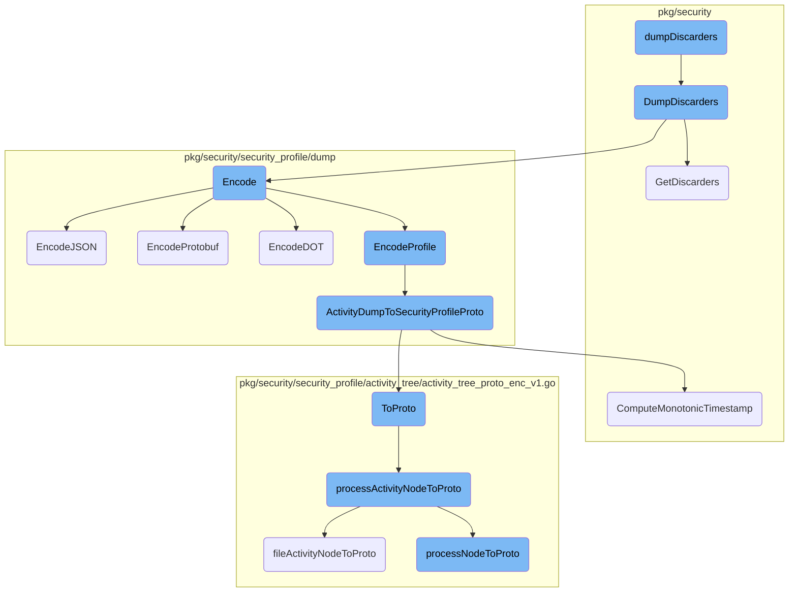
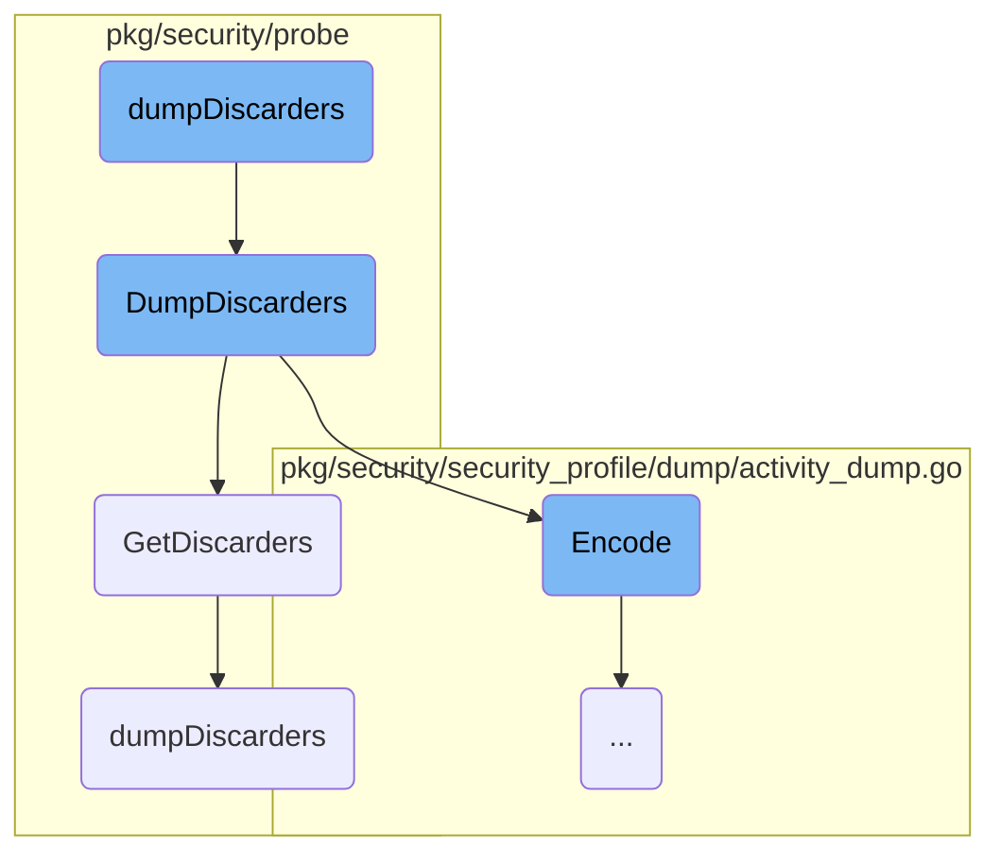
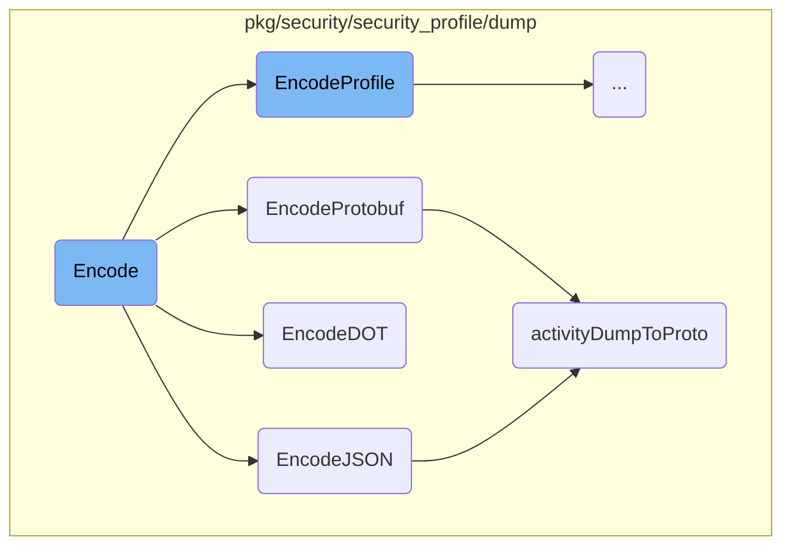
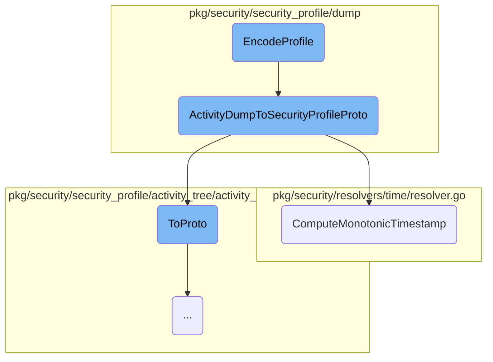
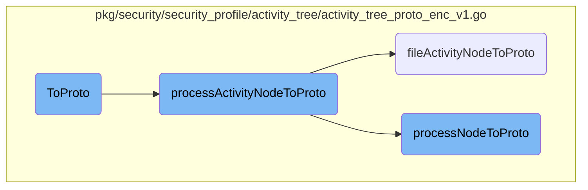

This document provides an overview of the <SwmToken path="cmd/security-agent/subcommands/runtime/command.go" pos="858:2:2" line-data="func dumpDiscarders(_ log.Component, _ config.Component, _ secrets.Component) error {">`dumpDiscarders`</SwmToken> process. The <SwmToken path="cmd/security-agent/subcommands/runtime/command.go" pos="858:2:2" line-data="func dumpDiscarders(_ log.Component, _ config.Component, _ secrets.Component) error {">`dumpDiscarders`</SwmToken> function is responsible for handling discarders, which are specific data structures used to filter out unnecessary information in the security monitoring process. The document outlines the steps involved in initializing the runtime security client, retrieving discarders, encoding them, and writing them to a file.

The flow starts with initializing a runtime security client. Once the client is ready, it retrieves discarders from various <SwmToken path="pkg/security/probe/discarders_linux.go" pos="647:24:24" line-data="func dumpDiscarders(resolver *dentry.Resolver, pidMap, inodeMap, statsFB, statsBB *ebpf.Map) (DiscardersDump, error) {">`ebpf`</SwmToken> maps. These discarders are then processed and encoded into different formats such as JSON, Protobuf, or DOT. Finally, the encoded discarders are written to a temporary file, and the filename is returned. This process ensures that only relevant security data is retained, improving the efficiency of the monitoring system.

Here is a high level diagram of the flow, showing only the most important functions:



# Flow drill down

First, we'll zoom into this section of the flow:



<SwmSnippet path="/cmd/security-agent/subcommands/runtime/command.go" line="858">

---

## Handling discarders

The <SwmToken path="cmd/security-agent/subcommands/runtime/command.go" pos="858:2:2" line-data="func dumpDiscarders(_ log.Component, _ config.Component, _ secrets.Component) error {">`dumpDiscarders`</SwmToken> function initializes a runtime security client and calls <SwmToken path="cmd/security-agent/subcommands/runtime/command.go" pos="858:2:2" line-data="func dumpDiscarders(_ log.Component, _ config.Component, _ secrets.Component) error {">`dumpDiscarders`</SwmToken> to handle the discarders. It ensures the client is properly closed and prints the filename of the dumped discarders.

```go
func dumpDiscarders(_ log.Component, _ config.Component, _ secrets.Component) error {
	runtimeSecurityClient, err := secagent.NewRuntimeSecurityClient()
	if err != nil {
		return fmt.Errorf("unable to create a runtime security client instance: %w", err)
	}
	defer runtimeSecurityClient.Close()

	dumpFilename, dumpErr := runtimeSecurityClient.DumpDiscarders()

	if dumpErr != nil {
		return fmt.Errorf("unable to dump discarders: %w", dumpErr)
	}

	fmt.Printf("Discarder dump file: %s\n", dumpFilename)

	return nil
```

---

</SwmSnippet>

<SwmSnippet path="/pkg/security/probe/probe_ebpf.go" line="1320">

---

The <SwmToken path="pkg/security/probe/probe_ebpf.go" pos="1320:9:9" line-data="func (p *EBPFProbe) DumpDiscarders() (string, error) {">`DumpDiscarders`</SwmToken> method in <SwmToken path="pkg/security/probe/probe_ebpf.go" pos="1320:6:6" line-data="func (p *EBPFProbe) DumpDiscarders() (string, error) {">`EBPFProbe`</SwmToken> retrieves the discarders using <SwmToken path="pkg/security/probe/probe_ebpf.go" pos="1321:10:10" line-data="	dump, err := p.GetDiscarders()">`GetDiscarders`</SwmToken>, writes them to a temporary file, and returns the filename. It handles file creation, permission setting, and encoding the discarders to YAML.

```go
func (p *EBPFProbe) DumpDiscarders() (string, error) {
	dump, err := p.GetDiscarders()
	if err != nil {
		return "", err
	}

	fp, err := os.CreateTemp("/tmp", "discarder-dump-")
	if err != nil {
		return "", err
	}
	defer fp.Close()

	if err := os.Chmod(fp.Name(), 0400); err != nil {
		return "", err
	}

	encoder := yaml.NewEncoder(fp)
	defer encoder.Close()

	if err := encoder.Encode(dump); err != nil {
		return "", err
```

---

</SwmSnippet>

<SwmSnippet path="/pkg/security/probe/probe_ebpf.go" line="1291">

---

The <SwmToken path="pkg/security/probe/probe_ebpf.go" pos="1291:9:9" line-data="func (p *EBPFProbe) GetDiscarders() (*DiscardersDump, error) {">`GetDiscarders`</SwmToken> method retrieves discarders from various <SwmToken path="pkg/security/probe/discarders_linux.go" pos="647:24:24" line-data="func dumpDiscarders(resolver *dentry.Resolver, pidMap, inodeMap, statsFB, statsBB *ebpf.Map) (DiscardersDump, error) {">`ebpf`</SwmToken> maps and calls <SwmToken path="cmd/security-agent/subcommands/runtime/command.go" pos="858:2:2" line-data="func dumpDiscarders(_ log.Component, _ config.Component, _ secrets.Component) error {">`dumpDiscarders`</SwmToken> to process them. It returns a <SwmToken path="pkg/security/probe/probe_ebpf.go" pos="1291:15:15" line-data="func (p *EBPFProbe) GetDiscarders() (*DiscardersDump, error) {">`DiscardersDump`</SwmToken> structure containing the discarders.

```go
func (p *EBPFProbe) GetDiscarders() (*DiscardersDump, error) {
	inodeMap, err := managerhelper.Map(p.Manager, "inode_discarders")
	if err != nil {
		return nil, err
	}

	pidMap, err := managerhelper.Map(p.Manager, "pid_discarders")
	if err != nil {
		return nil, err
	}

	statsFB, err := managerhelper.Map(p.Manager, "fb_discarder_stats")
	if err != nil {
		return nil, err
	}

	statsBB, err := managerhelper.Map(p.Manager, "bb_discarder_stats")
	if err != nil {
		return nil, err
	}

```

---

</SwmSnippet>

<SwmSnippet path="/pkg/security/probe/discarders_linux.go" line="647">

---

The <SwmToken path="pkg/security/probe/discarders_linux.go" pos="647:2:2" line-data="func dumpDiscarders(resolver *dentry.Resolver, pidMap, inodeMap, statsFB, statsBB *ebpf.Map) (DiscardersDump, error) {">`dumpDiscarders`</SwmToken> function processes discarders from different maps, including PID and inode discarders, and returns a <SwmToken path="pkg/security/probe/discarders_linux.go" pos="647:30:30" line-data="func dumpDiscarders(resolver *dentry.Resolver, pidMap, inodeMap, statsFB, statsBB *ebpf.Map) (DiscardersDump, error) {">`DiscardersDump`</SwmToken> structure. It logs the dumping process and handles errors for each type of discarder.

```go
func dumpDiscarders(resolver *dentry.Resolver, pidMap, inodeMap, statsFB, statsBB *ebpf.Map) (DiscardersDump, error) {
	seclog.Debugf("Dumping discarders")

	dump := DiscardersDump{
		Date: time.Now(),
	}

	pids, err := dumpPidDiscarders(pidMap)
	if err != nil {
		return dump, err
	}
	dump.Pids = pids

	inodes, err := dumpInodeDiscarders(resolver, inodeMap)
	if err != nil {
		return dump, err
	}
	dump.Inodes = inodes

	stats, err := dumpDiscarderStats(statsFB, statsBB)
	if err != nil {
```

---

</SwmSnippet>

Now, lets zoom into this section of the flow:



<SwmSnippet path="/pkg/security/security_profile/dump/activity_dump.go" line="650">

---

## Encode Function

The <SwmToken path="pkg/security/security_profile/dump/activity_dump.go" pos="650:2:2" line-data="// Encode encodes an activity dump in the provided format">`Encode`</SwmToken> function is responsible for encoding an activity dump into the specified format. It uses a switch statement to determine which encoding method to call based on the provided format.

```go
// Encode encodes an activity dump in the provided format
func (ad *ActivityDump) Encode(format config.StorageFormat) (*bytes.Buffer, error) {
	switch format {
	case config.JSON:
		return ad.EncodeJSON("")
	case config.Protobuf:
		return ad.EncodeProtobuf()
	case config.Dot:
		return ad.EncodeDOT()
	case config.Profile:
		return ad.EncodeProfile()
	default:
		return nil, fmt.Errorf("couldn't encode activity dump [%s] as [%s]: unknown format", ad.GetSelectorStr(), format)
	}
}
```

---

</SwmSnippet>

<SwmSnippet path="/pkg/security/security_profile/dump/activity_dump.go" line="697">

---

### <SwmToken path="pkg/security/security_profile/dump/activity_dump.go" pos="697:2:2" line-data="// EncodeJSON encodes an activity dump in the ProtoJSON format">`EncodeJSON`</SwmToken> Function

The <SwmToken path="pkg/security/security_profile/dump/activity_dump.go" pos="697:2:2" line-data="// EncodeJSON encodes an activity dump in the ProtoJSON format">`EncodeJSON`</SwmToken> function encodes an activity dump into the <SwmToken path="pkg/security/security_profile/dump/activity_dump.go" pos="697:16:16" line-data="// EncodeJSON encodes an activity dump in the ProtoJSON format">`ProtoJSON`</SwmToken> format. It locks the activity dump, converts it to a protobuf representation using <SwmToken path="pkg/security/security_profile/dump/activity_dump.go" pos="702:5:5" line-data="	pad := activityDumpToProto(ad)">`activityDumpToProto`</SwmToken>, and then marshals it into JSON.

```go
// EncodeJSON encodes an activity dump in the ProtoJSON format
func (ad *ActivityDump) EncodeJSON(indent string) (*bytes.Buffer, error) {
	ad.Lock()
	defer ad.Unlock()

	pad := activityDumpToProto(ad)
	defer pad.ReturnToVTPool()

	opts := protojson.MarshalOptions{
		EmitUnpopulated: true,
		UseProtoNames:   true,
		Indent:          indent,
	}

	raw, err := opts.Marshal(pad)
	if err != nil {
		return nil, fmt.Errorf("couldn't encode in %s: %v", config.JSON, err)
	}
	return bytes.NewBuffer(raw), nil
}
```

---

</SwmSnippet>

<SwmSnippet path="/pkg/security/security_profile/dump/activity_dump.go" line="666">

---

### <SwmToken path="pkg/security/security_profile/dump/activity_dump.go" pos="666:2:2" line-data="// EncodeProtobuf encodes an activity dump in the Protobuf format">`EncodeProtobuf`</SwmToken> Function

The <SwmToken path="pkg/security/security_profile/dump/activity_dump.go" pos="666:2:2" line-data="// EncodeProtobuf encodes an activity dump in the Protobuf format">`EncodeProtobuf`</SwmToken> function encodes an activity dump into the Protobuf format. Similar to <SwmToken path="pkg/security/security_profile/dump/activity_dump.go" pos="654:5:5" line-data="		return ad.EncodeJSON(&quot;&quot;)">`EncodeJSON`</SwmToken>, it locks the activity dump, converts it to a protobuf representation, and then marshals it into Protobuf.

```go
// EncodeProtobuf encodes an activity dump in the Protobuf format
func (ad *ActivityDump) EncodeProtobuf() (*bytes.Buffer, error) {
	ad.Lock()
	defer ad.Unlock()

	pad := activityDumpToProto(ad)
	defer pad.ReturnToVTPool()

	raw, err := pad.MarshalVT()
	if err != nil {
		return nil, fmt.Errorf("couldn't encode in %s: %v", config.Protobuf, err)
	}
	return bytes.NewBuffer(raw), nil
}
```

---

</SwmSnippet>

<SwmSnippet path="/pkg/security/security_profile/dump/graph.go" line="56">

---

### <SwmToken path="pkg/security/security_profile/dump/graph.go" pos="56:2:2" line-data="// EncodeDOT encodes an activity dump in the DOT format">`EncodeDOT`</SwmToken> Function

The <SwmToken path="pkg/security/security_profile/dump/graph.go" pos="56:2:2" line-data="// EncodeDOT encodes an activity dump in the DOT format">`EncodeDOT`</SwmToken> function encodes an activity dump into the DOT format. It converts the activity dump into a graph representation and then encodes it using the DOT format.

```go
// EncodeDOT encodes an activity dump in the DOT format
func (ad *ActivityDump) EncodeDOT() (*bytes.Buffer, error) {
	graph := ad.ToGraph()
	raw, err := graph.EncodeDOT(ActivityDumpGraphTemplate)
	if err != nil {
		return nil, fmt.Errorf("couldn't encode %s in %s: %w", ad.getSelectorStr(), config.Dot, err)
	}
	return raw, nil
}
```

---

</SwmSnippet>

<SwmSnippet path="/pkg/security/security_profile/dump/activity_dump_proto_enc_v1.go" line="18">

---

### <SwmToken path="pkg/security/security_profile/dump/activity_dump_proto_enc_v1.go" pos="18:2:2" line-data="func activityDumpToProto(ad *ActivityDump) *adproto.SecDump {">`activityDumpToProto`</SwmToken> Function

The <SwmToken path="pkg/security/security_profile/dump/activity_dump_proto_enc_v1.go" pos="18:2:2" line-data="func activityDumpToProto(ad *ActivityDump) *adproto.SecDump {">`activityDumpToProto`</SwmToken> function converts an activity dump into a protobuf representation. It initializes a protobuf object and populates it with data from the activity dump, including host, service, source, metadata, tags, and activity tree.

```go
func activityDumpToProto(ad *ActivityDump) *adproto.SecDump {
	if ad == nil {
		return nil
	}

	pad := adproto.SecDumpFromVTPool()
	*pad = adproto.SecDump{
		Host:    ad.Host,
		Service: ad.Service,
		Source:  ad.Source,

		Metadata: mtdt.ToProto(&ad.Metadata),

		Tags: make([]string, len(ad.Tags)),
		Tree: activity_tree.ToProto(ad.ActivityTree),
	}

	copy(pad.Tags, ad.Tags)

	return pad
}
```

---

</SwmSnippet>

Now, lets zoom into this section of the flow:



<SwmSnippet path="/pkg/security/security_profile/dump/activity_dump.go" line="681">

---

## <SwmToken path="pkg/security/security_profile/dump/activity_dump.go" pos="681:2:2" line-data="// EncodeProfile encodes an activity dump in the Security Profile protobuf format">`EncodeProfile`</SwmToken>

The <SwmToken path="pkg/security/security_profile/dump/activity_dump.go" pos="681:2:2" line-data="// EncodeProfile encodes an activity dump in the Security Profile protobuf format">`EncodeProfile`</SwmToken> function is responsible for encoding an activity dump into the Security Profile protobuf format. It locks the activity dump to ensure thread safety, then calls <SwmToken path="pkg/security/security_profile/dump/activity_dump.go" pos="686:8:8" line-data="	profileProto, err := ActivityDumpToSecurityProfileProto(ad)">`ActivityDumpToSecurityProfileProto`</SwmToken> to convert the activity dump into a protobuf representation. If successful, it marshals the protobuf into a byte buffer.

```go
// EncodeProfile encodes an activity dump in the Security Profile protobuf format
func (ad *ActivityDump) EncodeProfile() (*bytes.Buffer, error) {
	ad.Lock()
	defer ad.Unlock()

	profileProto, err := ActivityDumpToSecurityProfileProto(ad)
	if profileProto == nil {
		return nil, fmt.Errorf("Error while encoding security dump: %v", err)
	}
	raw, err := profileProto.MarshalVT()
	if err != nil {
		return nil, fmt.Errorf("couldn't encode dump to `%s` format: %v", config.Profile, err)
	}
	return bytes.NewBuffer(raw), nil
}
```

---

</SwmSnippet>

<SwmSnippet path="/pkg/security/security_profile/dump/activity_dump_profile_proto_enc_v1.go" line="23">

---

## <SwmToken path="pkg/security/security_profile/dump/activity_dump_profile_proto_enc_v1.go" pos="23:2:2" line-data="// ActivityDumpToSecurityProfileProto serializes an Activity Dump to a Security Profile protobuf representation">`ActivityDumpToSecurityProfileProto`</SwmToken>

The <SwmToken path="pkg/security/security_profile/dump/activity_dump_profile_proto_enc_v1.go" pos="23:2:2" line-data="// ActivityDumpToSecurityProfileProto serializes an Activity Dump to a Security Profile protobuf representation">`ActivityDumpToSecurityProfileProto`</SwmToken> function serializes an Activity Dump into a Security Profile protobuf representation. It first validates the input, retrieves the workload selector, and initializes the protobuf structure. It also initializes a time resolver to compute timestamps and populates the profile context with syscalls and tags.

```go
// ActivityDumpToSecurityProfileProto serializes an Activity Dump to a Security Profile protobuf representation
func ActivityDumpToSecurityProfileProto(input *ActivityDump) (*proto.SecurityProfile, error) {
	if input == nil {
		return nil, errors.New("imput == nil")
	}

	wSelector := input.GetWorkloadSelector()
	if wSelector == nil {
		return nil, errors.New("can't get dump selector, tags shouldn't be resolved yet")
	}

	output := &proto.SecurityProfile{
		Metadata:        mtdt.ToProto(&input.Metadata),
		ProfileContexts: make(map[string]*proto.ProfileContext),
		Tree:            activity_tree.ToProto(input.ActivityTree),
		Selector:        cgroupModel.WorkloadSelectorToProto(wSelector),
	}
	timeResolver, err := timeResolver.NewResolver()
	if err != nil {
		return nil, errors.New("can't init time resolver")
	}
```

---

</SwmSnippet>

<SwmSnippet path="/pkg/security/resolvers/time/resolver.go" line="63">

---

### <SwmToken path="pkg/security/resolvers/time/resolver.go" pos="63:2:2" line-data="// ComputeMonotonicTimestamp converts an absolute time to a kernel monotonic timestamp">`ComputeMonotonicTimestamp`</SwmToken>

The <SwmToken path="pkg/security/resolvers/time/resolver.go" pos="63:2:2" line-data="// ComputeMonotonicTimestamp converts an absolute time to a kernel monotonic timestamp">`ComputeMonotonicTimestamp`</SwmToken> function converts an absolute time to a kernel monotonic timestamp. It calculates the difference between the given timestamp and the system boot time, returning the result in nanoseconds.

```go
// ComputeMonotonicTimestamp converts an absolute time to a kernel monotonic timestamp
func (tr *Resolver) ComputeMonotonicTimestamp(timestamp time.Time) int64 {
	if !timestamp.IsZero() {
		return timestamp.Sub(tr.GetBootTime()).Nanoseconds()
	}
	return 0
}
```

---

</SwmSnippet>

Now, lets zoom into this section of the flow:



<SwmSnippet path="/pkg/security/security_profile/activity_tree/activity_tree_proto_enc_v1.go" line="24">

---

## <SwmToken path="pkg/security/security_profile/dump/activity_dump_proto_enc_v1.go" pos="29:6:6" line-data="		Metadata: mtdt.ToProto(&amp;ad.Metadata),">`ToProto`</SwmToken>

The <SwmToken path="pkg/security/security_profile/dump/activity_dump_proto_enc_v1.go" pos="29:6:6" line-data="		Metadata: mtdt.ToProto(&amp;ad.Metadata),">`ToProto`</SwmToken> function encodes an activity tree into its protobuf representation. It iterates over the <SwmToken path="pkg/security/security_profile/activity_tree/activity_tree_proto_enc_v1.go" pos="24:14:14" line-data="	for _, node := range at.ProcessNodes {">`ProcessNodes`</SwmToken> of the <SwmToken path="pkg/security/security_profile/dump/activity_dump_proto_enc_v1.go" pos="32:10:10" line-data="		Tree: activity_tree.ToProto(ad.ActivityTree),">`ActivityTree`</SwmToken> and converts each node using the <SwmToken path="pkg/security/security_profile/activity_tree/activity_tree_proto_enc_v1.go" pos="25:10:10" line-data="		out = append(out, processActivityNodeToProto(node))">`processActivityNodeToProto`</SwmToken> function.

```go
	for _, node := range at.ProcessNodes {
		out = append(out, processActivityNodeToProto(node))
	}
```

---

</SwmSnippet>

<SwmSnippet path="/pkg/security/security_profile/activity_tree/activity_tree_proto_enc_v1.go" line="49">

---

## <SwmToken path="pkg/security/security_profile/activity_tree/activity_tree_proto_enc_v1.go" pos="54:14:14" line-data="		ppan.Children = append(ppan.Children, processActivityNodeToProto(child))">`processActivityNodeToProto`</SwmToken>

The <SwmToken path="pkg/security/security_profile/activity_tree/activity_tree_proto_enc_v1.go" pos="54:14:14" line-data="		ppan.Children = append(ppan.Children, processActivityNodeToProto(child))">`processActivityNodeToProto`</SwmToken> function converts a <SwmToken path="pkg/security/security_profile/dump/activity_dump.go" pos="352:16:16" line-data="func (ad *ActivityDump) NewProcessNodeCallback(p *activity_tree.ProcessNode) {">`ProcessNode`</SwmToken> into its protobuf representation. It initializes a <SwmToken path="pkg/security/security_profile/activity_tree/activity_tree_proto_enc_v1.go" pos="21:15:15" line-data="func ToProto(at *ActivityTree) []*adproto.ProcessActivityNode {">`ProcessActivityNode`</SwmToken> and populates its fields, including matched rules and children nodes, by recursively calling itself for each child node.

```go
	for _, rule := range pan.MatchedRules {
		ppan.MatchedRules = append(ppan.MatchedRules, matchedRuleToProto(rule))
	}

	for _, child := range pan.Children {
		ppan.Children = append(ppan.Children, processActivityNodeToProto(child))
	}
```

---

</SwmSnippet>

<SwmSnippet path="/pkg/security/security_profile/activity_tree/activity_tree_proto_enc_v1.go" line="190">

---

### <SwmToken path="pkg/security/security_profile/activity_tree/activity_tree_proto_enc_v1.go" pos="195:14:14" line-data="		pfan.Children = append(pfan.Children, fileActivityNodeToProto(child))">`fileActivityNodeToProto`</SwmToken>

The <SwmToken path="pkg/security/security_profile/activity_tree/activity_tree_proto_enc_v1.go" pos="195:14:14" line-data="		pfan.Children = append(pfan.Children, fileActivityNodeToProto(child))">`fileActivityNodeToProto`</SwmToken> function converts a <SwmToken path="pkg/security/security_profile/activity_tree/activity_tree_proto_enc_v1.go" pos="173:7:7" line-data="func fileActivityNodeToProto(fan *FileNode) *adproto.FileActivityNode {">`FileNode`</SwmToken> into its protobuf representation. It initializes a <SwmToken path="pkg/security/security_profile/activity_tree/activity_tree_proto_enc_v1.go" pos="41:11:11" line-data="		Files:          make([]*adproto.FileActivityNode, 0, len(pan.Files)),">`FileActivityNode`</SwmToken> and populates its fields, including matched rules and children nodes, by recursively calling itself for each child node.

```go
	for _, rule := range fan.MatchedRules {
		pfan.MatchedRules = append(pfan.MatchedRules, matchedRuleToProto(rule))
	}

	for _, child := range fan.Children {
		pfan.Children = append(pfan.Children, fileActivityNodeToProto(child))
```

---

</SwmSnippet>

<SwmSnippet path="/pkg/security/security_profile/activity_tree/activity_tree_proto_enc_v1.go" line="100">

---

### <SwmToken path="pkg/security/security_profile/activity_tree/activity_tree_proto_enc_v1.go" pos="37:4:4" line-data="		Process:        processNodeToProto(&amp;pan.Process),">`processNodeToProto`</SwmToken>

The <SwmToken path="pkg/security/security_profile/activity_tree/activity_tree_proto_enc_v1.go" pos="37:4:4" line-data="		Process:        processNodeToProto(&amp;pan.Process),">`processNodeToProto`</SwmToken> function converts a <SwmToken path="tasks/libs/common/junit_upload_core.py" pos="226:3:3" line-data="    for process in processes:">`process`</SwmToken> into its protobuf representation. It initializes a <SwmToken path="pkg/security/security_profile/activity_tree/activity_tree_proto_enc_v1.go" pos="80:15:15" line-data="func processNodeToProto(p *model.Process) *adproto.ProcessInfo {">`ProcessInfo`</SwmToken> and populates its fields, including process <SwmToken path="tasks/gitlab_helpers.py" pos="90:10:10" line-data="def print_gitlab_object(get_object, ctx, ids, repo=&#39;DataDog/datadog-agent&#39;, jq: str | None = None, jq_colors=True):">`ids`</SwmToken>, container ID, and timestamps.

```go
		ForkTime: TimestampToProto(&p.ForkTime),
		ExitTime: TimestampToProto(&p.ExitTime),
		ExecTime: TimestampToProto(&p.ExecTime),

		Credentials: credentialsToProto(&p.Credentials),

		Args:          copyAndEscape(p.Argv),
		Argv0:         escape(p.Argv0),
		ArgsTruncated: p.ArgsTruncated,

		Envs:          copyAndEscape(p.Envs),
		EnvsTruncated: p.EnvsTruncated,
	}
```

---

</SwmSnippet>

&nbsp;

*This is an auto-generated document by Swimm AI 🌊 and has not yet been verified by a human*

<SwmMeta version="3.0.0" repo-id="Z2l0aHViJTNBJTNBZGF0YWRvZy1hZ2VudCUzQSUzQVN3aW1tLURlbW8=" repo-name="datadog-agent"><sup>Powered by [Swimm](/)</sup></SwmMeta>
