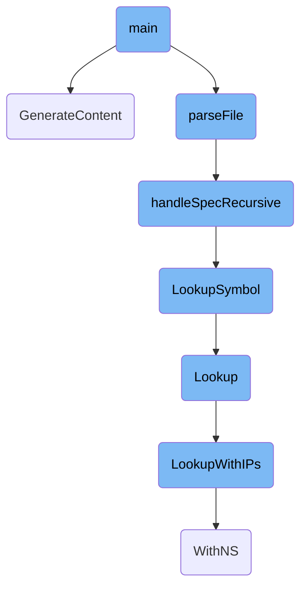
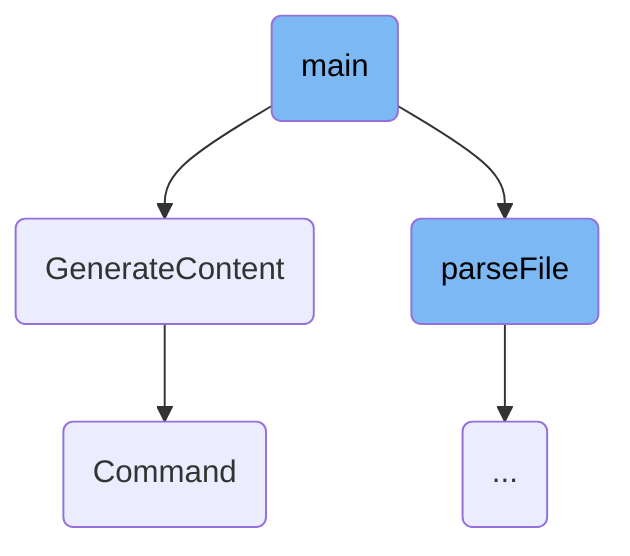
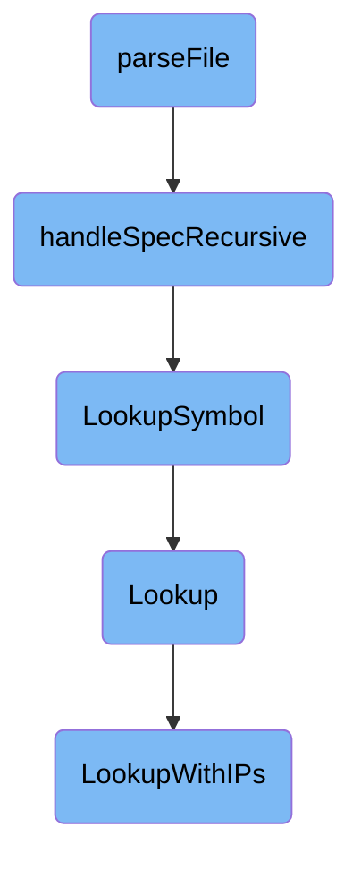

This document provides an overview of the main function's flow. The main function serves as the entry point of the program, initiating the process by parsing model and types files, generating content based on templates, and handling specifications recursively.

The main function starts by reading and understanding some files. If it successfully reads the files, it then creates some content based on templates. This content is generated multiple times for different purposes. The function also ensures that all the details in the files are processed correctly, even if they are nested or complex.

Here is a high level diagram of the flow, showing only the most important functions:



# Flow drill down

First, we'll zoom into this section of the flow:



<SwmSnippet path="/pkg/security/secl/compiler/generators/accessors/accessors.go" line="990">

---

## Main Function

The <SwmToken path="pkg/security/secl/compiler/generators/accessors/accessors.go" pos="990:2:2" line-data="func main() {">`main`</SwmToken> function is the entry point of the program. It starts by calling <SwmToken path="pkg/security/secl/compiler/generators/accessors/accessors.go" pos="991:8:8" line-data="	module, err := parseFile(modelFile, typesFile, pkgname)">`parseFile`</SwmToken> to parse the model and types files. If parsing is successful, it proceeds to generate content using the <SwmToken path="pkg/security/secl/compiler/generators/accessors/accessors.go" pos="997:7:7" line-data="		if err = GenerateContent(fieldHandlersOutput, module, fieldHandlersTemplate); err != nil {">`GenerateContent`</SwmToken> function. This function is called multiple times to generate different outputs based on the provided templates.

```go
func main() {
	module, err := parseFile(modelFile, typesFile, pkgname)
	if err != nil {
		panic(err)
	}

	if len(fieldHandlersOutput) > 0 {
		if err = GenerateContent(fieldHandlersOutput, module, fieldHandlersTemplate); err != nil {
			panic(err)
		}
	}

	if docOutput != "" {
		os.Remove(docOutput)
		if err := doc.GenerateDocJSON(module, path.Dir(modelFile), docOutput); err != nil {
			panic(err)
		}
	}

	os.Remove(output)
	if err := GenerateContent(output, module, accessorsTemplateCode); err != nil {
```

---

</SwmSnippet>

<SwmSnippet path="/pkg/security/secl/compiler/generators/accessors/accessors.go" line="1019">

---

## <SwmToken path="pkg/security/secl/compiler/generators/accessors/accessors.go" pos="1019:2:2" line-data="// GenerateContent generates with the given template">`GenerateContent`</SwmToken> Function

The <SwmToken path="pkg/security/secl/compiler/generators/accessors/accessors.go" pos="1019:2:2" line-data="// GenerateContent generates with the given template">`GenerateContent`</SwmToken> function is responsible for generating content based on a given template. It uses the <SwmToken path="pkg/security/secl/compiler/generators/accessors/accessors.go" pos="1019:12:12" line-data="// GenerateContent generates with the given template">`template`</SwmToken> package to parse the template code and execute it with the provided module data. The generated content is then formatted using <SwmToken path="pkg/security/secl/compiler/generators/accessors/accessors.go" pos="1043:10:10" line-data="	cmd := exec.Command(&quot;gofmt&quot;, &quot;-s&quot;, &quot;-w&quot;, tmpfile.Name())">`gofmt`</SwmToken> and written to a temporary file, which is finally renamed to the desired output file.

```go
// GenerateContent generates with the given template
func GenerateContent(output string, module *common.Module, tmplCode string) error {
	tmpl := template.Must(template.New("header").Funcs(funcMap).Funcs(sprig.TxtFuncMap()).Parse(tmplCode))

	buffer := bytes.Buffer{}
	if err := tmpl.Execute(&buffer, module); err != nil {
		return err
	}

	cleaned := removeEmptyLines(&buffer)

	tmpfile, err := os.CreateTemp(path.Dir(output), "secl-helpers")
	if err != nil {
		return err
	}

	if _, err := tmpfile.WriteString(cleaned); err != nil {
		return err
	}

	if err := tmpfile.Close(); err != nil {
```

---

</SwmSnippet>

<SwmSnippet path="/cmd/cws-instrumentation/subcommands/setupcmd/setup.go" line="26">

---

## Command Function

The <SwmToken path="cmd/cws-instrumentation/subcommands/setupcmd/setup.go" pos="26:2:2" line-data="// Command returns the commands for the setup subcommand">`Command`</SwmToken> function defines the setup subcommand for the CLI. It creates a new <SwmToken path="cmd/cws-instrumentation/subcommands/setupcmd/setup.go" pos="27:9:11" line-data="func Command() []*cobra.Command {">`cobra.Command`</SwmToken> with the <SwmToken path="cmd/cws-instrumentation/subcommands/setupcmd/setup.go" pos="26:14:14" line-data="// Command returns the commands for the setup subcommand">`setup`</SwmToken> use case, which copies the <SwmToken path="cmd/cws-instrumentation/subcommands/setupcmd/setup.go" pos="32:9:11" line-data="		Short: &quot;Copies the cws-instrumentation binary to the CWS volume mount&quot;,">`cws-instrumentation`</SwmToken> binary to the CWS volume mount. The function also sets up the necessary flags and marks the <SwmToken path="cmd/cws-instrumentation/subcommands/setupcmd/setup.go" pos="38:12:12" line-data="	setupCmd.Flags().StringVar(&amp;params.cwsVolumeMount, flags.CWSVolumeMount, &quot;&quot;, &quot;Path to the CWS volume mount&quot;)">`cwsVolumeMount`</SwmToken> flag as required.

```go
// Command returns the commands for the setup subcommand
func Command() []*cobra.Command {
	var params setupCliParams

	setupCmd := &cobra.Command{
		Use:   "setup",
		Short: "Copies the cws-instrumentation binary to the CWS volume mount",
		RunE: func(cmd *cobra.Command, args []string) error {
			return setupCWSInjector(&params)
		},
	}

	setupCmd.Flags().StringVar(&params.cwsVolumeMount, flags.CWSVolumeMount, "", "Path to the CWS volume mount")
	_ = setupCmd.MarkFlagRequired(flags.CWSVolumeMount)

	return []*cobra.Command{setupCmd}
}
```

---

</SwmSnippet>

Now, lets zoom into this section of the flow:



<SwmSnippet path="/pkg/security/secl/compiler/generators/accessors/accessors.go" line="687">

---

## Parsing the File

The <SwmToken path="pkg/security/secl/compiler/generators/accessors/accessors.go" pos="687:2:2" line-data="func parseFile(modelFile string, typesFile string, pkgName string) (*common.Module, error) {">`parseFile`</SwmToken> function is responsible for parsing the provided model and types files. It initializes the configuration for parsing, creates an abstract syntax tree (AST) from the files, and sets up a module structure to hold the parsed data. The function then iterates over the specifications in the AST and processes them using the <SwmToken path="pkg/security/secl/compiler/generators/accessors/accessors.go" pos="429:2:2" line-data="// handleSpecRecursive is a recursive function that walks through the fields of a module">`handleSpecRecursive`</SwmToken> function.

```go
func parseFile(modelFile string, typesFile string, pkgName string) (*common.Module, error) {
	cfg := packages.Config{
		Mode:       packages.NeedSyntax | packages.NeedTypes | packages.NeedImports,
		BuildFlags: []string{"-mod=mod", fmt.Sprintf("-tags=%s", buildTags)},
	}

	astFiles, err := newAstFiles(&cfg, modelFile, typesFile)
	if err != nil {
		return nil, err
	}

	moduleName := path.Base(path.Dir(output))
	if moduleName == "." {
		moduleName = path.Base(pkgName)
	}

	module := &common.Module{
		Name:       moduleName,
		SourcePkg:  pkgName,
		TargetPkg:  pkgName,
		BuildTags:  formatBuildTags(buildTags),
```

---

</SwmSnippet>

<SwmSnippet path="/pkg/security/secl/compiler/generators/accessors/accessors.go" line="429">

---

## Handling Specifications Recursively

The <SwmToken path="pkg/security/secl/compiler/generators/accessors/accessors.go" pos="429:2:2" line-data="// handleSpecRecursive is a recursive function that walks through the fields of a module">`handleSpecRecursive`</SwmToken> function is a recursive function that processes each field in a module's specification. It handles embedded structures, parses field tags, and updates the module's metadata accordingly. This function ensures that all nested structures and fields are processed and included in the module's representation.

```go
// handleSpecRecursive is a recursive function that walks through the fields of a module
func handleSpecRecursive(module *common.Module, astFiles *AstFiles, spec interface{}, prefix, aliasPrefix, event string, iterator *common.StructField, dejavu map[string]bool) {
	if verbose {
		fmt.Printf("handleSpec spec: %+v, prefix: %s, aliasPrefix %s, event %s, iterator %+v\n", spec, prefix, aliasPrefix, event, iterator)
	}

	var typeSpec *ast.TypeSpec
	var structType *ast.StructType
	var ok bool
	if typeSpec, ok = spec.(*ast.TypeSpec); !ok {
		return
	}
	if structType, ok = typeSpec.Type.(*ast.StructType); !ok {
		log.Printf("Don't know what to do with %s (%s)", typeSpec.Name, spew.Sdump(typeSpec))
		return
	}

	for _, field := range structType.Fields.List {
		fieldCommentText := field.Comment.Text()
		fieldIterator := iterator

```

---

</SwmSnippet>

<SwmSnippet path="/pkg/security/secl/compiler/generators/accessors/accessors.go" line="59">

---

### Looking Up Symbols

The <SwmToken path="pkg/security/secl/compiler/generators/accessors/accessors.go" pos="59:2:2" line-data="// LookupSymbol lookups symbol">`LookupSymbol`</SwmToken> function is used to find a symbol within the parsed AST files. It searches through the files' scopes to locate the specified symbol, which is essential for resolving references to other types and structures during the recursive handling of specifications.

```go
// LookupSymbol lookups symbol
func (af *AstFiles) LookupSymbol(symbol string) *ast.Object {
	for _, file := range af.files {
		if obj := file.Scope.Lookup(symbol); obj != nil {
			return obj
		}
	}
	return nil
}
```

---

</SwmSnippet>

<SwmSnippet path="/pkg/network/gateway_lookup_linux.go" line="114">

---

## Performing Gateway Lookup

The <SwmToken path="pkg/network/gateway_lookup_linux.go" pos="114:2:2" line-data="// Lookup performs a gateway lookup for connection stats">`Lookup`</SwmToken> function performs a gateway lookup for connection statistics. It determines the destination address for the lookup and delegates the actual lookup process to the <SwmToken path="pkg/network/gateway_lookup_linux.go" pos="121:5:5" line-data="	return g.LookupWithIPs(cs.Source, dest, cs.NetNS)">`LookupWithIPs`</SwmToken> function.

```go
// Lookup performs a gateway lookup for connection stats
func (g *gatewayLookup) Lookup(cs *ConnectionStats) *Via {
	dest := cs.Dest
	if cs.IPTranslation != nil {
		dest = cs.IPTranslation.ReplSrcIP
	}

	return g.LookupWithIPs(cs.Source, dest, cs.NetNS)
}
```

---

</SwmSnippet>

<SwmSnippet path="/pkg/network/gateway_lookup_linux.go" line="124">

---

### Gateway Lookup with <SwmToken path="tasks/kernel_matrix_testing/ci.py" pos="126:1:1" line-data="        ips: set[str] = set()">`ips`</SwmToken>

The <SwmToken path="pkg/network/gateway_lookup_linux.go" pos="124:2:2" line-data="// LookupWithIPs performs a gateway lookup given the">`LookupWithIPs`</SwmToken> function performs a gateway lookup given the source, destination, and network namespace. It checks the route cache for existing entries and, if necessary, retrieves subnet information for the gateway. This function ensures that the gateway information is accurately resolved and cached for future lookups.

```go
// LookupWithIPs performs a gateway lookup given the
// source, destination, and namespace
func (g *gatewayLookup) LookupWithIPs(source util.Address, dest util.Address, netns uint32) *Via {
	r, ok := g.routeCache.Get(source, dest, netns)
	if !ok {
		return nil
	}

	// if there is no gateway, we don't need to add subnet info
	// for gateway resolution in the backend
	if r.Gateway.IsZero() || r.Gateway.IsUnspecified() {
		return nil
	}

	gatewayLookupTelemetry.subnetCacheLookups.Inc()
	v, ok := g.subnetCache.Get(r.IfIndex)
	if !ok {
		gatewayLookupTelemetry.subnetCacheMisses.Inc()

		var s Subnet
		var err error
```

---

</SwmSnippet>

&nbsp;

*This is an auto-generated document by Swimm AI 🌊 and has not yet been verified by a human*

<SwmMeta version="3.0.0" repo-id="Z2l0aHViJTNBJTNBZGF0YWRvZy1hZ2VudCUzQSUzQVN3aW1tLURlbW8=" repo-name="datadog-agent"><sup>Powered by [Swimm](/)</sup></SwmMeta>
