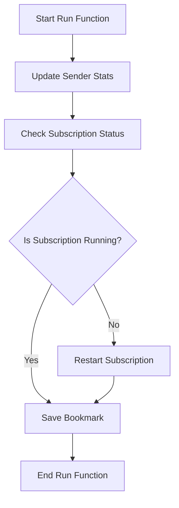

This document will cover the overview of the Run function, which includes:

1. Updating sender stats
2. Restarting subscriptions if they fail
3. Saving bookmarks to ensure continuous event collection.

Technical document: <SwmLink doc-title="Overview of the Run Function">[Overview of the Run Function](/.swm/overview-of-the-run-function.bkmluo29.sw.md)</SwmLink>

# [Updating Sender Stats](https://app.swimm.io/repos/Z2l0aHViJTNBJTNBZGF0YWRvZy1hZ2VudCUzQSUzQVN3aW1tLURlbW8=/docs/bkmluo29#run)

The Run function begins by updating the sender stats. This step is essential for calculating the number of events collected since the last time the Run function was called. By updating these stats, we ensure that the system has accurate data on event collection, which is crucial for monitoring and analysis.

# [Checking Subscription Status](https://app.swimm.io/repos/Z2l0aHViJTNBJTNBZGF0YWRvZy1hZ2VudCUzQSUzQVN3aW1tLURlbW8=/docs/bkmluo29#run)

Next, the Run function checks if the event subscription is currently running. This is important because the subscription is responsible for collecting events in the background. If the subscription is not running, it means that event collection has stopped, which could lead to data loss or gaps in monitoring.

# [Restarting Subscriptions if They Fail](https://app.swimm.io/repos/Z2l0aHViJTNBJTNBZGF0YWRvZy1hZ2VudCUzQSUzQVN3aW1tLURlbW8=/docs/bkmluo29#run)

If the subscription is found to be not running, the Run function will attempt to restart it. Restarting the subscription ensures that event collection resumes, preventing any interruptions in data gathering. This step is critical for maintaining continuous monitoring and ensuring that no events are missed.

# [Saving Bookmarks](https://app.swimm.io/repos/Z2l0aHViJTNBJTNBZGF0YWRvZy1hZ2VudCUzQSUzQVN3aW1tLURlbW8=/docs/bkmluo29#run)

Finally, the Run function saves a bookmark. This bookmark keeps track of the events that have been collected up to this point. By saving this information, the system can resume event collection from the correct point in case of a restart or failure, ensuring that no events are duplicated or missed.

&nbsp;

*This is an auto-generated document by Swimm AI 🌊 and has not yet been verified by a human*

<SwmMeta version="3.0.0" repo-id="Z2l0aHViJTNBJTNBZGF0YWRvZy1hZ2VudCUzQSUzQVN3aW1tLURlbW8=" repo-name="datadog-agent">Powered by [Swimm](/)</SwmMeta>
