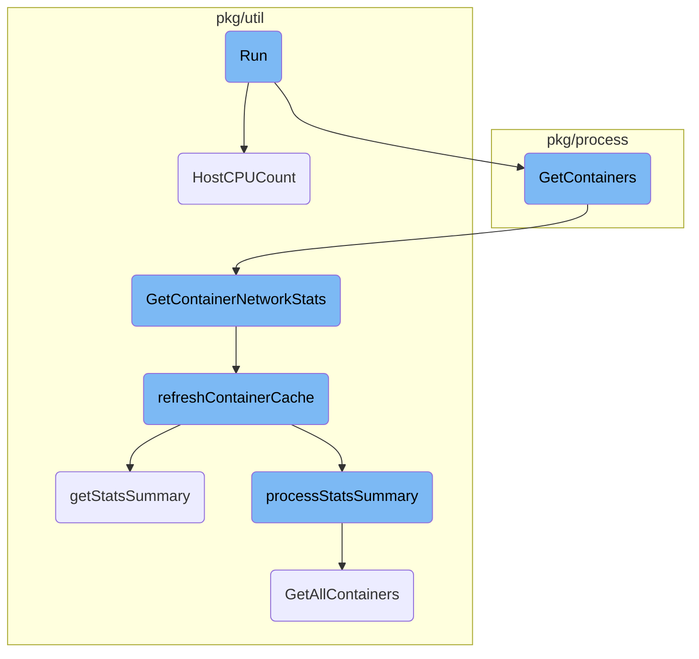
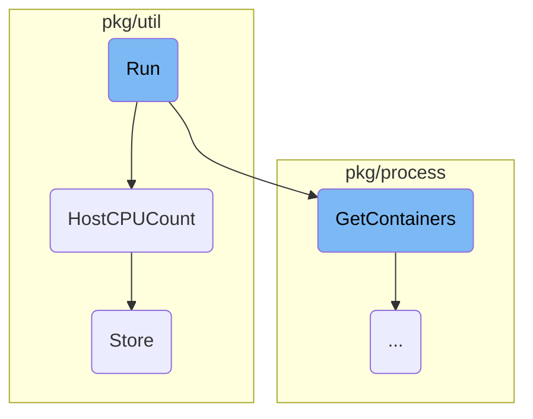
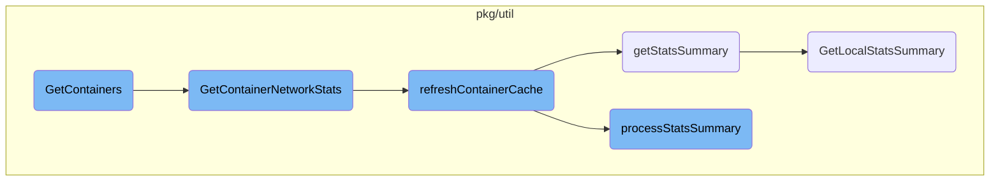

This document provides an overview of the <SwmToken path="pkg/process/checks/container_rt.go" pos="75:2:2" line-data="// Run runs the real-time container check getting container-level stats from the Cgroups and Docker APIs.">`Run`</SwmToken> function, which is responsible for executing the <SwmToken path="pkg/process/checks/container_rt.go" pos="75:8:10" line-data="// Run runs the real-time container check getting container-level stats from the Cgroups and Docker APIs.">`real-time`</SwmToken> container check. It gathers <SwmToken path="pkg/process/checks/container_rt.go" pos="75:18:20" line-data="// Run runs the real-time container check getting container-level stats from the Cgroups and Docker APIs.">`container-level`</SwmToken> stats from the Cgroups and Docker <SwmToken path="pkg/process/checks/container_rt.go" pos="75:34:34" line-data="// Run runs the real-time container check getting container-level stats from the Cgroups and Docker APIs.">`APIs`</SwmToken>, processes them, and returns the results.

The <SwmToken path="pkg/process/checks/container_rt.go" pos="75:2:2" line-data="// Run runs the real-time container check getting container-level stats from the Cgroups and Docker APIs.">`Run`</SwmToken> function starts by gathering container stats from the Cgroups and Docker <SwmToken path="pkg/process/checks/container_rt.go" pos="75:34:34" line-data="// Run runs the real-time container check getting container-level stats from the Cgroups and Docker APIs.">`APIs`</SwmToken>. It then processes these stats into chunks and converts each chunk into a message that includes details like the hostname, CPU count, total memory, and container stats. These messages are then returned as the result. The function ensures that all relevant container metadata and statistics are collected and processed efficiently.

Here is a high level diagram of the flow, showing only the most important functions:



# Flow drill down

First, we'll zoom into this section of the flow:



<SwmSnippet path="/pkg/process/checks/container_rt.go" line="75">

---

## Run

The <SwmToken path="pkg/process/checks/container_rt.go" pos="75:2:2" line-data="// Run runs the real-time container check getting container-level stats from the Cgroups and Docker APIs.">`Run`</SwmToken> function is responsible for executing the <SwmToken path="pkg/process/checks/container_rt.go" pos="75:8:10" line-data="// Run runs the real-time container check getting container-level stats from the Cgroups and Docker APIs.">`real-time`</SwmToken> container check. It gathers <SwmToken path="pkg/process/checks/container_rt.go" pos="75:18:20" line-data="// Run runs the real-time container check getting container-level stats from the Cgroups and Docker APIs.">`container-level`</SwmToken> stats from the Cgroups and Docker <SwmToken path="pkg/process/checks/container_rt.go" pos="75:34:34" line-data="// Run runs the real-time container check getting container-level stats from the Cgroups and Docker APIs.">`APIs`</SwmToken>. The function first retrieves the container stats and then processes them into chunks. Each chunk is then converted into a <SwmToken path="pkg/process/checks/container_rt.go" pos="100:13:13" line-data="		messages = append(messages, &amp;model.CollectorContainerRealTime{">`CollectorContainerRealTime`</SwmToken> message, which includes details such as the hostname, CPU count, total memory, and container stats. These messages are then returned as the result.

```go
// Run runs the real-time container check getting container-level stats from the Cgroups and Docker APIs.
func (r *RTContainerCheck) Run(nextGroupID func() int32, _ *RunOptions) (RunResult, error) {
	var err error
	var containers []*model.Container
	var lastRates map[string]*proccontainers.ContainerRateMetrics
	containers, lastRates, _, err = r.containerProvider.GetContainers(cacheValidityRT, r.lastRates)
	if err == nil {
		r.lastRates = lastRates
	} else {
		log.Debugf("Unable to gather stats for containers, err: %v", err)
	}

	if len(containers) == 0 {
		log.Trace("No containers found")
		return nil, nil
	}

	groupSize := len(containers) / r.maxBatchSize
	if len(containers)%r.maxBatchSize != 0 {
		groupSize++
	}
```

---

</SwmSnippet>

<SwmSnippet path="/pkg/util/system/cpu.go" line="31">

---

## <SwmToken path="pkg/util/system/cpu.go" pos="31:2:2" line-data="// HostCPUCount returns the number of logical CPUs from host">`HostCPUCount`</SwmToken>

The <SwmToken path="pkg/util/system/cpu.go" pos="31:2:2" line-data="// HostCPUCount returns the number of logical CPUs from host">`HostCPUCount`</SwmToken> function returns the number of logical <SwmToken path="pkg/util/system/cpu.go" pos="31:14:14" line-data="// HostCPUCount returns the number of logical CPUs from host">`CPUs`</SwmToken> on the host. It first checks if the CPU count is already cached. If not, it attempts to retrieve the CPU count using <SwmToken path="pkg/util/system/cpu.go" pos="43:8:8" line-data="	cpuCount, err := cpuInfoFunc(ctx, true)">`cpuInfoFunc`</SwmToken>. If this fails, it falls back to using <SwmToken path="pkg/util/system/cpu.go" pos="52:23:27" line-data="			log.Debugf(&quot;Permafail while getting host cpu count, will use runtime.NumCPU(), err: %v&quot;, err)">`runtime.NumCPU()`</SwmToken>. The retrieved or fallback value is then cached for future use.

```go
// HostCPUCount returns the number of logical CPUs from host
func HostCPUCount() int {
	if v := hostCPUCount.Load(); v != 0 {
		return int(v)
	}

	hostCPUCountUpdateLock.Lock()
	defer hostCPUCountUpdateLock.Unlock()

	ctx, cancel := context.WithTimeout(context.Background(), time.Second)
	defer cancel()

	cpuCount, err := cpuInfoFunc(ctx, true)
	if err != nil {
		hostCPUFailedAttempts++
		log.Debugf("Unable to get host cpu count, err: %v", err)

		// To maximize backward compatibility and still be able to return
		// a value which is accurate in most cases.
		// After max attempts, we give up and cache this value
		if hostCPUFailedAttempts >= maxHostCPUFailedAttempts {
```

---

</SwmSnippet>

<SwmSnippet path="/pkg/util/trivy/db.go" line="109">

---

## Store

The <SwmToken path="pkg/util/trivy/db.go" pos="109:2:2" line-data="// Store inserts a key in the database.">`Store`</SwmToken> function inserts a <SwmToken path="pkg/util/trivy/db.go" pos="21:23:25" line-data="	// boltBucket is the name of the BoltDB bucket that stores key-value pairs.">`key-value`</SwmToken> pair into the database. It uses a transaction to ensure atomicity. If the specified bucket does not exist, it creates one. The <SwmToken path="pkg/util/trivy/db.go" pos="21:23:25" line-data="	// boltBucket is the name of the BoltDB bucket that stores key-value pairs.">`key-value`</SwmToken> pair is then stored in the bucket.

```go
// Store inserts a key in the database.
func (b BoltDB) Store(key string, value []byte) error {
	return b.db.Update(func(tx *bolt.Tx) error {
		bucket, err := tx.CreateBucketIfNotExists([]byte(boltBucket))
		if err != nil {
			return err
		}
		return bucket.Put([]byte(key), value)
	})
}
```

---

</SwmSnippet>

Now, lets zoom into this section of the flow:



<SwmSnippet path="/pkg/process/util/containers/containers.go" line="101">

---

## <SwmToken path="pkg/process/checks/container_rt.go" pos="80:18:18" line-data="	containers, lastRates, _, err = r.containerProvider.GetContainers(cacheValidityRT, r.lastRates)">`GetContainers`</SwmToken>

The <SwmToken path="pkg/process/checks/container_rt.go" pos="80:18:18" line-data="	containers, lastRates, _, err = r.containerProvider.GetContainers(cacheValidityRT, r.lastRates)">`GetContainers`</SwmToken> function is responsible for retrieving the list of containers running on the machine. It filters out excluded containers based on annotations, collects tags, and gathers container and network statistics. This function ensures that all relevant container metadata and statistics are collected and returned for further processing.

```go
	containersMetadata := p.metadataStore.ListContainersWithFilter(workloadmeta.GetRunningContainers)

	processContainers := make([]*model.Container, 0)
	rateStats := make(map[string]*ContainerRateMetrics)
	pidToCid := make(map[int]string)
	for _, container := range containersMetadata {
		var annotations map[string]string
		if pod, err := p.metadataStore.GetKubernetesPodForContainer(container.ID); err == nil {
			annotations = pod.Annotations
		}

		if p.filter != nil && p.filter.IsExcluded(annotations, container.Name, container.Image.Name, container.Labels[kubernetes.CriContainerNamespaceLabel]) {
			continue
		}

		if container.Runtime == workloadmeta.ContainerRuntimeGarden && len(container.CollectorTags) == 0 {
			log.Debugf("No tags found for garden container: %s, skipping", container.ID)
			continue
		}

		entityID := containers.BuildTaggerEntityName(container.ID)
```

---

</SwmSnippet>

<SwmSnippet path="/pkg/util/containers/metrics/kubelet/collector.go" line="147">

---

## <SwmToken path="pkg/util/containers/metrics/kubelet/collector.go" pos="147:9:9" line-data="func (kc *kubeletCollector) GetContainerNetworkStats(containerNS, containerID string, cacheValidity time.Duration) (*provider.ContainerNetworkStats, error) { //nolint:revive // TODO fix revive unused-parameter">`GetContainerNetworkStats`</SwmToken>

The <SwmToken path="pkg/util/containers/metrics/kubelet/collector.go" pos="147:9:9" line-data="func (kc *kubeletCollector) GetContainerNetworkStats(containerNS, containerID string, cacheValidity time.Duration) (*provider.ContainerNetworkStats, error) { //nolint:revive // TODO fix revive unused-parameter">`GetContainerNetworkStats`</SwmToken> function retrieves network statistics for a specific container. It first checks the cache for existing data and refreshes the cache if necessary. This function ensures that up-to-date network statistics are available for the container.

```go
func (kc *kubeletCollector) GetContainerNetworkStats(containerNS, containerID string, cacheValidity time.Duration) (*provider.ContainerNetworkStats, error) { //nolint:revive // TODO fix revive unused-parameter
	currentTime := time.Now()

	containerNetworkStats, found, err := kc.statsCache.Get(currentTime, contNetStatsCachePrefix+containerID, cacheValidity)
	if found {
		if containerNetworkStats != nil {
			return containerNetworkStats.(*provider.ContainerNetworkStats), err
		}
		return nil, err
	}

	// Item missing from cache
	if err := kc.refreshContainerCache(currentTime, cacheValidity); err != nil {
		return nil, err
	}

	containerNetworkStats, found, err = kc.statsCache.Get(currentTime, contNetStatsCachePrefix+containerID, cacheValidity)
	if found {
		if containerNetworkStats != nil {
			return containerNetworkStats.(*provider.ContainerNetworkStats), err
		}
```

---

</SwmSnippet>

<SwmSnippet path="/pkg/util/containers/metrics/kubelet/collector.go" line="174">

---

## <SwmToken path="pkg/util/containers/metrics/kubelet/collector.go" pos="174:9:9" line-data="func (kc *kubeletCollector) refreshContainerCache(currentTime time.Time, cacheValidity time.Duration) error {">`refreshContainerCache`</SwmToken>

The <SwmToken path="pkg/util/containers/metrics/kubelet/collector.go" pos="174:9:9" line-data="func (kc *kubeletCollector) refreshContainerCache(currentTime time.Time, cacheValidity time.Duration) error {">`refreshContainerCache`</SwmToken> function updates the cache with the latest container statistics. It locks the cache to prevent concurrent updates, retrieves the latest statistics summary, and processes the summary to store the updated statistics in the cache.

```go
func (kc *kubeletCollector) refreshContainerCache(currentTime time.Time, cacheValidity time.Duration) error {
	kc.refreshLock.Lock()
	defer kc.refreshLock.Unlock()

	// Not refreshing if last refresh is within cacheValidity
	_, found, err := kc.statsCache.Get(currentTime, refreshCacheKey, cacheValidity)
	if found {
		return err
	}

	statsSummary, err := kc.getStatsSummary()
	if err == nil {
		kc.processStatsSummary(currentTime, statsSummary)
	} else {
		log.Debugf("Unable to get stats from Kubelet, err: %v", err)
	}

	kc.statsCache.Store(currentTime, refreshCacheKey, nil, err)
	return err
}
```

---

</SwmSnippet>

<SwmSnippet path="/pkg/util/containers/metrics/kubelet/collector.go" line="195">

---

## <SwmToken path="pkg/util/containers/metrics/kubelet/collector.go" pos="195:9:9" line-data="func (kc *kubeletCollector) getStatsSummary() (*v1alpha1.Summary, error) {">`getStatsSummary`</SwmToken>

The <SwmToken path="pkg/util/containers/metrics/kubelet/collector.go" pos="195:9:9" line-data="func (kc *kubeletCollector) getStatsSummary() (*v1alpha1.Summary, error) {">`getStatsSummary`</SwmToken> function retrieves a summary of node and pod statistics from the Kubelet. It makes a request to the Kubelet API and returns the parsed statistics summary.

```go
func (kc *kubeletCollector) getStatsSummary() (*v1alpha1.Summary, error) {
	ctx, cancel := context.WithTimeout(context.Background(), kubeletCallTimeout)
	statsSummary, err := kc.kubeletClient.GetLocalStatsSummary(ctx)
	cancel()

	if err != nil {
		return nil, err
	}

	return statsSummary, err
}
```

---

</SwmSnippet>

<SwmSnippet path="/pkg/util/containers/metrics/kubelet/collector.go" line="207">

---

## <SwmToken path="pkg/util/containers/metrics/kubelet/collector.go" pos="207:9:9" line-data="func (kc *kubeletCollector) processStatsSummary(currentTime time.Time, statsSummary *v1alpha1.Summary) {">`processStatsSummary`</SwmToken>

The <SwmToken path="pkg/util/containers/metrics/kubelet/collector.go" pos="207:9:9" line-data="func (kc *kubeletCollector) processStatsSummary(currentTime time.Time, statsSummary *v1alpha1.Summary) {">`processStatsSummary`</SwmToken> function processes the statistics summary retrieved from the Kubelet. It parses network and container statistics, maps container names to <SwmToken path="tasks/gitlab_helpers.py" pos="90:10:10" line-data="def print_gitlab_object(get_object, ctx, ids, repo=&#39;DataDog/datadog-agent&#39;, jq: str | None = None, jq_colors=True):">`ids`</SwmToken>, and stores the parsed statistics in the cache.

```go
func (kc *kubeletCollector) processStatsSummary(currentTime time.Time, statsSummary *v1alpha1.Summary) {
	if statsSummary == nil {
		return
	}

	for _, pod := range statsSummary.Pods {
		if len(pod.Containers) == 0 {
			continue
		}

		// Parsing network stats, need to store them by container anyway as it's the way it works currently
		// We use POD UID to generate an isolation group. It won't be network namespace FD, but it will still work
		// as all containers will get the same.
		// We could know if we're hostNetwork or not if we retrieve local POD list instead of relying on Workload meta,
		// albeit, with extra work. As this collector is designed to run in environment where we don't have access to
		// underlying host, it should not be an issue.
		podNetworkStats := &provider.ContainerNetworkStats{}
		convertNetworkStats(pod.Network, podNetworkStats)
		podNetworkStats.NetworkIsolationGroupID = pointer.Ptr(networkIDFromPODUID(pod.PodRef.UID))

		// As Metadata collector is running through polling, it can happen that we have newer PODs, containers
```

---

</SwmSnippet>

<SwmSnippet path="/pkg/util/kubernetes/kubelet/kubelet.go" line="339">

---

## <SwmToken path="pkg/util/kubernetes/kubelet/kubelet.go" pos="339:9:9" line-data="func (ku *KubeUtil) GetLocalStatsSummary(ctx context.Context) (*kubeletv1alpha1.Summary, error) {">`GetLocalStatsSummary`</SwmToken>

The <SwmToken path="pkg/util/kubernetes/kubelet/kubelet.go" pos="339:9:9" line-data="func (ku *KubeUtil) GetLocalStatsSummary(ctx context.Context) (*kubeletv1alpha1.Summary, error) {">`GetLocalStatsSummary`</SwmToken> function queries the Kubelet for node and pod statistics. It handles the HTTP request to the Kubelet API, checks the response status, and parses the JSON response into a statistics summary.

```go
func (ku *KubeUtil) GetLocalStatsSummary(ctx context.Context) (*kubeletv1alpha1.Summary, error) {
	data, code, err := ku.QueryKubelet(ctx, kubeletStatsSummary)
	if err != nil {
		return nil, errors.NewRetriable("statssummary", fmt.Errorf("error performing kubelet query %s%s: %w", ku.kubeletClient.kubeletURL, kubeletStatsSummary, err))
	}
	if code != http.StatusOK {
		return nil, errors.NewRetriable("statssummary", fmt.Errorf("unexpected status code %d on %s%s: %s", code, ku.kubeletClient.kubeletURL, kubeletStatsSummary, string(data)))
	}

	statsSummary := &kubeletv1alpha1.Summary{}
	if err := json.Unmarshal(data, statsSummary); err != nil {
		return nil, err
	}

	return statsSummary, nil
}
```

---

</SwmSnippet>

&nbsp;

*This is an auto-generated document by Swimm AI 🌊 and has not yet been verified by a human*

<SwmMeta version="3.0.0" repo-id="Z2l0aHViJTNBJTNBZGF0YWRvZy1hZ2VudCUzQSUzQVN3aW1tLURlbW8=" repo-name="datadog-agent"><sup>Powered by [Swimm](/)</sup></SwmMeta>
