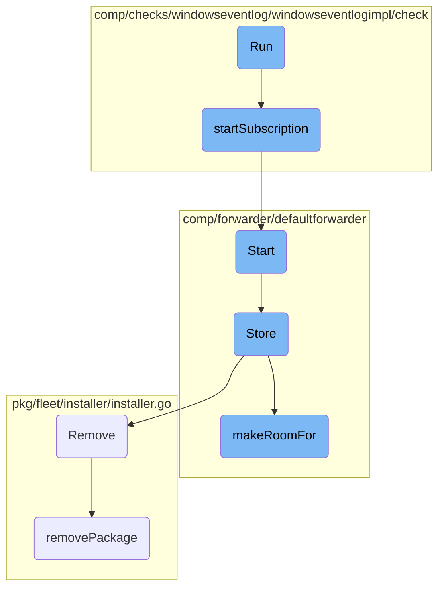

This document explains the <SwmToken path="comp/checks/windowseventlog/windowseventlogimpl/check/check.go" pos="72:2:2" line-data="// Run updates sender stats, restarts the subscription if it failed, and saves the bookmark.">`Run`</SwmToken> function, which is responsible for updating sender stats, restarting subscriptions if they fail, and saving bookmarks. It ensures that the event collection logic runs continuously in the background.

The <SwmToken path="comp/checks/windowseventlog/windowseventlogimpl/check/check.go" pos="72:2:2" line-data="// Run updates sender stats, restarts the subscription if it failed, and saves the bookmark.">`Run`</SwmToken> function starts by updating the sender stats and checking if the subscription is running. If the subscription is not running, it restarts it to ensure continuous event collection. The function also saves a bookmark to keep track of the events. This process ensures that the system can collect and process events without interruption.

# Flow drill down



<SwmSnippet path="/comp/checks/windowseventlog/windowseventlogimpl/check/check.go" line="72">

---

## Run

The <SwmToken path="comp/checks/windowseventlog/windowseventlogimpl/check/check.go" pos="72:2:2" line-data="// Run updates sender stats, restarts the subscription if it failed, and saves the bookmark.">`Run`</SwmToken> function updates sender stats, restarts the subscription if it failed, and saves the bookmark. It ensures that the event collection logic runs continuously in the background.

```go
// Run updates sender stats, restarts the subscription if it failed, and saves the bookmark.
// The main event collection logic runs continuously in the background, not during Run().
func (c *Check) Run() error {
	sender, err := c.GetSender()
	if err != nil {
		return err
	}
	// Necessary for check stats to be calculated (number of events collected, etc)
	// Since events are collected in the background, this will update stats with the
	// count of events collected since the last Run() call.
	defer sender.Commit()

	// Start/Restart the subscription if it is not running
	if !c.sub.Running() {
		// starts the event collection in the background.
		err := c.startSubscription()
		if err != nil {
			err = fmt.Errorf("subscription is not running, failed to start: %w", err)
			if c.sub.Error() != nil {
				err = fmt.Errorf("%w, last stop reason: %w", err, c.sub.Error())
			}
```

---

</SwmSnippet>

<SwmSnippet path="/comp/checks/windowseventlog/windowseventlogimpl/check/subscription.go" line="151">

---

## <SwmToken path="comp/checks/windowseventlog/windowseventlogimpl/check/subscription.go" pos="151:9:9" line-data="func (c *Check) startSubscription() error {">`startSubscription`</SwmToken>

The <SwmToken path="comp/checks/windowseventlog/windowseventlogimpl/check/subscription.go" pos="151:9:9" line-data="func (c *Check) startSubscription() error {">`startSubscription`</SwmToken> function initializes the event subscription and starts the event collection loop in the background. It handles both event and log pipelines based on the configuration.

```go
func (c *Check) startSubscription() error {
	sender, err := c.GetSender()
	if err != nil {
		return err
	}

	err = c.sub.Start()
	if err != nil {
		return fmt.Errorf("failed to start event subscription: %w", err)
	}

	// Start collection loop in the background so we can collect/report
	// events as they come instead of being behind by check_interval (15s).
	c.fetchEventsLoopStop = make(chan struct{})
	c.fetchEventsLoopWaiter.Add(1)
	pipelineWaiter := sync.WaitGroup{}
	eventCh := make(chan *evtapi.EventRecord)
	go c.fetchEventsLoop(eventCh, &pipelineWaiter)

	// start the events or the logs pipeline to handle the incoming events
	if _, isSet := c.config.instance.ChannelPath.Get(); isSet {
```

---

</SwmSnippet>

<SwmSnippet path="/comp/forwarder/defaultforwarder/default_forwarder.go" line="374">

---

## Start

The <SwmToken path="comp/forwarder/defaultforwarder/default_forwarder.go" pos="374:2:2" line-data="// Start initialize and runs the forwarder.">`Start`</SwmToken> function initializes and runs the forwarder. It ensures that the forwarder is not already started and logs the endpoints configuration.

```go
// Start initialize and runs the forwarder.
func (f *DefaultForwarder) Start() error {
	// Lock so we can't stop a Forwarder while is starting
	f.m.Lock()
	defer f.m.Unlock()

	if f.internalState.Load() == Started {
		return fmt.Errorf("the forwarder is already started")
	}

	for _, df := range f.domainForwarders {
		_ = df.Start()
	}

	// log endpoints configuration
	endpointLogs := make([]string, 0, len(f.domainResolvers))
	for domain, dr := range f.domainResolvers {
		endpointLogs = append(endpointLogs, fmt.Sprintf("\"%s\" (%v api key(s))",
			domain, len(dr.GetAPIKeys())))
	}
	f.log.Infof("Forwarder started, sending to %v endpoint(s) with %v worker(s) each: %s",
```

---

</SwmSnippet>

<SwmSnippet path="/comp/forwarder/defaultforwarder/internal/retry/on_disk_retry_queue.go" line="67">

---

## Store

The <SwmToken path="comp/forwarder/defaultforwarder/internal/retry/on_disk_retry_queue.go" pos="67:2:2" line-data="// Store stores transactions to the file system.">`Store`</SwmToken> function stores transactions to the file system. It serializes transactions, makes room for new data if necessary, and writes the serialized data to a temporary file.

```go
// Store stores transactions to the file system.
func (s *onDiskRetryQueue) Store(transactions []transaction.Transaction) error {
	s.telemetry.addSerializeCount()

	// Reset the serializer in case some transactions were serialized
	// but `GetBytesAndReset` was not called because of an error.
	_, _ = s.serializer.GetBytesAndReset()

	for _, t := range transactions {
		if err := t.SerializeTo(s.log, s.serializer); err != nil {
			return err
		}
	}

	bytes, err := s.serializer.GetBytesAndReset()
	if err != nil {
		return err
	}
	bufferSize := int64(len(bytes))

	if err := s.makeRoomFor(bufferSize); err != nil {
```

---

</SwmSnippet>

<SwmSnippet path="/pkg/fleet/installer/installer.go" line="297">

---

## Remove

The <SwmToken path="pkg/fleet/installer/installer.go" pos="297:2:2" line-data="// Remove uninstalls a package.">`Remove`</SwmToken> function uninstalls a package. It locks the installer, calls the <SwmToken path="pkg/fleet/installer/installer.go" pos="301:7:7" line-data="	err := i.removePackage(ctx, pkg)">`removePackage`</SwmToken> function, and deletes the package from the repositories and database.

```go
// Remove uninstalls a package.
func (i *installerImpl) Remove(ctx context.Context, pkg string) error {
	i.m.Lock()
	defer i.m.Unlock()
	err := i.removePackage(ctx, pkg)
	if err != nil {
		return fmt.Errorf("could not remove package: %w", err)
	}
	err = i.repositories.Delete(ctx, pkg)
	if err != nil {
		return fmt.Errorf("could not delete repository: %w", err)
	}
	err = i.db.DeletePackage(pkg)
	if err != nil {
		return fmt.Errorf("could not remove package installation in db: %w", err)
	}
	return nil
}
```

---

</SwmSnippet>

<SwmSnippet path="/comp/forwarder/defaultforwarder/internal/retry/on_disk_retry_queue.go" line="154">

---

## <SwmToken path="comp/forwarder/defaultforwarder/internal/retry/on_disk_retry_queue.go" pos="154:9:9" line-data="func (s *onDiskRetryQueue) makeRoomFor(bufferSize int64) error {">`makeRoomFor`</SwmToken>

The <SwmToken path="comp/forwarder/defaultforwarder/internal/retry/on_disk_retry_queue.go" pos="154:9:9" line-data="func (s *onDiskRetryQueue) makeRoomFor(bufferSize int64) error {">`makeRoomFor`</SwmToken> function ensures there is enough disk space for new data by removing old files if necessary. It checks the available space and removes files until there is enough room for the new data.

```go
func (s *onDiskRetryQueue) makeRoomFor(bufferSize int64) error {
	maxSizeInBytes := s.diskUsageLimit.getMaxSizeInBytes()
	if bufferSize > maxSizeInBytes {
		return fmt.Errorf("The payload is too big. Current:%v Maximum:%v", bufferSize, maxSizeInBytes)
	}

	maxStorageInBytes, err := s.diskUsageLimit.computeAvailableSpace(s.currentSizeInBytes)
	if err != nil {
		return err
	}
	for len(s.filenames) > 0 && s.currentSizeInBytes+bufferSize > maxStorageInBytes {
		index := 0
		filename := s.filenames[index]
		s.log.Errorf("Maximum disk space for retry transactions is reached. Removing %s", filename)

		bytes, err := os.ReadFile(filename)
		if err != nil {
			s.log.Errorf("Cannot read the file %v: %v", filename, err)
		} else if transactions, _, errDeserialize := s.serializer.Deserialize(bytes); errDeserialize == nil {
			pointDroppedCount := 0
			for _, tr := range transactions {
```

---

</SwmSnippet>

<SwmSnippet path="/pkg/fleet/installer/installer.go" line="410">

---

## <SwmToken path="pkg/fleet/installer/installer.go" pos="410:9:9" line-data="func (i *installerImpl) removePackage(ctx context.Context, pkg string) error {">`removePackage`</SwmToken>

The <SwmToken path="pkg/fleet/installer/installer.go" pos="410:9:9" line-data="func (i *installerImpl) removePackage(ctx context.Context, pkg string) error {">`removePackage`</SwmToken> function handles the uninstallation of specific packages. It calls the appropriate service removal function based on the package name.

```go
func (i *installerImpl) removePackage(ctx context.Context, pkg string) error {
	switch pkg {
	case packageDatadogAgent:
		return service.RemoveAgent(ctx)
	case packageAPMInjector:
		return service.RemoveAPMInjector(ctx)
	case packageDatadogInstaller:
		return service.RemoveInstaller(ctx)
	default:
		return nil
	}
}
```

---

</SwmSnippet>

&nbsp;

*This is an auto-generated document by Swimm AI 🌊 and has not yet been verified by a human*

<SwmMeta version="3.0.0" repo-id="Z2l0aHViJTNBJTNBZGF0YWRvZy1hZ2VudCUzQSUzQVN3aW1tLURlbW8=" repo-name="datadog-agent"><sup>Powered by [Swimm](/)</sup></SwmMeta>
