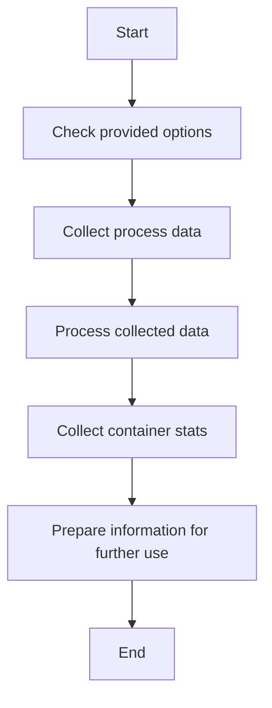

This document will cover the overview of the Run Function, which includes:

1. Checking provided options
2. Collecting process data
3. Processing collected data
4. Collecting container stats
5. Preparing information for further use.

Technical document: <SwmLink doc-title="Overview of the Run Function">[Overview of the Run Function](/.swm/overview-of-the-run-function.xtuijnny.sw.md)</SwmLink>

# [Checking provided options](https://app.swimm.io/repos/Z2l0aHViJTNBJTNBZGF0YWRvZy1hZ2VudCUzQSUzQVN3aW1tLURlbW8=/docs/xtuijnny#checking-provided-options)

The Run function begins by examining the provided options to determine the type of process check to perform. If the standard check is selected, it will collect regular metadata and statistics about the processes. If the real-time check is selected, it will gather real-time statistics. This step ensures that the function knows which type of data to collect based on user preferences.

# [Collecting process data](https://app.swimm.io/repos/Z2l0aHViJTNBJTNBZGF0YWRvZy1hZ2VudCUzQSUzQVN3aW1tLURlbW8=/docs/xtuijnny#collecting-process-data)

Once the type of check is determined, the function proceeds to collect the relevant process data. For a standard check, it gathers regular metadata and statistics about the processes. For a real-time check, it collects real-time statistics. This data collection is crucial for providing accurate and up-to-date information about the system's processes.

# [Processing collected data](https://app.swimm.io/repos/Z2l0aHViJTNBJTNBZGF0YWRvZy1hZ2VudCUzQSUzQVN3aW1tLURlbW8=/docs/xtuijnny#processing-collected-data)

After collecting the process data, the function processes this information to make it usable for further analysis. This involves organizing and structuring the data in a way that can be easily interpreted and utilized by other components of the system. This step ensures that the collected data is ready for subsequent processing and analysis.

# [Collecting container stats](https://app.swimm.io/repos/Z2l0aHViJTNBJTNBZGF0YWRvZy1hZ2VudCUzQSUzQVN3aW1tLURlbW8=/docs/xtuijnny#collecting-container-stats)

In addition to process data, the function also collects statistics about containers running on the machine. This includes gathering metadata and performance metrics for each container. This step is essential for providing a comprehensive view of the system's performance, including both processes and containers.

# [Preparing information for further use](https://app.swimm.io/repos/Z2l0aHViJTNBJTNBZGF0YWRvZy1hZ2VudCUzQSUzQVN3aW1tLURlbW8=/docs/xtuijnny#preparing-information-for-further-use)

Finally, the function prepares the collected and processed information for further use. This involves formatting the data into chunks and preparing messages to be sent to other components of the system. This step ensures that the information is ready to be utilized for monitoring and analysis purposes.

&nbsp;

*This is an auto-generated document by Swimm AI 🌊 and has not yet been verified by a human*

<SwmMeta version="3.0.0" repo-id="Z2l0aHViJTNBJTNBZGF0YWRvZy1hZ2VudCUzQSUzQVN3aW1tLURlbW8=" repo-name="datadog-agent">Powered by [Swimm](/)</SwmMeta>
