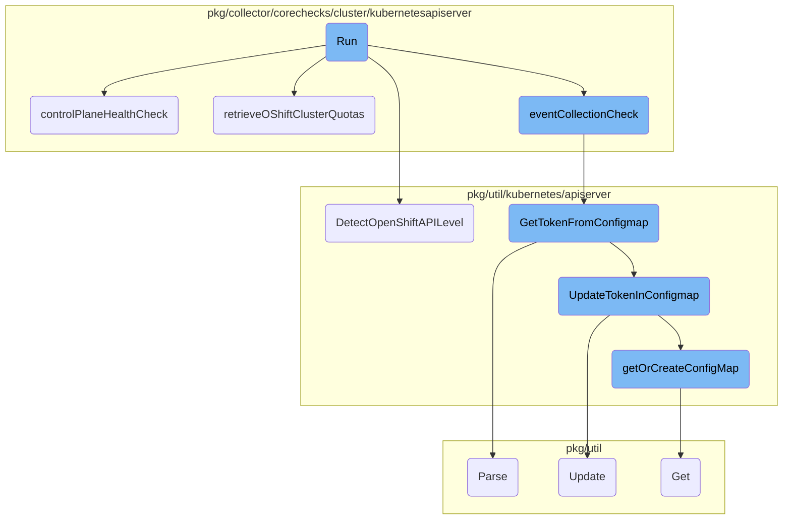
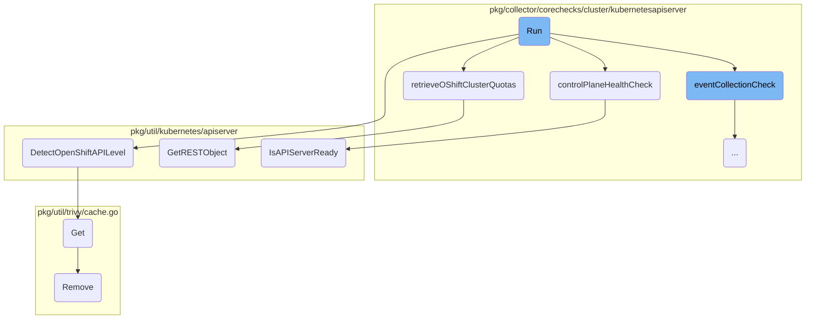
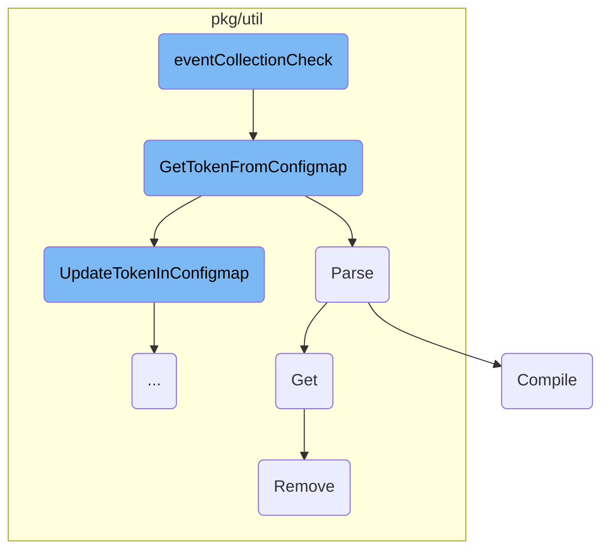
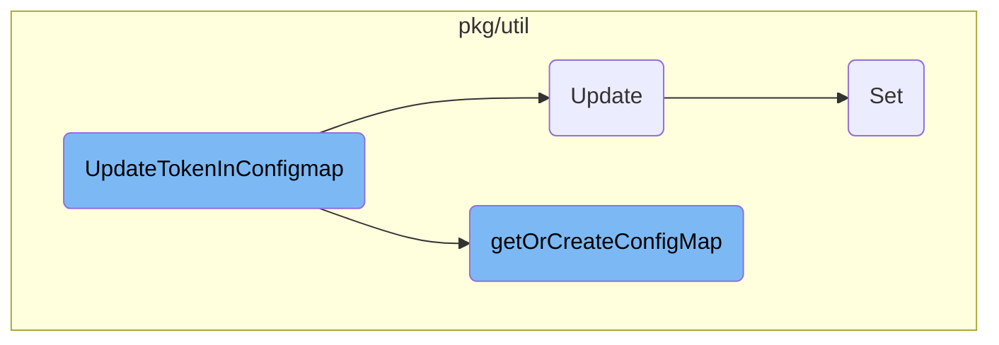

This document provides an overview of the <SwmToken path="pkg/collector/corechecks/cluster/kubernetesapiserver/kubernetes_apiserver.go" pos="198:2:2" line-data="// Run executes the check.">`Run`</SwmToken> function, which is the main execution point for the Kubernetes API Server check. It outlines the steps involved in obtaining metrics and logs, performing health checks, and collecting events.

The <SwmToken path="pkg/collector/corechecks/cluster/kubernetesapiserver/kubernetes_apiserver.go" pos="198:2:2" line-data="// Run executes the check.">`Run`</SwmToken> function starts by getting a sender for metrics and logs. If the cluster agent is enabled, it skips the check. It ensures that leader election is enabled and that the current instance is the leader before proceeding. The function initializes the API server client if it hasn't been done already and detects <SwmToken path="pkg/collector/corechecks/cluster/kubernetesapiserver/kubernetes_openshift.go" pos="28:10:10" line-data="// retrieveOShiftClusterQuotas lists and unmarshalls Openshift">`Openshift`</SwmToken> presence for quota collection. It then performs a control plane health check and collects <SwmToken path="pkg/collector/corechecks/cluster/kubernetesapiserver/kubernetes_openshift.go" pos="28:10:10" line-data="// retrieveOShiftClusterQuotas lists and unmarshalls Openshift">`Openshift`</SwmToken> cluster quotas if applicable. Finally, it collects Kubernetes events if configured to do so.

Here is a high level diagram of the flow, showing only the most important functions:



# Flow drill down

First, we'll zoom into this section of the flow:



<SwmSnippet path="/pkg/collector/corechecks/cluster/kubernetesapiserver/kubernetes_apiserver.go" line="198">

---

## Run

The <SwmToken path="pkg/collector/corechecks/cluster/kubernetesapiserver/kubernetes_apiserver.go" pos="198:2:2" line-data="// Run executes the check.">`Run`</SwmToken> function is the main execution point for the Kubernetes API Server check. It starts by obtaining a sender for metrics and logs. If the cluster agent is enabled, it skips the check. It ensures that leader election is enabled and that the current instance is the leader before proceeding. The function initializes the API server client if it hasn't been done already and detects <SwmToken path="pkg/collector/corechecks/cluster/kubernetesapiserver/kubernetes_openshift.go" pos="28:10:10" line-data="// retrieveOShiftClusterQuotas lists and unmarshalls Openshift">`Openshift`</SwmToken> presence for quota collection. It then performs a control plane health check and collects <SwmToken path="pkg/collector/corechecks/cluster/kubernetesapiserver/kubernetes_openshift.go" pos="28:10:10" line-data="// retrieveOShiftClusterQuotas lists and unmarshalls Openshift">`Openshift`</SwmToken> cluster quotas if applicable. Finally, it collects Kubernetes events if configured to do so.

```go
// Run executes the check.
func (k *KubeASCheck) Run() error {
	sender, err := k.GetSender()
	if err != nil {
		return err
	}
	defer sender.Commit()

	if ddConfig.Datadog().GetBool("cluster_agent.enabled") {
		log.Debug("Cluster agent is enabled. Not running Kubernetes API Server check or collecting Kubernetes Events.")
		return nil
	}
	// If the check is configured as a cluster check, the cluster check worker needs to skip the leader election section.
	// The Cluster Agent will passed in the `skip_leader_election` bool.
	if !k.instance.LeaderSkip {
		// Only run if Leader Election is enabled.
		if !ddConfig.Datadog().GetBool("leader_election") {
			return log.Error("Leader Election not enabled. Not running Kubernetes API Server check or collecting Kubernetes Events.")
		}
		leader, errLeader := cluster.RunLeaderElection()
		if errLeader != nil {
```

---

</SwmSnippet>

<SwmSnippet path="/pkg/collector/corechecks/cluster/kubernetesapiserver/kubernetes_apiserver.go" line="380">

---

## <SwmToken path="pkg/collector/corechecks/cluster/kubernetesapiserver/kubernetes_apiserver.go" pos="380:9:9" line-data="func (k *KubeASCheck) controlPlaneHealthCheck(ctx context.Context, sender sender.Sender) error {">`controlPlaneHealthCheck`</SwmToken>

The <SwmToken path="pkg/collector/corechecks/cluster/kubernetesapiserver/kubernetes_apiserver.go" pos="380:9:9" line-data="func (k *KubeASCheck) controlPlaneHealthCheck(ctx context.Context, sender sender.Sender) error {">`controlPlaneHealthCheck`</SwmToken> function checks the readiness of the API server. It sends a service check status based on whether the API server is ready or not. If the API server is ready, it sends an 'ok' status; otherwise, it sends a 'critical' status along with an error message if available.

```go
func (k *KubeASCheck) controlPlaneHealthCheck(ctx context.Context, sender sender.Sender) error {
	ready, err := k.ac.IsAPIServerReady(ctx)

	var (
		msg    string
		status servicecheck.ServiceCheckStatus
	)

	if ready {
		msg = "ok"
		status = servicecheck.ServiceCheckOK
	} else {
		status = servicecheck.ServiceCheckCritical
		if err != nil {
			msg = err.Error()
		} else {
			msg = "unknown error"
		}
	}

	sender.ServiceCheck(KubeControlPaneCheck, status, "", nil, msg)
```

---

</SwmSnippet>

<SwmSnippet path="/pkg/collector/corechecks/cluster/kubernetesapiserver/kubernetes_openshift.go" line="28">

---

## <SwmToken path="pkg/collector/corechecks/cluster/kubernetesapiserver/kubernetes_openshift.go" pos="28:2:2" line-data="// retrieveOShiftClusterQuotas lists and unmarshalls Openshift">`retrieveOShiftClusterQuotas`</SwmToken>

The <SwmToken path="pkg/collector/corechecks/cluster/kubernetesapiserver/kubernetes_openshift.go" pos="28:2:2" line-data="// retrieveOShiftClusterQuotas lists and unmarshalls Openshift">`retrieveOShiftClusterQuotas`</SwmToken> function lists and unmarshalls <SwmToken path="pkg/collector/corechecks/cluster/kubernetesapiserver/kubernetes_openshift.go" pos="28:10:10" line-data="// retrieveOShiftClusterQuotas lists and unmarshalls Openshift">`Openshift`</SwmToken> <SwmToken path="pkg/collector/corechecks/cluster/kubernetesapiserver/kubernetes_openshift.go" pos="29:2:2" line-data="// ClusterResourceQuota objects from the APIserver">`ClusterResourceQuota`</SwmToken> objects from the API server. It determines the appropriate URL based on the detected <SwmToken path="pkg/collector/corechecks/cluster/kubernetesapiserver/kubernetes_openshift.go" pos="28:10:10" line-data="// retrieveOShiftClusterQuotas lists and unmarshalls Openshift">`Openshift`</SwmToken> API level and retrieves the quota objects using the <SwmToken path="pkg/collector/corechecks/cluster/kubernetesapiserver/kubernetes_openshift.go" pos="42:9:9" line-data="	err := k.ac.GetRESTObject(url, list)">`GetRESTObject`</SwmToken> function.

```go
// retrieveOShiftClusterQuotas lists and unmarshalls Openshift
// ClusterResourceQuota objects from the APIserver
func (k *KubeASCheck) retrieveOShiftClusterQuotas() ([]osq.ClusterResourceQuota, error) {
	var url string
	switch k.oshiftAPILevel {
	case apiserver.OpenShiftAPIGroup:
		url = apiGroupClusterQuotaEndpoint
	case apiserver.OpenShiftOAPI:
		url = oapiClusterQuotaEndpoint
	default:
		return nil, errors.New("OpenShift APIs unavailable")
	}

	list := &osq.ClusterResourceQuotaList{}
	err := k.ac.GetRESTObject(url, list)
	if err != nil {
		return nil, err
	}
	return list.Items, nil
}
```

---

</SwmSnippet>

<SwmSnippet path="/pkg/util/kubernetes/apiserver/openshift.go" line="16">

---

## <SwmToken path="pkg/util/kubernetes/apiserver/openshift.go" pos="16:2:2" line-data="// DetectOpenShiftAPILevel looks at known endpoints to detect if OpenShift">`DetectOpenShiftAPILevel`</SwmToken>

The <SwmToken path="pkg/util/kubernetes/apiserver/openshift.go" pos="16:2:2" line-data="// DetectOpenShiftAPILevel looks at known endpoints to detect if OpenShift">`DetectOpenShiftAPILevel`</SwmToken> function detects if <SwmToken path="pkg/util/kubernetes/apiserver/openshift.go" pos="16:18:18" line-data="// DetectOpenShiftAPILevel looks at known endpoints to detect if OpenShift">`OpenShift`</SwmToken> <SwmToken path="pkg/util/kubernetes/apiserver/openshift.go" pos="17:2:2" line-data="// APIs are available on this apiserver. OpenShift transitioned from a">`APIs`</SwmToken> are available on the API server. It checks for the presence of known <SwmToken path="pkg/util/kubernetes/apiserver/openshift.go" pos="16:18:18" line-data="// DetectOpenShiftAPILevel looks at known endpoints to detect if OpenShift">`OpenShift`</SwmToken> API endpoints and returns the detected API level, preferring the newer API group endpoints if both are available.

```go
// DetectOpenShiftAPILevel looks at known endpoints to detect if OpenShift
// APIs are available on this apiserver. OpenShift transitioned from a
// non-standard `/oapi` URL prefix to standard api groups under the `/apis`
// prefix in 3.6. Detecting both, with a preference for the new prefix.
func (c *APIClient) DetectOpenShiftAPILevel() OpenShiftAPILevel {
	err := c.Cl.CoreV1().RESTClient().Get().AbsPath("/apis/quota.openshift.io").Do(context.TODO()).Error()
	if err == nil {
		log.Debugf("Found %s", OpenShiftAPIGroup)
		return OpenShiftAPIGroup
	}
	log.Debugf("Cannot access %s: %s", OpenShiftAPIGroup, err)

	err = c.Cl.CoreV1().RESTClient().Get().AbsPath("/oapi").Do(context.TODO()).Error()
	if err == nil {
		log.Debugf("Found %s", OpenShiftOAPI)
		return OpenShiftOAPI
	}
	log.Debugf("Cannot access %s: %s", OpenShiftOAPI, err)

	// Fallback to NotOpenShift
	return NotOpenShift
```

---

</SwmSnippet>

<SwmSnippet path="/pkg/util/trivy/cache.go" line="387">

---

## Get

The <SwmToken path="pkg/util/trivy/cache.go" pos="387:2:2" line-data="// Get implements Cache#Get.">`Get`</SwmToken> function retrieves an entry from the cache. It first checks if the key exists in the cache. If the key is found, it retrieves the corresponding value; otherwise, it returns an error indicating that the key was not found.

```go
// Get implements Cache#Get.
func (c *persistentCache) Get(key string) ([]byte, error) {
	ok := c.Contains(key)
	if !ok {
		return nil, fmt.Errorf("key not found")
	}

	res, err := c.db.Get(key)
	if err != nil {
		_ = c.Remove([]string{key})
		return nil, err
	}
	return res, nil
}
```

---

</SwmSnippet>

<SwmSnippet path="/pkg/util/trivy/cache.go" line="420">

---

## Remove

The <SwmToken path="pkg/util/trivy/cache.go" pos="420:2:2" line-data="// Remove removes an entry from the cache.">`Remove`</SwmToken> function removes an entry from the cache. It locks the cache to ensure thread safety and then calls the internal <SwmToken path="pkg/util/trivy/cache.go" pos="420:2:2" line-data="// Remove removes an entry from the cache.">`Remove`</SwmToken> function to delete the specified keys.

```go
// Remove removes an entry from the cache.
func (c *persistentCache) Remove(keys []string) error {
	c.mutex.Lock()
	defer c.mutex.Unlock()
	return c.remove(keys)
}
```

---

</SwmSnippet>

<SwmSnippet path="/pkg/util/kubernetes/apiserver/apiserver.go" line="605">

---

## <SwmToken path="pkg/util/kubernetes/apiserver/apiserver.go" pos="605:2:2" line-data="// GetRESTObject allows to retrieve a custom resource from the APIserver">`GetRESTObject`</SwmToken>

The <SwmToken path="pkg/util/kubernetes/apiserver/apiserver.go" pos="605:2:2" line-data="// GetRESTObject allows to retrieve a custom resource from the APIserver">`GetRESTObject`</SwmToken> function retrieves a custom resource from the API server. It sends a GET request to the specified path and unmarshalls the response into the provided output object.

```go
// GetRESTObject allows to retrieve a custom resource from the APIserver
func (c *APIClient) GetRESTObject(path string, output runtime.Object) error {
	result := c.Cl.CoreV1().RESTClient().Get().AbsPath(path).Do(context.TODO())
	if result.Error() != nil {
		return result.Error()
	}

	return result.Into(output)
}
```

---

</SwmSnippet>

<SwmSnippet path="/pkg/util/kubernetes/apiserver/apiserver.go" line="615">

---

## <SwmToken path="pkg/util/kubernetes/apiserver/apiserver.go" pos="615:2:2" line-data="// IsAPIServerReady retrieves the API Server readiness status">`IsAPIServerReady`</SwmToken>

The <SwmToken path="pkg/util/kubernetes/apiserver/apiserver.go" pos="615:2:2" line-data="// IsAPIServerReady retrieves the API Server readiness status">`IsAPIServerReady`</SwmToken> function checks the readiness status of the API server. It sends a GET request to the <SwmToken path="pkg/util/kubernetes/apiserver/apiserver.go" pos="617:6:7" line-data="	path := &quot;/readyz&quot;">`/readyz`</SwmToken> endpoint and returns whether the API server is ready based on the response.

```go
// IsAPIServerReady retrieves the API Server readiness status
func (c *APIClient) IsAPIServerReady(ctx context.Context) (bool, error) {
	path := "/readyz"
	_, err := c.Cl.Discovery().RESTClient().Get().AbsPath(path).DoRaw(ctx)

	return err == nil, err
}
```

---

</SwmSnippet>

Now, lets zoom into this section of the flow:



<SwmSnippet path="/pkg/collector/corechecks/cluster/kubernetesapiserver/kubernetes_apiserver.go" line="283">

---

## <SwmToken path="pkg/collector/corechecks/cluster/kubernetesapiserver/kubernetes_apiserver.go" pos="283:9:9" line-data="func (k *KubeASCheck) eventCollectionCheck() ([]event.Event, error) {">`eventCollectionCheck`</SwmToken>

The <SwmToken path="pkg/collector/corechecks/cluster/kubernetesapiserver/kubernetes_apiserver.go" pos="283:9:9" line-data="func (k *KubeASCheck) eventCollectionCheck() ([]event.Event, error) {">`eventCollectionCheck`</SwmToken> function is responsible for collecting events from the Kubernetes API server. It first retrieves the token from the <SwmToken path="pkg/collector/corechecks/cluster/kubernetesapiserver/kubernetes_apiserver.go" pos="292:16:16" line-data="		log.Errorf(&quot;Resource Version stored in the ConfigMap is incorrect. Will resume collecting from %s&quot;, k.eventCollection.LastResVer)">`ConfigMap`</SwmToken> using <SwmToken path="pkg/collector/corechecks/cluster/kubernetesapiserver/kubernetes_apiserver.go" pos="284:15:15" line-data="	resVer, lastTime, err := k.ac.GetTokenFromConfigmap(eventTokenKey)">`GetTokenFromConfigmap`</SwmToken>. If the token is invalid, it logs an error and uses the last known resource version. It then sets up parameters like timeout, limit, and resync period for event collection. The function calls <SwmToken path="pkg/collector/corechecks/cluster/kubernetesapiserver/kubernetes_apiserver.go" pos="301:18:18" line-data="	kubeEvents, resVer, lastTime, err = k.ac.RunEventCollection(">`RunEventCollection`</SwmToken> to fetch the events and updates the token in the <SwmToken path="pkg/collector/corechecks/cluster/kubernetesapiserver/kubernetes_apiserver.go" pos="292:16:16" line-data="		log.Errorf(&quot;Resource Version stored in the ConfigMap is incorrect. Will resume collecting from %s&quot;, k.eventCollection.LastResVer)">`ConfigMap`</SwmToken> using <SwmToken path="pkg/util/kubernetes/apiserver/apiserver.go" pos="466:7:7" line-data="		err = c.UpdateTokenInConfigmap(token, &quot;&quot;, time.Now())">`UpdateTokenInConfigmap`</SwmToken>. Finally, it transforms the collected events and returns them.

```go
func (k *KubeASCheck) eventCollectionCheck() ([]event.Event, error) {
	resVer, lastTime, err := k.ac.GetTokenFromConfigmap(eventTokenKey)
	if err != nil {
		return nil, err
	}

	// This is to avoid getting in a situation where we list all the events
	// for multiple runs in a row.
	if resVer == "" && k.eventCollection.LastResVer != "" {
		log.Errorf("Resource Version stored in the ConfigMap is incorrect. Will resume collecting from %s", k.eventCollection.LastResVer)
		resVer = k.eventCollection.LastResVer
	}

	timeout := int64(k.instance.EventCollectionTimeoutMs / 1000)
	limit := int64(k.instance.MaxEventCollection)
	resync := int64(k.instance.ResyncPeriodEvents)

	var kubeEvents []*v1.Event
	kubeEvents, resVer, lastTime, err = k.ac.RunEventCollection(
		resVer,
		lastTime,
```

---

</SwmSnippet>

<SwmSnippet path="/pkg/util/kubernetes/apiserver/apiserver.go" line="447">

---

## <SwmToken path="pkg/util/kubernetes/apiserver/apiserver.go" pos="447:2:2" line-data="// GetTokenFromConfigmap returns the value of the `tokenValue` from the `tokenKey` in the ConfigMap `configMapDCAToken` if its timestamp is less than tokenTimeout old.">`GetTokenFromConfigmap`</SwmToken>

The <SwmToken path="pkg/util/kubernetes/apiserver/apiserver.go" pos="447:2:2" line-data="// GetTokenFromConfigmap returns the value of the `tokenValue` from the `tokenKey` in the ConfigMap `configMapDCAToken` if its timestamp is less than tokenTimeout old.">`GetTokenFromConfigmap`</SwmToken> function retrieves the token value from the <SwmToken path="pkg/util/kubernetes/apiserver/apiserver.go" pos="447:30:30" line-data="// GetTokenFromConfigmap returns the value of the `tokenValue` from the `tokenKey` in the ConfigMap `configMapDCAToken` if its timestamp is less than tokenTimeout old.">`ConfigMap`</SwmToken>. It checks if the token exists and is not outdated. If the token is missing or invalid, it updates the <SwmToken path="pkg/util/kubernetes/apiserver/apiserver.go" pos="447:30:30" line-data="// GetTokenFromConfigmap returns the value of the `tokenValue` from the `tokenKey` in the ConfigMap `configMapDCAToken` if its timestamp is less than tokenTimeout old.">`ConfigMap`</SwmToken> with a new token and returns an error. Otherwise, it returns the token value and its timestamp.

```go
// GetTokenFromConfigmap returns the value of the `tokenValue` from the `tokenKey` in the ConfigMap `configMapDCAToken` if its timestamp is less than tokenTimeout old.
func (c *APIClient) GetTokenFromConfigmap(token string) (string, time.Time, error) {
	namespace := common.GetResourcesNamespace()
	nowTs := time.Now()

	configMapDCAToken := config.Datadog().GetString("cluster_agent.token_name")
	cmEvent, err := c.getOrCreateConfigMap(configMapDCAToken, namespace)
	if err != nil {
		// we do not process event if we can't interact with the CM.
		return "", time.Now(), err
	}
	eventTokenKey := fmt.Sprintf("%s.%s", token, tokenKey)
	if cmEvent.Data == nil {
		cmEvent.Data = make(map[string]string)
	}
	tokenValue, found := cmEvent.Data[eventTokenKey]
	if !found {
		log.Debugf("%s was not found in the ConfigMap %s, updating it to resync.", eventTokenKey, configMapDCAToken)
		// we should try to set it to "" .
		err = c.UpdateTokenInConfigmap(token, "", time.Now())
		return "", time.Now(), err
```

---

</SwmSnippet>

<SwmSnippet path="/pkg/util/jsonquery/jsonquery.go" line="24">

---

## Parse

The <SwmToken path="pkg/util/jsonquery/jsonquery.go" pos="24:2:2" line-data="// Parse returns an (eventually cached) Code object to run json query">`Parse`</SwmToken> function parses a JSON query string and returns a compiled query object. It first checks if the query is cached. If not, it parses and compiles the query, then stores it in the cache for future use.

```go
// Parse returns an (eventually cached) Code object to run json query
func Parse(q string) (*gojq.Code, error) {
	if code, found := cache.Cache.Get(jqCachePrefix + q); found {
		return code.(*gojq.Code), nil
	}

	query, err := gojq.Parse(q)
	if err != nil {
		return nil, err
	}

	code, err := gojq.Compile(query)
	if err != nil {
		return nil, err
	}

	if err := cache.Cache.Add(jqCachePrefix+q, code, cacheTTL); err != nil {
		log.Errorf("Unable to store item in cache: %v", err)
	}
	return code, nil
}
```

---

</SwmSnippet>

<SwmSnippet path="/pkg/ebpf/bytecode/runtime/generated_asset.go" line="39">

---

## Compile

The <SwmToken path="pkg/ebpf/bytecode/runtime/generated_asset.go" pos="39:2:2" line-data="// Compile compiles the provided c code to an object file, writes it to the configured output directory, and">`Compile`</SwmToken> function compiles provided C code into an object file. It sets up kernel headers, creates an output directory, and writes the input code to a protected file. It then calls <SwmToken path="pkg/ebpf/bytecode/runtime/generated_asset.go" pos="90:11:11" line-data="	out, result, err := compileToObjectFile(protectedFile.Name(), outputDir, a.filename, inputHash, additionalFlags, kernelHeaders)">`compileToObjectFile`</SwmToken> to generate the compiled output and returns it.

```go
// Compile compiles the provided c code to an object file, writes it to the configured output directory, and
// then opens and returns the compiled output
func (a *generatedAsset) Compile(config *ebpf.Config, inputCode string, additionalFlags []string, client statsd.ClientInterface) (CompiledOutput, error) {
	log.Debugf("starting runtime compilation of %s", a.filename)

	start := time.Now()
	a.tm.compilationEnabled = true
	defer func() {
		a.tm.compilationDuration = time.Since(start)
		if client != nil {
			a.tm.SubmitTelemetry(a.filename, client)
		}
	}()

	opts := kernel.HeaderOptions{
		DownloadEnabled: config.EnableKernelHeaderDownload,
		Dirs:            config.KernelHeadersDirs,
		DownloadDir:     config.KernelHeadersDownloadDir,
		AptConfigDir:    config.AptConfigDir,
		YumReposDir:     config.YumReposDir,
		ZypperReposDir:  config.ZypperReposDir,
```

---

</SwmSnippet>

Now, lets zoom into this section of the flow:



<SwmSnippet path="/pkg/util/kubernetes/apiserver/apiserver.go" line="487">

---

## Updating the token in the <SwmToken path="pkg/util/kubernetes/apiserver/apiserver.go" pos="488:14:14" line-data="// sets its collected timestamp in the ConfigMap `configmaptokendca`">`ConfigMap`</SwmToken>

The <SwmToken path="pkg/util/kubernetes/apiserver/apiserver.go" pos="487:2:2" line-data="// UpdateTokenInConfigmap updates the value of the `tokenValue` from the `tokenKey` and">`UpdateTokenInConfigmap`</SwmToken> function updates the value of the <SwmToken path="pkg/util/kubernetes/apiserver/apiserver.go" pos="487:15:15" line-data="// UpdateTokenInConfigmap updates the value of the `tokenValue` from the `tokenKey` and">`tokenValue`</SwmToken> from the <SwmToken path="pkg/util/kubernetes/apiserver/apiserver.go" pos="487:23:23" line-data="// UpdateTokenInConfigmap updates the value of the `tokenValue` from the `tokenKey` and">`tokenKey`</SwmToken> and sets its collected timestamp in the <SwmToken path="pkg/util/kubernetes/apiserver/apiserver.go" pos="488:14:14" line-data="// sets its collected timestamp in the ConfigMap `configmaptokendca`">`ConfigMap`</SwmToken> <SwmToken path="pkg/util/kubernetes/apiserver/apiserver.go" pos="488:17:17" line-data="// sets its collected timestamp in the ConfigMap `configmaptokendca`">`configmaptokendca`</SwmToken>. It first retrieves or creates the <SwmToken path="pkg/util/kubernetes/apiserver/apiserver.go" pos="488:14:14" line-data="// sets its collected timestamp in the ConfigMap `configmaptokendca`">`ConfigMap`</SwmToken> using <SwmToken path="pkg/util/kubernetes/apiserver/apiserver.go" pos="492:10:10" line-data="	tokenConfigMap, err := c.getOrCreateConfigMap(configMapDCAToken, namespace)">`getOrCreateConfigMap`</SwmToken>, then updates the token and timestamp values in the ConfigMap's data, and finally updates the <SwmToken path="pkg/util/kubernetes/apiserver/apiserver.go" pos="488:14:14" line-data="// sets its collected timestamp in the ConfigMap `configmaptokendca`">`ConfigMap`</SwmToken> in the Kubernetes cluster.

```go
// UpdateTokenInConfigmap updates the value of the `tokenValue` from the `tokenKey` and
// sets its collected timestamp in the ConfigMap `configmaptokendca`
func (c *APIClient) UpdateTokenInConfigmap(token, tokenValue string, timestamp time.Time) error {
	namespace := common.GetResourcesNamespace()
	configMapDCAToken := config.Datadog().GetString("cluster_agent.token_name")
	tokenConfigMap, err := c.getOrCreateConfigMap(configMapDCAToken, namespace)
	if err != nil {
		return err
	}
	eventTokenKey := fmt.Sprintf("%s.%s", token, tokenKey)
	if tokenConfigMap.Data == nil {
		tokenConfigMap.Data = make(map[string]string)
	}
	tokenConfigMap.Data[eventTokenKey] = tokenValue

	eventTokenTS := fmt.Sprintf("%s.%s", token, tokenTime)
	tokenConfigMap.Data[eventTokenTS] = timestamp.Format(time.RFC3339) // Timestamps in the ConfigMap should all use the type int.

	_, err = c.Cl.CoreV1().ConfigMaps(namespace).Update(context.TODO(), tokenConfigMap, metav1.UpdateOptions{})
	if err != nil {
		return err
```

---

</SwmSnippet>

<SwmSnippet path="/pkg/util/kubernetes/apiserver/apiserver.go" line="429">

---

### Retrieving or Creating the <SwmToken path="pkg/util/kubernetes/apiserver/apiserver.go" pos="429:25:25" line-data="func (c *APIClient) getOrCreateConfigMap(name, namespace string) (cmEvent *v1.ConfigMap, err error) {">`ConfigMap`</SwmToken>

The <SwmToken path="pkg/util/kubernetes/apiserver/apiserver.go" pos="429:9:9" line-data="func (c *APIClient) getOrCreateConfigMap(name, namespace string) (cmEvent *v1.ConfigMap, err error) {">`getOrCreateConfigMap`</SwmToken> function is responsible for retrieving an existing <SwmToken path="pkg/util/kubernetes/apiserver/apiserver.go" pos="429:25:25" line-data="func (c *APIClient) getOrCreateConfigMap(name, namespace string) (cmEvent *v1.ConfigMap, err error) {">`ConfigMap`</SwmToken> or creating a new one if it does not exist. This ensures that the <SwmToken path="pkg/util/kubernetes/apiserver/apiserver.go" pos="429:25:25" line-data="func (c *APIClient) getOrCreateConfigMap(name, namespace string) (cmEvent *v1.ConfigMap, err error) {">`ConfigMap`</SwmToken> is always available for updating the token.

```go
func (c *APIClient) getOrCreateConfigMap(name, namespace string) (cmEvent *v1.ConfigMap, err error) {
	cmEvent, err = c.Cl.CoreV1().ConfigMaps(namespace).Get(context.TODO(), name, metav1.GetOptions{})
	if err != nil {
		log.Errorf("Could not get the ConfigMap %s: %s, trying to create it.", name, err.Error())
		cmEvent, err = c.Cl.CoreV1().ConfigMaps(namespace).Create(context.TODO(), &v1.ConfigMap{
			ObjectMeta: metav1.ObjectMeta{
				Name:      name,
				Namespace: namespace,
			},
		}, metav1.CreateOptions{})
		if err != nil {
			return nil, fmt.Errorf("could not create the ConfigMap: %s", err.Error())
		}
		log.Infof("Created the ConfigMap %s", name)
	}
	return cmEvent, nil
}
```

---

</SwmSnippet>

<SwmSnippet path="/pkg/util/stat.go" line="82">

---

## Updating the expvar Parameter

The <SwmToken path="pkg/util/stat.go" pos="82:2:2" line-data="// Update update the expvar parameter with the last aggregated value">`Update`</SwmToken> function in <SwmPath>[pkg/util/stat.go](pkg/util/stat.go)</SwmPath> updates the expvar parameter with the last aggregated value. It uses a ticker to periodically set the expvar parameter to the latest value from the aggregated statistics.

```go
// Update update the expvar parameter with the last aggregated value
func (s *Stats) Update(expStat *expvar.Int) {
	t := time.NewTicker(time.Second)
	defer t.Stop()

	for {
		select {
		case <-t.C:
			last := <-s.Aggregated
			expStat.Set(last.Val)
		case <-s.stopped:
			return
		}
	}
}
```

---

</SwmSnippet>

<SwmSnippet path="/pkg/util/trivy/cache.go" line="380">

---

## Setting the Cache Value

The <SwmToken path="pkg/util/trivy/cache.go" pos="380:2:2" line-data="// Set implements Cache#Set. It is a thread-safe version of set.">`Set`</SwmToken> function in <SwmPath>[pkg/util/trivy/cache.go](pkg/util/trivy/cache.go)</SwmPath> is a <SwmToken path="pkg/util/trivy/cache.go" pos="380:17:19" line-data="// Set implements Cache#Set. It is a thread-safe version of set.">`thread-safe`</SwmToken> method for setting a value in the cache. It locks the cache, sets the value, and then unlocks the cache to ensure thread safety.

```go
// Set implements Cache#Set. It is a thread-safe version of set.
func (c *persistentCache) Set(key string, value []byte) error {
	c.mutex.Lock()
	defer c.mutex.Unlock()
	return c.set(key, value)
}
```

---

</SwmSnippet>

&nbsp;

*This is an auto-generated document by Swimm AI 🌊 and has not yet been verified by a human*

<SwmMeta version="3.0.0" repo-id="Z2l0aHViJTNBJTNBZGF0YWRvZy1hZ2VudCUzQSUzQVN3aW1tLURlbW8=" repo-name="datadog-agent"><sup>Powered by [Swimm](/)</sup></SwmMeta>
