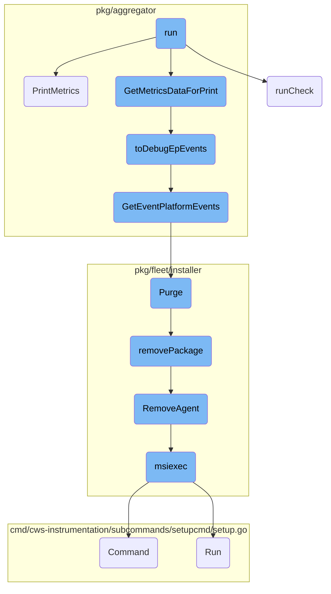
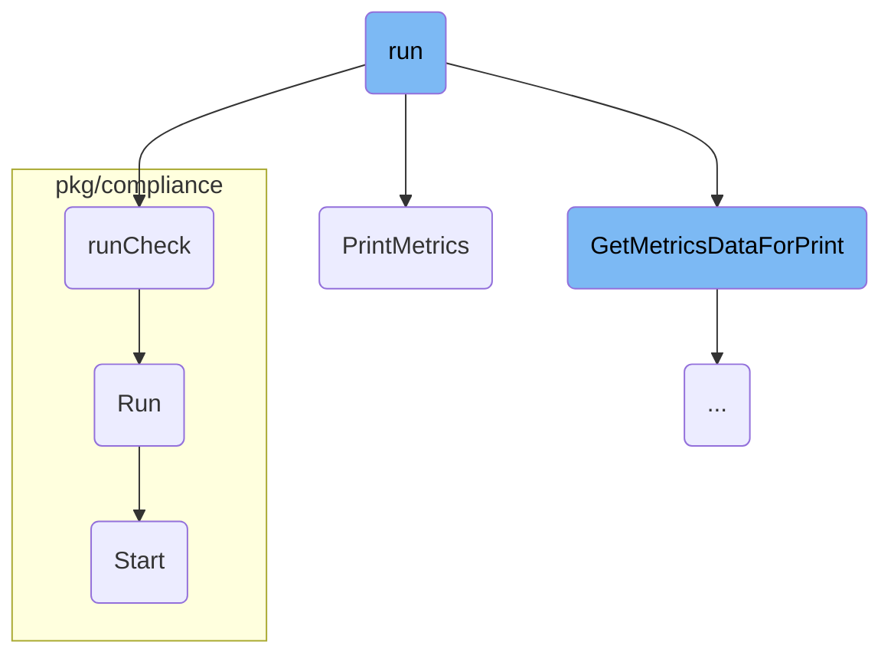
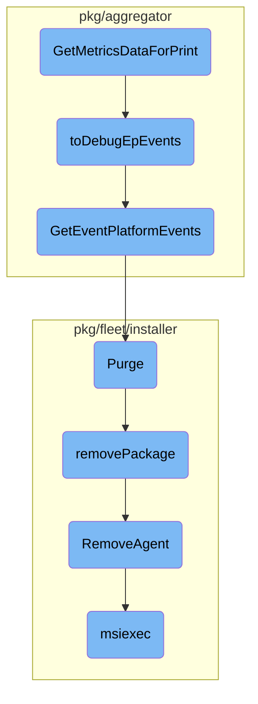

This document provides an overview of the <SwmToken path="pkg/cli/subcommands/check/command.go" pos="264:2:2" line-data="func run(">`run`</SwmToken> function, which is responsible for initializing and executing various checks and processes within the system. It covers the setup of necessary components, loading configurations, handling JMX checks, managing memory profiling, and collecting and printing results.

The <SwmToken path="pkg/cli/subcommands/check/command.go" pos="264:2:2" line-data="func run(">`run`</SwmToken> function starts by setting up all the necessary components and loading configurations. It then handles specific checks like JMX separately. If memory profiling or breakpoints are specified, it manages those as well. After everything is set up, it retrieves the checks that need to be run and executes them. Finally, it collects the results and prints them out in a readable format.

Here is a high level diagram of the flow, showing only the most important functions:



# Flow drill down

First, we'll zoom into this section of the flow:



<SwmSnippet path="/pkg/cli/subcommands/check/command.go" line="264">

---

## Running Checks

The <SwmToken path="pkg/cli/subcommands/check/command.go" pos="264:2:2" line-data="func run(">`run`</SwmToken> function is responsible for initializing and running checks based on the provided CLI parameters. It sets up the necessary components, loads configurations, and handles JMX checks separately. The function also manages memory profiling and breakpoints if specified. After setting up, it retrieves the checks and runs them, collecting and printing the results.

```go
func run(
	config config.Component,
	cliParams *cliParams,
	demultiplexer demultiplexer.Component,
	wmeta workloadmeta.Component,
	_ tagger.Component,
	ac autodiscovery.Component,
	secretResolver secrets.Component,
	agentAPI internalAPI.Component,
	invChecks inventorychecks.Component,
	statusComponent status.Component,
	collector optional.Option[collector.Component],
	jmxLogger jmxlogger.Component,
	telemetry telemetry.Component,
	logReceiver optional.Option[integrations.Component],
) error {
	previousIntegrationTracing := false
	previousIntegrationTracingExhaustive := false
	if cliParams.generateIntegrationTraces {
		if pkgconfig.Datadog().IsSet("integration_tracing") {
			previousIntegrationTracing = pkgconfig.Datadog().GetBool("integration_tracing")
```

---

</SwmSnippet>

<SwmSnippet path="/pkg/aggregator/demultiplexer_agent_printer.go" line="32">

---

## Printing Metrics

The <SwmToken path="pkg/aggregator/demultiplexer_agent_printer.go" pos="32:2:2" line-data="// PrintMetrics prints metrics aggregator in the Demultiplexer&#39;s check samplers (series and sketches),">`PrintMetrics`</SwmToken> function in the <SwmToken path="pkg/aggregator/demultiplexer_agent_printer.go" pos="34:5:5" line-data="func (p AgentDemultiplexerPrinter) PrintMetrics(checkFileOutput *bytes.Buffer, formatTable bool) {">`AgentDemultiplexerPrinter`</SwmToken> struct prints the metrics collected by the aggregator. It formats the metrics, service checks, and events into either a table or JSON format based on the provided options. This function is crucial for displaying the collected data in a readable format.

```go
// PrintMetrics prints metrics aggregator in the Demultiplexer's check samplers (series and sketches),
// service checks buffer, events buffers.
func (p AgentDemultiplexerPrinter) PrintMetrics(checkFileOutput *bytes.Buffer, formatTable bool) {
	series, sketches := p.Aggregator().GetSeriesAndSketches(time.Now())
	if len(series) != 0 {
		fmt.Fprintf(color.Output, "=== %s ===\n", color.BlueString("Series"))

		if formatTable {
			headers, data := series.MarshalStrings()
			var buffer bytes.Buffer

			// plain table with no borders
			table := tablewriter.NewWriter(&buffer)
			table.SetHeader(headers)
			table.SetAutoWrapText(false)
			table.SetAutoFormatHeaders(true)
			table.SetHeaderAlignment(tablewriter.ALIGN_LEFT)
			table.SetAlignment(tablewriter.ALIGN_LEFT)
			table.SetCenterSeparator("")
			table.SetColumnSeparator("")
			table.SetRowSeparator("")
```

---

</SwmSnippet>

<SwmSnippet path="/pkg/cli/subcommands/check/command.go" line="639">

---

### Running Individual Checks

The <SwmToken path="pkg/cli/subcommands/check/command.go" pos="639:2:2" line-data="func runCheck(cliParams *cliParams, c check.Check, _ aggregator.Demultiplexer) *stats.Stats {">`runCheck`</SwmToken> function runs an individual check multiple times based on the CLI parameters. It collects statistics for each run, including execution time, errors, and warnings. This function is called within the main <SwmToken path="pkg/cli/subcommands/check/command.go" pos="655:7:7" line-data="		err := c.Run()">`Run`</SwmToken> function to execute each check and gather results.

```go
func runCheck(cliParams *cliParams, c check.Check, _ aggregator.Demultiplexer) *stats.Stats {
	s := stats.NewStats(c)
	times := cliParams.checkTimes
	pause := cliParams.checkPause
	if cliParams.checkRate {
		if cliParams.checkTimes > 2 {
			color.Yellow("The check-rate option is overriding check-times to 2")
		}
		if pause > 0 {
			color.Yellow("The check-rate option is overriding pause to 1000ms")
		}
		times = 2
		pause = 1000
	}
	for i := 0; i < times; i++ {
		t0 := time.Now()
		err := c.Run()
		warnings := c.GetWarnings()
		sStats, _ := c.GetSenderStats()
		s.Add(time.Since(t0), err, warnings, sStats)
		if pause > 0 && i < times-1 {
```

---

</SwmSnippet>

<SwmSnippet path="/pkg/compliance/evaluator_xccdf.go" line="93">

---

### Executing Compliance Checks

The <SwmToken path="pkg/compliance/evaluator_xccdf.go" pos="93:9:9" line-data="func (p *oscapIO) Run(ctx context.Context) error {">`Run`</SwmToken> function in the <SwmToken path="pkg/compliance/evaluator_xccdf.go" pos="93:6:6" line-data="func (p *oscapIO) Run(ctx context.Context) error {">`oscapIO`</SwmToken> struct executes compliance checks using the <SwmToken path="pkg/compliance/evaluator_xccdf.go" pos="76:33:35" line-data="	binPath := filepath.Join(here, &quot;..&quot;, &quot;..&quot;, &quot;embedded&quot;, &quot;bin&quot;, &quot;oscap-io&quot;)">`oscap-io`</SwmToken> tool. It sets up the environment, starts the process, and reads the output to collect results. This function is part of the compliance evaluation process and is called to perform specific compliance checks.

```go
func (p *oscapIO) Run(ctx context.Context) error {
	defer p.Stop()

	if config.IsContainerized() {
		hostRoot := os.Getenv("HOST_ROOT")
		if hostRoot == "" {
			hostRoot = "/host"
		}

		os.Setenv("OSCAP_PROBE_ROOT", hostRoot)
		defer os.Unsetenv("OSCAP_PROBE_ROOT")
	}

	args := []string{}
	if enableSysChar {
		args = append(args, "-syschar")
	}
	args = append(args, p.File)

	binPath, err := getOSCAPIODefaultBinPath()
	if err != nil {
```

---

</SwmSnippet>

<SwmSnippet path="/pkg/compliance/agent.go" line="201">

---

### Starting the Compliance Agent

The <SwmToken path="pkg/compliance/agent.go" pos="201:2:2" line-data="// Start starts the compliance agent.">`Start`</SwmToken> function in the <SwmToken path="pkg/compliance/agent.go" pos="201:10:10" line-data="// Start starts the compliance agent.">`agent`</SwmToken> struct starts the compliance agent. It initializes telemetry, sets up the context, and runs various benchmarks and configuration exports in separate goroutines. This function ensures that the compliance agent is up and running, ready to perform its tasks.

```go
// Start starts the compliance agent.
func (a *Agent) Start() error {
	telemetry, err := telemetry.NewContainersTelemetry(a.telemetrySender, a.wmeta)
	if err != nil {
		log.Errorf("could not start containers telemetry: %v", err)
		return err
	}

	ctx, cancel := context.WithCancel(context.Background())
	a.telemetry = telemetry
	a.cancel = cancel
	a.finish = make(chan struct{})

	status.Set(
		"Checks",
		expvar.Func(func() interface{} {
			return a.getChecksStatus()
		}),
	)

	_, k8sResourceData := k8sconfig.LoadConfiguration(ctx, a.opts.HostRoot)
```

---

</SwmSnippet>

Now, lets zoom into this section of the flow:



<SwmSnippet path="/pkg/aggregator/demultiplexer_agent_printer.go" line="149">

---

## Extracting and Formatting Metrics Data

The <SwmToken path="pkg/aggregator/demultiplexer_agent_printer.go" pos="149:2:2" line-data="// GetMetricsDataForPrint returns metrics data for series and sketches for printing purpose.">`GetMetricsDataForPrint`</SwmToken> function is responsible for extracting various types of metrics data such as series, sketches, service checks, and events from the aggregator. It then formats this data into a map for printing purposes. This function ensures that all relevant metrics data is collected and structured in a way that is suitable for debugging and analysis.

```go
// GetMetricsDataForPrint returns metrics data for series and sketches for printing purpose.
func (p AgentDemultiplexerPrinter) GetMetricsDataForPrint() map[string]interface{} {
	aggData := make(map[string]interface{})

	agg := p.Aggregator()

	series, sketches := agg.GetSeriesAndSketches(time.Now())
	if len(series) != 0 {
		metrics := make([]interface{}, len(series))
		// Workaround to get the sequence of metrics as plain interface{}
		for i, serie := range series {
			serie.PopulateDeviceField()
			serie.PopulateResources()
			sj, _ := json.Marshal(serie)
			json.Unmarshal(sj, &metrics[i]) //nolint:errcheck
		}

		aggData["metrics"] = metrics
	}
	if len(sketches) != 0 {
		aggData["sketches"] = sketches
```

---

</SwmSnippet>

<SwmSnippet path="/pkg/aggregator/demultiplexer_agent_printer.go" line="130">

---

## Transforming Event Platform Messages

The <SwmToken path="pkg/aggregator/demultiplexer_agent_printer.go" pos="130:2:2" line-data="// toDebugEpEvents transforms the raw event platform messages to eventPlatformDebugEvents which are better for json formatting">`toDebugEpEvents`</SwmToken> function transforms raw event platform messages into a more readable format for JSON output. It iterates over the event types and their corresponding messages, unmarshalling the raw event data into a structured format. This transformation is crucial for making the event data human-readable and easier to debug.

```go
// toDebugEpEvents transforms the raw event platform messages to eventPlatformDebugEvents which are better for json formatting
func (p AgentDemultiplexerPrinter) toDebugEpEvents() map[string][]eventPlatformDebugEvent {
	events := p.Aggregator().GetEventPlatformEvents()
	result := make(map[string][]eventPlatformDebugEvent)
	for eventType, messages := range events {
		var events []eventPlatformDebugEvent
		for _, m := range messages {
			e := eventPlatformDebugEvent{EventType: eventType, RawEvent: string(m.GetContent())}
			err := json.Unmarshal([]byte(e.RawEvent), &e.UnmarshalledEvent)
			if err == nil {
				e.RawEvent = ""
			}
			events = append(events, e)
		}
		result[eventType] = events
	}
	return result
}
```

---

</SwmSnippet>

<SwmSnippet path="/pkg/aggregator/aggregator.go" line="668">

---

## Retrieving Event Platform Events

The <SwmToken path="pkg/aggregator/aggregator.go" pos="668:2:2" line-data="// GetEventPlatformEvents grabs the event platform events from the queue and clears them.">`GetEventPlatformEvents`</SwmToken> function retrieves event platform events from the queue and clears them. This function is essential for ensuring that the event data is processed and then removed from the queue, preventing duplicate processing.

```go
// GetEventPlatformEvents grabs the event platform events from the queue and clears them.
// Note that this works only if using the 'noop' event platform forwarder
func (agg *BufferedAggregator) GetEventPlatformEvents() map[string][]*message.Message {
	forwarder, found := agg.eventPlatformForwarder.Get()
	if !found {
		return nil
	}
	return forwarder.Purge()
}
```

---

</SwmSnippet>

<SwmSnippet path="/pkg/fleet/installer/installer.go" line="263">

---

## Purging Packages

The <SwmToken path="pkg/fleet/installer/installer.go" pos="263:2:2" line-data="// Purge removes all packages.">`Purge`</SwmToken> function removes all packages from the system. It first attempts to list all packages and then iterates over them to remove each one. This function is critical for cleaning up the system by removing unnecessary or outdated packages.

```go
// Purge removes all packages.
func (i *installerImpl) Purge(ctx context.Context) {
	i.m.Lock()
	defer i.m.Unlock()

	packages, err := i.db.ListPackages()
	if err != nil {
		// if we can't list packages we'll only remove the installer
		packages = nil
		log.Warnf("could not list packages: %v", err)
	}
	for _, pkg := range packages {
		if pkg.Name == packageDatadogInstaller {
			continue
		}
		err := i.removePackage(ctx, pkg.Name)
		if err != nil {
			log.Warnf("could not remove package %s: %v", pkg.Name, err)
		}
	}
	err = i.removePackage(ctx, packageDatadogInstaller)
```

---

</SwmSnippet>

<SwmSnippet path="/pkg/fleet/installer/installer.go" line="410">

---

## Removing Specific Packages

The <SwmToken path="pkg/fleet/installer/installer.go" pos="410:9:9" line-data="func (i *installerImpl) removePackage(ctx context.Context, pkg string) error {">`removePackage`</SwmToken> function removes a specific package based on its name. It delegates the removal process to specialized functions for different types of packages. This function is important for targeted package removal, ensuring that only the specified package is removed.

```go
func (i *installerImpl) removePackage(ctx context.Context, pkg string) error {
	switch pkg {
	case packageDatadogAgent:
		return service.RemoveAgent(ctx)
	case packageAPMInjector:
		return service.RemoveAPMInjector(ctx)
	case packageDatadogInstaller:
		return service.RemoveInstaller(ctx)
	default:
		return nil
	}
}
```

---

</SwmSnippet>

<SwmSnippet path="/pkg/fleet/installer/service/datadog_agent_windows.go" line="92">

---

## Removing the Agent

The <SwmToken path="pkg/fleet/installer/service/datadog_agent_windows.go" pos="92:2:2" line-data="// RemoveAgent stops and removes the agent">`RemoveAgent`</SwmToken> function stops and removes the Datadog agent from the system. It uses the <SwmToken path="pkg/fleet/installer/service/datadog_agent_windows.go" pos="101:3:3" line-data="	return msiexec(&quot;stable&quot;, &quot;/x&quot;, nil)">`msiexec`</SwmToken> function to perform the uninstallation. This function is crucial for completely removing the agent and its associated services.

```go
// RemoveAgent stops and removes the agent
func RemoveAgent(ctx context.Context) (err error) {
	span, _ := tracer.StartSpanFromContext(ctx, "remove_agent")
	defer func() {
		if err != nil {
			log.Errorf("Failed to remove agent: %s", err)
		}
		span.Finish(tracer.WithError(err))
	}()
	return msiexec("stable", "/x", nil)
```

---

</SwmSnippet>

<SwmSnippet path="/pkg/fleet/installer/service/datadog_agent_windows.go" line="22">

---

## Executing MSI Commands

The <SwmToken path="pkg/fleet/installer/service/datadog_agent_windows.go" pos="22:2:2" line-data="func msiexec(target, operation string, args []string) (err error) {">`msiexec`</SwmToken> function executes MSI commands to install or uninstall packages. It constructs the command with the appropriate parameters and runs it. This function is essential for managing the installation and uninstallation of MSI packages.

```go
func msiexec(target, operation string, args []string) (err error) {
	updaterPath := filepath.Join(paths.PackagesPath, "datadog-agent", target)
	msis, err := filepath.Glob(filepath.Join(updaterPath, "datadog-agent-*-1-x86_64.msi"))
	if err != nil {
		return err
	}
	if len(msis) > 1 {
		return fmt.Errorf("too many MSIs in package")
	} else if len(msis) == 0 {
		return fmt.Errorf("no MSIs in package")
	}

	tmpDir, err := os.MkdirTemp(paths.TmpDirPath, fmt.Sprintf("install-%s-*", filepath.Base(msis[0])))
	if err != nil {
		return fmt.Errorf("could not create temporary directory: %w", err)
	}

	logPath := filepath.Join(tmpDir, "install.log")
	cmd := exec.Command("msiexec", append([]string{operation, msis[0], "/qn", "/l", logPath, "MSIFASTINSTALL=7"}, args...)...)
	return cmd.Run()
}
```

---

</SwmSnippet>

&nbsp;

*This is an auto-generated document by Swimm AI 🌊 and has not yet been verified by a human*

<SwmMeta version="3.0.0" repo-id="Z2l0aHViJTNBJTNBZGF0YWRvZy1hZ2VudCUzQSUzQVN3aW1tLURlbW8=" repo-name="datadog-agent"><sup>Powered by [Swimm](/)</sup></SwmMeta>
