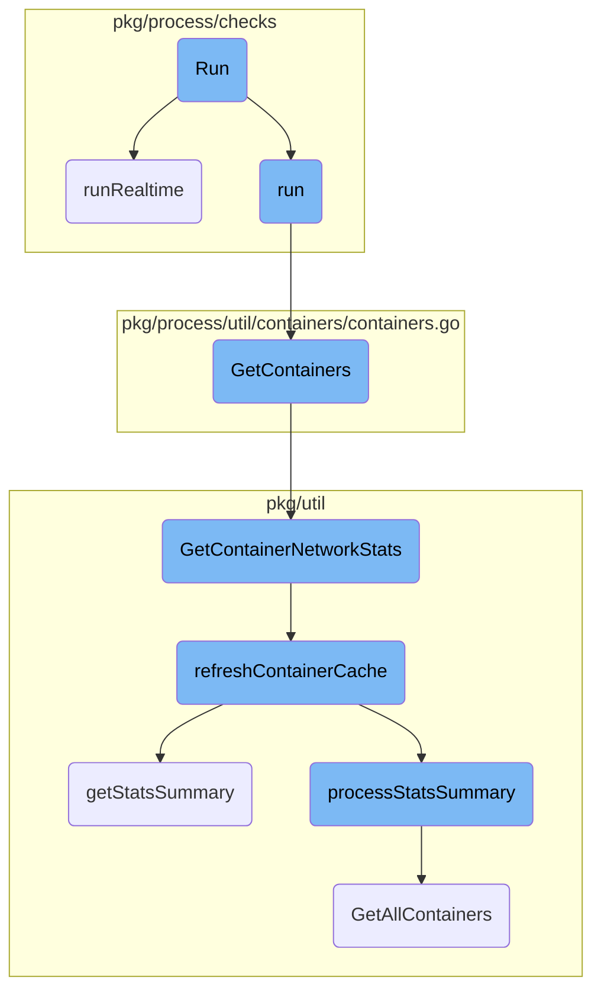
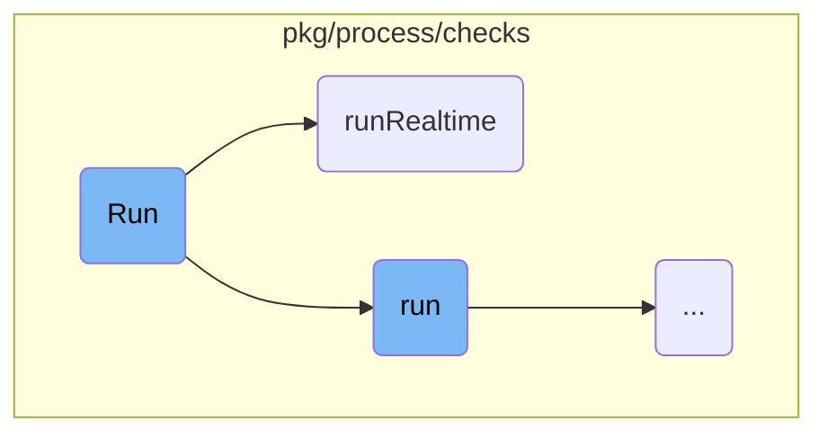
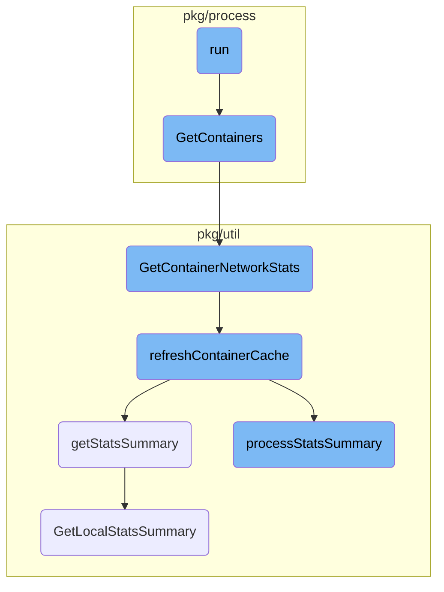

This document provides an overview of the <SwmToken path="pkg/process/checks/process.go" pos="235:9:9" line-data="func (p *ProcessCheck) run(groupID int32, collectRealTime bool) (RunResult, error) {">`run`</SwmToken> function, which is responsible for collecting process data, including both regular metadata and <SwmToken path="pkg/process/checks/process.go" pos="222:18:20" line-data="// Realtime indicates if this check only runs in real-time mode.">`real-time`</SwmToken> statistics. It explains the flow of how the function operates, the different checks it performs, and how it gathers and processes data.

The <SwmToken path="pkg/process/checks/process.go" pos="235:9:9" line-data="func (p *ProcessCheck) run(groupID int32, collectRealTime bool) (RunResult, error) {">`run`</SwmToken> function starts by checking the provided options to determine whether to run a standard process check or a <SwmToken path="pkg/process/checks/process.go" pos="222:18:20" line-data="// Realtime indicates if this check only runs in real-time mode.">`real-time`</SwmToken> process check. If the standard check is selected, it collects regular metadata and statistics about the processes. If the <SwmToken path="pkg/process/checks/process.go" pos="222:18:20" line-data="// Realtime indicates if this check only runs in real-time mode.">`real-time`</SwmToken> check is selected, it gathers <SwmToken path="pkg/process/checks/process.go" pos="222:18:20" line-data="// Realtime indicates if this check only runs in real-time mode.">`real-time`</SwmToken> statistics. The function then processes this data, collects container stats, and prepares the information for further use. This ensures that the system has up-to-date and accurate process data for monitoring and analysis.

Here is a high level diagram of the flow, showing only the most important functions:



# Flow drill down

First, we'll zoom into this section of the flow:



<SwmSnippet path="/pkg/process/checks/process.go" line="370">

---

## Running Process Checks

The <SwmToken path="pkg/process/checks/process.go" pos="370:2:2" line-data="// Run collects process data (regular metadata + stats) and/or realtime process data (stats only)">`Run`</SwmToken> function is responsible for collecting process data, including both regular metadata and statistics. Depending on the options provided, it can also collect <SwmToken path="pkg/process/checks/process.go" pos="222:18:20" line-data="// Realtime indicates if this check only runs in real-time mode.">`real-time`</SwmToken> process data. If <SwmToken path="pkg/process/checks/process.go" pos="376:3:5" line-data="	if options.RunStandard {">`options.RunStandard`</SwmToken> is true, it runs the standard process check. If <SwmToken path="pkg/process/checks/process.go" pos="378:12:14" line-data="		return p.run(nextGroupID(), options.RunRealtime)">`options.RunRealtime`</SwmToken> is true, it runs the <SwmToken path="pkg/process/checks/process.go" pos="222:18:20" line-data="// Realtime indicates if this check only runs in real-time mode.">`real-time`</SwmToken> process check using the <SwmToken path="pkg/process/checks/process.go" pos="378:14:14" line-data="		return p.run(nextGroupID(), options.RunRealtime)">`RunRealtime`</SwmToken> function.

```go
// Run collects process data (regular metadata + stats) and/or realtime process data (stats only)
func (p *ProcessCheck) Run(nextGroupID func() int32, options *RunOptions) (RunResult, error) {
	if options == nil {
		return p.run(nextGroupID(), false)
	}

	if options.RunStandard {
		log.Tracef("Running process check")
		return p.run(nextGroupID(), options.RunRealtime)
	}

	if options.RunRealtime {
		log.Tracef("Running rtprocess check")
		return p.runRealtime(nextGroupID())
	}
	return nil, errors.New("invalid run options for check")
}
```

---

</SwmSnippet>

<SwmSnippet path="/pkg/process/checks/process_rt.go" line="20">

---

## Collecting <SwmToken path="pkg/process/checks/process.go" pos="222:18:20" line-data="// Realtime indicates if this check only runs in real-time mode.">`real-time`</SwmToken> Statistics

The <SwmToken path="pkg/process/checks/process_rt.go" pos="20:2:2" line-data="// runRealtime runs the realtime ProcessCheck to collect statistics about the running processes.">`runRealtime`</SwmToken> function collects <SwmToken path="pkg/process/checks/process.go" pos="222:18:20" line-data="// Realtime indicates if this check only runs in real-time mode.">`real-time`</SwmToken> statistics about running processes. It first gathers CPU times and checks if there are any processes to monitor. It then fetches statistics for the processes and merges them with system probe stats if available. Container statistics are also collected. The function formats the collected data into chunks and prepares messages to be sent. Finally, it updates the last run state for future comparisons and returns the collected <SwmToken path="pkg/process/checks/process.go" pos="222:18:20" line-data="// Realtime indicates if this check only runs in real-time mode.">`real-time`</SwmToken> statistics.

```go
// runRealtime runs the realtime ProcessCheck to collect statistics about the running processes.
// Underying procutil.Probe is responsible for the actual implementation
func (p *ProcessCheck) runRealtime(groupID int32) (RunResult, error) {
	cpuTimes, err := cpu.Times(false)
	if err != nil {
		return nil, err
	}
	if len(cpuTimes) == 0 {
		return nil, errEmptyCPUTime
	}

	// if processCheck haven't fetched any PIDs, return early
	if len(p.lastPIDs) == 0 {
		return CombinedRunResult{}, nil
	}

	procs, err := p.probe.StatsForPIDs(p.lastPIDs, time.Now())
	if err != nil {
		return nil, err
	}

```

---

</SwmSnippet>

Now, lets zoom into this section of the flow:



<SwmSnippet path="/pkg/process/checks/process.go" line="235">

---

## run

The <SwmToken path="pkg/process/checks/process.go" pos="235:9:9" line-data="func (p *ProcessCheck) run(groupID int32, collectRealTime bool) (RunResult, error) {">`run`</SwmToken> function initializes the process collection by gathering CPU times and processes by PID. It then collects container stats and prepares the data for further processing. This function is crucial for the initial setup and data collection in the flow.

```go
func (p *ProcessCheck) run(groupID int32, collectRealTime bool) (RunResult, error) {
	start := time.Now()
	cpuTimes, err := cpu.Times(false)
	if err != nil {
		return nil, err
	}
	if len(cpuTimes) == 0 {
		return nil, errEmptyCPUTime
	}

	procs, err := p.probe.ProcessesByPID(time.Now(), true)
	if err != nil {
		return nil, err
	}

	// stores lastPIDs to be used by RTProcess
	p.lastPIDs = p.lastPIDs[:0]
	for pid := range procs {
		p.lastPIDs = append(p.lastPIDs, pid)
	}

```

---

</SwmSnippet>

<SwmSnippet path="/pkg/process/util/containers/containers.go" line="99">

---

## <SwmToken path="pkg/process/util/containers/containers.go" pos="99:2:2" line-data="// GetContainers returns containers found on the machine">`GetContainers`</SwmToken>

The <SwmToken path="pkg/process/util/containers/containers.go" pos="99:2:2" line-data="// GetContainers returns containers found on the machine">`GetContainers`</SwmToken> function retrieves the list of containers running on the machine, filters them based on certain criteria, and gathers their stats. This function is essential for obtaining container metadata and stats, which are used in the subsequent steps.

```go
// GetContainers returns containers found on the machine
func (p *containerProvider) GetContainers(cacheValidity time.Duration, previousContainers map[string]*ContainerRateMetrics) ([]*model.Container, map[string]*ContainerRateMetrics, map[int]string, error) {
	containersMetadata := p.metadataStore.ListContainersWithFilter(workloadmeta.GetRunningContainers)

	processContainers := make([]*model.Container, 0)
	rateStats := make(map[string]*ContainerRateMetrics)
	pidToCid := make(map[int]string)
	for _, container := range containersMetadata {
		var annotations map[string]string
		if pod, err := p.metadataStore.GetKubernetesPodForContainer(container.ID); err == nil {
			annotations = pod.Annotations
		}

		if p.filter != nil && p.filter.IsExcluded(annotations, container.Name, container.Image.Name, container.Labels[kubernetes.CriContainerNamespaceLabel]) {
			continue
		}

		if container.Runtime == workloadmeta.ContainerRuntimeGarden && len(container.CollectorTags) == 0 {
			log.Debugf("No tags found for garden container: %s, skipping", container.ID)
			continue
		}
```

---

</SwmSnippet>

<SwmSnippet path="/pkg/util/containers/metrics/kubelet/collector.go" line="146">

---

## <SwmToken path="pkg/util/containers/metrics/kubelet/collector.go" pos="146:2:2" line-data="// GetContainerNetworkStats returns network stats by container ID.">`GetContainerNetworkStats`</SwmToken>

The <SwmToken path="pkg/util/containers/metrics/kubelet/collector.go" pos="146:2:2" line-data="// GetContainerNetworkStats returns network stats by container ID.">`GetContainerNetworkStats`</SwmToken> function retrieves network stats for a specific container. It first checks the cache and, if necessary, refreshes it. This function is important for collecting network-related metrics for containers.

```go
// GetContainerNetworkStats returns network stats by container ID.
func (kc *kubeletCollector) GetContainerNetworkStats(containerNS, containerID string, cacheValidity time.Duration) (*provider.ContainerNetworkStats, error) { //nolint:revive // TODO fix revive unused-parameter
	currentTime := time.Now()

	containerNetworkStats, found, err := kc.statsCache.Get(currentTime, contNetStatsCachePrefix+containerID, cacheValidity)
	if found {
		if containerNetworkStats != nil {
			return containerNetworkStats.(*provider.ContainerNetworkStats), err
		}
		return nil, err
	}

	// Item missing from cache
	if err := kc.refreshContainerCache(currentTime, cacheValidity); err != nil {
		return nil, err
	}

	containerNetworkStats, found, err = kc.statsCache.Get(currentTime, contNetStatsCachePrefix+containerID, cacheValidity)
	if found {
		if containerNetworkStats != nil {
			return containerNetworkStats.(*provider.ContainerNetworkStats), err
```

---

</SwmSnippet>

<SwmSnippet path="/pkg/util/containers/metrics/kubelet/collector.go" line="174">

---

## <SwmToken path="pkg/util/containers/metrics/kubelet/collector.go" pos="174:9:9" line-data="func (kc *kubeletCollector) refreshContainerCache(currentTime time.Time, cacheValidity time.Duration) error {">`refreshContainerCache`</SwmToken>

The <SwmToken path="pkg/util/containers/metrics/kubelet/collector.go" pos="174:9:9" line-data="func (kc *kubeletCollector) refreshContainerCache(currentTime time.Time, cacheValidity time.Duration) error {">`refreshContainerCache`</SwmToken> function refreshes the container stats cache by calling <SwmToken path="pkg/util/containers/metrics/kubelet/collector.go" pos="184:10:10" line-data="	statsSummary, err := kc.getStatsSummary()">`getStatsSummary`</SwmToken> and processing the summary. This function ensures that the cache is up-to-date with the latest container stats.

```go
func (kc *kubeletCollector) refreshContainerCache(currentTime time.Time, cacheValidity time.Duration) error {
	kc.refreshLock.Lock()
	defer kc.refreshLock.Unlock()

	// Not refreshing if last refresh is within cacheValidity
	_, found, err := kc.statsCache.Get(currentTime, refreshCacheKey, cacheValidity)
	if found {
		return err
	}

	statsSummary, err := kc.getStatsSummary()
	if err == nil {
		kc.processStatsSummary(currentTime, statsSummary)
	} else {
		log.Debugf("Unable to get stats from Kubelet, err: %v", err)
	}

	kc.statsCache.Store(currentTime, refreshCacheKey, nil, err)
	return err
}
```

---

</SwmSnippet>

<SwmSnippet path="/pkg/util/containers/metrics/kubelet/collector.go" line="195">

---

## <SwmToken path="pkg/util/containers/metrics/kubelet/collector.go" pos="195:9:9" line-data="func (kc *kubeletCollector) getStatsSummary() (*v1alpha1.Summary, error) {">`getStatsSummary`</SwmToken>

The <SwmToken path="pkg/util/containers/metrics/kubelet/collector.go" pos="195:9:9" line-data="func (kc *kubeletCollector) getStatsSummary() (*v1alpha1.Summary, error) {">`getStatsSummary`</SwmToken> function retrieves a summary of stats from the Kubelet. This function is called during the cache refresh to get the latest stats from the Kubelet.

```go
func (kc *kubeletCollector) getStatsSummary() (*v1alpha1.Summary, error) {
	ctx, cancel := context.WithTimeout(context.Background(), kubeletCallTimeout)
	statsSummary, err := kc.kubeletClient.GetLocalStatsSummary(ctx)
	cancel()

	if err != nil {
		return nil, err
	}

	return statsSummary, err
}
```

---

</SwmSnippet>

<SwmSnippet path="/pkg/util/containers/metrics/kubelet/collector.go" line="207">

---

## <SwmToken path="pkg/util/containers/metrics/kubelet/collector.go" pos="207:9:9" line-data="func (kc *kubeletCollector) processStatsSummary(currentTime time.Time, statsSummary *v1alpha1.Summary) {">`processStatsSummary`</SwmToken>

The <SwmToken path="pkg/util/containers/metrics/kubelet/collector.go" pos="207:9:9" line-data="func (kc *kubeletCollector) processStatsSummary(currentTime time.Time, statsSummary *v1alpha1.Summary) {">`processStatsSummary`</SwmToken> function processes the stats summary obtained from the Kubelet and stores the relevant data in the cache. This function is crucial for parsing and storing the container stats.

```go
func (kc *kubeletCollector) processStatsSummary(currentTime time.Time, statsSummary *v1alpha1.Summary) {
	if statsSummary == nil {
		return
	}

	for _, pod := range statsSummary.Pods {
		if len(pod.Containers) == 0 {
			continue
		}

		// Parsing network stats, need to store them by container anyway as it's the way it works currently
		// We use POD UID to generate an isolation group. It won't be network namespace FD, but it will still work
		// as all containers will get the same.
		// We could know if we're hostNetwork or not if we retrieve local POD list instead of relying on Workload meta,
		// albeit, with extra work. As this collector is designed to run in environment where we don't have access to
		// underlying host, it should not be an issue.
		podNetworkStats := &provider.ContainerNetworkStats{}
		convertNetworkStats(pod.Network, podNetworkStats)
		podNetworkStats.NetworkIsolationGroupID = pointer.Ptr(networkIDFromPODUID(pod.PodRef.UID))

		// As Metadata collector is running through polling, it can happen that we have newer PODs, containers
```

---

</SwmSnippet>

<SwmSnippet path="/pkg/util/kubernetes/kubelet/kubelet.go" line="338">

---

## <SwmToken path="pkg/util/kubernetes/kubelet/kubelet.go" pos="338:2:2" line-data="// GetLocalStatsSummary returns node and pod stats from kubelet">`GetLocalStatsSummary`</SwmToken>

The <SwmToken path="pkg/util/kubernetes/kubelet/kubelet.go" pos="338:2:2" line-data="// GetLocalStatsSummary returns node and pod stats from kubelet">`GetLocalStatsSummary`</SwmToken> function queries the Kubelet for node and pod stats and returns the parsed summary. This function is used by <SwmToken path="pkg/util/containers/metrics/kubelet/collector.go" pos="184:10:10" line-data="	statsSummary, err := kc.getStatsSummary()">`getStatsSummary`</SwmToken> to fetch the latest stats from the Kubelet.

```go
// GetLocalStatsSummary returns node and pod stats from kubelet
func (ku *KubeUtil) GetLocalStatsSummary(ctx context.Context) (*kubeletv1alpha1.Summary, error) {
	data, code, err := ku.QueryKubelet(ctx, kubeletStatsSummary)
	if err != nil {
		return nil, errors.NewRetriable("statssummary", fmt.Errorf("error performing kubelet query %s%s: %w", ku.kubeletClient.kubeletURL, kubeletStatsSummary, err))
	}
	if code != http.StatusOK {
		return nil, errors.NewRetriable("statssummary", fmt.Errorf("unexpected status code %d on %s%s: %s", code, ku.kubeletClient.kubeletURL, kubeletStatsSummary, string(data)))
	}

	statsSummary := &kubeletv1alpha1.Summary{}
	if err := json.Unmarshal(data, statsSummary); err != nil {
		return nil, err
	}

	return statsSummary, nil
}
```

---

</SwmSnippet>

&nbsp;

*This is an auto-generated document by Swimm AI 🌊 and has not yet been verified by a human*

<SwmMeta version="3.0.0" repo-id="Z2l0aHViJTNBJTNBZGF0YWRvZy1hZ2VudCUzQSUzQVN3aW1tLURlbW8=" repo-name="datadog-agent"><sup>Powered by [Swimm](/)</sup></SwmMeta>
