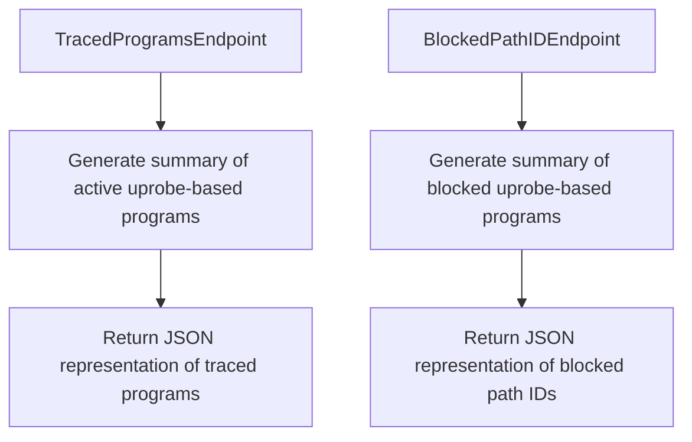

# Overview of Universal Service Monitoring

Universal Service Monitoring (USM) is responsible for monitoring various network services and protocols. The USM package contains implementations for all USM logic, including monitoring and managing network connections.

# USM Package

The USM package contains implementations for all USM logic. It is located in <SwmPath>[pkg/network/usm/compile.go](pkg/network/usm/compile.go)</SwmPath>.

<SwmSnippet path="/pkg/network/usm/compile.go" line="8">

---

The USM package is defined here and includes all necessary imports for its functionality.

```go
// Package usm contains implementation for all USM logic
package usm

import (
```

---

</SwmSnippet>

# Start Method

The <SwmToken path="pkg/network/usm/monitor.go" pos="116:2:2" line-data="// Start USM monitor.">`Start`</SwmToken> method in the <SwmToken path="pkg/network/usm/monitor.go" pos="116:6:6" line-data="// Start USM monitor.">`monitor`</SwmToken> struct initializes and starts the USM monitoring process. It sets up the <SwmToken path="pkg/network/usm/monitor.go" pos="127:33:33" line-data="				err = fmt.Errorf(&quot;could not enable usm monitoring: not enough memory to attach http ebpf socket filter. please consider raising the limit via sysctl -w net.core.optmem_max=&lt;LIMIT&gt;&quot;)">`ebpf`</SwmToken> program and, if needed, initializes the process monitor.

<SwmSnippet path="/pkg/network/usm/monitor.go" line="116">

---

The <SwmToken path="pkg/network/usm/monitor.go" pos="116:2:2" line-data="// Start USM monitor.">`Start`</SwmToken> method initializes the USM monitor and handles potential errors during the startup process.

```go
// Start USM monitor.
func (m *Monitor) Start() error {
	if m == nil {
		return nil
	}

	var err error

	defer func() {
		if err != nil {
			if errors.Is(err, syscall.ENOMEM) {
				err = fmt.Errorf("could not enable usm monitoring: not enough memory to attach http ebpf socket filter. please consider raising the limit via sysctl -w net.core.optmem_max=<LIMIT>")
			} else {
				err = fmt.Errorf("could not enable USM: %s", err)
			}

			m.Stop()

			startupError = err
		}
	}()
```

---

</SwmSnippet>

# Stop Method

The <SwmToken path="pkg/network/usm/monitor.go" pos="132:3:3" line-data="			m.Stop()">`Stop`</SwmToken> method in the <SwmToken path="pkg/network/usm/monitor.go" pos="116:6:6" line-data="// Start USM monitor.">`monitor`</SwmToken> struct stops the USM monitoring process and cleans up resources.

<SwmSnippet path="/pkg/network/usm/monitor.go" line="206">

---

The <SwmToken path="pkg/network/usm/monitor.go" pos="206:2:2" line-data="// Stop HTTP monitoring">`Stop`</SwmToken> method stops the USM monitor and performs necessary cleanup operations.

```go
// Stop HTTP monitoring
func (m *Monitor) Stop() {
	if m == nil {
		return
	}

	m.processMonitor.Stop()

	ddebpf.RemoveNameMappings(m.ebpfProgram.Manager.Manager)

	m.ebpfProgram.Close()
	m.closeFilterFn()
}
```

---

</SwmSnippet>

# <SwmToken path="pkg/network/usm/config/config.go" pos="64:2:2" line-data="// NeedProcessMonitor returns true if the process monitor is needed for the given configuration">`NeedProcessMonitor`</SwmToken> Function

The <SwmToken path="pkg/network/usm/config/config.go" pos="64:2:2" line-data="// NeedProcessMonitor returns true if the process monitor is needed for the given configuration">`NeedProcessMonitor`</SwmToken> function determines if the process monitor is needed based on the configuration.

<SwmSnippet path="/pkg/network/usm/config/config.go" line="64">

---

The <SwmToken path="pkg/network/usm/config/config.go" pos="64:2:2" line-data="// NeedProcessMonitor returns true if the process monitor is needed for the given configuration">`NeedProcessMonitor`</SwmToken> function checks the configuration to decide if the process monitor should be enabled.

```go
// NeedProcessMonitor returns true if the process monitor is needed for the given configuration
func NeedProcessMonitor(config *config.Config) bool {
	return config.EnableNativeTLSMonitoring || config.EnableGoTLSSupport || config.EnableJavaTLSSupport || config.EnableIstioMonitoring || config.EnableNodeJSMonitoring
}
```

---

</SwmSnippet>

# Istio Monitor

The <SwmToken path="pkg/network/usm/istio.go" pos="89:2:2" line-data="// istioMonitor essentially scans for Envoy processes and attaches SSL uprobes">`istioMonitor`</SwmToken> struct is used to monitor Istio processes and attach SSL uprobes to them.

<SwmSnippet path="/pkg/network/usm/istio.go" line="6">

---

The <SwmToken path="pkg/network/usm/istio.go" pos="89:2:2" line-data="// istioMonitor essentially scans for Envoy processes and attaches SSL uprobes">`istioMonitor`</SwmToken> struct is defined here and includes necessary imports for monitoring Istio processes.

```go
//go:build linux_bpf

package usm

import (
```

---

</SwmSnippet>

# Main Functions

There are several main functions in the USM package, including <SwmToken path="pkg/network/usm/monitor.go" pos="116:2:2" line-data="// Start USM monitor.">`Start`</SwmToken>, <SwmToken path="pkg/network/usm/monitor.go" pos="132:3:3" line-data="			m.Stop()">`Stop`</SwmToken>, <SwmToken path="pkg/network/usm/monitor.go" pos="169:2:2" line-data="// GetUSMStats returns the current state of the USM monitor">`GetUSMStats`</SwmToken>, and `ClearEphemeralPort`. We will focus on <SwmToken path="pkg/network/usm/monitor.go" pos="116:2:2" line-data="// Start USM monitor.">`Start`</SwmToken> and <SwmToken path="pkg/network/usm/monitor.go" pos="169:2:2" line-data="// GetUSMStats returns the current state of the USM monitor">`GetUSMStats`</SwmToken>.

## Start

The <SwmToken path="pkg/network/usm/monitor.go" pos="116:2:2" line-data="// Start USM monitor.">`Start`</SwmToken> function initializes and starts the USM monitoring process. It sets up the <SwmToken path="pkg/network/usm/monitor.go" pos="127:33:33" line-data="				err = fmt.Errorf(&quot;could not enable usm monitoring: not enough memory to attach http ebpf socket filter. please consider raising the limit via sysctl -w net.core.optmem_max=&lt;LIMIT&gt;&quot;)">`ebpf`</SwmToken> program and, if needed, initializes the process monitor.

<SwmSnippet path="/pkg/network/usm/monitor.go" line="116">

---

The <SwmToken path="pkg/network/usm/monitor.go" pos="116:2:2" line-data="// Start USM monitor.">`Start`</SwmToken> function initializes the USM monitor and handles potential errors during the startup process.

```go
// Start USM monitor.
func (m *Monitor) Start() error {
	if m == nil {
		return nil
	}

	var err error

	defer func() {
		if err != nil {
			if errors.Is(err, syscall.ENOMEM) {
				err = fmt.Errorf("could not enable usm monitoring: not enough memory to attach http ebpf socket filter. please consider raising the limit via sysctl -w net.core.optmem_max=<LIMIT>")
			} else {
				err = fmt.Errorf("could not enable USM: %s", err)
			}

			m.Stop()

			startupError = err
		}
	}()
```

---

</SwmSnippet>

## <SwmToken path="pkg/network/usm/monitor.go" pos="169:2:2" line-data="// GetUSMStats returns the current state of the USM monitor">`GetUSMStats`</SwmToken>

The <SwmToken path="pkg/network/usm/monitor.go" pos="169:2:2" line-data="// GetUSMStats returns the current state of the USM monitor">`GetUSMStats`</SwmToken> function returns the current state of the USM monitor, including any startup errors and lists of blocked processes and traced programs.

<SwmSnippet path="/pkg/network/usm/monitor.go" line="169">

---

The <SwmToken path="pkg/network/usm/monitor.go" pos="169:2:2" line-data="// GetUSMStats returns the current state of the USM monitor">`GetUSMStats`</SwmToken> function provides a summary of the USM monitor's current state, including any errors and lists of blocked and traced programs.

```go
// GetUSMStats returns the current state of the USM monitor
func (m *Monitor) GetUSMStats() map[string]interface{} {
	response := map[string]interface{}{
		"state": state,
	}

	if startupError != nil {
		response["error"] = startupError.Error()
	}

	response["blocked_processes"] = utils.GetBlockedPathIDsList()

	tracedPrograms := utils.GetTracedProgramList()
	response["traced_programs"] = tracedPrograms

	if m != nil {
		response["last_check"] = m.lastUpdateTime
	}
	return response
}
```

---

</SwmSnippet>

# USM Endpoints

USM provides several endpoints for debugging purposes, including <SwmToken path="pkg/network/usm/utils/debugger.go" pos="49:2:2" line-data="// TracedProgramsEndpoint generates a summary of all active uprobe-based">`TracedProgramsEndpoint`</SwmToken> and <SwmToken path="pkg/network/usm/utils/debugger.go" pos="56:2:2" line-data="// BlockedPathIDEndpoint generates a summary of all blocked uprobe-based">`BlockedPathIDEndpoint`</SwmToken>.

## <SwmToken path="pkg/network/usm/utils/debugger.go" pos="49:2:2" line-data="// TracedProgramsEndpoint generates a summary of all active uprobe-based">`TracedProgramsEndpoint`</SwmToken>

The <SwmToken path="pkg/network/usm/utils/debugger.go" pos="49:2:2" line-data="// TracedProgramsEndpoint generates a summary of all active uprobe-based">`TracedProgramsEndpoint`</SwmToken> function generates a summary of all active <SwmToken path="pkg/network/usm/utils/debugger.go" pos="49:16:18" line-data="// TracedProgramsEndpoint generates a summary of all active uprobe-based">`uprobe-based`</SwmToken> programs along with their file paths and <SwmToken path="pkg/network/usm/utils/debugger.go" pos="50:16:16" line-data="// programs along with their file paths and PIDs.">`PIDs`</SwmToken>. This endpoint is used for debugging purposes and provides a JSON representation of the traced programs.

<SwmSnippet path="/pkg/network/usm/utils/debugger.go" line="49">

---

The <SwmToken path="pkg/network/usm/utils/debugger.go" pos="49:2:2" line-data="// TracedProgramsEndpoint generates a summary of all active uprobe-based">`TracedProgramsEndpoint`</SwmToken> function generates a JSON summary of active <SwmToken path="pkg/network/usm/utils/debugger.go" pos="49:16:18" line-data="// TracedProgramsEndpoint generates a summary of all active uprobe-based">`uprobe-based`</SwmToken> programs for debugging.

```go
// TracedProgramsEndpoint generates a summary of all active uprobe-based
// programs along with their file paths and PIDs.
// This is used for debugging purposes only.
func TracedProgramsEndpoint(w http.ResponseWriter, _ *http.Request) {
	otherutils.WriteAsJSON(w, debugger.GetTracedPrograms())
}
```

---

</SwmSnippet>

## <SwmToken path="pkg/network/usm/utils/debugger.go" pos="56:2:2" line-data="// BlockedPathIDEndpoint generates a summary of all blocked uprobe-based">`BlockedPathIDEndpoint`</SwmToken>

The <SwmToken path="pkg/network/usm/utils/debugger.go" pos="56:2:2" line-data="// BlockedPathIDEndpoint generates a summary of all blocked uprobe-based">`BlockedPathIDEndpoint`</SwmToken> function generates a summary of all blocked <SwmToken path="pkg/network/usm/utils/debugger.go" pos="49:16:18" line-data="// TracedProgramsEndpoint generates a summary of all active uprobe-based">`uprobe-based`</SwmToken> programs in the registry along with their device and inode numbers, and sample path. This endpoint is also used for debugging purposes and provides a JSON representation of the blocked path <SwmToken path="tasks/gitlab_helpers.py" pos="90:10:10" line-data="def print_gitlab_object(get_object, ctx, ids, repo=&#39;DataDog/datadog-agent&#39;, jq: str | None = None, jq_colors=True):">`ids`</SwmToken>.

<SwmSnippet path="/pkg/network/usm/utils/debugger.go" line="56">

---

The <SwmToken path="pkg/network/usm/utils/debugger.go" pos="56:2:2" line-data="// BlockedPathIDEndpoint generates a summary of all blocked uprobe-based">`BlockedPathIDEndpoint`</SwmToken> function generates a JSON summary of blocked <SwmToken path="pkg/network/usm/utils/debugger.go" pos="56:16:18" line-data="// BlockedPathIDEndpoint generates a summary of all blocked uprobe-based">`uprobe-based`</SwmToken> programs for debugging.

```go
// BlockedPathIDEndpoint generates a summary of all blocked uprobe-based
// programs that are blocked in the registry along with their device and inode numbers, and sample path.
// This is used for debugging purposes only.
func BlockedPathIDEndpoint(w http.ResponseWriter, _ *http.Request) {
	otherutils.WriteAsJSON(w, debugger.GetAllBlockedPathIDs())
}
```

---

</SwmSnippet>

&nbsp;

*This is an auto-generated document by Swimm AI 🌊 and has not yet been verified by a human*

<SwmMeta version="3.0.0" repo-id="Z2l0aHViJTNBJTNBZGF0YWRvZy1hZ2VudCUzQSUzQVN3aW1tLURlbW8=" repo-name="datadog-agent"><sup>Powered by [Swimm](/)</sup></SwmMeta>
