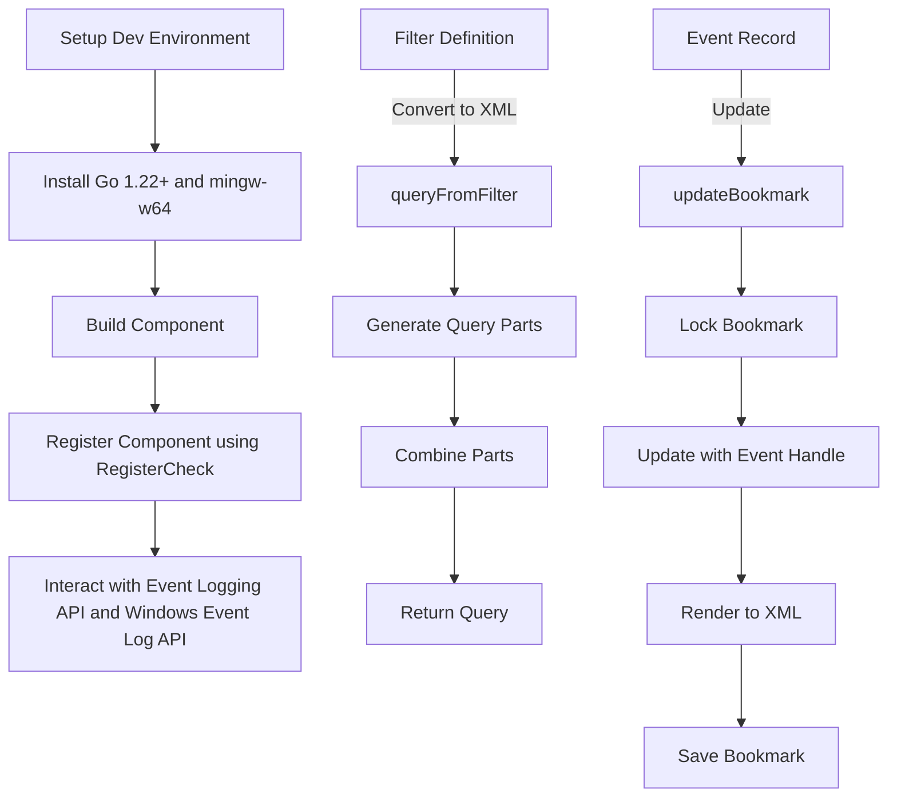

# Overview of Windows Event Log Check

The Windows Event Log check component is defined in the <SwmToken path="comp/checks/windowseventlog/windowseventlogimpl/windows_event_log.go" pos="40:9:9" line-data="func newComp(deps dependencies) windowseventlog.Component {">`windowseventlog`</SwmToken> package and is part of the checks in the Datadog Agent. This component is responsible for collecting and processing Windows Event Logs. It integrates with both the legacy Event Logging API and the newer Windows Event Log API. The implementation details can be found in the <SwmToken path="comp/checks/windowseventlog/windowseventlogimpl/windows_event_log.go" pos="6:4:4" line-data="// Package windowseventlogimpl provides the Windows Event Log check component">`windowseventlogimpl`</SwmToken> package.

## Setting Up the Development Environment

To set up a development environment for the Windows Event Log check, you need to install Go 1.22+ and `mingw-w64`. Building the component involves cross-compilation for Windows.

<SwmSnippet path="/comp/checks/windowseventlog/windowseventlogimpl/windows_event_log.go" line="40">

---

## Registering the Component

The <SwmToken path="comp/checks/windowseventlog/windowseventlogimpl/windows_event_log.go" pos="40:2:2" line-data="func newComp(deps dependencies) windowseventlog.Component {">`newComp`</SwmToken> function registers the Windows Event Log component using the <SwmToken path="comp/checks/windowseventlog/windowseventlogimpl/windows_event_log.go" pos="43:3:3" line-data="			core.RegisterCheck(check.CheckName, check.Factory(deps.LogsComponent, deps.Config))">`RegisterCheck`</SwmToken> function, which adds it to the catalog of checks.

```go
func newComp(deps dependencies) windowseventlog.Component {
	deps.Lifecycle.Append(fx.Hook{
		OnStart: func(ctx context.Context) error {
			core.RegisterCheck(check.CheckName, check.Factory(deps.LogsComponent, deps.Config))
			return nil
		},
	})
	return struct{}{}
}
```

---

</SwmSnippet>

## APIs

The `evtapi.API` interface includes functions from both the legacy Event Logging API and the newer Windows Event Log API, enabling comprehensive interaction with Windows Event Logs.

## Main Functions

There are several main functions in this folder. Some of them are <SwmToken path="comp/checks/windowseventlog/windowseventlogimpl/windows_event_log.go" pos="22:2:2" line-data="// Module defines the fx options for this component.">`Module`</SwmToken>, <SwmToken path="comp/checks/windowseventlog/windowseventlogimpl/windows_event_log.go" pos="25:5:5" line-data="		fx.Provide(newComp),">`newComp`</SwmToken>, <SwmToken path="comp/checks/windowseventlog/windowseventlogimpl/windows_event_log.go" pos="43:3:3" line-data="			core.RegisterCheck(check.CheckName, check.Factory(deps.LogsComponent, deps.Config))">`RegisterCheck`</SwmToken>, `submit`, `renderEventValues`, `eventDataGetter`, `eventMessageFilter`, `ddEventSubmitter`, `enrichEvent`, and <SwmToken path="comp/checks/windowseventlog/windowseventlogimpl/check/filters.go" pos="40:2:2" line-data="func queryFromFilter(f filterDefinition) (string, error) {">`queryFromFilter`</SwmToken>. We will dive a little into <SwmToken path="comp/checks/windowseventlog/windowseventlogimpl/windows_event_log.go" pos="22:2:2" line-data="// Module defines the fx options for this component.">`Module`</SwmToken>, <SwmToken path="comp/checks/windowseventlog/windowseventlogimpl/windows_event_log.go" pos="25:5:5" line-data="		fx.Provide(newComp),">`newComp`</SwmToken>, and <SwmToken path="comp/checks/windowseventlog/windowseventlogimpl/windows_event_log.go" pos="43:3:3" line-data="			core.RegisterCheck(check.CheckName, check.Factory(deps.LogsComponent, deps.Config))">`RegisterCheck`</SwmToken>.

<SwmSnippet path="/comp/checks/windowseventlog/windowseventlogimpl/windows_event_log.go" line="22">

---

### Module

The <SwmToken path="comp/checks/windowseventlog/windowseventlogimpl/windows_event_log.go" pos="22:2:2" line-data="// Module defines the fx options for this component.">`Module`</SwmToken> function defines the fx options for the Windows Event Log component. It uses <SwmToken path="comp/checks/windowseventlog/windowseventlogimpl/windows_event_log.go" pos="24:3:5" line-data="	return fxutil.Component(">`fxutil.Component`</SwmToken> to provide the necessary dependencies for the component.

```go
// Module defines the fx options for this component.
func Module() fxutil.Module {
	return fxutil.Component(
		fx.Provide(newComp),
	)
}
```

---

</SwmSnippet>

<SwmSnippet path="/comp/checks/windowseventlog/windowseventlogimpl/windows_event_log.go" line="40">

---

### <SwmToken path="comp/checks/windowseventlog/windowseventlogimpl/windows_event_log.go" pos="40:2:2" line-data="func newComp(deps dependencies) windowseventlog.Component {">`newComp`</SwmToken>

The <SwmToken path="comp/checks/windowseventlog/windowseventlogimpl/windows_event_log.go" pos="40:2:2" line-data="func newComp(deps dependencies) windowseventlog.Component {">`newComp`</SwmToken> function initializes the Windows Event Log component with the provided dependencies. It registers the check using <SwmToken path="comp/checks/windowseventlog/windowseventlogimpl/windows_event_log.go" pos="43:1:3" line-data="			core.RegisterCheck(check.CheckName, check.Factory(deps.LogsComponent, deps.Config))">`core.RegisterCheck`</SwmToken> and appends a lifecycle hook to start the component.

```go
func newComp(deps dependencies) windowseventlog.Component {
	deps.Lifecycle.Append(fx.Hook{
		OnStart: func(ctx context.Context) error {
			core.RegisterCheck(check.CheckName, check.Factory(deps.LogsComponent, deps.Config))
			return nil
		},
	})
	return struct{}{}
}
```

---

</SwmSnippet>

<SwmSnippet path="/pkg/collector/corechecks/loader.go" line="27">

---

### <SwmToken path="pkg/collector/corechecks/loader.go" pos="27:2:2" line-data="// RegisterCheck adds a check to the catalog">`RegisterCheck`</SwmToken>

The <SwmToken path="pkg/collector/corechecks/loader.go" pos="27:2:2" line-data="// RegisterCheck adds a check to the catalog">`RegisterCheck`</SwmToken> function adds a check to the catalog. It takes the name of the check and a factory function that creates instances of the check.

```go
// RegisterCheck adds a check to the catalog
func RegisterCheck(name string, checkFactory optional.Option[func() check.Check]) {
	if v, ok := checkFactory.Get(); ok {
		catalog[name] = v
	}
}
```

---

</SwmSnippet>

## Windowseventlog Endpoints

The Windows Event Log check component has several endpoints that facilitate its functionality.

<SwmSnippet path="/comp/checks/windowseventlog/windowseventlogimpl/check/filters.go" line="40">

---

### <SwmToken path="comp/checks/windowseventlog/windowseventlogimpl/check/filters.go" pos="40:2:2" line-data="func queryFromFilter(f filterDefinition) (string, error) {">`queryFromFilter`</SwmToken>

The <SwmToken path="comp/checks/windowseventlog/windowseventlogimpl/check/filters.go" pos="40:2:2" line-data="func queryFromFilter(f filterDefinition) (string, error) {">`queryFromFilter`</SwmToken> function converts the filter definition from the configuration into a structured XML query. This function checks if the filter is empty and, if not, generates query parts for sources, types, and event <SwmToken path="comp/checks/windowseventlog/windowseventlogimpl/check/filters.go" pos="55:12:12" line-data="	eventIDPart, err := genQueryPart(f.IDs(), formatEventIDPart)">`IDs`</SwmToken>. These parts are then combined into a single query string using logical operators.

```go
func queryFromFilter(f filterDefinition) (string, error) {
	if filterIsEmpty(f) {
		return "*", nil
	}
	sourcePart, err := genQueryPart(f.Sources(), formatSourcePart)
	if err != nil {
		return "", err
	}
	if len(sourcePart) > 0 {
		sourcePart = fmt.Sprintf("Provider[%s]", sourcePart)
	}
	typePart, err := genQueryPart(f.Types(), formatTypePart)
	if err != nil {
		return "", err
	}
	eventIDPart, err := genQueryPart(f.IDs(), formatEventIDPart)
	if err != nil {
		return "", err
	}
	systemValsQuery := logicJoinParts([]string{
		sourcePart,
```

---

</SwmSnippet>

<SwmSnippet path="/comp/checks/windowseventlog/windowseventlogimpl/check/bookmark.go" line="34">

---

### <SwmToken path="comp/checks/windowseventlog/windowseventlogimpl/check/bookmark.go" pos="34:9:9" line-data="func (b *bookmarkSaver) updateBookmark(event *evtapi.EventRecord) error {">`updateBookmark`</SwmToken>

The <SwmToken path="comp/checks/windowseventlog/windowseventlogimpl/check/bookmark.go" pos="34:9:9" line-data="func (b *bookmarkSaver) updateBookmark(event *evtapi.EventRecord) error {">`updateBookmark`</SwmToken> function updates the bookmark with the latest event record. It locks the bookmark for thread safety, updates it with the event record handle, and renders the bookmark to XML. If the bookmark frequency condition is met, it saves the bookmark.

```go
func (b *bookmarkSaver) updateBookmark(event *evtapi.EventRecord) error {
	b.mu.Lock()
	defer b.mu.Unlock()

	// Updating and rendering the bookmark is fast, and it makes the "update bookmark at end of check"
	// logic easier by avoiding having to conditionally track/save/close the event handle, so just do it every time.
	// DuplicateHandle() does not support event log handles, so we can't use it to separate the event
	// from the subscription.
	err := b.bookmark.Update(event.EventRecordHandle)
	if err != nil {
		return fmt.Errorf("failed to update bookmark: %w", err)
	}

	bookmarkXML, err := b.bookmark.Render()
	if err != nil {
		return fmt.Errorf("failed to render bookmark XML: %w", err)
	}
	b.lastBookmark = bookmarkXML

	// The bookmark is only saved/persisted according to the bookmarkFrequency
	b.eventsSinceLastBookmark++
```

---

</SwmSnippet>

&nbsp;

*This is an auto-generated document by Swimm AI 🌊 and has not yet been verified by a human*

<SwmMeta version="3.0.0" repo-id="Z2l0aHViJTNBJTNBZGF0YWRvZy1hZ2VudCUzQSUzQVN3aW1tLURlbW8=" repo-name="datadog-agent"><sup>Powered by [Swimm](/)</sup></SwmMeta>
