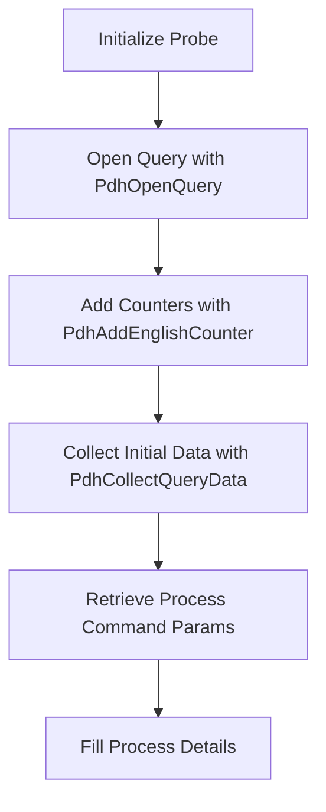

# Overview

Windows Process in Procutil refers to the handling and monitoring of processes running on a Windows operating system. The <SwmToken path="pkg/process/procutil/process_windows.go" pos="40:8:8" line-data="// NewProcessProbe returns a Probe object">`Probe`</SwmToken> struct in <SwmToken path="pkg/process/procutil/process_windows.go" pos="8:2:2" line-data="package procutil">`procutil`</SwmToken> is responsible for collecting and managing process-related data. It uses various counters to gather metrics such as CPU usage, memory usage, and I/O operations.

<SwmSnippet path="/pkg/process/procutil/process_windows.go" line="47">

---

# Probe Struct

The <SwmToken path="pkg/process/procutil/process_windows.go" pos="47:2:2" line-data="// probe implements Probe on Windows">`probe`</SwmToken> struct is responsible for collecting and managing process-related data. It uses various counters to gather metrics such as CPU usage, memory usage, and I/O operations.

```go
// probe implements Probe on Windows
type probe struct {
	hQuery    pdhutil.PDH_HQUERY
	counters  map[string]pdhutil.PDH_HCOUNTER
	formatter pdhutil.PdhFormatter
	enumSpecs map[string]counterEnumSpec
	initError error

	instanceToPID map[string]int32
	procs         map[int32]*Process
}
```

---

</SwmSnippet>

<SwmSnippet path="/pkg/process/procutil/process_windows.go" line="59">

---

# Init Method

The <SwmToken path="pkg/process/procutil/process_windows.go" pos="59:9:9" line-data="func (p *probe) init() {">`init`</SwmToken> method of the <SwmToken path="pkg/process/procutil/process_windows.go" pos="59:6:6" line-data="func (p *probe) init() {">`probe`</SwmToken> struct initializes the counters and prepares the probe for data collection. It opens a query using <SwmToken path="pkg/process/procutil/process_windows.go" pos="69:7:7" line-data="	status := pdhutil.PdhOpenQuery(0, 0, &amp;p.hQuery)">`PdhOpenQuery`</SwmToken> and adds counters for different process metrics using <SwmToken path="pkg/process/procutil/process_windows.go" pos="79:7:7" line-data="		status = pdhutil.PdhAddEnglishCounter(p.hQuery, path, 0, &amp;hCounter)">`PdhAddEnglishCounter`</SwmToken>.

```go
func (p *probe) init() {
	var err error

	defer func() {
		p.initError = err
		if err != nil {
			p.Close()
		}
	}()

	status := pdhutil.PdhOpenQuery(0, 0, &p.hQuery)
	if status != 0 {
		err = fmt.Errorf("PdhOpenQuery failed with 0x%x", status)
		return
	}

	p.counters = make(map[string]pdhutil.PDH_HCOUNTER)

	for _, path := range counterPaths {
		var hCounter pdhutil.PDH_HCOUNTER
		status = pdhutil.PdhAddEnglishCounter(p.hQuery, path, 0, &hCounter)
```

---

</SwmSnippet>

<SwmSnippet path="/pkg/process/procutil/process_windows.go" line="520">

---

# <SwmToken path="pkg/process/procutil/process_windows.go" pos="520:2:2" line-data="func getProcessCommandParams(procHandle windows.Handle) *winutil.ProcessCommandParams {">`getProcessCommandParams`</SwmToken> Function

The <SwmToken path="pkg/process/procutil/process_windows.go" pos="520:2:2" line-data="func getProcessCommandParams(procHandle windows.Handle) *winutil.ProcessCommandParams {">`getProcessCommandParams`</SwmToken> function retrieves command line parameters and executable paths for a given process handle. This information is used to populate the <SwmToken path="pkg/process/procutil/process_windows.go" pos="56:8:8" line-data="	procs         map[int32]*Process">`Process`</SwmToken> struct with details about the process.

```go
func getProcessCommandParams(procHandle windows.Handle) *winutil.ProcessCommandParams {
	var err error
	if cmdParams, err := winutil.GetCommandParamsForProcess(procHandle, true); err == nil {
		return cmdParams
	}

	log.Debugf("Error retrieving command params %v", err)
	if imagePath, err := winutil.GetImagePathForProcess(procHandle); err == nil {
		return &winutil.ProcessCommandParams{
			CmdLine:   imagePath,
			ImagePath: imagePath,
		}
	}

	log.Debugf("Error retrieving exe path %v", err)
	return &winutil.ProcessCommandParams{}
}
```

---

</SwmSnippet>

<SwmSnippet path="/pkg/process/procutil/process_windows.go" line="487">

---

# <SwmToken path="pkg/process/procutil/process_windows.go" pos="487:2:2" line-data="func fillProcessDetails(pid int32, proc *Process) error {">`fillProcessDetails`</SwmToken> Function

The <SwmToken path="pkg/process/procutil/process_windows.go" pos="487:2:2" line-data="func fillProcessDetails(pid int32, proc *Process) error {">`fillProcessDetails`</SwmToken> function uses <SwmToken path="pkg/process/procutil/process_windows.go" pos="500:5:5" line-data="	cmdParams := getProcessCommandParams(procHandle)">`getProcessCommandParams`</SwmToken> to gather detailed information about a process, including its command line arguments and executable path. It also collects CPU times and other metrics.

```go
func fillProcessDetails(pid int32, proc *Process) error {
	procHandle, err := OpenProcessHandle(pid)
	if err != nil {
		return err
	}
	defer windows.Close(procHandle)

	userName, usererr := GetUsernameForProcess(procHandle)
	if usererr != nil {
		log.Debugf("Couldn't get process username %v %v", pid, err)
	}
	proc.Username = userName

	cmdParams := getProcessCommandParams(procHandle)

	proc.Cmdline = ParseCmdLineArgs(cmdParams.CmdLine)
	if len(cmdParams.CmdLine) > 0 && len(proc.Cmdline) == 0 {
		log.Warnf("Failed to parse the cmdline:%s for pid:%d", cmdParams.CmdLine, pid)
	}

	proc.Exe = cmdParams.ImagePath
```

---

</SwmSnippet>

# Main Functions

There are several main functions in this folder. Some of them are <SwmToken path="pkg/process/procutil/process_windows.go" pos="40:2:2" line-data="// NewProcessProbe returns a Probe object">`NewProcessProbe`</SwmToken>, <SwmToken path="pkg/process/procutil/process_windows.go" pos="43:3:3" line-data="	p.init()">`init`</SwmToken>, and <SwmToken path="pkg/process/procutil/process_windows.go" pos="487:2:2" line-data="func fillProcessDetails(pid int32, proc *Process) error {">`fillProcessDetails`</SwmToken>. We will dive a little into <SwmToken path="pkg/process/procutil/process_windows.go" pos="40:2:2" line-data="// NewProcessProbe returns a Probe object">`NewProcessProbe`</SwmToken> and <SwmToken path="pkg/process/procutil/process_windows.go" pos="487:2:2" line-data="func fillProcessDetails(pid int32, proc *Process) error {">`fillProcessDetails`</SwmToken>.

<SwmSnippet path="/pkg/process/procutil/process_windows.go" line="40">

---

## <SwmToken path="pkg/process/procutil/process_windows.go" pos="40:2:2" line-data="// NewProcessProbe returns a Probe object">`NewProcessProbe`</SwmToken>

The <SwmToken path="pkg/process/procutil/process_windows.go" pos="40:2:2" line-data="// NewProcessProbe returns a Probe object">`NewProcessProbe`</SwmToken> function returns a new <SwmToken path="pkg/process/procutil/process_windows.go" pos="40:8:8" line-data="// NewProcessProbe returns a Probe object">`Probe`</SwmToken> object. It initializes the probe by calling the <SwmToken path="pkg/process/procutil/process_windows.go" pos="43:3:3" line-data="	p.init()">`init`</SwmToken> method, which sets up the necessary counters and prepares the probe for data collection.

```go
// NewProcessProbe returns a Probe object
func NewProcessProbe(...Option) Probe {
	p := &probe{}
	p.init()
	return p
}
```

---

</SwmSnippet>

&nbsp;

*This is an auto-generated document by Swimm AI 🌊 and has not yet been verified by a human*

<SwmMeta version="3.0.0" repo-id="Z2l0aHViJTNBJTNBZGF0YWRvZy1hZ2VudCUzQSUzQVN3aW1tLURlbW8=" repo-name="datadog-agent"><sup>Powered by [Swimm](/)</sup></SwmMeta>
