```mermaid
graph TD;
    A[Windows Toolhelp Overview] --> B[windowsToolhelpProbe Struct];
    A --> C[NewWindowsToolhelpProbe Function];
    A --> D[ProcessesByPID Method];
    A --> E[getProcessMemoryInfo Function];
    A --> F[getProcessHandleCount Function];
    A --> G[getProcessIoCounters Function];
    B -->|Maintains| H[Cached Processes];
    D -->|Uses| I[Toolhelp API];
    D -->|Gathers| J[Process Information];
    J -->|Includes| K[Process ids, Parent Process ids, Memory Usage, I/O Statistics];
    J -->|Stores| L[Cached Processes Map];

%% Swimm:
%% graph TD;
%%     A[Windows Toolhelp Overview] --> B[windowsToolhelpProbe Struct];
%%     A --> C[NewWindowsToolhelpProbe Function];
%%     A --> D[ProcessesByPID Method];
%%     A --> E[getProcessMemoryInfo Function];
%%     A --> F[getProcessHandleCount Function];
%%     A --> G[getProcessIoCounters Function];
%%     B -->|Maintains| H[Cached Processes];
%%     D -->|Uses| I[Toolhelp API];
%%     D -->|Gathers| J[Process Information];
%%     J -->|Includes| K[Process <SwmToken path="tasks/gitlab_helpers.py" pos="90:10:10" line-data="def print_gitlab_object(get_object, ctx, ids, repo=&#39;DataDog/datadog-agent&#39;, jq: str | None = None, jq_colors=True):">`ids`</SwmToken>, Parent Process <SwmToken path="tasks/gitlab_helpers.py" pos="90:10:10" line-data="def print_gitlab_object(get_object, ctx, ids, repo=&#39;DataDog/datadog-agent&#39;, jq: str | None = None, jq_colors=True):">`ids`</SwmToken>, Memory Usage, I/O Statistics];
%%     J -->|Stores| L[Cached Processes Map];
```

# Overview of Windows Toolhelp in Procutil

Windows Toolhelp is a mechanism used to capture snapshots of the processes running on a Windows system. It is implemented in the <SwmToken path="pkg/process/procutil/process_windows_toolhelp.go" pos="67:2:2" line-data="type windowsToolhelpProbe struct {">`windowsToolhelpProbe`</SwmToken> struct, which maintains a cache of processes. This document provides an overview of the key components and functions involved in the Windows Toolhelp implementation within the Procutil package.

<SwmSnippet path="/pkg/process/procutil/process_windows_toolhelp.go" line="67">

---

## Windows Toolhelp Probe

The <SwmToken path="pkg/process/procutil/process_windows_toolhelp.go" pos="67:2:2" line-data="type windowsToolhelpProbe struct {">`windowsToolhelpProbe`</SwmToken> struct maintains a cache of processes. This cache is essential for storing and retrieving process information efficiently.

```go
type windowsToolhelpProbe struct {
	cachedProcesses map[uint32]*cachedProcess
}
```

---

</SwmSnippet>

<SwmSnippet path="/pkg/process/procutil/process_windows_toolhelp.go" line="71">

---

## Initializing the Probe

The <SwmToken path="pkg/process/procutil/process_windows_toolhelp.go" pos="71:2:2" line-data="// NewWindowsToolhelpProbe provides an implementation of a process probe based on Toolhelp API">`NewWindowsToolhelpProbe`</SwmToken> function initializes the probe and sets up the cached processes map. This function is crucial for preparing the probe to capture and store process information.

```go
// NewWindowsToolhelpProbe provides an implementation of a process probe based on Toolhelp API
func NewWindowsToolhelpProbe() Probe {
	return &windowsToolhelpProbe{
		cachedProcesses: map[uint32]*cachedProcess{},
	}
}
```

---

</SwmSnippet>

<SwmSnippet path="/pkg/process/procutil/process_windows_toolhelp.go" line="97">

---

## Gathering Process Information

The <SwmToken path="pkg/process/procutil/process_windows_toolhelp.go" pos="97:9:9" line-data="func (p *windowsToolhelpProbe) ProcessesByPID(now time.Time, collectStats bool) (map[int32]*Process, error) { //nolint:revive // TODO fix revive unused-parameter">`ProcessesByPID`</SwmToken> method uses the Toolhelp API to create a snapshot of all processes and iterates through them to gather information. This information includes process <SwmToken path="tasks/gitlab_helpers.py" pos="90:10:10" line-data="def print_gitlab_object(get_object, ctx, ids, repo=&#39;DataDog/datadog-agent&#39;, jq: str | None = None, jq_colors=True):">`ids`</SwmToken>, parent process <SwmToken path="tasks/gitlab_helpers.py" pos="90:10:10" line-data="def print_gitlab_object(get_object, ctx, ids, repo=&#39;DataDog/datadog-agent&#39;, jq: str | None = None, jq_colors=True):">`ids`</SwmToken>, memory usage, and I/O statistics. The collected data is stored in the <SwmToken path="pkg/process/procutil/process_windows_toolhelp.go" pos="113:11:11" line-data="	for pid := range p.cachedProcesses {">`cachedProcesses`</SwmToken> map, which is then used to provide statistics for specific <SwmToken path="pkg/process/procutil/process_windows_toolhelp.go" pos="80:11:11" line-data="func (p *windowsToolhelpProbe) StatsForPIDs(pids []int32, now time.Time) (map[int32]*Stats, error) { //nolint:revive // TODO fix revive unused-parameter">`pids`</SwmToken>.

```go
func (p *windowsToolhelpProbe) ProcessesByPID(now time.Time, collectStats bool) (map[int32]*Process, error) { //nolint:revive // TODO fix revive unused-parameter
	// make sure we get the consistent snapshot by using the same OS thread
	runtime.LockOSThread()
	defer runtime.UnlockOSThread()

	allProcsSnap := w32.CreateToolhelp32Snapshot(w32.TH32CS_SNAPPROCESS, 0)
	if allProcsSnap == 0 {
		return nil, windows.GetLastError()
	}
	procs := make(map[int32]*Process)

	defer w32.CloseHandle(allProcsSnap)
	var pe32 w32.PROCESSENTRY32
	pe32.DwSize = uint32(unsafe.Sizeof(pe32))

	knownPids := make(map[uint32]struct{})
	for pid := range p.cachedProcesses {
		knownPids[pid] = struct{}{}
	}

	for success := w32.Process32First(allProcsSnap, &pe32); success; success = w32.Process32Next(allProcsSnap, &pe32) {
```

---

</SwmSnippet>

<SwmSnippet path="/pkg/process/procutil/process_windows_toolhelp.go" line="43">

---

## Retrieving Memory Information

The <SwmToken path="pkg/process/procutil/process_windows_toolhelp.go" pos="43:2:2" line-data="func getProcessMemoryInfo(h windows.Handle, mem *process.PROCESS_MEMORY_COUNTERS) (err error) {">`getProcessMemoryInfo`</SwmToken> function retrieves memory information for a given process handle using the <SwmToken path="pkg/process/procutil/process_windows_toolhelp.go" pos="43:2:2" line-data="func getProcessMemoryInfo(h windows.Handle, mem *process.PROCESS_MEMORY_COUNTERS) (err error) {">`getProcessMemoryInfo`</SwmToken> procedure from the <SwmToken path="pkg/process/procutil/process_windows_toolhelp.go" pos="26:10:12" line-data="	modpsapi                  = windows.NewLazyDLL(&quot;psapi.dll&quot;)">`psapi.dll`</SwmToken> library. This function is essential for obtaining detailed memory usage statistics for processes.

```go
func getProcessMemoryInfo(h windows.Handle, mem *process.PROCESS_MEMORY_COUNTERS) (err error) {
	r1, _, e1 := procGetProcessMemoryInfo.Call(uintptr(h), uintptr(unsafe.Pointer(mem)), uintptr(unsafe.Sizeof(*mem)))
	if r1 == 0 {
		return e1
	}
	return nil
}
```

---

</SwmSnippet>

<SwmSnippet path="/pkg/process/procutil/process_windows_toolhelp.go" line="51">

---

## Retrieving Handle Count

The <SwmToken path="pkg/process/procutil/process_windows_toolhelp.go" pos="51:2:2" line-data="func getProcessHandleCount(h windows.Handle, count *uint32) (err error) {">`getProcessHandleCount`</SwmToken> function retrieves the handle count for a given process handle using the <SwmToken path="pkg/process/procutil/process_windows_toolhelp.go" pos="51:2:2" line-data="func getProcessHandleCount(h windows.Handle, count *uint32) (err error) {">`getProcessHandleCount`</SwmToken> procedure from the <SwmToken path="pkg/process/procutil/process_windows_toolhelp.go" pos="27:10:12" line-data="	modkernel                 = windows.NewLazyDLL(&quot;kernel32.dll&quot;)">`kernel32.dll`</SwmToken> library. This function helps in understanding the number of handles a process has open.

```go
func getProcessHandleCount(h windows.Handle, count *uint32) (err error) {
	r1, _, e1 := procGetProcessHandleCount.Call(uintptr(h), uintptr(unsafe.Pointer(count)))
	if r1 == 0 {
		return e1
	}
	return nil
}
```

---

</SwmSnippet>

<SwmSnippet path="/pkg/process/procutil/process_windows_toolhelp.go" line="59">

---

## Retrieving I/O Statistics

The <SwmToken path="pkg/process/procutil/process_windows_toolhelp.go" pos="59:2:2" line-data="func getProcessIoCounters(h windows.Handle, counters *IO_COUNTERS) (err error) {">`getProcessIoCounters`</SwmToken> function retrieves I/O statistics for a given process handle using the <SwmToken path="pkg/process/procutil/process_windows_toolhelp.go" pos="59:2:2" line-data="func getProcessIoCounters(h windows.Handle, counters *IO_COUNTERS) (err error) {">`getProcessIoCounters`</SwmToken> procedure from the <SwmToken path="pkg/process/procutil/process_windows_toolhelp.go" pos="27:10:12" line-data="	modkernel                 = windows.NewLazyDLL(&quot;kernel32.dll&quot;)">`kernel32.dll`</SwmToken> library. This function is used to gather detailed I/O statistics for processes.

```go
func getProcessIoCounters(h windows.Handle, counters *IO_COUNTERS) (err error) {
	r1, _, e1 := procGetProcessIoCounters.Call(uintptr(h), uintptr(unsafe.Pointer(counters)))
	if r1 == 0 {
		return e1
	}
	return nil
}
```

---

</SwmSnippet>

&nbsp;

*This is an auto-generated document by Swimm AI 🌊 and has not yet been verified by a human*

<SwmMeta version="3.0.0" repo-id="Z2l0aHViJTNBJTNBZGF0YWRvZy1hZ2VudCUzQSUzQVN3aW1tLURlbW8=" repo-name="datadog-agent"><sup>Powered by [Swimm](/)</sup></SwmMeta>
