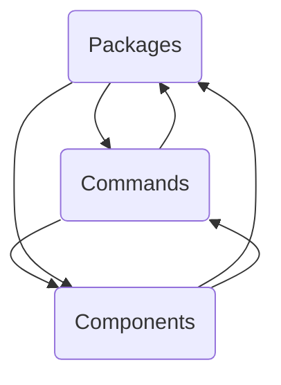

The repo datadog-agent contains the source code for the Datadog Agent, which collects metrics, logs, and traces from various sources and sends them to the Datadog platform for monitoring and analysis.

## Main Components

### Packages

Packages are collections of related code and data that are grouped together to provide specific functionality or features. They help organize the codebase, making it modular and easier to manage.

- <SwmLink doc-title="Introduction to Gohai in Packages">[Introduction to Gohai in Packages](/.swm/introduction-to-gohai-in-packages.0br2zrjo.sw.md)</SwmLink>

- <SwmLink doc-title="Understanding SNMP Package">[Understanding SNMP Package](/.swm/understanding-snmp-package.64ggmv9m.sw.md)</SwmLink>

- <SwmLink doc-title="DatadogPodAutoscaler Management Process">[DatadogPodAutoscaler Management Process](/.swm/datadogpodautoscaler-management-process.faibpj3u.sw.md)</SwmLink>

- <SwmLink doc-title="Exploring Obfuscation Mechanism">[Exploring Obfuscation Mechanism](/.swm/exploring-obfuscation-mechanism.ztd93dne.sw.md)</SwmLink>

- <SwmLink doc-title="Exploring Metrics in Packages">[Exploring Metrics in Packages](/.swm/exploring-metrics-in-packages.k92eniis.sw.md)</SwmLink>

- <SwmLink doc-title="Introduction to Aggregator Module">[Introduction to Aggregator Module](/.swm/introduction-to-aggregator-module.jvio1qbn.sw.md)</SwmLink>

- **Fleet**

  - <SwmLink doc-title="Exploring Fleet Package">[Exploring Fleet Package](/.swm/exploring-fleet-package.7lbp1i5s.sw.md)</SwmLink>
    - **Installer**
      - <SwmLink doc-title="Fleet Installer Overview">[Fleet Installer Overview](/.swm/fleet-installer-overview.es27w9n8.sw.md)</SwmLink>
      - **Flows**
        - <SwmLink doc-title="Setting Up the Datadog Agent">[Setting Up the Datadog Agent](/.swm/setting-up-the-datadog-agent.kmuc1pzj.sw.md)</SwmLink>
        - <SwmLink doc-title="Setting Up the APM Injector">[Setting Up the APM Injector](/.swm/setting-up-the-apm-injector.zocju7pm.sw.md)</SwmLink>

- **Compliance**

  - <SwmLink doc-title="Introduction to Compliance in Packages">[Introduction to Compliance in Packages](/.swm/introduction-to-compliance-in-packages.pa5dcdz4.sw.md)</SwmLink>
  - <SwmLink doc-title="Overview of NewLogReporter">[Overview of NewLogReporter](/.swm/overview-of-newlogreporter.0pkij0hp.sw.md)</SwmLink>

- **Process**

  - <SwmLink doc-title="Introduction to Process Metadata">[Introduction to Process Metadata](/.swm/introduction-to-process-metadata.ekmidybj.sw.md)</SwmLink>
  - <SwmLink doc-title="Basic Concepts of Process Checks">[Basic Concepts of Process Checks](/.swm/basic-concepts-of-process-checks.npbmap2e.sw.md)</SwmLink>
  - <SwmLink doc-title="Process Monitor Initialization">[Process Monitor Initialization](/.swm/process-monitor-initialization.k2k58yge.sw.md)</SwmLink>
  - **Procutil**
    - <SwmLink doc-title="Basic Concepts of Process Utilities">[Basic Concepts of Process Utilities](/.swm/basic-concepts-of-process-utilities.avlelp4c.sw.md)</SwmLink>
    - <SwmLink doc-title="Getting Started with Process Model in Procutil">[Getting Started with Process Model in Procutil](/.swm/getting-started-with-process-model-in-procutil.ta1t7uhd.sw.md)</SwmLink>
    - <SwmLink doc-title="Data Scrubber in Procutil">[Data Scrubber in Procutil](/.swm/data-scrubber-in-procutil.1ky5v32g.sw.md)</SwmLink>
    - <SwmLink doc-title="Introduction to Linux Process Handling">[Introduction to Linux Process Handling](/.swm/introduction-to-linux-process-handling.uiv4cg6e.sw.md)</SwmLink>
    - <SwmLink doc-title="Overview of Windows Process in Procutil">[Overview of Windows Process in Procutil](/.swm/overview-of-windows-process-in-procutil.df87hm8w.sw.md)</SwmLink>
    - <SwmLink doc-title="Overview of Windows Toolhelp in Procutil">[Overview of Windows Toolhelp in Procutil](/.swm/overview-of-windows-toolhelp-in-procutil.2avoghbt.sw.md)</SwmLink>
    - <SwmLink doc-title="Linux Dirent in Procutil">[Linux Dirent in Procutil](/.swm/linux-dirent-in-procutil.3jgx8ipg.sw.md)</SwmLink>
    - **Flows**
      - <SwmLink doc-title="Building the MSI Installer">[Building the MSI Installer](/.swm/building-the-msi-installer.6kzro17u.sw.md)</SwmLink>

- **Security**

  - <SwmLink doc-title="Exploring Runtime Security Probe">[Exploring Runtime Security Probe](/.swm/exploring-runtime-security-probe.fq6d5ymu.sw.md)</SwmLink>
  - <SwmLink doc-title="Exploring the Activity Tree">[Exploring the Activity Tree](/.swm/exploring-the-activity-tree.yg541tf1.sw.md)</SwmLink>
  - <SwmLink doc-title="What is Resolvers in Security">[What is Resolvers in Security](/.swm/what-is-resolvers-in-security.q8d5aspx.sw.md)</SwmLink>
  - <SwmLink doc-title="Security Utilities Overview">[Security Utilities Overview](/.swm/security-utilities-overview.tl9gveac.sw.md)</SwmLink>
  - <SwmLink doc-title="Introduction to Security Module">[Introduction to Security Module](/.swm/introduction-to-security-module.kyp34ote.sw.md)</SwmLink>
  - <SwmLink doc-title="Introduction to Seclwin in Security">[Introduction to Seclwin in Security](/.swm/introduction-to-seclwin-in-security.23l0ct4u.sw.md)</SwmLink>
  - **Dump**
    - <SwmLink doc-title="Overview of Activity Dump">[Overview of Activity Dump](/.swm/overview-of-activity-dump.a5dl9pgy.sw.md)</SwmLink>
    - <SwmLink doc-title="Initialization and Execution Flow of Start Function">[Initialization and Execution Flow of Start Function](/.swm/initialization-and-execution-flow-of-start-function.vfgg4eju.sw.md)</SwmLink>
  - **Flows**
    - <SwmLink doc-title="Handling Network Namespace Cache Dump Requests">[Handling Network Namespace Cache Dump Requests](/.swm/handling-network-namespace-cache-dump-requests.8omjib0u.sw.md)</SwmLink>
    - <SwmLink doc-title="Dumping Network Namespaces">[Dumping Network Namespaces](/.swm/dumping-network-namespaces.u104ln55.sw.md)</SwmLink>
    - <SwmLink doc-title="Dumping Discarders Process">[Dumping Discarders Process](/.swm/dumping-discarders-process.g8f0kba8.sw.md)</SwmLink>
    - <SwmLink doc-title="Overview of the dumpDiscarders Process">[Overview of the dumpDiscarders Process](/.swm/overview-of-the-dumpdiscarders-process.4gbx046o.sw.md)</SwmLink>
  - **Secl**
    - <SwmLink doc-title="Basic Concepts of SECL Compiler">[Basic Concepts of SECL Compiler](/.swm/basic-concepts-of-secl-compiler.2n9h4bca.sw.md)</SwmLink>
    - <SwmLink doc-title="Understanding Rules in SECL">[Understanding Rules in SECL](/.swm/understanding-rules-in-secl.b31n8i2m.sw.md)</SwmLink>
    - **Flows**
      - <SwmLink doc-title="Generating and Evaluating Rules">[Generating and Evaluating Rules](/.swm/generating-and-evaluating-rules.29dwrzxu.sw.md)</SwmLink>
      - <SwmLink doc-title="Generating Partial Evaluators">[Generating Partial Evaluators](/.swm/generating-partial-evaluators.u3nouz0g.sw.md)</SwmLink>
    - **Model**
      - <SwmLink doc-title="Getting Started with Security Event Model">[Getting Started with Security Event Model](/.swm/getting-started-with-security-event-model.jp4pimcx.sw.md)</SwmLink>
      - <SwmLink doc-title="The ExtraFieldHandlers class">[The ExtraFieldHandlers class](/.swm/the-extrafieldhandlers-class.xbavk.sw.md)</SwmLink>
  - **Flows**
    - <SwmLink doc-title="Setting Up the eBPF Compiler">[Setting Up the eBPF Compiler](/.swm/setting-up-the-ebpf-compiler.kkpdtulq.sw.md)</SwmLink>
    - <SwmLink doc-title="Updating Build Images Flow">[Updating Build Images Flow](/.swm/updating-build-images-flow.tuaib6m2.sw.md)</SwmLink>
    - <SwmLink doc-title="Handling Consistent Job Failures">[Handling Consistent Job Failures](/.swm/handling-consistent-job-failures.j2d3clvy.sw.md)</SwmLink>
    - <SwmLink doc-title="Unfreeze Process Flow">[Unfreeze Process Flow](/.swm/unfreeze-process-flow.s8gt4p6b.sw.md)</SwmLink>
    - <SwmLink doc-title="Resolving Process Information from Procfs">[Resolving Process Information from Procfs](/.swm/resolving-process-information-from-procfs.no9hntc5.sw.md)</SwmLink>
    - <SwmLink doc-title="Creating a Release Candidate">[Creating a Release Candidate](/.swm/creating-a-release-candidate.ugwxf0hx.sw.md)</SwmLink>
    - <SwmLink doc-title="Resolving Process Information from Kernel Maps">[Resolving Process Information from Kernel Maps](/.swm/resolving-process-information-from-kernel-maps.9io6tvib.sw.md)</SwmLink>
    - <SwmLink doc-title="SyncCache Process Overview">[SyncCache Process Overview](/.swm/synccache-process-overview.n3lxzizn.sw.md)</SwmLink>
    - <SwmLink doc-title="Finishing a Release">[Finishing a Release](/.swm/finishing-a-release.gg00p3lg.sw.md)</SwmLink>
  - **Flows**
    - <SwmLink doc-title="Event Dispatch Flow">[Event Dispatch Flow](/.swm/event-dispatch-flow.zpczuq0o.sw.md)</SwmLink>
    - <SwmLink doc-title="Marshaling an Event">[Marshaling an Event](/.swm/marshaling-an-event.adzi6ja7.sw.md)</SwmLink>
    - <SwmLink doc-title="Snapshot Process Overview">[Snapshot Process Overview](/.swm/snapshot-process-overview.9nzlfa9d.sw.md)</SwmLink>
    - <SwmLink doc-title="Initialization Process">[Initialization Process](/.swm/initialization-process.jyz5llsx.sw.md)</SwmLink>

- **Ebpf**

  - <SwmLink doc-title="Overview of Ebpf Package">[Overview of Ebpf Package](/.swm/overview-of-ebpf-package.2irazbm0.sw.md)</SwmLink>
  - <SwmLink doc-title="Overview of C in eBPF">[Overview of C in eBPF](/.swm/overview-of-c-in-ebpf.gofk57tx.sw.md)</SwmLink>
  - <SwmLink doc-title="Post Register Flow">[Post Register Flow](/.swm/post-register-flow.sj29ssxm.sw.md)</SwmLink>

- **Logs**

  - <SwmLink doc-title="Getting Started with Log Launchers">[Getting Started with Log Launchers](/.swm/getting-started-with-log-launchers.5axw8lmh.sw.md)</SwmLink>
  - <SwmLink doc-title="Understanding Tailers in Logs">[Understanding Tailers in Logs](/.swm/understanding-tailers-in-logs.3enh45w1.sw.md)</SwmLink>
  - **Internal**
    - <SwmLink doc-title="Introduction to Internal Logging Components">[Introduction to Internal Logging Components](/.swm/introduction-to-internal-logging-components.ipc0hzgl.sw.md)</SwmLink>
    - <SwmLink doc-title="Introduction to Decoder">[Introduction to Decoder](/.swm/introduction-to-decoder.05n9skd3.sw.md)</SwmLink>

- **Flare**

  - <SwmLink doc-title="Overview of Flare in Packages">[Overview of Flare in Packages](/.swm/overview-of-flare-in-packages.n5qpk14d.sw.md)</SwmLink>
  - <SwmLink doc-title="Creating a Flare">[Creating a Flare](/.swm/creating-a-flare.k94ab5cc.sw.md)</SwmLink>

- **Networkpath**

  - <SwmLink doc-title="Overview of Networkpath Component Bundle">[Overview of Networkpath Component Bundle](/.swm/overview-of-networkpath-component-bundle.nhqp7yi8.sw.md)</SwmLink>
  - <SwmLink doc-title="Traceroute Registration and Execution">[Traceroute Registration and Execution](/.swm/traceroute-registration-and-execution.ss7tfnuf.sw.md)</SwmLink>

- **Collector**

  - <SwmLink doc-title="System Checks Overview">[System Checks Overview](/.swm/system-checks-overview.4q8ocy0h.sw.md)</SwmLink>
  - <SwmLink doc-title="Oracle in Collector">[Oracle in Collector](/.swm/oracle-in-collector.npxc3mxj.sw.md)</SwmLink>
  - <SwmLink doc-title="Understanding Cluster Functionality">[Understanding Cluster Functionality](/.swm/understanding-cluster-functionality.6z4oblxw.sw.md)</SwmLink>
  - **Ebpf**
    - <SwmLink doc-title="Overview of Ebpf in Collector">[Overview of Ebpf in Collector](/.swm/overview-of-ebpf-in-collector.b55bctgc.sw.md)</SwmLink>
    - <SwmLink doc-title="Getting Started with eBPF Probe">[Getting Started with eBPF Probe](/.swm/getting-started-with-ebpf-probe.krq2r8b8.sw.md)</SwmLink>
  - **Containers**
    - <SwmLink doc-title="Exploring Kubelet in Containers">[Exploring Kubelet in Containers](/.swm/exploring-kubelet-in-containers.rn7xr8lw.sw.md)</SwmLink>
    - <SwmLink doc-title="Overview of Docker in Containers">[Overview of Docker in Containers](/.swm/overview-of-docker-in-containers.m1mxyrfu.sw.md)</SwmLink>
  - **Servicediscovery**
    - <SwmLink doc-title="Getting Started with Service Discovery">[Getting Started with Service Discovery](/.swm/getting-started-with-service-discovery.tvrfetwm.sw.md)</SwmLink>
    - <SwmLink doc-title="Introduction to Service Name Detection">[Introduction to Service Name Detection](/.swm/introduction-to-service-name-detection.qsti9ic9.sw.md)</SwmLink>
  - **Network devices**
    - <SwmLink doc-title="Basic Concepts of Network Devices in Collector">[Basic Concepts of Network Devices in Collector](/.swm/basic-concepts-of-network-devices-in-collector.640gwmr6.sw.md)</SwmLink>
    - <SwmLink doc-title="Running the Cisco SD-WAN Client">[Running the Cisco SD-WAN Client](/.swm/running-the-cisco-sd-wan-client.bsjfmiit.sw.md)</SwmLink>
  - **Snmp**
    - <SwmLink doc-title="What is SNMP Integration">[What is SNMP Integration](/.swm/what-is-snmp-integration.35dj3763.sw.md)</SwmLink>
    - <SwmLink doc-title="SNMP Check Configuration Overview">[SNMP Check Configuration Overview](/.swm/snmp-check-configuration-overview.5rnhbz92.sw.md)</SwmLink>
    - <SwmLink doc-title="Introduction to SNMP Configuration Validation">[Introduction to SNMP Configuration Validation](/.swm/introduction-to-snmp-configuration-validation.626cgnli.sw.md)</SwmLink>
    - <SwmLink doc-title="Exploring SNMP Profiles">[Exploring SNMP Profiles](/.swm/exploring-snmp-profiles.dtdqugk6.sw.md)</SwmLink>
    - <SwmLink doc-title="Exploring SNMP Fetch">[Exploring SNMP Fetch](/.swm/exploring-snmp-fetch.oayo7ojv.sw.md)</SwmLink>
    - <SwmLink doc-title="SNMP Discovery Process">[SNMP Discovery Process](/.swm/snmp-discovery-process.h4z5jnxr.sw.md)</SwmLink>
    - <SwmLink doc-title="Getting Started with SNMP Device Check">[Getting Started with SNMP Device Check](/.swm/getting-started-with-snmp-device-check.49vi30ft.sw.md)</SwmLink>
    - <SwmLink doc-title="Introduction to SNMP Value Store">[Introduction to SNMP Value Store](/.swm/introduction-to-snmp-value-store.2t944ycr.sw.md)</SwmLink>
    - **SNMP Session**
      - <SwmLink doc-title="Understanding SNMP Session">[Understanding SNMP Session](/.swm/understanding-snmp-session.oxzw8kw1.sw.md)</SwmLink>
      - <SwmLink doc-title="Getting Started with FakeSession">[Getting Started with FakeSession](/.swm/getting-started-with-fakesession.jdkzscmd.sw.md)</SwmLink>
    - **Config**
      - <SwmLink doc-title="Exploring SNMP Check Configuration">[Exploring SNMP Check Configuration](/.swm/exploring-snmp-check-configuration.x8nau8cz.sw.md)</SwmLink>
      - <SwmLink doc-title="SNMP Check Configuration Process">[SNMP Check Configuration Process](/.swm/snmp-check-configuration-process.kg77hnnq.sw.md)</SwmLink>
    - **SNMP Report**
      - <SwmLink doc-title="Reporting Metrics in SNMP">[Reporting Metrics in SNMP](/.swm/reporting-metrics-in-snmp.lj3s5le0.sw.md)</SwmLink>
      - <SwmLink doc-title="Introduction to Memory Usage Reporting">[Introduction to Memory Usage Reporting](/.swm/introduction-to-memory-usage-reporting.zo56bjx8.sw.md)</SwmLink>
      - <SwmLink doc-title="Introduction to Device Metadata Reporting">[Introduction to Device Metadata Reporting](/.swm/introduction-to-device-metadata-reporting.nakfh073.sw.md)</SwmLink>
      - <SwmLink doc-title="Understanding SNMP Report Utilities">[Understanding SNMP Report Utilities](/.swm/understanding-snmp-report-utilities.fpxristq.sw.md)</SwmLink>
  - **Orchestrator**
    - <SwmLink doc-title="Exploring Transformers in Orchestrator">[Exploring Transformers in Orchestrator](/.swm/exploring-transformers-in-orchestrator.j56t8s9f.sw.md)</SwmLink>
    - <SwmLink doc-title="Exploring Resource Processors">[Exploring Resource Processors](/.swm/exploring-resource-processors.t4wl4iuc.sw.md)</SwmLink>
    - <SwmLink doc-title="Getting Started with Orchestrator Collectors">[Getting Started with Orchestrator Collectors](/.swm/getting-started-with-orchestrator-collectors.1fko3g4b.sw.md)</SwmLink>
    - <SwmLink doc-title="Configuration Process Overview">[Configuration Process Overview](/.swm/configuration-process-overview.wbg86bl8.sw.md)</SwmLink>
  - **Flows**
    - <SwmLink doc-title="Retrieving Checks by Name">[Retrieving Checks by Name](/.swm/retrieving-checks-by-name.yvk2e5j5.sw.md)</SwmLink>
    - <SwmLink doc-title="Python Environment Setup">[Python Environment Setup](/.swm/python-environment-setup.vq932pth.sw.md)</SwmLink>
    - <SwmLink doc-title="Reloading Check Instances">[Reloading Check Instances](/.swm/reloading-check-instances.d7cvzebf.sw.md)</SwmLink>
    - <SwmLink doc-title="Obfuscating SQL Queries">[Obfuscating SQL Queries](/.swm/obfuscating-sql-queries.925otsjk.sw.md)</SwmLink>
    - <SwmLink doc-title="LocalAPI Initialization and Routing">[LocalAPI Initialization and Routing](/.swm/localapi-initialization-and-routing.sjumnsa8.sw.md)</SwmLink>
    - <SwmLink doc-title="SBOM Check Run Function">[SBOM Check Run Function](/.swm/sbom-check-run-function.8y2014xz.sw.md)</SwmLink>
    - <SwmLink doc-title="Cluster Name Retrieval Process">[Cluster Name Retrieval Process](/.swm/cluster-name-retrieval-process.dxpzgegm.sw.md)</SwmLink>
    - <SwmLink doc-title="Persistent Cache Retrieval Flow">[Persistent Cache Retrieval Flow](/.swm/persistent-cache-retrieval-flow.1kft9rvu.sw.md)</SwmLink>
    - <SwmLink doc-title="Scheduling Process Overview">[Scheduling Process Overview](/.swm/scheduling-process-overview.6ugiywfr.sw.md)</SwmLink>
    - <SwmLink doc-title="Kubelet Connection Information Flow">[Kubelet Connection Information Flow](/.swm/kubelet-connection-information-flow.f8xox322.sw.md)</SwmLink>

- **Proto**

  - <SwmLink doc-title="Overview of Protocol Buffers">[Overview of Protocol Buffers](/.swm/overview-of-protocol-buffers.xpuaxitf.sw.md)</SwmLink>
  - <SwmLink doc-title="Introduction to Trace in Proto">[Introduction to Trace in Proto](/.swm/introduction-to-trace-in-proto.jxo0405q.sw.md)</SwmLink>

- **Trace**

  - <SwmLink doc-title="Introduction to Trace in Packages">[Introduction to Trace in Packages](/.swm/introduction-to-trace-in-packages.fjfe6cfr.sw.md)</SwmLink>
  - <SwmLink doc-title="Understanding Trace API">[Understanding Trace API](/.swm/understanding-trace-api.47rves4q.sw.md)</SwmLink>
  - **Flows**
    - <SwmLink doc-title="NewAgent Initialization Process">[NewAgent Initialization Process](/.swm/newagent-initialization-process.lu7pq63u.sw.md)</SwmLink>
    - <SwmLink doc-title="Converting OTLP Spans for APM Stats">[Converting OTLP Spans for APM Stats](/.swm/converting-otlp-spans-for-apm-stats.g3qti1fg.sw.md)</SwmLink>

- **Config**

  - <SwmLink doc-title="Introduction to Remote Configuration">[Introduction to Remote Configuration](/.swm/introduction-to-remote-configuration.cpyzpd3c.sw.md)</SwmLink>
  - <SwmLink doc-title="Configuration Setup">[Configuration Setup](/.swm/configuration-setup.6fvrkh0e.sw.md)</SwmLink>
  - **Flows**
    - <SwmLink doc-title="Initializing and Configuring a New Tracer">[Initializing and Configuring a New Tracer](/.swm/initializing-and-configuring-a-new-tracer.hu1svgcv.sw.md)</SwmLink>
    - <SwmLink doc-title="NewProbe Initialization Flow">[NewProbe Initialization Flow](/.swm/newprobe-initialization-flow.4zt307vl.sw.md)</SwmLink>
    - <SwmLink doc-title="Initializing and Managing CORE Conntracker">[Initializing and Managing CORE Conntracker](/.swm/initializing-and-managing-core-conntracker.ioym3vv5.sw.md)</SwmLink>
  - **Flows**
    - <SwmLink doc-title="Initialization Process Overview">[Initialization Process Overview](/.swm/initialization-process-overview.ln5q0fww.sw.md)</SwmLink>
    - <SwmLink doc-title="Configuration Loading Without Secrets">[Configuration Loading Without Secrets](/.swm/configuration-loading-without-secrets.hod62821.sw.md)</SwmLink>

- **Network**

  - <SwmLink doc-title="Getting Started with HTTP/2 Protocol">[Getting Started with HTTP/2 Protocol](/.swm/getting-started-with-http2-protocol.lpsg6q3p.sw.md)</SwmLink>
  - <SwmLink doc-title="Getting Started with Go in Network">[Getting Started with Go in Network](/.swm/getting-started-with-go-in-network.2fu888ja.sw.md)</SwmLink>
  - <SwmLink doc-title="Understanding Network Data Encoding">[Understanding Network Data Encoding](/.swm/understanding-network-data-encoding.24vsxz4f.sw.md)</SwmLink>
  - <SwmLink doc-title="Exploring DNS Resolution">[Exploring DNS Resolution](/.swm/exploring-dns-resolution.rhwaxtp3.sw.md)</SwmLink>
  - <SwmLink doc-title="eBPF in Network Monitoring">[eBPF in Network Monitoring](/.swm/ebpf-in-network-monitoring.p9zsxwkh.sw.md)</SwmLink>
  - **Http**
    - <SwmLink doc-title="Basic Concepts of HTTP Protocol">[Basic Concepts of HTTP Protocol](/.swm/basic-concepts-of-http-protocol.rja7faj8.sw.md)</SwmLink>
    - <SwmLink doc-title="Starting HTTP Event Consumption">[Starting HTTP Event Consumption](/.swm/starting-http-event-consumption.dugdd95n.sw.md)</SwmLink>
  - **Build tools**
    - <SwmLink doc-title="Building the MongoDB Service with Docker Compose">[Building the MongoDB Service with Docker Compose](/.swm/building-the-mongodb-service-with-docker-compose.gi4ul4t3.sw.md)</SwmLink>
    - <SwmLink doc-title="Building the MySQL Test Environment with Docker Compose">[Building the MySQL Test Environment with Docker Compose](/.swm/building-the-mysql-test-environment-with-docker-compose.slmkq71l.sw.md)</SwmLink>
    - <SwmLink doc-title="Building the Java Test Data with Docker Compose">[Building the Java Test Data with Docker Compose](/.swm/building-the-java-test-data-with-docker-compose.1spwibe1.sw.md)</SwmLink>
    - <SwmLink doc-title="Building the NodeJS Test Data with Docker Compose">[Building the NodeJS Test Data with Docker Compose](/.swm/building-the-nodejs-test-data-with-docker-compose.qpsjgmcs.sw.md)</SwmLink>
    - <SwmLink doc-title="Docker">[Docker](.swm/docker.etddam9s.sw.md)</SwmLink>
    - <SwmLink doc-title="Docker Configuration for Redis Test Data">[Docker Configuration for Redis Test Data](/.swm/docker-configuration-for-redis-test-data.y1tqdyiw.sw.md)</SwmLink>
  - **Usm**
    - <SwmLink doc-title="Overview of Universal Service Monitoring">[Overview of Universal Service Monitoring](/.swm/overview-of-universal-service-monitoring.l47ihqo4.sw.md)</SwmLink>
    - <SwmLink doc-title="Initialization and Flow of Main Function">[Initialization and Flow of Main Function](/.swm/initialization-and-flow-of-main-function.ykdlfd1x.sw.md)</SwmLink>
    - <SwmLink doc-title="Docker Configuration in pkg/network/usm/testdata/musl">[Docker Configuration in pkg/network/usm/testdata/musl](/.swm/docker-configuration-in-pkgnetworkusmtestdatamusl.mj1evpv8.sw.md)</SwmLink>
  - **Tracer**
    - <SwmLink doc-title="Getting Started with Network Tracer">[Getting Started with Network Tracer](/.swm/getting-started-with-network-tracer.2rov9k00.sw.md)</SwmLink>
    - <SwmLink doc-title="Understanding Connection Management">[Understanding Connection Management](/.swm/understanding-connection-management.avlcezgq.sw.md)</SwmLink>
    - **Flows**
      - <SwmLink doc-title="The Close Function">[The Close Function](/.swm/the-close-function.8y6wyx8p.sw.md)</SwmLink>
      - <SwmLink doc-title="Initialization and Setup of NewTracer">[Initialization and Setup of NewTracer](/.swm/initialization-and-setup-of-newtracer.pj1s3pvb.sw.md)</SwmLink>
      - <SwmLink doc-title="Initializing Prebuilt Conntracker">[Initializing Prebuilt Conntracker](/.swm/initializing-prebuilt-conntracker.mi23ngfb.sw.md)</SwmLink>
      - <SwmLink doc-title="Guessing Kernel Struct Offsets">[Guessing Kernel Struct Offsets](/.swm/guessing-kernel-struct-offsets.coe7dubs.sw.md)</SwmLink>
  - **Netlink**
    - <SwmLink doc-title="Netlink in Network">[Netlink in Network](/.swm/netlink-in-network.ptcud7i3.sw.md)</SwmLink>
    - <SwmLink doc-title="Main Method Flow in JavaClientSimulator">[Main Method Flow in JavaClientSimulator](/.swm/main-method-flow-in-javaclientsimulator.k6cxqa6v.sw.md)</SwmLink>
  - **Protocols**
    - <SwmLink doc-title="What is Protocols in eBPF">[What is Protocols in eBPF](/.swm/what-is-protocols-in-ebpf.lytkimjw.sw.md)</SwmLink>
    - <SwmLink doc-title="Exploring TLS Protocols">[Exploring TLS Protocols](/.swm/exploring-tls-protocols.hkv6x5e4.sw.md)</SwmLink>
  - **Flows**
    - <SwmLink doc-title="Overview of ReadAll Function">[Overview of ReadAll Function](/.swm/overview-of-readall-function.pgdwp9w8.sw.md)</SwmLink>
    - <SwmLink doc-title="Managing Active Connections">[Managing Active Connections](/.swm/managing-active-connections.6sdhn5kp.sw.md)</SwmLink>
  - **Build tools**
    - <SwmLink doc-title="Maven">[Maven](.swm/maven.qhheh9d7.sw.md)</SwmLink>
    - <SwmLink doc-title="Docker">[Docker](.swm/docker.lb6cpspi.sw.md)</SwmLink>

- **Serverless**

  - <SwmLink doc-title="Serverless in Packages">[Serverless in Packages](/.swm/serverless-in-packages.8ifa1nfi.sw.md)</SwmLink>
  - <SwmLink doc-title="Exploring Serverless Trace">[Exploring Serverless Trace](/.swm/exploring-serverless-trace.v6873c1x.sw.md)</SwmLink>
  - <SwmLink doc-title="Starting the Datadog Agent">[Starting the Datadog Agent](/.swm/starting-the-datadog-agent.852maho3.sw.md)</SwmLink>

- **Flows**

  - <SwmLink doc-title="Reading Directory Contents">[Reading Directory Contents](/.swm/reading-directory-contents.fljqb508.sw.md)</SwmLink>
  - <SwmLink doc-title="Logging an Info Message">[Logging an Info Message](/.swm/logging-an-info-message.q9wupj4k.sw.md)</SwmLink>
  - <SwmLink doc-title="Compilation Process Overview">[Compilation Process Overview](/.swm/compilation-process-overview.glb9a5bh.sw.md)</SwmLink>
  - <SwmLink doc-title="Overview of the Run Function">[Overview of the Run Function](/.swm/overview-of-the-run-function.xtuijnny.sw.md)</SwmLink>
  - <SwmLink doc-title="Starting the Autoscalers Controller">[Starting the Autoscalers Controller](/.swm/starting-the-autoscalers-controller.clbmmflr.sw.md)</SwmLink>
  - <SwmLink doc-title="Running the Datadog Agent">[Running the Datadog Agent](/.swm/running-the-datadog-agent.8b2dfdi1.sw.md)</SwmLink>
  - <SwmLink doc-title="Handling Metric Samples">[Handling Metric Samples](/.swm/handling-metric-samples.h8b5xip7.sw.md)</SwmLink>
  - <SwmLink doc-title="Overview of the Run Function">[Overview of the Run Function](/.swm/overview-of-the-run-function.rmelntd8.sw.md)</SwmLink>
  - <SwmLink doc-title="Running Diagnostic Information Collection">[Running Diagnostic Information Collection](/.swm/running-diagnostic-information-collection.b98aw4gh.sw.md)</SwmLink>
  - <SwmLink doc-title="Orchestration Process Overview">[Orchestration Process Overview](/.swm/orchestration-process-overview.tmjvw2k4.sw.md)</SwmLink>
  - <SwmLink doc-title="Overview of the Run Function">[Overview of the Run Function](/.swm/overview-of-the-run-function.wdgbo9z1.sw.md)</SwmLink>
  - <SwmLink doc-title="Status Command Flow">[Status Command Flow](/.swm/status-command-flow.b93jqau7.sw.md)</SwmLink>
  - <SwmLink doc-title="Gathering Container Statistics">[Gathering Container Statistics](/.swm/gathering-container-statistics.el8uawmx.sw.md)</SwmLink>
  - <SwmLink doc-title="Setting Up Kubernetes Metadata Endpoints">[Setting Up Kubernetes Metadata Endpoints](/.swm/setting-up-kubernetes-metadata-endpoints.umede2do.sw.md)</SwmLink>
  - <SwmLink doc-title="Overview of the Run Function">[Overview of the Run Function](/.swm/overview-of-the-run-function.5r8m72y5.sw.md)</SwmLink>
  - <SwmLink doc-title="Overview of the Main Function Flow">[Overview of the Main Function Flow](/.swm/overview-of-the-main-function-flow.eq2sj0rb.sw.md)</SwmLink>

### Components

Components encapsulate specific logic or features, providing clear interfaces while hiding implementation complexity. They are designed to be reusable, testable, and maintainable by a single team, ensuring that internal changes do not affect other components.

- <SwmLink doc-title="Understanding SNMP Traps Components">[Understanding SNMP Traps Components](/.swm/understanding-snmp-traps-components.fszlwbwl.sw.md)</SwmLink>

- <SwmLink doc-title="Exploring Dogstatsd Server">[Exploring Dogstatsd Server](/.swm/exploring-dogstatsd-server.5rnq7udr.sw.md)</SwmLink>

- <SwmLink doc-title="Overview of Netflow Components">[Overview of Netflow Components](/.swm/overview-of-netflow-components.h147tmhl.sw.md)</SwmLink>

- <SwmLink doc-title="Gathering APT Signature Keys">[Gathering APT Signature Keys](/.swm/gathering-apt-signature-keys.mxgge1o8.sw.md)</SwmLink>

- **Metadata**

  - <SwmLink doc-title="Introduction to Metadata in Datadog Agent Components">[Introduction to Metadata in Datadog Agent Components](/.swm/introduction-to-metadata-in-datadog-agent-components.scj675xw.sw.md)</SwmLink>
  - <SwmLink doc-title="Overview of Package Signing">[Overview of Package Signing](/.swm/overview-of-package-signing.ikfs30es.sw.md)</SwmLink>
  - <SwmLink doc-title="Understanding System Probe Metadata">[Understanding System Probe Metadata](/.swm/understanding-system-probe-metadata.grgljwyi.sw.md)</SwmLink>
  - <SwmLink doc-title="Getting Started with Security Agent Metadata">[Getting Started with Security Agent Metadata](/.swm/getting-started-with-security-agent-metadata.72ofr3wt.sw.md)</SwmLink>
  - <SwmLink doc-title="Introduction to Inventory Checks in Metadata">[Introduction to Inventory Checks in Metadata](/.swm/introduction-to-inventory-checks-in-metadata.xf7y13r7.sw.md)</SwmLink>
  - <SwmLink doc-title="Introduction to Internal Utilities in Metadata">[Introduction to Internal Utilities in Metadata](/.swm/introduction-to-internal-utilities-in-metadata.82p5mjuu.sw.md)</SwmLink>
  - <SwmLink doc-title="Basic Concepts of Runner in Metadata">[Basic Concepts of Runner in Metadata](/.swm/basic-concepts-of-runner-in-metadata.2fzjw8x6.sw.md)</SwmLink>
  - <SwmLink doc-title="Introduction to Inventory Host Metadata">[Introduction to Inventory Host Metadata](/.swm/introduction-to-inventory-host-metadata.1o7snvdo.sw.md)</SwmLink>
  - <SwmLink doc-title="Exploring Inventory Agent in Metadata">[Exploring Inventory Agent in Metadata](/.swm/exploring-inventory-agent-in-metadata.icsfi3qt.sw.md)</SwmLink>
  - **Package signing**
    - <SwmLink doc-title="Overview of RPM Signing">[Overview of RPM Signing](/.swm/overview-of-rpm-signing.nu88idi9.sw.md)</SwmLink>
    - <SwmLink doc-title="Getting Started with APT Signing">[Getting Started with APT Signing](/.swm/getting-started-with-apt-signing.5x0nejik.sw.md)</SwmLink>
    - <SwmLink doc-title="Package Signing Implementation Overview">[Package Signing Implementation Overview](/.swm/package-signing-implementation-overview.gmlpebl4.sw.md)</SwmLink>
    - <SwmLink doc-title="Overview of ReadGPGFile">[Overview of ReadGPGFile](/.swm/overview-of-readgpgfile.pv8se0hu.sw.md)</SwmLink>
  - **Utils**
    - <SwmLink doc-title="Overview of Rpm Utilities">[Overview of Rpm Utilities](/.swm/overview-of-rpm-utilities.34yjlvtx.sw.md)</SwmLink>
    - <SwmLink doc-title="Introduction to Linux Utilities">[Introduction to Linux Utilities](/.swm/introduction-to-linux-utilities.p928kvsq.sw.md)</SwmLink>
  - **Host Metadata**
    - <SwmLink doc-title="Understanding Host Tags">[Understanding Host Tags](/.swm/understanding-host-tags.3bhwodto.sw.md)</SwmLink>
    - <SwmLink doc-title="Host Metadata Collection and Management">[Host Metadata Collection and Management](/.swm/host-metadata-collection-and-management.7bbm5tcz.sw.md)</SwmLink>
    - **Utils**
      - <SwmLink doc-title="Overview of Host Metadata Utils">[Overview of Host Metadata Utils](/.swm/overview-of-host-metadata-utils.xx84cezf.sw.md)</SwmLink>
      - <SwmLink doc-title="Exploring Host Metadata">[Exploring Host Metadata](/.swm/exploring-host-metadata.31nu8261.sw.md)</SwmLink>
  - **Inventory OTEL**
    - <SwmLink doc-title="Getting Started with Inventory OTEL Metadata">[Getting Started with Inventory OTEL Metadata](/.swm/getting-started-with-inventory-otel-metadata.ujrcvdt3.sw.md)</SwmLink>
    - <SwmLink doc-title="Basic Concepts of Inventoryotel Component">[Basic Concepts of Inventoryotel Component](/.swm/basic-concepts-of-inventoryotel-component.0t0c8o79.sw.md)</SwmLink>

- **Api**

  - <SwmLink doc-title="Basic Concepts of API in Datadog Agent Components">[Basic Concepts of API in Datadog Agent Components](/.swm/basic-concepts-of-api-in-datadog-agent-components.2qoepqzd.sw.md)</SwmLink>
  - <SwmLink doc-title="API Server Initialization and Startup">[API Server Initialization and Startup](/.swm/api-server-initialization-and-startup.n3jwc6sc.sw.md)</SwmLink>

- **Logs**

  - <SwmLink doc-title="Getting Started with Logs in Components">[Getting Started with Logs in Components](/.swm/getting-started-with-logs-in-components.0lzd4kva.sw.md)</SwmLink>
  - <SwmLink doc-title="Introduction to Logs Configuration">[Introduction to Logs Configuration](/.swm/introduction-to-logs-configuration.uflgl9bp.sw.md)</SwmLink>
  - **Flows**
    - <SwmLink doc-title="Starting Runtime Security">[Starting Runtime Security](/.swm/starting-runtime-security.kz6y2nr8.sw.md)</SwmLink>
    - <SwmLink doc-title="Initializing NewAgentStorageManager">[Initializing NewAgentStorageManager](/.swm/initializing-newagentstoragemanager.bg3dioyl.sw.md)</SwmLink>

- **Otelcol**

  - <SwmLink doc-title="Exploring OpenTelemetry Collector">[Exploring OpenTelemetry Collector](/.swm/exploring-opentelemetry-collector.xvmfbji0.sw.md)</SwmLink>
  - <SwmLink doc-title="Basic Concepts of the OTLP Package">[Basic Concepts of the OTLP Package](/.swm/basic-concepts-of-the-otlp-package.rv3e9qug.sw.md)</SwmLink>
  - **Components**
    - <SwmLink doc-title="Overview of Components in Otlp">[Overview of Components in Otlp](/.swm/overview-of-components-in-otlp.91az1h2j.sw.md)</SwmLink>
    - <SwmLink doc-title="Basic Concepts of Exporter Components">[Basic Concepts of Exporter Components](/.swm/basic-concepts-of-exporter-components.rh1i2oae.sw.md)</SwmLink>

- **Core**

  - <SwmLink doc-title="Basic concepts of Secrets Management">[Basic concepts of Secrets Management](/.swm/basic-concepts-of-secrets-management.v0dudhv0.sw.md)</SwmLink>
  - <SwmLink doc-title="Exploring Workload Metadata">[Exploring Workload Metadata](/.swm/exploring-workload-metadata.sbi73lks.sw.md)</SwmLink>
  - <SwmLink doc-title="Tagger Module Overview">[Tagger Module Overview](/.swm/tagger-module-overview.gcho35cz.sw.md)</SwmLink>
  - <SwmLink doc-title="Basic Concepts of Gui in Core">[Basic Concepts of Gui in Core](/.swm/basic-concepts-of-gui-in-core.ftxn52c1.sw.md)</SwmLink>
  - <SwmLink doc-title="Understanding Status in Core">[Understanding Status in Core](/.swm/understanding-status-in-core.4okx686f.sw.md)</SwmLink>
  - **Flows**
    - <SwmLink doc-title="Refreshing Secrets Flow">[Refreshing Secrets Flow](/.swm/refreshing-secrets-flow.jj72nyi8.sw.md)</SwmLink>
    - <SwmLink doc-title="Subscribing to Secret Changes">[Subscribing to Secret Changes](/.swm/subscribing-to-secret-changes.5wb0fuif.sw.md)</SwmLink>
    - <SwmLink doc-title="Resolving Secrets Flow">[Resolving Secrets Flow](/.swm/resolving-secrets-flow.3rz5xbsx.sw.md)</SwmLink>
    - <SwmLink doc-title="Run Function Overview">[Run Function Overview](/.swm/run-function-overview.6go795lj.sw.md)</SwmLink>
    - <SwmLink doc-title="Remote Tagger Initialization and Main Loop">[Remote Tagger Initialization and Main Loop](/.swm/remote-tagger-initialization-and-main-loop.ik2a04gg.sw.md)</SwmLink>
  - **Collectors**
    - <SwmLink doc-title="Overview of Collectors in Workloadmeta">[Overview of Collectors in Workloadmeta](/.swm/overview-of-collectors-in-workloadmeta.575jc98r.sw.md)</SwmLink>
    - <SwmLink doc-title="Initialization and Event Processing Flow">[Initialization and Event Processing Flow](/.swm/initialization-and-event-processing-flow.4b4w0z51.sw.md)</SwmLink>
  - **Autodiscovery**
    - <SwmLink doc-title="Exploring Service Listeners">[Exploring Service Listeners](/.swm/exploring-service-listeners.vrtk6r6l.sw.md)</SwmLink>
    - <SwmLink doc-title="Getting Started with Autodiscovery Providers">[Getting Started with Autodiscovery Providers](/.swm/getting-started-with-autodiscovery-providers.pqfratek.sw.md)</SwmLink>
    - <SwmLink doc-title="LoadAndRun Process Overview">[LoadAndRun Process Overview](/.swm/loadandrun-process-overview.fkbdn1rv.sw.md)</SwmLink>

- **Checks**

  - <SwmLink doc-title="Introduction to Agent Checks">[Introduction to Agent Checks](/.swm/introduction-to-agent-checks.qnyt5bpv.sw.md)</SwmLink>
  - <SwmLink doc-title="Overview of Windows Event Log Check">[Overview of Windows Event Log Check](/.swm/overview-of-windows-event-log-check.5icg8z9w.sw.md)</SwmLink>

- **Trace**

  - <SwmLink doc-title="Exploring Trace Components">[Exploring Trace Components](/.swm/exploring-trace-components.j0yclhza.sw.md)</SwmLink>
  - <SwmLink doc-title="Basic Concepts of Trace Configuration">[Basic Concepts of Trace Configuration](/.swm/basic-concepts-of-trace-configuration.s6oaexpj.sw.md)</SwmLink>

- **Forwarder**

  - <SwmLink doc-title="Forwarder Component Overview">[Forwarder Component Overview](/.swm/forwarder-component-overview.pas5xada.sw.md)</SwmLink>
  - <SwmLink doc-title="Introduction to Internal Package Structure">[Introduction to Internal Package Structure](/.swm/introduction-to-internal-package-structure.jnzanb0g.sw.md)</SwmLink>
  - **Flows**
    - <SwmLink doc-title="Forwarder Component Management">[Forwarder Component Management](/.swm/forwarder-component-management.kqgxsmpm.sw.md)</SwmLink>
    - <SwmLink doc-title="Creating a Remote Configuration Client">[Creating a Remote Configuration Client](/.swm/creating-a-remote-configuration-client.gns9780e.sw.md)</SwmLink>
    - <SwmLink doc-title="Overview of the Run Function">[Overview of the Run Function](/.swm/overview-of-the-run-function.bkmluo29.sw.md)</SwmLink>
    - <SwmLink doc-title="Creating and Configuring MRF Remote Config Service">[Creating and Configuring MRF Remote Config Service](/.swm/creating-and-configuring-mrf-remote-config-service.ikskew5v.sw.md)</SwmLink>
    - <SwmLink doc-title="Conditional Remote Config Service Creation">[Conditional Remote Config Service Creation](/.swm/conditional-remote-config-service-creation.jdgtauod.sw.md)</SwmLink>
    - <SwmLink doc-title="Lazy Initialization of SenderManager">[Lazy Initialization of SenderManager](/.swm/lazy-initialization-of-sendermanager.o0i7t8ta.sw.md)</SwmLink>
    - <SwmLink doc-title="Creating a Mock Sender">[Creating a Mock Sender](/.swm/creating-a-mock-sender.kwu7ke83.sw.md)</SwmLink>
    - <SwmLink doc-title="Creating and Initializing the Event Platform Forwarder">[Creating and Initializing the Event Platform Forwarder](/.swm/creating-and-initializing-the-event-platform-forwarder.7fn62jcn.sw.md)</SwmLink>

- **Listeners**

  - <SwmLink doc-title="Exploring Listeners in Dogstatsd">[Exploring Listeners in Dogstatsd](/.swm/exploring-listeners-in-dogstatsd.x42uneds.sw.md)</SwmLink>
  - <SwmLink doc-title="Listen Functionality Overview">[Listen Functionality Overview](/.swm/listen-functionality-overview.eyf1uiaa.sw.md)</SwmLink>

- **Flows**

  - <SwmLink doc-title="Starting Components and Servers">[Starting Components and Servers](/.swm/starting-components-and-servers.e4oapmt0.sw.md)</SwmLink>
  - <SwmLink doc-title="Creating a Test Server with Latency">[Creating a Test Server with Latency](/.swm/creating-a-test-server-with-latency.zrzpubao.sw.md)</SwmLink>
  - <SwmLink doc-title="Initialization and Starting Process">[Initialization and Starting Process](/.swm/initialization-and-starting-process.u100wl7b.sw.md)</SwmLink>
  - <SwmLink doc-title="Starting the DogStatsD Server">[Starting the DogStatsD Server](/.swm/starting-the-dogstatsd-server.l26h1x7z.sw.md)</SwmLink>

### Commands

Commands refer to the top-level binaries and their subcommands implemented in various packages within the repository. These commands are responsible for executing specific functionalities related to different components such as the cluster agent, trace agent, security agent, and others.

- <SwmLink doc-title="Getting Started with the Security Agent">[Getting Started with the Security Agent](/.swm/getting-started-with-the-security-agent.m46a02j4.sw.md)</SwmLink>
- **Cluster agent**
  - <SwmLink doc-title="Introduction to Cluster Agent">[Introduction to Cluster Agent](/.swm/introduction-to-cluster-agent.fut6et6r.sw.md)</SwmLink>
  - <SwmLink doc-title="Initialization and Startup Processes">[Initialization and Startup Processes](/.swm/initialization-and-startup-processes.2ry80c6i.sw.md)</SwmLink>
  - **Api**
    - <SwmLink doc-title="Getting Started with Cluster Agent API">[Getting Started with Cluster Agent API](/.swm/getting-started-with-cluster-agent-api.rte5mmhr.sw.md)</SwmLink>
    - <SwmLink doc-title="Running the Datadog Cluster Agent">[Running the Datadog Cluster Agent](/.swm/running-the-datadog-cluster-agent.4y330x8q.sw.md)</SwmLink>
- **Agent**
  - <SwmLink doc-title="Basic Concepts of Common Utilities">[Basic Concepts of Common Utilities](/.swm/basic-concepts-of-common-utilities.oq6wrlfl.sw.md)</SwmLink>

  - <SwmLink doc-title="Exploring Agent Subcommands">[Exploring Agent Subcommands](/.swm/exploring-agent-subcommands.3tao4gvs.sw.md)</SwmLink>

  - **Flows**

    - <SwmLink doc-title="Initialization Process">[Initialization Process](/.swm/initialization-process.cdhyrt40.sw.md)</SwmLink>
    - <SwmLink doc-title="Importing Configuration Files">[Importing Configuration Files](/.swm/importing-configuration-files.exclm1g0.sw.md)</SwmLink>
    - &nbsp;

  - <SwmLink doc-title="Running a Compliance Check">[Running a Compliance Check](/.swm/running-a-compliance-check.x8gl1hj9.sw.md)</SwmLink>

  - <SwmLink doc-title="Starting the Security Agent">[Starting the Security Agent](/.swm/starting-the-security-agent.r1zyr5bf.sw.md)</SwmLink>

  - <SwmLink doc-title="Overview of Security Agent Commands">[Overview of Security Agent Commands](/.swm/overview-of-security-agent-commands.zy90fnct.sw.md)</SwmLink>

### Flows

- <SwmLink doc-title="Initialization and Setup of NewWatcher">[Initialization and Setup of NewWatcher](/.swm/initialization-and-setup-of-newwatcher.uoudxts3.sw.md)</SwmLink>
- <SwmLink doc-title="Initialization Process of Datadog Agent">[Initialization Process of Datadog Agent](/.swm/initialization-process-of-datadog-agent.rbvexnqs.sw.md)</SwmLink>
- <SwmLink doc-title="Configuration Loading Process">[Configuration Loading Process](/.swm/configuration-loading-process.813ovcap.sw.md)</SwmLink>
- <SwmLink doc-title="Run Function Overview">[Run Function Overview](/.swm/run-function-overview.hk7zu2zs.sw.md)</SwmLink>
- <SwmLink doc-title="Overview of Installer Commands">[Overview of Installer Commands](/.swm/overview-of-installer-commands.g964fcns.sw.md)</SwmLink>
- <SwmLink doc-title="Registering Network Tracer Endpoints">[Registering Network Tracer Endpoints](/.swm/registering-network-tracer-endpoints.x90ebz1v.sw.md)</SwmLink>
- <SwmLink doc-title="Commands to Start Security Agent and Compliance Sub-Agent">[Commands to Start Security Agent and Compliance Sub-Agent](/.swm/commands-to-start-security-agent-and-compliance-sub-agent.v1bhr796.sw.md)</SwmLink>
- <SwmLink doc-title="Handling Encoding Requests from Activity Dumps">[Handling Encoding Requests from Activity Dumps](/.swm/handling-encoding-requests-from-activity-dumps.x01zyz3g.sw.md)</SwmLink>
- <SwmLink doc-title="Generating Encoding from Activity Dump">[Generating Encoding from Activity Dump](/.swm/generating-encoding-from-activity-dump.m2bpur3j.sw.md)</SwmLink>
- <SwmLink doc-title="Rendering Text Output for Status Information">[Rendering Text Output for Status Information](/.swm/rendering-text-output-for-status-information.llw7ojtq.sw.md)</SwmLink>
- <SwmLink doc-title="HTML Rendering Flow">[HTML Rendering Flow](/.swm/html-rendering-flow.84zgafev.sw.md)</SwmLink>
- <SwmLink doc-title="JSON Flow Overview">[JSON Flow Overview](/.swm/json-flow-overview.doqsw8io.sw.md)</SwmLink>
- <SwmLink doc-title="Collecting Host Metadata">[Collecting Host Metadata](/.swm/collecting-host-metadata.992vckhp.sw.md)</SwmLink>
- <SwmLink doc-title="Initialization and Routing in newGui">[Initialization and Routing in newGui](/.swm/initialization-and-routing-in-newgui.1ctgkmwx.sw.md)</SwmLink>
- <SwmLink doc-title="Retrieving Process-Agent Status">[Retrieving Process-Agent Status](/.swm/retrieving-process-agent-status.33nwi1mq.sw.md)</SwmLink>
- <SwmLink doc-title="Handling Metadata Payloads in JSON">[Handling Metadata Payloads in JSON](/.swm/handling-metadata-payloads-in-json.nnlld6rf.sw.md)</SwmLink>
- <SwmLink doc-title="Adding Host Metadata to Flare Archive">[Adding Host Metadata to Flare Archive](/.swm/adding-host-metadata-to-flare-archive.mw7zw1rp.sw.md)</SwmLink>
- <SwmLink doc-title="Rendering Text Output Flow">[Rendering Text Output Flow](/.swm/rendering-text-output-flow.bv4bbsya.sw.md)</SwmLink>
- <SwmLink doc-title="Populating Status Map Flow">[Populating Status Map Flow](/.swm/populating-status-map-flow.t4ea8fl6.sw.md)</SwmLink>
- <SwmLink doc-title="Initialization and Configuration of newComponent">[Initialization and Configuration of newComponent](/.swm/initialization-and-configuration-of-newcomponent.8o9qga3t.sw.md)</SwmLink>
- <SwmLink doc-title="Constructing the Metadata Payload">[Constructing the Metadata Payload](/.swm/constructing-the-metadata-payload.x5s22xsz.sw.md)</SwmLink>

## Build Tools

- <SwmLink doc-title="Using the Makefile in Datadog Agent">[Using the Makefile in Datadog Agent](/.swm/using-the-makefile-in-datadog-agent.p9xte8qm.sw.md)</SwmLink>

&nbsp;

*This is an auto-generated document by Swimm AI 🌊 and has not yet been verified by a human*

<SwmMeta version="3.0.0" repo-id="Z2l0aHViJTNBJTNBZGF0YWRvZy1hZ2VudCUzQSUzQVN3aW1tLURlbW8=" repo-name="datadog-agent">Powered by [Swimm](https://app.swimm.io/)</SwmMeta>
