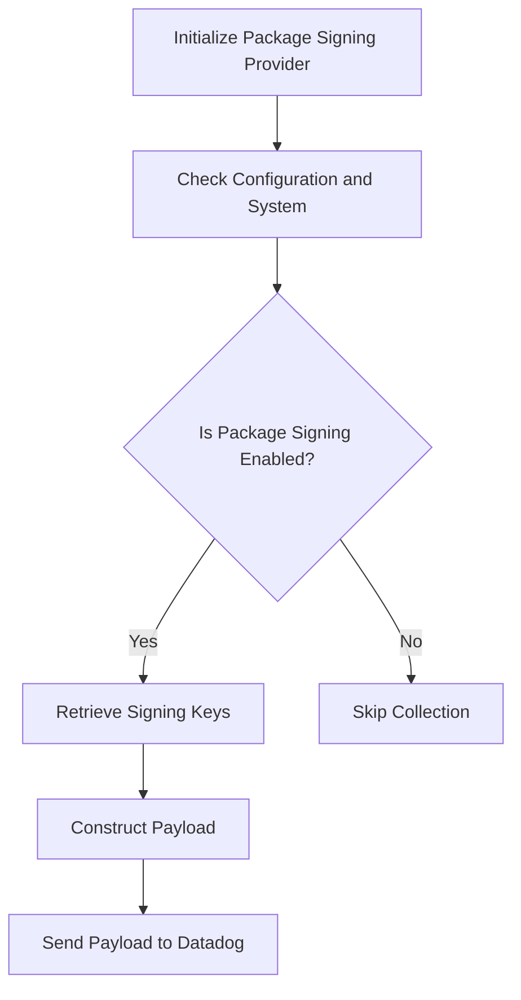

# Overview of Package Signing Implementation

The <SwmToken path="comp/metadata/packagesigning/packagesigningimpl/packagesigning.go" pos="6:4:4" line-data="// Package packagesigningimpl implements the inventory signing component, to collect package signing keys.">`packagesigningimpl`</SwmToken> package is responsible for generating the 'signing' metadata payload for Datadog inventory (REDAPL). This package collects package signing keys and constructs the necessary payload to be sent to Datadog.

# Payload Type

The <SwmToken path="comp/metadata/packagesigning/packagesigningimpl/packagesigning.go" pos="45:2:2" line-data="// Payload handles the JSON unmarshalling of the metadata payload">`Payload`</SwmToken> type handles the JSON unmarshalling of the metadata payload, including the hostname, timestamp, signing metadata, and UUID.

<SwmSnippet path="/comp/metadata/packagesigning/packagesigningimpl/packagesigning.go" line="45">

---

The <SwmToken path="comp/metadata/packagesigning/packagesigningimpl/packagesigning.go" pos="45:2:2" line-data="// Payload handles the JSON unmarshalling of the metadata payload">`Payload`</SwmToken> struct is defined to handle the JSON unmarshalling of the metadata payload.

```go
// Payload handles the JSON unmarshalling of the metadata payload
type Payload struct {
	Hostname  string           `json:"hostname"`
	Timestamp int64            `json:"timestamp"`
	Metadata  *signingMetadata `json:"signing_metadata"`
	UUID      string           `json:"uuid"`
}
```

---

</SwmSnippet>

# Initializing the Package Signing Provider

The <SwmToken path="comp/metadata/packagesigning/packagesigningimpl/packagesigning.go" pos="40:5:5" line-data="		fx.Provide(newPackageSigningProvider))">`newPackageSigningProvider`</SwmToken> function initializes the package signing provider, setting up the necessary dependencies and determining if the package signing telemetry should be collected based on the package manager and system configuration.

# Retrieving Signing Keys

The <SwmToken path="comp/metadata/packagesigning/packagesigningimpl/packagesigning.go" pos="164:9:9" line-data="func (is *pkgSigning) getData() []signingKey {">`getData`</SwmToken> method in <SwmToken path="comp/metadata/packagesigning/packagesigningimpl/packagesigning.go" pos="164:6:6" line-data="func (is *pkgSigning) getData() []signingKey {">`pkgSigning`</SwmToken> retrieves the signing keys based on the detected package manager, supporting APT, YUM, DNF, and Zypper package managers.

<SwmSnippet path="/comp/metadata/packagesigning/packagesigningimpl/packagesigning.go" line="164">

---

The <SwmToken path="comp/metadata/packagesigning/packagesigningimpl/packagesigning.go" pos="164:9:9" line-data="func (is *pkgSigning) getData() []signingKey {">`getData`</SwmToken> method retrieves the signing keys for the supported package managers.

```go
func (is *pkgSigning) getData() []signingKey {

	transport := httputils.CreateHTTPTransport(is.conf)
	client := &http.Client{Transport: transport}

	switch is.pkgManager {
	case "apt":
		return getAPTKeys(client, is.log)
	case "yum", "dnf", "zypper":
		return getYUMKeys(is.pkgManager, client, is.log)
	default: // should not happen, tested above
		is.log.Info("No supported package manager detected, package signing telemetry will not be collected")
	}
	return nil
}
```

---

</SwmSnippet>

# Constructing the Payload

The <SwmToken path="comp/metadata/packagesigning/packagesigningimpl/packagesigning.go" pos="180:9:9" line-data="func (is *pkgSigning) getPayload() marshaler.JSONMarshaler {">`getPayload`</SwmToken> method in <SwmToken path="comp/metadata/packagesigning/packagesigningimpl/packagesigning.go" pos="164:6:6" line-data="func (is *pkgSigning) getData() []signingKey {">`pkgSigning`</SwmToken> constructs the payload containing the signing metadata, which is then serialized to JSON for further processing.

<SwmSnippet path="/comp/metadata/packagesigning/packagesigningimpl/packagesigning.go" line="180">

---

The <SwmToken path="comp/metadata/packagesigning/packagesigningimpl/packagesigning.go" pos="180:9:9" line-data="func (is *pkgSigning) getPayload() marshaler.JSONMarshaler {">`getPayload`</SwmToken> method constructs the payload with the signing metadata.

```go
func (is *pkgSigning) getPayload() marshaler.JSONMarshaler {

	return &Payload{
		Hostname:  is.hostname,
		Timestamp: time.Now().UnixNano(),
		Metadata:  &signingMetadata{is.getData()},
		UUID:      uuid.GetUUID(),
	}
```

---

</SwmSnippet>

&nbsp;

*This is an auto-generated document by Swimm AI 🌊 and has not yet been verified by a human*

<SwmMeta version="3.0.0" repo-id="Z2l0aHViJTNBJTNBZGF0YWRvZy1hZ2VudCUzQSUzQVN3aW1tLURlbW8=" repo-name="datadog-agent"><sup>Powered by [Swimm](/)</sup></SwmMeta>
