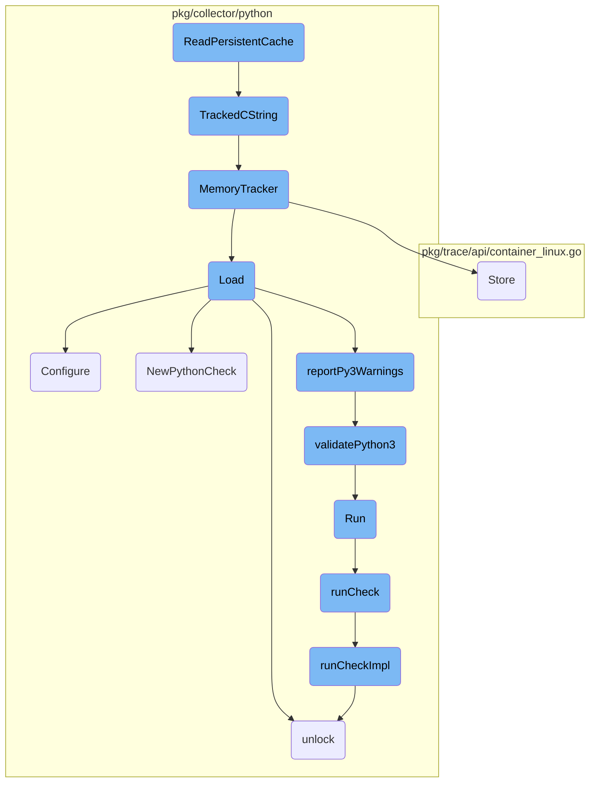
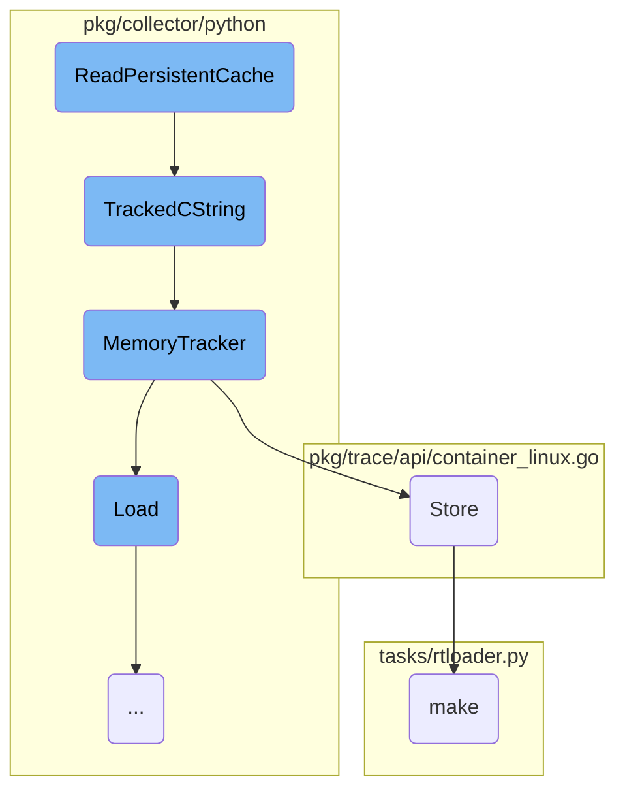
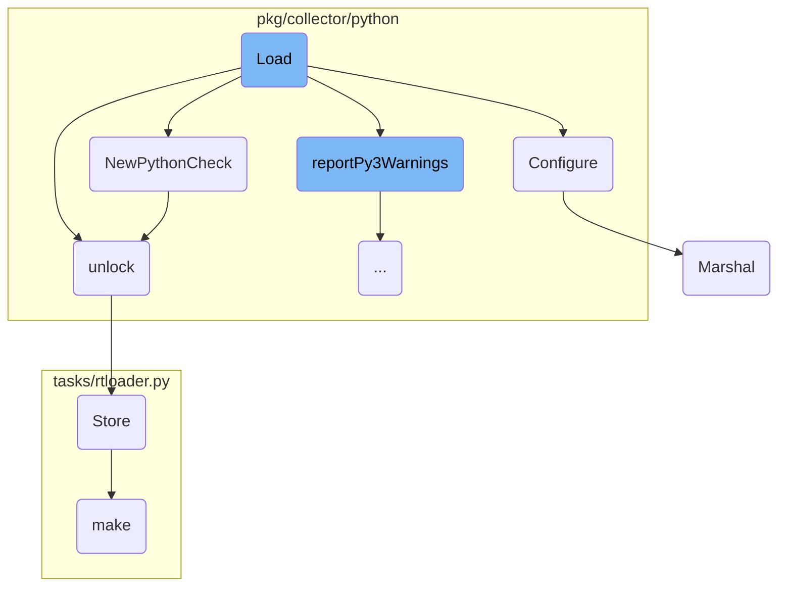
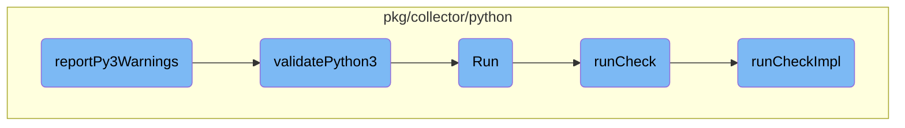

This document provides an overview of the <SwmToken path="pkg/collector/python/datadog_agent.go" pos="190:2:2" line-data="// ReadPersistentCache retrieves a value for one check instance">`ReadPersistentCache`</SwmToken> function, which is responsible for retrieving cached data for a specific check instance. It also covers the related components and their roles in the caching process.

The <SwmToken path="pkg/collector/python/datadog_agent.go" pos="190:2:2" line-data="// ReadPersistentCache retrieves a value for one check instance">`ReadPersistentCache`</SwmToken> function starts by converting a key from a C string to a Go string. It then reads the value from the persistent cache. If there's an error during this process, it logs the error and returns nothing. If successful, it returns the cached data as a tracked C string. The tracked C string is monitored for memory usage, ensuring efficient memory management. The memory tracker logs memory operations and updates metrics related to memory usage. The cache is periodically cleared to prevent it from growing indefinitely.

Here is a high level diagram of the flow, showing only the most important functions:



# Flow drill down

First, we'll zoom into this section of the flow:



<SwmSnippet path="/pkg/collector/python/datadog_agent.go" line="190">

---

## <SwmToken path="pkg/collector/python/datadog_agent.go" pos="190:2:2" line-data="// ReadPersistentCache retrieves a value for one check instance">`ReadPersistentCache`</SwmToken>

The <SwmToken path="pkg/collector/python/datadog_agent.go" pos="190:2:2" line-data="// ReadPersistentCache retrieves a value for one check instance">`ReadPersistentCache`</SwmToken> function retrieves a value for a specific check instance. It converts the key from a C string to a Go string, reads the value from the persistent cache, and handles any errors that occur during this process. If successful, it returns the cached data as a tracked C string using the <SwmToken path="pkg/collector/python/datadog_agent.go" pos="201:3:3" line-data="	return TrackedCString(data)">`TrackedCString`</SwmToken> function.

```go
// ReadPersistentCache retrieves a value for one check instance
// Indirectly used by the C function `read_persistent_cache` that's mapped to `datadog_agent.read_persistent_cache`.
//
//export ReadPersistentCache
func ReadPersistentCache(key *C.char) *C.char {
	keyName := C.GoString(key)
	data, err := persistentcache.Read(keyName)
	if err != nil {
		log.Errorf("Failed to read cache %s: %s", keyName, err)
		return nil
	}
	return TrackedCString(data)
}
```

---

</SwmSnippet>

<SwmSnippet path="/pkg/collector/python/memory.go" line="116">

---

## <SwmToken path="pkg/collector/python/memory.go" pos="117:2:2" line-data="func TrackedCString(str string) *C.char {">`TrackedCString`</SwmToken>

The <SwmToken path="pkg/collector/python/memory.go" pos="117:2:2" line-data="func TrackedCString(str string) *C.char {">`TrackedCString`</SwmToken> function converts a Go string to a C string and tracks its memory allocation if memory tracking is enabled. This helps in monitoring and managing memory usage within the application.

```go
//nolint:revive // TODO(AML) Fix revive linter
func TrackedCString(str string) *C.char {
	cstr := C.CString(str)

	// TODO(memory-tracking): track the origin of the string (for example check name)
	if config.Datadog().GetBool("memtrack_enabled") {
		MemoryTracker(unsafe.Pointer(cstr), C.size_t(len(str)+1), C.DATADOG_AGENT_RTLOADER_ALLOCATION)
	}

	return cstr
}
```

---

</SwmSnippet>

<SwmSnippet path="/pkg/collector/python/memory.go" line="69">

---

## <SwmToken path="pkg/collector/python/memory.go" pos="69:2:2" line-data="// MemoryTracker is the method exposed to the RTLoader for memory tracking">`MemoryTracker`</SwmToken>

The <SwmToken path="pkg/collector/python/memory.go" pos="69:2:2" line-data="// MemoryTracker is the method exposed to the RTLoader for memory tracking">`MemoryTracker`</SwmToken> function is used for tracking memory allocations and deallocations. It logs memory operations and updates various metrics related to memory usage, such as the number of allocations, frees, and the amount of memory currently in use.

```go
// MemoryTracker is the method exposed to the RTLoader for memory tracking
//
//export MemoryTracker
func MemoryTracker(ptr unsafe.Pointer, sz C.size_t, op C.rtloader_mem_ops_t) {
	// run sync for reliability reasons

	// This check looks redundant since the log level is also checked in pkg/util/log,
	// but from profiling, even passing these vars through as arguments allocates to the heap.
	// This is an optimization to avoid even evaluating the `Tracef` call if the trace log
	// level is not enabled.
	if log.ShouldLog(seelog.TraceLvl) {
		log.Tracef("Memory Tracker - ptr: %v, sz: %v, op: %v", ptr, sz, op)
	}
	switch op {
	case C.DATADOG_AGENT_RTLOADER_ALLOCATION:
		pointerCache.Store(ptr, sz)
		allocations.Add(1)
		tlmAllocations.Inc()
		allocatedBytes.Add(int64(sz))
		tlmAllocatedBytes.Add(float64(sz))
		inuseBytes.Add(int64(sz))
```

---

</SwmSnippet>

<SwmSnippet path="/pkg/trace/api/container_linux.go" line="346">

---

## Store

The <SwmToken path="pkg/trace/api/container_linux.go" pos="346:2:2" line-data="// Store sets data in the cache, it also clears the cache if the gcInterval has passed">`Store`</SwmToken> function sets data in the cache and clears the cache if a specified garbage collection interval has passed. It ensures that the cache is kept up-to-date and does not grow indefinitely by periodically clearing old entries.

```go
// Store sets data in the cache, it also clears the cache if the gcInterval has passed
func (c *Cache) Store(currentTime time.Time, key string, value interface{}, err error) {
	c.cacheLock.Lock()
	defer c.cacheLock.Unlock()

	if currentTime.Sub(c.gcTimestamp) > c.gcInterval {
		c.cache = make(map[string]cacheEntry, len(c.cache))
		c.gcTimestamp = currentTime
	}

	c.cache[key] = cacheEntry{value: value, timestamp: currentTime, err: err}
}
```

---

</SwmSnippet>

<SwmSnippet path="/tasks/rtloader.py" line="60">

---

## make

The <SwmToken path="tasks/rtloader.py" pos="60:2:2" line-data="def make(ctx, install_prefix=None, python_runtimes=&#39;3&#39;, cmake_options=&#39;&#39;):">`make`</SwmToken> function in <SwmPath>[tasks/rtloader.py](tasks/rtloader.py)</SwmPath> is responsible for building the rtloader component. It configures the build settings, handles different Python runtime versions, and performs an out-of-source build using <SwmToken path="tasks/rtloader.py" pos="40:1:1" line-data="    CMake is not regenerated when we change an option. This function detect the">`CMake`</SwmToken>. This function ensures that the rtloader is built correctly with the specified options and settings.

```python
def make(ctx, install_prefix=None, python_runtimes='3', cmake_options=''):
    dev_path = get_dev_path()

    if cmake_options.find("-G") == -1:
        cmake_options += " -G \"Unix Makefiles\""

    cmake_args = cmake_options + f" -DBUILD_DEMO:BOOL=OFF -DCMAKE_INSTALL_PREFIX:PATH={install_prefix or dev_path}"

    python_runtimes = python_runtimes.split(',')

    settings = {
        "DISABLE_PYTHON2:BOOL": "OFF",
        "DISABLE_PYTHON3:BOOL": "OFF",
    }
    if '2' not in python_runtimes:
        settings["DISABLE_PYTHON2:BOOL"] = "ON"
    if '3' not in python_runtimes:
        settings["DISABLE_PYTHON3:BOOL"] = "ON"

    rtloader_build_path = get_rtloader_build_path()

```

---

</SwmSnippet>

Now, lets zoom into this section of the flow:



<SwmSnippet path="/pkg/collector/python/loader.go" line="110">

---

## Loading Python Checks

The <SwmToken path="pkg/collector/python/loader.go" pos="110:2:2" line-data="// Load tries to import a Python module with the same name found in config.Name, searches for">`Load`</SwmToken> function is responsible for importing a Python module specified in the configuration, searching for subclasses of the <SwmToken path="pkg/collector/python/loader.go" pos="111:8:8" line-data="// subclasses of the AgentCheck class and returns the corresponding Check">`AgentCheck`</SwmToken> class, and returning the corresponding check. It handles <SwmToken path="pkg/collector/python/loader.go" pos="127:3:5" line-data="	// Platform-specific preparation">`Platform-specific`</SwmToken> preparations, checks for module versions, and ensures Python 3 compatibility. If the module is successfully loaded, it proceeds to configure the check.

```go
// Load tries to import a Python module with the same name found in config.Name, searches for
// subclasses of the AgentCheck class and returns the corresponding Check
func (cl *PythonCheckLoader) Load(senderManager sender.SenderManager, config integration.Config, instance integration.Data) (check.Check, error) {
	if rtloader == nil {
		return nil, fmt.Errorf("python is not initialized")
	}
	moduleName := config.Name
	// FastDigest is used as check id calculation does not account for tags order
	configDigest := config.FastDigest()

	// Lock the GIL
	glock, err := newStickyLock()
	if err != nil {
		return nil, err
	}
	defer glock.unlock()

	// Platform-specific preparation
	if !agentConfig.Datadog().GetBool("win_skip_com_init") {
		log.Debugf("Performing platform loading prep")
		err = platformLoaderPrep()
```

---

</SwmSnippet>

<SwmSnippet path="/pkg/collector/python/check.go" line="236">

---

## Configuring Python Checks

The <SwmToken path="pkg/collector/python/check.go" pos="236:2:2" line-data="// Configure the Python check from YAML data">`Configure`</SwmToken> function sets up the Python check using YAML data. It generates a check ID, sets service configurations, and handles collection intervals and hostname settings. It also ensures the check instance is properly initialized and configured, adding any necessary tags and finalizing the setup.

```go
// Configure the Python check from YAML data
//
//nolint:revive // TODO(AML) Fix revive linter
func (c *PythonCheck) Configure(senderManager sender.SenderManager, integrationConfigDigest uint64, data integration.Data, initConfig integration.Data, source string) error {
	// Generate check ID
	c.id = checkid.BuildID(c.String(), integrationConfigDigest, data, initConfig)

	commonGlobalOptions := integration.CommonGlobalConfig{}
	if err := yaml.Unmarshal(initConfig, &commonGlobalOptions); err != nil {
		log.Errorf("invalid init_config section for check %s: %s", string(c.id), err)
		return err
	}

	// Set service for this check
	if len(commonGlobalOptions.Service) > 0 {
		s, err := c.senderManager.GetSender(c.id)
		if err != nil {
			log.Errorf("failed to retrieve a sender for check %s: %s", string(c.id), err)
		} else {
			s.SetCheckService(commonGlobalOptions.Service)
		}
```

---

</SwmSnippet>

<SwmSnippet path="/pkg/collector/python/check.go" line="68">

---

## Creating a New Python Check

The <SwmToken path="pkg/collector/python/check.go" pos="68:2:2" line-data="// NewPythonCheck conveniently creates a PythonCheck instance">`NewPythonCheck`</SwmToken> function creates a new instance of <SwmToken path="pkg/collector/python/check.go" pos="68:10:10" line-data="// NewPythonCheck conveniently creates a PythonCheck instance">`PythonCheck`</SwmToken>. It initializes the check with the provided sender manager, module name, and class, and sets default values for the check's interval and telemetry settings.

```go
// NewPythonCheck conveniently creates a PythonCheck instance
func NewPythonCheck(senderManager sender.SenderManager, name string, class *C.rtloader_pyobject_t) (*PythonCheck, error) {
	glock, err := newStickyLock()
	if err != nil {
		return nil, err
	}

	C.rtloader_incref(rtloader, class) // own the ref
	glock.unlock()

	pyCheck := &PythonCheck{
		senderManager: senderManager,
		ModuleName:    name,
		class:         class,
		interval:      defaults.DefaultCheckInterval,
		lastWarnings:  []error{},
		telemetry:     utils.IsCheckTelemetryEnabled(name, config.Datadog()),
	}
	runtime.SetFinalizer(pyCheck, pythonCheckFinalizer)

	return pyCheck, nil
```

---

</SwmSnippet>

<SwmSnippet path="/pkg/collector/python/helpers.go" line="109">

---

## Unlocking the GIL

The <SwmToken path="pkg/collector/python/helpers.go" pos="109:2:2" line-data="// unlock deregisters the current thread from the interpreter, unlocks the GIL">`unlock`</SwmToken> function deregisters the current thread from the interpreter, unlocks the Global Interpreter Lock (GIL), and detaches the goroutine from the current thread. This ensures that the GIL is properly managed and prevents potential deadlocks.

```go
// unlock deregisters the current thread from the interpreter, unlocks the GIL
// and detaches the goroutine from the current thread.
// Thread safe ; noop when called on an already-unlocked stickylock.
func (sl *stickyLock) unlock() {
	sl.locked.Store(false)

	pyDestroyLock.RLock()
	if rtloader != nil {
		C.release_gil(rtloader, sl.gstate)
	}
	pyDestroyLock.RUnlock()

	runtime.UnlockOSThread()
}
```

---

</SwmSnippet>

<SwmSnippet path="/pkg/process/encoding/protobuf.go" line="21">

---

## Marshaling Process Stats

The <SwmToken path="pkg/process/encoding/protobuf.go" pos="21:2:2" line-data="// Marshal serializes stats by PID into bytes">`Marshal`</SwmToken> function serializes process statistics by PID into bytes. It creates a payload containing the stats, iterates over the provided stats map, and populates the payload with the relevant data. The payload is then serialized into a byte array using the protobuf library.

```go
// Marshal serializes stats by PID into bytes
func (protoSerializer) Marshal(stats map[int32]*procutil.StatsWithPerm) ([]byte, error) {
	payload := &model.ProcStatsWithPermByPID{
		StatsByPID: make(map[int32]*model.ProcStatsWithPerm),
	}
	for pid, s := range stats {
		stat := statPool.Get()
		stat.OpenFDCount = s.OpenFdCount
		stat.ReadCount = s.IOStat.ReadCount
		stat.WriteCount = s.IOStat.WriteCount
		stat.ReadBytes = s.IOStat.ReadBytes
		stat.WriteBytes = s.IOStat.WriteBytes
		payload.StatsByPID[pid] = stat
	}

	buf, err := proto.Marshal(payload)
	returnToPool(payload.StatsByPID)
	return buf, err
}
```

---

</SwmSnippet>

Now, lets zoom into this section of the flow:



<SwmSnippet path="/pkg/collector/python/loader.go" line="262">

---

## <SwmToken path="pkg/collector/python/loader.go" pos="262:2:2" line-data="// reportPy3Warnings runs the a7 linter and exports the result in both expvar">`reportPy3Warnings`</SwmToken>

The function <SwmToken path="pkg/collector/python/loader.go" pos="262:2:2" line-data="// reportPy3Warnings runs the a7 linter and exports the result in both expvar">`reportPy3Warnings`</SwmToken> is responsible for running the <SwmToken path="pkg/collector/python/loader.go" pos="262:8:8" line-data="// reportPy3Warnings runs the a7 linter and exports the result in both expvar">`a7`</SwmToken> linter and exporting the results. It first checks if the check has already been linted to avoid redundant operations. If the check is not already linted, it proceeds to run the linter. Depending on the Python version, it either sets the status to Python 3 or runs the <SwmToken path="pkg/collector/python/py3_checker.go" pos="35:2:2" line-data="// validatePython3 checks that a check can run on python 3.">`validatePython3`</SwmToken> function to perform linting. The results are then logged and added to the aggregator to be sent on every flush.

```go
// reportPy3Warnings runs the a7 linter and exports the result in both expvar
// and the aggregator (as extra series)
func reportPy3Warnings(checkName string, checkFilePath string) {
	// check if the check has already been linted
	py3LintedLock.Lock()
	_, found := py3Linted[checkName]
	if found {
		py3LintedLock.Unlock()
		return
	}
	py3Linted[checkName] = struct{}{}
	py3LintedLock.Unlock()

	status := a7TagUnknown
	metricValue := 0.0
	if checkFilePath != "" {
		// __file__ return the .pyc file path
		if strings.HasSuffix(checkFilePath, ".pyc") {
			checkFilePath = checkFilePath[:len(checkFilePath)-1]
		}

```

---

</SwmSnippet>

<SwmSnippet path="/pkg/collector/python/py3_checker.go" line="35">

---

## <SwmToken path="pkg/collector/python/py3_checker.go" pos="35:2:2" line-data="// validatePython3 checks that a check can run on python 3.">`validatePython3`</SwmToken>

The function <SwmToken path="pkg/collector/python/py3_checker.go" pos="35:2:2" line-data="// validatePython3 checks that a check can run on python 3.">`validatePython3`</SwmToken> checks if a module can run on Python 3 by using pylint with specific parameters. It captures the output and errors, processes the warnings, and returns them. This function is CPU and memory-intensive, so it is designed to run only one instance at a time to avoid resource spikes.

```go
// validatePython3 checks that a check can run on python 3.
//
//nolint:revive // TODO(AML) Fix revive linter
func validatePython3(moduleName string, modulePath string) ([]string, error) {
	ctx, cancel := context.WithTimeout(context.Background(), linterTimeout)
	defer cancel()

	cmd := exec.CommandContext(ctx, pythonBinPath, "-m", "pylint", "-f", "json", "--py3k", "-d", "W1618", "--persistent", "no", "--exit-zero", modulePath)

	stdout := bytes.Buffer{}
	stderr := bytes.Buffer{}
	cmd.Stdout = &stdout
	cmd.Stderr = &stderr

	if err := cmd.Run(); err != nil {
		return nil, fmt.Errorf("error running the linter on (%s): %s", err, stderr.String())
	}

	res := []string{}
	if stdout.Len() == 0 {
		// No warning
```

---

</SwmSnippet>

<SwmSnippet path="/pkg/collector/python/check.go" line="138">

---

## Run

The <SwmToken path="pkg/collector/python/check.go" pos="138:2:2" line-data="// Run a Python check">`Run`</SwmToken> method in the <SwmToken path="pkg/collector/python/check.go" pos="139:6:6" line-data="func (c *PythonCheck) Run() error {">`PythonCheck`</SwmToken> struct initiates the execution of a Python check by calling the <SwmToken path="pkg/collector/python/check.go" pos="140:5:5" line-data="	return c.runCheck(true)">`runCheck`</SwmToken> method with the <SwmToken path="pkg/collector/python/check.go" pos="91:11:11" line-data="func (c *PythonCheck) runCheckImpl(commitMetrics bool) error {">`commitMetrics`</SwmToken> flag set to true.

```go
// Run a Python check
func (c *PythonCheck) Run() error {
	return c.runCheck(true)
}
```

---

</SwmSnippet>

<SwmSnippet path="/pkg/collector/python/check.go" line="128">

---

## <SwmToken path="pkg/collector/python/check.go" pos="128:9:9" line-data="func (c *PythonCheck) runCheck(commitMetrics bool) error {">`runCheck`</SwmToken>

The <SwmToken path="pkg/collector/python/check.go" pos="128:9:9" line-data="func (c *PythonCheck) runCheck(commitMetrics bool) error {">`runCheck`</SwmToken> method sets up the context and labels for profiling, then calls the <SwmToken path="pkg/collector/python/check.go" pos="133:7:7" line-data="		err = c.runCheckImpl(commitMetrics)">`runCheckImpl`</SwmToken> method to perform the actual check execution.

```go
func (c *PythonCheck) runCheck(commitMetrics bool) error {
	ctx := context.Background()
	var err error
	idStr := string(c.id)
	pprof.Do(ctx, pprof.Labels("check_id", idStr), func(ctx context.Context) {
		err = c.runCheckImpl(commitMetrics)
	})
	return err
}
```

---

</SwmSnippet>

<SwmSnippet path="/pkg/collector/python/check.go" line="91">

---

## <SwmToken path="pkg/collector/python/check.go" pos="91:9:9" line-data="func (c *PythonCheck) runCheckImpl(commitMetrics bool) error {">`runCheckImpl`</SwmToken>

The <SwmToken path="pkg/collector/python/check.go" pos="91:9:9" line-data="func (c *PythonCheck) runCheckImpl(commitMetrics bool) error {">`runCheckImpl`</SwmToken> method locks the Global Interpreter Lock (GIL), runs the Python check, commits the metrics if required, and retrieves any warnings generated during the check execution. It handles errors and ensures proper resource cleanup.

```go
func (c *PythonCheck) runCheckImpl(commitMetrics bool) error {
	// Lock the GIL and release it at the end of the run
	gstate, err := newStickyLock()
	if err != nil {
		return err
	}
	defer gstate.unlock()

	log.Debugf("Running python check %s (version: '%s', id: '%s')", c.ModuleName, c.version, c.id)

	cResult := C.run_check(rtloader, c.instance)
	if cResult == nil {
		if err := getRtLoaderError(); err != nil {
			return err
		}
		return fmt.Errorf("An error occurred while running python check %s", c.ModuleName)
	}
	defer C.rtloader_free(rtloader, unsafe.Pointer(cResult))

	if commitMetrics {
		s, err := c.senderManager.GetSender(c.ID())
```

---

</SwmSnippet>

&nbsp;

*This is an auto-generated document by Swimm AI 🌊 and has not yet been verified by a human*

<SwmMeta version="3.0.0" repo-id="Z2l0aHViJTNBJTNBZGF0YWRvZy1hZ2VudCUzQSUzQVN3aW1tLURlbW8=" repo-name="datadog-agent"><sup>Powered by [Swimm](/)</sup></SwmMeta>
