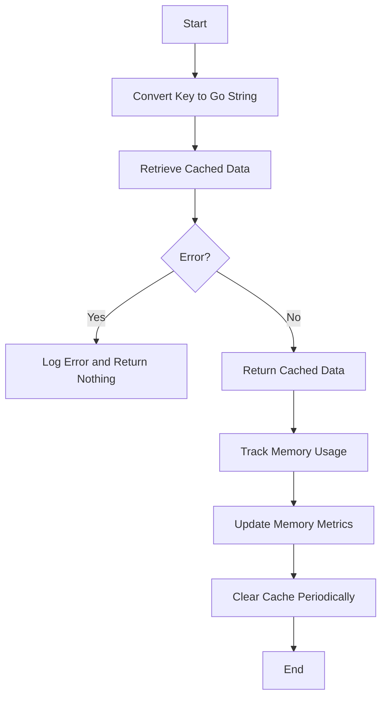

This document will cover the Persistent Cache Retrieval Flow, which includes:

1. Retrieving cached data
2. Memory management
3. Error handling
4. Cache maintenance.

Technical document: <SwmLink doc-title="Persistent Cache Retrieval Flow">[Persistent Cache Retrieval Flow](/.swm/persistent-cache-retrieval-flow.1kft9rvu.sw.md)</SwmLink>

# [Retrieving cached data](https://app.swimm.io/repos/Z2l0aHViJTNBJTNBZGF0YWRvZy1hZ2VudCUzQSUzQVN3aW1tLURlbW8=/docs/1kft9rvu#readpersistentcache)

The process begins by converting the key from a C string to a Go string. This conversion is necessary because the cache system operates in Go, and the key needs to be in a compatible format. Once the key is converted, the system attempts to read the value associated with this key from the persistent cache.

# [Memory management](https://app.swimm.io/repos/Z2l0aHViJTNBJTNBZGF0YWRvZy1hZ2VudCUzQSUzQVN3aW1tLURlbW8=/docs/1kft9rvu#trackedcstring)

If the data retrieval is successful, the cached data is returned as a tracked C string. This tracking is crucial for monitoring memory usage. The memory tracker logs memory operations and updates metrics related to memory usage, ensuring that the application remains efficient and does not consume excessive memory.

# [Error handling](https://app.swimm.io/repos/Z2l0aHViJTNBJTNBZGF0YWRvZy1hZ2VudCUzQSUzQVN3aW1tLURlbW8=/docs/1kft9rvu#readpersistentcache)

If there is an error during the data retrieval process, the system logs the error and returns nothing. This logging helps in diagnosing issues and understanding why the data retrieval failed. It ensures that the system can handle errors gracefully without crashing or causing further issues.

# [Cache maintenance](https://app.swimm.io/repos/Z2l0aHViJTNBJTNBZGF0YWRvZy1hZ2VudCUzQSUzQVN3aW1tLURlbW8=/docs/1kft9rvu#store)

To prevent the cache from growing indefinitely, it is periodically cleared. This maintenance step ensures that old or irrelevant data does not occupy space in the cache, keeping it efficient and manageable. The system checks if a specified garbage collection interval has passed and clears the cache accordingly.

&nbsp;

*This is an auto-generated document by Swimm AI 🌊 and has not yet been verified by a human*

<SwmMeta version="3.0.0" repo-id="Z2l0aHViJTNBJTNBZGF0YWRvZy1hZ2VudCUzQSUzQVN3aW1tLURlbW8=" repo-name="datadog-agent">Powered by [Swimm](/)</SwmMeta>
