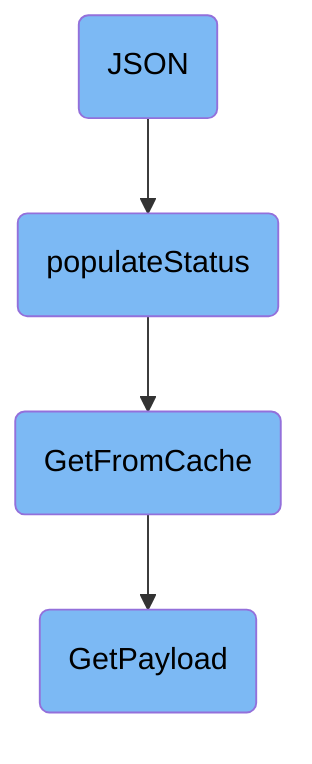

In this document, we will explain the process of populating a status map with hostname statistics and metadata. The process involves several steps: calling the JSON function, populating the status map, retrieving data from the cache, and building a metadata payload.

The flow starts with the JSON function, which calls another function to fill in the status map. This function retrieves hostname statistics and metadata, converts them into a suitable format, and adds them to the status map. If the data is not found in the cache, it creates a new payload to ensure fresh data is always available.

# Flow drill down



<SwmSnippet path="/pkg/status/clusteragent/hostname/status.go" line="48">

---

## JSON

The <SwmToken path="pkg/status/clusteragent/hostname/status.go" pos="48:2:2" line-data="// JSON populates the status map">`JSON`</SwmToken> function is responsible for populating the status map. It calls the <SwmToken path="pkg/status/clusteragent/hostname/status.go" pos="50:1:1" line-data="	populateStatus(stats, p.config)">`populateStatus`</SwmToken> function to fill in the details and then returns nil.

```go
// JSON populates the status map
func (p Provider) JSON(_ bool, stats map[string]interface{}) error {
	populateStatus(stats, p.config)

	return nil
}
```

---

</SwmSnippet>

<SwmSnippet path="/pkg/status/clusteragent/hostname/status.go" line="73">

---

## <SwmToken path="pkg/status/clusteragent/hostname/status.go" pos="73:2:2" line-data="func populateStatus(stats map[string]interface{}, config config.Component) {">`populateStatus`</SwmToken>

The <SwmToken path="pkg/status/clusteragent/hostname/status.go" pos="73:2:2" line-data="func populateStatus(stats map[string]interface{}, config config.Component) {">`populateStatus`</SwmToken> function takes a status map and a configuration object as parameters. It retrieves the hostname statistics and metadata, unmarshals them into maps, and adds them to the status map. This function ensures that the status map is populated with the necessary hostname and metadata information.

```go
func populateStatus(stats map[string]interface{}, config config.Component) {
	hostnameStatsJSON := []byte(expvar.Get("hostname").String())
	hostnameStats := make(map[string]interface{})
	json.Unmarshal(hostnameStatsJSON, &hostnameStats) //nolint:errcheck
	stats["hostnameStats"] = hostnameStats

	hostMetadata := hostMetadataUtils.GetFromCache(context.TODO(), config)
	metadataStats := make(map[string]interface{})
	hostMetadataBytes, _ := json.Marshal(hostMetadata)
	json.Unmarshal(hostMetadataBytes, &metadataStats) //nolint:errcheck

	stats["metadata"] = metadataStats
}
```

---

</SwmSnippet>

<SwmSnippet path="/comp/metadata/host/hostimpl/utils/host.go" line="201">

---

## <SwmToken path="comp/metadata/host/hostimpl/utils/host.go" pos="201:2:2" line-data="// GetFromCache returns the payload from the cache if it exists, otherwise it creates it.">`GetFromCache`</SwmToken>

The <SwmToken path="comp/metadata/host/hostimpl/utils/host.go" pos="201:2:2" line-data="// GetFromCache returns the payload from the cache if it exists, otherwise it creates it.">`GetFromCache`</SwmToken> function attempts to retrieve the payload from the cache. If the payload is not found in the cache, it calls the <SwmToken path="comp/metadata/host/hostimpl/utils/host.go" pos="206:3:3" line-data="		return GetPayload(ctx, conf)">`GetPayload`</SwmToken> function to create a new payload. This function ensures that the metadata reporting always grabs fresh data, while other uses can rely on cached data.

```go
// GetFromCache returns the payload from the cache if it exists, otherwise it creates it.
// The metadata reporting should always grab it fresh. Any other uses, e.g. status, should use this
func GetFromCache(ctx context.Context, conf config.Reader) *Payload {
	data, found := cache.Cache.Get(hostCacheKey)
	if !found {
		return GetPayload(ctx, conf)
	}
	return data.(*Payload)
}
```

---

</SwmSnippet>

<SwmSnippet path="/comp/metadata/host/hostimpl/utils/host.go" line="169">

---

## <SwmToken path="comp/metadata/host/hostimpl/utils/host.go" pos="169:2:2" line-data="// GetPayload builds a metadata payload every time is called.">`GetPayload`</SwmToken>

The <SwmToken path="comp/metadata/host/hostimpl/utils/host.go" pos="169:2:2" line-data="// GetPayload builds a metadata payload every time is called.">`GetPayload`</SwmToken> function builds a metadata payload every time it is called. It collects various pieces of data, such as hostname, system stats, and network metadata, and constructs a <SwmToken path="comp/metadata/host/hostimpl/utils/host.go" pos="169:10:10" line-data="// GetPayload builds a metadata payload every time is called.">`payload`</SwmToken> object. This function also caches the metadata for use in other payloads, ensuring that the data is readily available for subsequent requests.

```go
// GetPayload builds a metadata payload every time is called.
// Some data is collected only once, some is cached, some is collected at every call.
func GetPayload(ctx context.Context, conf config.Reader) *Payload {
	hostnameData, err := hostname.GetWithProvider(ctx)
	if err != nil {
		log.Errorf("Error grabbing hostname for status: %v", err)
		hostnameData = hostname.Data{Hostname: "unknown", Provider: "unknown"}
	}

	meta := GetMeta(ctx, conf)
	meta.Hostname = hostnameData.Hostname

	p := &Payload{
		Os:            osName,
		AgentFlavor:   flavor.GetFlavor(),
		PythonVersion: python.GetPythonInfo(),
		SystemStats:   getSystemStats(),
		Meta:          meta,
		HostTags:      hosttags.Get(ctx, false, conf),
		ContainerMeta: containerMetadata.Get(1 * time.Second),
		NetworkMeta:   getNetworkMeta(ctx),
```

---

</SwmSnippet>

&nbsp;

*This is an auto-generated document by Swimm AI 🌊 and has not yet been verified by a human*

<SwmMeta version="3.0.0" repo-id="Z2l0aHViJTNBJTNBZGF0YWRvZy1hZ2VudCUzQSUzQVN3aW1tLURlbW8=" repo-name="datadog-agent"><sup>Powered by [Swimm](/)</sup></SwmMeta>
