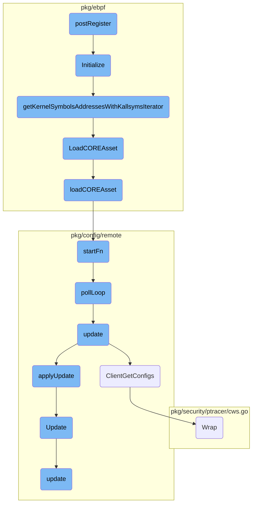

In this document, we will explain the `postRegister` process. This process involves several steps, starting from initialization, retrieving kernel symbol addresses, loading <SwmToken path="pkg/ebpf/co_re.go" pos="34:19:21" line-data="// LoadCOREAsset attempts to find kernel BTF, reads the CO-RE object file, and then calls the callback function with the">`CO-RE`</SwmToken> assets, starting the poll loop, and finally updating configurations.

The flow starts with initializing the necessary components, followed by retrieving kernel symbol addresses. Next, it loads the <SwmToken path="pkg/ebpf/co_re.go" pos="34:19:21" line-data="// LoadCOREAsset attempts to find kernel BTF, reads the CO-RE object file, and then calls the callback function with the">`CO-RE`</SwmToken> assets required for the process. After that, it starts a poll loop to continuously check for updates. Finally, it updates the configurations based on the data fetched during the poll loop.

# Flow drill down



<SwmSnippet path="/pkg/ebpf/lockcontention.go" line="284">

---

## Initialization

The <SwmToken path="pkg/ebpf/lockcontention.go" pos="284:2:2" line-data="// Initialize will collect all the memory ranges we wish to monitor in our lock stats eBPF programs">`Initialize`</SwmToken> function is responsible for setting up the memory ranges to be monitored by the <SwmToken path="pkg/ebpf/lockcontention.go" pos="284:32:32" line-data="// Initialize will collect all the memory ranges we wish to monitor in our lock stats eBPF programs">`eBPF`</SwmToken> programs. It collects these ranges by iterating over file descriptors representing resources of interest, such as <SwmToken path="pkg/ebpf/lockcontention.go" pos="284:32:32" line-data="// Initialize will collect all the memory ranges we wish to monitor in our lock stats eBPF programs">`eBPF`</SwmToken> maps. This setup is crucial for tracking locks taken by <SwmToken path="pkg/ebpf/lockcontention.go" pos="284:32:32" line-data="// Initialize will collect all the memory ranges we wish to monitor in our lock stats eBPF programs">`eBPF`</SwmToken> programs.

```go
// Initialize will collect all the memory ranges we wish to monitor in our lock stats eBPF programs
// These memory ranges correspond to locks taken by eBPF programs and are collected by walking the
// fds representing the resource of interest, for example an eBPF map.
func (l *LockContentionCollector) Initialize(trackAllResources bool) error {
	var name string
	var err error

	l.mtx.Lock()
	defer l.mtx.Unlock()

	if l.initialized {
		return nil
	}

	l.trackedLockMemRanges = make(map[LockRange]*mapStats)
	maps := make(map[uint32]*targetMap)

	mapid := ebpf.MapID(0)
	for mapid, err = ebpf.MapGetNextID(mapid); err == nil; mapid, err = ebpf.MapGetNextID(mapid) {
		mp, err := ebpf.NewMapFromID(mapid)
		if err != nil {
```

---

</SwmSnippet>

<SwmSnippet path="/pkg/ebpf/lockcontention.go" line="548">

---

## Kernel Symbol Address Retrieval

The <SwmToken path="pkg/ebpf/lockcontention.go" pos="548:2:2" line-data="func getKernelSymbolsAddressesWithKallsymsIterator(kernelAddresses ...string) (map[string]uint64, error) {">`getKernelSymbolsAddressesWithKallsymsIterator`</SwmToken> function retrieves kernel symbol addresses using a BPF iterator. This is essential for the <SwmToken path="pkg/ebpf/lockcontention.go" pos="552:8:8" line-data="		collectionSpec, err := ebpf.LoadCollectionSpecFromReader(bc)">`ebpf`</SwmToken> programs to correctly monitor and interact with kernel symbols.

```go
func getKernelSymbolsAddressesWithKallsymsIterator(kernelAddresses ...string) (map[string]uint64, error) {
	var prog ksymIterProgram

	if err := LoadCOREAsset(ksymsIterBpfObjectFile, func(bc bytecode.AssetReader, managerOptions manager.Options) error {
		collectionSpec, err := ebpf.LoadCollectionSpecFromReader(bc)
		if err != nil {
			return fmt.Errorf("failed to load collection spec: %w", err)
		}

		opts := ebpf.CollectionOptions{
			Programs: ebpf.ProgramOptions{
				LogLevel:    ebpf.LogLevelBranch,
				KernelTypes: managerOptions.VerifierOptions.Programs.KernelTypes,
			},
		}

		if err := collectionSpec.LoadAndAssign(&prog, &opts); err != nil {
			var ve *ebpf.VerifierError
			if errors.As(err, &ve) {
				return fmt.Errorf("verfier error loading collection: %s\n%+v", err, ve)
			}
```

---

</SwmSnippet>

<SwmSnippet path="/pkg/ebpf/co_re.go" line="34">

---

## Loading <SwmToken path="pkg/ebpf/co_re.go" pos="34:19:21" line-data="// LoadCOREAsset attempts to find kernel BTF, reads the CO-RE object file, and then calls the callback function with the">`CO-RE`</SwmToken> Asset

The <SwmToken path="pkg/ebpf/co_re.go" pos="34:2:2" line-data="// LoadCOREAsset attempts to find kernel BTF, reads the CO-RE object file, and then calls the callback function with the">`LoadCOREAsset`</SwmToken> function reads the <SwmToken path="pkg/ebpf/co_re.go" pos="34:19:21" line-data="// LoadCOREAsset attempts to find kernel BTF, reads the CO-RE object file, and then calls the callback function with the">`CO-RE`</SwmToken> object file and calls a callback function with the asset and BTF options <SwmToken path="pkg/ebpf/co_re.go" pos="35:10:12" line-data="// asset and BTF options pre-filled. You should attempt to load the CO-RE program in the startFn func for telemetry to">`pre-filled`</SwmToken>. This function is used to load the <SwmToken path="pkg/ebpf/co_re.go" pos="34:19:21" line-data="// LoadCOREAsset attempts to find kernel BTF, reads the CO-RE object file, and then calls the callback function with the">`CO-RE`</SwmToken> program correctly.

```go
// LoadCOREAsset attempts to find kernel BTF, reads the CO-RE object file, and then calls the callback function with the
// asset and BTF options pre-filled. You should attempt to load the CO-RE program in the startFn func for telemetry to
// be correctly recorded.
func LoadCOREAsset(filename string, startFn func(bytecode.AssetReader, manager.Options) error) error {
	loader, err := coreLoader(NewConfig())
	if err != nil {
		return err
	}
	return loader.loadCOREAsset(filename, startFn)
}
```

---

</SwmSnippet>

<SwmSnippet path="/pkg/ebpf/co_re.go" line="45">

---

### Loading <SwmToken path="pkg/ebpf/co_re.go" pos="34:19:21" line-data="// LoadCOREAsset attempts to find kernel BTF, reads the CO-RE object file, and then calls the callback function with the">`CO-RE`</SwmToken> Asset Implementation

The <SwmToken path="pkg/ebpf/co_re.go" pos="45:9:9" line-data="func (c *coreAssetLoader) loadCOREAsset(filename string, startFn func(bytecode.AssetReader, manager.Options) error) error {">`loadCOREAsset`</SwmToken> method implements the actual loading of the <SwmToken path="pkg/ebpf/co_re.go" pos="34:19:21" line-data="// LoadCOREAsset attempts to find kernel BTF, reads the CO-RE object file, and then calls the callback function with the">`CO-RE`</SwmToken> asset. It reads the BTF data, sets up the necessary options, and calls the provided start function to load the <SwmToken path="pkg/ebpf/lockcontention.go" pos="284:32:32" line-data="// Initialize will collect all the memory ranges we wish to monitor in our lock stats eBPF programs">`eBPF`</SwmToken> program.

```go
func (c *coreAssetLoader) loadCOREAsset(filename string, startFn func(bytecode.AssetReader, manager.Options) error) error {
	var result ebpftelemetry.COREResult
	base := strings.TrimSuffix(filename, path.Ext(filename))
	defer func() {
		c.reportTelemetry(base, result)
	}()

	ret, result, err := c.btfLoader.Get()
	if err != nil {
		return fmt.Errorf("BTF load: %w", err)
	}
	if ret == nil {
		return fmt.Errorf("no BTF data")
	}

	buf, err := bytecode.GetReader(c.coreDir, filename)
	if err != nil {
		result = ebpftelemetry.AssetReadError
		return fmt.Errorf("error reading %s: %s", filename, err)
	}
	defer buf.Close()
```

---

</SwmSnippet>

<SwmSnippet path="/pkg/config/remote/client/client.go" line="364">

---

## Starting the Poll Loop

The <SwmToken path="pkg/config/remote/client/client.go" pos="364:9:9" line-data="func (c *Client) startFn() {">`startFn`</SwmToken> method initiates the polling loop by calling <SwmToken path="pkg/config/remote/client/client.go" pos="365:5:5" line-data="	go c.pollLoop()">`pollLoop`</SwmToken> in a separate goroutine. This is the entry point for the client's main polling mechanism.

```go
func (c *Client) startFn() {
	go c.pollLoop()
}
```

---

</SwmSnippet>

<SwmSnippet path="/pkg/config/remote/client/client.go" line="368">

---

### Poll Loop Execution

The <SwmToken path="pkg/config/remote/client/client.go" pos="368:2:2" line-data="// pollLoop is the main polling loop of the client.">`pollLoop`</SwmToken> method is the main polling loop of the client. It periodically calls the <SwmToken path="pkg/config/remote/client/client.go" pos="375:7:7" line-data="	err := c.update()">`update`</SwmToken> method to fetch and apply configuration updates from the server.

```go
// pollLoop is the main polling loop of the client.
//
// pollLoop should never be called manually and only be called via the client's `sync.Once`
// structure in startFn.
func (c *Client) pollLoop() {
	successfulFirstRun := false
	// First run
	err := c.update()
	if err != nil {
		if status.Code(err) == codes.Unimplemented {
			// Remote Configuration is disabled as the server isn't initialized
			//
			// As this is not a transient error (that would be codes.Unavailable),
			// stop the client: it shouldn't keep contacting a server that doesn't
			// exist.
			log.Debugf("remote configuration isn't enabled, disabling client")
			return
		}

		// As some clients may start before the core-agent server is up, we log the first error
		// as an Info log as the race is expected. If the error persists, we log with error logs
```

---

</SwmSnippet>

<SwmSnippet path="/pkg/config/remote/client/client.go" line="439">

---

## Updating Configuration

The <SwmToken path="pkg/config/remote/client/client.go" pos="439:2:2" line-data="// update requests a config updates from the agent via the secure grpc channel and">`update`</SwmToken> method requests configuration updates via a secure <SwmToken path="pkg/config/remote/client/client.go" pos="439:24:24" line-data="// update requests a config updates from the agent via the secure grpc channel and">`grpc`</SwmToken> channel and applies those updates. It also informs any registered listeners of any state changes.

```go
// update requests a config updates from the agent via the secure grpc channel and
// applies that update, informing any registered listeners of any config state changes
// that occurred.
func (c *Client) update() error {
	req, err := c.newUpdateRequest()
	if err != nil {
		return err
	}

	response, err := c.configFetcher.ClientGetConfigs(c.ctx, req)
	if err != nil {
		return err
	}

	changedProducts, err := c.applyUpdate(response)
	if err != nil {
		return err
	}
	// We don't want to force the products to reload config if nothing changed
	// in the latest update.
	if len(changedProducts) == 0 {
```

---

</SwmSnippet>

<SwmSnippet path="/pkg/config/remote/client/client.go" line="485">

---

## Applying Updates

The <SwmToken path="pkg/config/remote/client/client.go" pos="485:9:9" line-data="func (c *Client) applyUpdate(pbUpdate *pbgo.ClientGetConfigsResponse) ([]string, error) {">`applyUpdate`</SwmToken> method processes the configuration updates received from the server and updates the client's state accordingly.

```go
func (c *Client) applyUpdate(pbUpdate *pbgo.ClientGetConfigsResponse) ([]string, error) {
	fileMap := make(map[string][]byte, len(pbUpdate.TargetFiles))
	for _, f := range pbUpdate.TargetFiles {
		fileMap[f.Path] = f.Raw
	}

	update := state.Update{
		TUFRoots:      pbUpdate.Roots,
		TUFTargets:    pbUpdate.Targets,
		TargetFiles:   fileMap,
		ClientConfigs: pbUpdate.ClientConfigs,
	}

	return c.state.Update(update)
}
```

---

</SwmSnippet>

&nbsp;

*This is an auto-generated document by Swimm AI 🌊 and has not yet been verified by a human*

<SwmMeta version="3.0.0" repo-id="Z2l0aHViJTNBJTNBZGF0YWRvZy1hZ2VudCUzQSUzQVN3aW1tLURlbW8=" repo-name="datadog-agent"><sup>Powered by [Swimm](/)</sup></SwmMeta>
