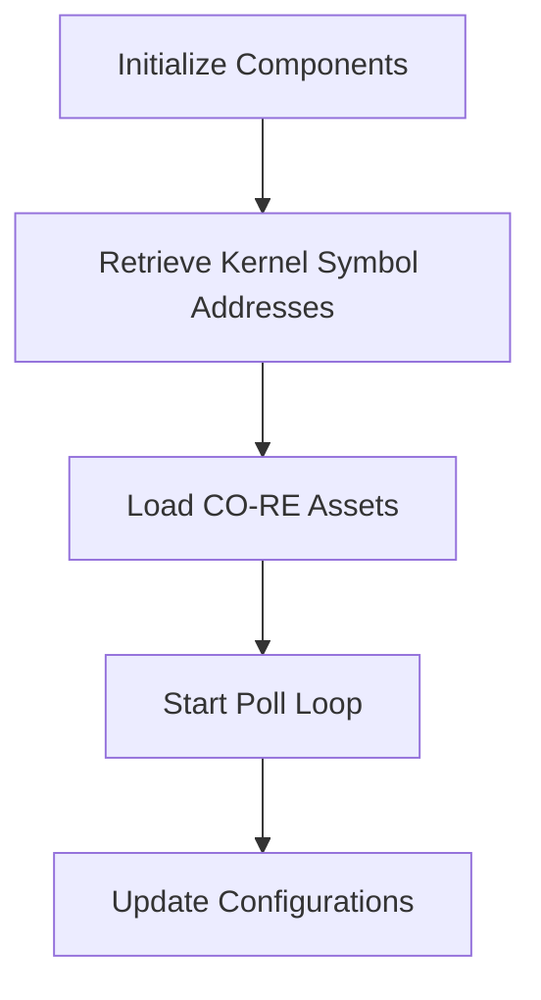

This document will cover the Post Registration Flow, which includes:

1. Initializing necessary components
2. Retrieving kernel symbol addresses
3. Loading CO-RE assets
4. Starting the poll loop
5. Updating configurations.

Technical document: <SwmLink doc-title="Post Register Flow">[Post Register Flow](/.swm/post-register-flow.sj29ssxm.sw.md)</SwmLink>

# [Initializing necessary components](https://app.swimm.io/repos/Z2l0aHViJTNBJTNBZGF0YWRvZy1hZ2VudCUzQSUzQVN3aW1tLURlbW8=/docs/sj29ssxm#initialization)

The initialization step involves setting up the memory ranges that need to be monitored. This is done by iterating over file descriptors representing resources of interest, such as eBPF maps. This setup is essential for tracking locks taken by eBPF programs, ensuring that the system can monitor and manage these resources effectively.

# [Retrieving kernel symbol addresses](https://app.swimm.io/repos/Z2l0aHViJTNBJTNBZGF0YWRvZy1hZ2VudCUzQSUzQVN3aW1tLURlbW8=/docs/sj29ssxm#kernel-symbol-address-retrieval)

In this step, kernel symbol addresses are retrieved using a BPF iterator. This is crucial for the eBPF programs to correctly monitor and interact with kernel symbols. By obtaining these addresses, the system can ensure that the eBPF programs have the necessary information to function correctly.

# [Loading CO-RE assets](https://app.swimm.io/repos/Z2l0aHViJTNBJTNBZGF0YWRvZy1hZ2VudCUzQSUzQVN3aW1tLURlbW8=/docs/sj29ssxm#loading-co-re-asset)

The CO-RE (Compile Once - Run Everywhere) assets are loaded in this step. This involves reading the CO-RE object file and calling a callback function with the asset and BTF (BPF Type Format) options pre-filled. This ensures that the CO-RE program is loaded correctly, allowing it to function across different environments without needing recompilation.

# [Starting the poll loop](https://app.swimm.io/repos/Z2l0aHViJTNBJTNBZGF0YWRvZy1hZ2VudCUzQSUzQVN3aW1tLURlbW8=/docs/sj29ssxm#starting-the-poll-loop)

The poll loop is initiated in this step. This involves calling the `pollLoop` method in a separate goroutine. The poll loop is responsible for continuously checking for updates, ensuring that the system remains up-to-date with the latest configurations and data.

# [Updating configurations](https://app.swimm.io/repos/Z2l0aHViJTNBJTNBZGF0YWRvZy1hZ2VudCUzQSUzQVN3aW1tLURlbW8=/docs/sj29ssxm#updating-configuration)

In this final step, the system requests configuration updates via a secure gRPC channel and applies those updates. It also informs any registered listeners of any state changes. This ensures that the system's configurations are always current, providing the latest settings and data to the end user.

&nbsp;

*This is an auto-generated document by Swimm AI 🌊 and has not yet been verified by a human*

<SwmMeta version="3.0.0" repo-id="Z2l0aHViJTNBJTNBZGF0YWRvZy1hZ2VudCUzQSUzQVN3aW1tLURlbW8=" repo-name="datadog-agent">Powered by [Swimm](/)</SwmMeta>
