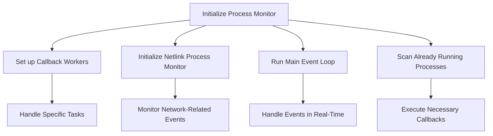

This document will cover the initialization process for the Process Monitor, which includes:

1. Setting up callback workers
2. Initializing the netlink process monitor
3. Running the main event loop
4. Scanning already running processes to execute callbacks.

Technical document: <SwmLink doc-title="Process Monitor Initialization">[Process Monitor Initialization](/.swm/process-monitor-initialization.k2k58yge.sw.md)</SwmLink>

# [Setting up Callback Workers](https://app.swimm.io/repos/Z2l0aHViJTNBJTNBZGF0YWRvZy1hZ2VudCUzQSUzQVN3aW1tLURlbW8=/docs/k2k58yge#initialize)

The initialization process begins by setting up callback workers. These workers are responsible for handling specific tasks that are essential for the process monitor to function correctly. Callback workers ensure that various events and actions are managed efficiently, which is crucial for maintaining the overall performance and reliability of the process monitor.

# [Initializing the Netlink Process Monitor](https://app.swimm.io/repos/Z2l0aHViJTNBJTNBZGF0YWRvZy1hZ2VudCUzQSUzQVN3aW1tLURlbW8=/docs/k2k58yge#initialize)

Next, the netlink process monitor is initialized. This component is vital for monitoring network-related events. By setting up the netlink process monitor, the system can track and respond to changes in network states, which is essential for real-time process monitoring and ensuring that network events are captured accurately.

# [Running the Main Event Loop](https://app.swimm.io/repos/Z2l0aHViJTNBJTNBZGF0YWRvZy1hZ2VudCUzQSUzQVN3aW1tLURlbW8=/docs/k2k58yge#maineventloop)

The main event loop is then started in a separate thread. This loop is the core of the process monitor, handling events as they occur in real-time. It processes these events and executes the appropriate callbacks, ensuring that the system responds promptly to any changes or actions that need to be taken. This real-time handling is crucial for effective process monitoring.

# [Scanning Already Running Processes](https://app.swimm.io/repos/Z2l0aHViJTNBJTNBZGF0YWRvZy1hZ2VudCUzQSUzQVN3aW1tLURlbW8=/docs/k2k58yge#initialize)

Finally, the system scans already running processes to ensure that any necessary callbacks are executed. This step is important because it ensures that the process monitor is aware of all current processes and can manage them appropriately. By executing the required callbacks, the system maintains consistency and reliability in process monitoring.

&nbsp;

*This is an auto-generated document by Swimm AI 🌊 and has not yet been verified by a human*

<SwmMeta version="3.0.0" repo-id="Z2l0aHViJTNBJTNBZGF0YWRvZy1hZ2VudCUzQSUzQVN3aW1tLURlbW8=" repo-name="datadog-agent">Powered by [Swimm](/)</SwmMeta>
