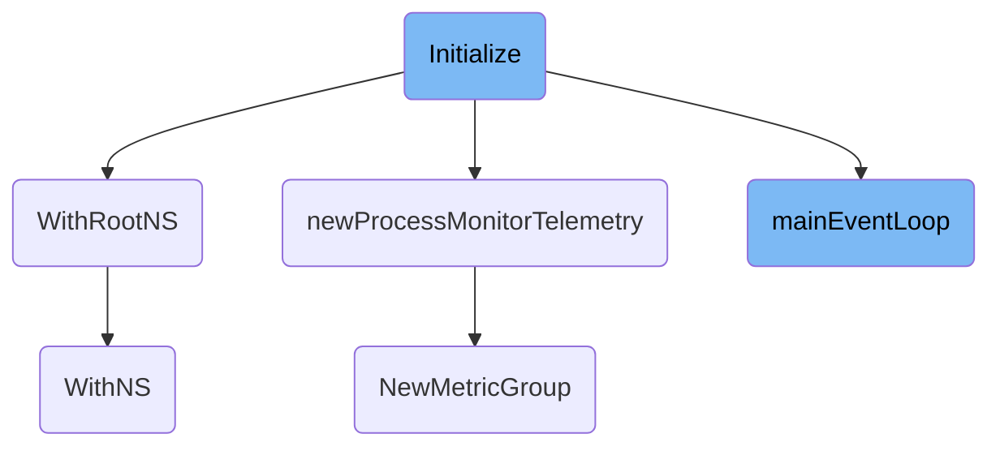

This document explains the initialization process for the process monitor. The initialization ensures that the process monitor is set up correctly and only once, regardless of how many times the initialization function is called. The process involves setting up callback workers, initializing the netlink process monitor, running the main event loop, and scanning already running processes to execute callbacks.

The initialization process starts by setting up callback workers, which are responsible for handling specific tasks. Next, it initializes the netlink process monitor, which is crucial for monitoring network-related events. The main event loop is then started in a separate thread to handle events in real-time. Finally, the system scans already running processes to ensure that any necessary callbacks are executed. This entire setup is essential for effective process monitoring.

# Flow drill down



<SwmSnippet path="/pkg/process/monitor/process_monitor.go" line="351">

---

## Initialize

The <SwmToken path="pkg/process/monitor/process_monitor.go" pos="351:2:2" line-data="// Initialize setting up the process monitor only once, no matter how many times it was called.">`Initialize`</SwmToken> function sets up the process monitor. It ensures that the initialization happens only once, regardless of how many times it is called. The function initializes callback workers, sets up the netlink process monitor, runs the main event loop in a goroutine, and scans already running processes to call the Exec callbacks on them. This setup is crucial for monitoring processes effectively.

```go
// Initialize setting up the process monitor only once, no matter how many times it was called.
// The initialization order:
//  1. Initializes callback workers.
//  2. Initializes the netlink process monitor.
//  2. Run the main event loop in a goroutine.
//  4. Scans already running processes and call the Exec callbacks on them.
func (pm *ProcessMonitor) Initialize(useEventStream bool) error {
	var initErr error
	pm.initOnce.Do(
		func() {
			method := "netlink"
			if useEventStream {
				method = "event stream"
			}
			log.Infof("initializing process monitor (%s)", method)
			pm.tel = newProcessMonitorTelemetry()

			pm.useEventStream = useEventStream
			pm.done = make(chan struct{})
			pm.initCallbackRunner()

```

---

</SwmSnippet>

<SwmSnippet path="/pkg/util/kernel/netns.go" line="24">

---

## <SwmToken path="pkg/util/kernel/netns.go" pos="24:2:2" line-data="// WithRootNS executes a function within root network namespace and then switch back">`WithRootNS`</SwmToken>

The <SwmToken path="pkg/util/kernel/netns.go" pos="24:2:2" line-data="// WithRootNS executes a function within root network namespace and then switch back">`WithRootNS`</SwmToken> function executes a given function within the root network namespace and then switches back to the previous namespace. This is essential for operations that require root namespace access without permanently changing the namespace context.

```go
// WithRootNS executes a function within root network namespace and then switch back
// to the previous namespace. If the thread is already in the root network namespace,
// the function is executed without calling SYS_SETNS.
func WithRootNS(procRoot string, fn func() error) error {
	rootNS, err := GetRootNetNamespace(procRoot)
	if err != nil {
		return err
	}
	defer rootNS.Close()

	return WithNS(rootNS, fn)
}
```

---

</SwmSnippet>

<SwmSnippet path="/pkg/process/monitor/process_monitor.go" line="70">

---

## <SwmToken path="pkg/process/monitor/process_monitor.go" pos="70:2:2" line-data="func newProcessMonitorTelemetry() processMonitorTelemetry {">`newProcessMonitorTelemetry`</SwmToken>

The <SwmToken path="pkg/process/monitor/process_monitor.go" pos="70:2:2" line-data="func newProcessMonitorTelemetry() processMonitorTelemetry {">`newProcessMonitorTelemetry`</SwmToken> function initializes telemetry for the process monitor. It creates a new metric group and sets up various counters to track events, executions, exits, restarts, and failures. This telemetry data is vital for monitoring the health and performance of the process monitor.

```go
func newProcessMonitorTelemetry() processMonitorTelemetry {
	metricGroup := telemetry.NewMetricGroup(
		"usm.process.monitor",
		telemetry.OptPrometheus,
	)
	return processMonitorTelemetry{
		mg:      metricGroup,
		events:  metricGroup.NewCounter("events"),
		exec:    metricGroup.NewCounter("exec"),
		exit:    metricGroup.NewCounter("exit"),
		restart: metricGroup.NewCounter("restart"),

		reinitFailed:      metricGroup.NewCounter("reinit_failed"),
		processScanFailed: metricGroup.NewCounter("process_scan_failed"),
		callbackExecuted:  metricGroup.NewCounter("callback_executed"),

		processExecChannelIsFull: metricGroup.NewCounter("process_exec_channel_is_full"),
		processExitChannelIsFull: metricGroup.NewCounter("process_exit_channel_is_full"),
	}
}
```

---

</SwmSnippet>

<SwmSnippet path="/pkg/process/monitor/process_monitor.go" line="270">

---

## <SwmToken path="pkg/process/monitor/process_monitor.go" pos="270:2:2" line-data="// mainEventLoop is an event loop receiving events from netlink, or periodic events, and handles them.">`mainEventLoop`</SwmToken>

The <SwmToken path="pkg/process/monitor/process_monitor.go" pos="270:2:2" line-data="// mainEventLoop is an event loop receiving events from netlink, or periodic events, and handles them.">`mainEventLoop`</SwmToken> function is the core event loop for the process monitor. It handles events from netlink or periodic events, processes them, and executes the appropriate callbacks. This loop is crucial for real-time monitoring and handling of process events.

```go
// mainEventLoop is an event loop receiving events from netlink, or periodic events, and handles them.
func (pm *ProcessMonitor) mainEventLoop() {
	log.Info("process monitor main event loop is starting")
	logTicker := time.NewTicker(2 * time.Minute)

	defer func() {
		logTicker.Stop()
		// Marking netlink to stop, so we won't get any new events.
		close(pm.netlinkDoneChannel)

		pm.stopCallbackRunners()

		// We intentionally don't close the callbackRunner channel,
		// as we don't want to panic if we're trying to send to it in another goroutine.

		// Before shutting down, making sure we're cleaning all resources.
		pm.processMonitorWG.Done()
	}()

	maxChannelSize := 0
	for {
```

---

</SwmSnippet>

<SwmSnippet path="/pkg/network/protocols/telemetry/metric_group.go" line="38">

---

## <SwmToken path="pkg/network/protocols/telemetry/metric_group.go" pos="38:2:2" line-data="// NewMetricGroup returns a new `MetricGroup`">`NewMetricGroup`</SwmToken>

The <SwmToken path="pkg/network/protocols/telemetry/metric_group.go" pos="38:2:2" line-data="// NewMetricGroup returns a new `MetricGroup`">`NewMetricGroup`</SwmToken> function creates a new metric group for telemetry. It sets up a namespace and common tags for the metrics, which are used to organize and categorize telemetry data. This function is fundamental for setting up structured telemetry data collection.

```go
// NewMetricGroup returns a new `MetricGroup`
func NewMetricGroup(namespace string, commonTags ...string) *MetricGroup {
	return &MetricGroup{
		namespace:  namespace,
		commonTags: sets.New(commonTags...),
		then:       time.Now(),
	}
}
```

---

</SwmSnippet>

<SwmSnippet path="/pkg/util/kernel/netns.go" line="37">

---

## <SwmToken path="pkg/util/kernel/netns.go" pos="37:2:2" line-data="// WithNS executes the given function in the given network namespace, and then">`WithNS`</SwmToken>

The <SwmToken path="pkg/util/kernel/netns.go" pos="37:2:2" line-data="// WithNS executes the given function in the given network namespace, and then">`WithNS`</SwmToken> function executes a given function in a specified network namespace and then switches back to the previous namespace. This function is important for performing operations in different network namespaces without permanently changing the namespace context.

```go
// WithNS executes the given function in the given network namespace, and then
// switches back to the previous namespace.
func WithNS(ns netns.NsHandle, fn func() error) error {
	if ns == netns.None() {
		return fn()
	}

	runtime.LockOSThread()
	defer runtime.UnlockOSThread()

	prevNS, err := netns.Get()
	if err != nil {
		return err
	}
	defer prevNS.Close()

	if ns.Equal(prevNS) {
		return fn()
	}

	if err := netns.Set(ns); err != nil {
```

---

</SwmSnippet>

&nbsp;

*This is an auto-generated document by Swimm AI 🌊 and has not yet been verified by a human*

<SwmMeta version="3.0.0" repo-id="Z2l0aHViJTNBJTNBZGF0YWRvZy1hZ2VudCUzQSUzQVN3aW1tLURlbW8=" repo-name="datadog-agent"><sup>Powered by [Swimm](/)</sup></SwmMeta>
