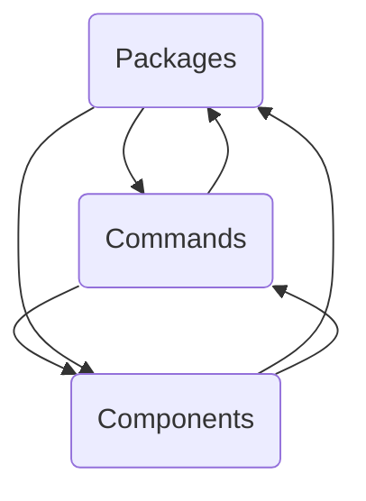

The repo datadog-agent contains the source code for the Datadog Agent, which collects metrics, logs, and traces from various sources and sends them to the Datadog platform for monitoring and analysis.

## Main Components

### Packages

Packages are collections of related code and data that are grouped together to provide specific functionality or features. They help organize the codebase, making it modular and easier to manage.

- <SwmLink doc-title="Overview of NewLogReporter">[Overview of NewLogReporter](/.swm/overview-of-newlogreporter.86i1z5eg.sw.md)</SwmLink>
- <SwmLink doc-title="Process Monitor Initialization">[Process Monitor Initialization](/.swm/process-monitor-initialization.e7k6gqub.sw.md)</SwmLink>
- <SwmLink doc-title="Post Registration Flow">[Post Registration Flow](/.swm/post-registration-flow.s5osbajy.sw.md)</SwmLink>
- <SwmLink doc-title="Creating a Flare">[Creating a Flare](/.swm/creating-a-flare.pzg0bek6.sw.md)</SwmLink>
- <SwmLink doc-title="Traceroute Registration and Execution">[Traceroute Registration and Execution](/.swm/traceroute-registration-and-execution.hy7m5u87.sw.md)</SwmLink>
- <SwmLink doc-title="Converting OTLP Spans for APM Stats Calculation">[Converting OTLP Spans for APM Stats Calculation](/.swm/converting-otlp-spans-for-apm-stats-calculation.7yvwxs6n.sw.md)</SwmLink>
- <SwmLink doc-title="Starting the Datadog Agent">[Starting the Datadog Agent](/.swm/starting-the-datadog-agent.aedlv6fm.sw.md)</SwmLink>
- **Security**
  - <SwmLink doc-title="Data Collection and Transmission">[Data Collection and Transmission](/.swm/data-collection-and-transmission.3fb2sjxf.sw.md)</SwmLink>
  - <SwmLink doc-title="Initialization and Execution Flow of Start Function">[Initialization and Execution Flow of Start Function](/.swm/initialization-and-execution-flow-of-start-function.bpskw1rc.sw.md)</SwmLink>
  - **Flows**
    - <SwmLink doc-title="Event Dispatch Flow">[Event Dispatch Flow](/.swm/event-dispatch-flow.d620x0l3.sw.md)</SwmLink>
    - <SwmLink doc-title="Collecting and Sending Data with Datadog Agent">[Collecting and Sending Data with Datadog Agent](/.swm/collecting-and-sending-data-with-datadog-agent.26aiuzsf.sw.md)</SwmLink>
    - <SwmLink doc-title="Marshaling an Event">[Marshaling an Event](/.swm/marshaling-an-event.aaneb20u.sw.md)</SwmLink>
    - <SwmLink doc-title="Snapshot Process Overview">[Snapshot Process Overview](/.swm/snapshot-process-overview.8zsm6cse.sw.md)</SwmLink>
    - <SwmLink doc-title="Initialization Process">[Initialization Process](/.swm/initialization-process.typ2gh2c.sw.md)</SwmLink>
- **Collector**
  - <SwmLink doc-title="Running the Cisco SD-WAN Client">[Running the Cisco SD-WAN Client](/.swm/running-the-cisco-sd-wan-client.32pf9l7k.sw.md)</SwmLink>
  - <SwmLink doc-title="Collecting and Sending Data with Datadog Agent">[Collecting and Sending Data with Datadog Agent](/.swm/collecting-and-sending-data-with-datadog-agent.ef4ljv12.sw.md)</SwmLink>
  - <SwmLink doc-title="SNMP Check Configuration Process">[SNMP Check Configuration Process](/.swm/snmp-check-configuration-process.4f90oo7n.sw.md)</SwmLink>
  - <SwmLink doc-title="Configuration Process Overview">[Configuration Process Overview](/.swm/configuration-process-overview.cgcq8cl8.sw.md)</SwmLink>
  - **Flows**
    - <SwmLink doc-title="Retrieving Checks by Name">[Retrieving Checks by Name](/.swm/retrieving-checks-by-name.jth048k5.sw.md)</SwmLink>
    - <SwmLink doc-title="Python Environment Setup">[Python Environment Setup](/.swm/python-environment-setup.ldbu80ue.sw.md)</SwmLink>
    - <SwmLink doc-title="Collecting and Sending Data with Datadog Agent">[Collecting and Sending Data with Datadog Agent](/.swm/collecting-and-sending-data-with-datadog-agent.67uleear.sw.md)</SwmLink>
    - <SwmLink doc-title="Obfuscating SQL Queries">[Obfuscating SQL Queries](/.swm/obfuscating-sql-queries.xfnu8h4f.sw.md)</SwmLink>
    - <SwmLink doc-title="LocalAPI Initialization and Routing">[LocalAPI Initialization and Routing](/.swm/localapi-initialization-and-routing.aiyf1uni.sw.md)</SwmLink>
    - <SwmLink doc-title="SBOM Check Run Function">[SBOM Check Run Function](/.swm/sbom-check-run-function.xxgc1vhn.sw.md)</SwmLink>
    - <SwmLink doc-title="Cluster Name Retrieval Process">[Cluster Name Retrieval Process](/.swm/cluster-name-retrieval-process.e0tty0i4.sw.md)</SwmLink>
    - <SwmLink doc-title="Persistent Cache Retrieval Flow">[Persistent Cache Retrieval Flow](/.swm/persistent-cache-retrieval-flow.w3ghq7yd.sw.md)</SwmLink>
    - <SwmLink doc-title="Scheduling Process Overview">[Scheduling Process Overview](/.swm/scheduling-process-overview.i69ru8uf.sw.md)</SwmLink>
    - <SwmLink doc-title="Kubelet Connection Information Flow">[Kubelet Connection Information Flow](/.swm/kubelet-connection-information-flow.75ib7256.sw.md)</SwmLink>
- **Network**
  - <SwmLink doc-title="Starting HTTP Event Consumption">[Starting HTTP Event Consumption](/.swm/starting-http-event-consumption.0w9i19p5.sw.md)</SwmLink>
  - <SwmLink doc-title="Initialization and Flow of Main Function">[Initialization and Flow of Main Function](/.swm/initialization-and-flow-of-main-function.3gtp54c7.sw.md)</SwmLink>
  - <SwmLink doc-title="Main Method Flow in JavaClientSimulator">[Main Method Flow in JavaClientSimulator](/.swm/main-method-flow-in-javaclientsimulator.8i3cgln4.sw.md)</SwmLink>
  - **Flows**
    - <SwmLink doc-title="Overview of ReadAll Function">[Overview of ReadAll Function](/.swm/overview-of-readall-function.sc8yqtee.sw.md)</SwmLink>
    - <SwmLink doc-title="Managing Active Connections">[Managing Active Connections](/.swm/managing-active-connections.usz3nbl9.sw.md)</SwmLink>
- **Flows**
  - <SwmLink doc-title="Data Collection and Transmission">[Data Collection and Transmission](/.swm/data-collection-and-transmission.cjl4jvj2.sw.md)</SwmLink>
  - <SwmLink doc-title="Collecting Metrics, Logs, and Traces">[Collecting Metrics, Logs, and Traces](/.swm/collecting-metrics-logs-and-traces.wxkoq6d6.sw.md)</SwmLink>
  - <SwmLink doc-title="Adding a New Data Source">[Adding a New Data Source](/.swm/adding-a-new-data-source.9srsxx9p.sw.md)</SwmLink>
  - <SwmLink doc-title="Reading Directory Contents">[Reading Directory Contents](/.swm/reading-directory-contents.prhrwuu9.sw.md)</SwmLink>
  - <SwmLink doc-title="Data Collection and Processing with Datadog Agent">[Data Collection and Processing with Datadog Agent](/.swm/data-collection-and-processing-with-datadog-agent.nap9d5ho.sw.md)</SwmLink>
  - <SwmLink doc-title="Compilation Process Overview">[Compilation Process Overview](/.swm/compilation-process-overview.md5pt7df.sw.md)</SwmLink>
  - <SwmLink doc-title="Overview of the Run Function">[Overview of the Run Function](/.swm/overview-of-the-run-function.jmeagheg.sw.md)</SwmLink>
  - <SwmLink doc-title="Starting the Autoscalers Controller">[Starting the Autoscalers Controller](/.swm/starting-the-autoscalers-controller.oszl1mzd.sw.md)</SwmLink>
  - <SwmLink doc-title="Running the Datadog Agent">[Running the Datadog Agent](/.swm/running-the-datadog-agent.93clm5g7.sw.md)</SwmLink>
  - <SwmLink doc-title="Handling Metric Samples">[Handling Metric Samples](/.swm/handling-metric-samples.4w3jm3nx.sw.md)</SwmLink>
  - <SwmLink doc-title="Data Collection and Transmission">[Data Collection and Transmission](/.swm/data-collection-and-transmission.thw8godm.sw.md)</SwmLink>
  - <SwmLink doc-title="Main Execution Flow of Kubernetes API Server Check">[Main Execution Flow of Kubernetes API Server Check](/.swm/main-execution-flow-of-kubernetes-api-server-check.2dpvifqp.sw.md)</SwmLink>
  - <SwmLink doc-title="Collecting and Sending Data with Datadog Agent">[Collecting and Sending Data with Datadog Agent](/.swm/collecting-and-sending-data-with-datadog-agent.rvgl6yfv.sw.md)</SwmLink>
  - <SwmLink doc-title="Running Diagnostic Information Collection">[Running Diagnostic Information Collection](/.swm/running-diagnostic-information-collection.db3l8yg2.sw.md)</SwmLink>
  - <SwmLink doc-title="Status Command Flow">[Status Command Flow](/.swm/status-command-flow.xbv53fje.sw.md)</SwmLink>
  - <SwmLink doc-title="Gathering Container Statistics">[Gathering Container Statistics](/.swm/gathering-container-statistics.tfq9tks8.sw.md)</SwmLink>
  - <SwmLink doc-title="Setting Up Kubernetes Metadata Endpoints">[Setting Up Kubernetes Metadata Endpoints](/.swm/setting-up-kubernetes-metadata-endpoints.1hy916nw.sw.md)</SwmLink>
  - <SwmLink doc-title="Overview of the Run Function">[Overview of the Run Function](/.swm/overview-of-the-run-function.d4d1o1gd.sw.md)</SwmLink>
  - <SwmLink doc-title="Generating Content from Templates">[Generating Content from Templates](/.swm/generating-content-from-templates.qxnpwfo0.sw.md)</SwmLink>

### Components

Components encapsulate specific logic or features, providing clear interfaces while hiding implementation complexity. They are designed to be reusable, testable, and maintainable by a single team, ensuring that internal changes do not affect other components.

- <SwmLink doc-title="API Server Initialization and Startup">[API Server Initialization and Startup](/.swm/api-server-initialization-and-startup.kwdid41a.sw.md)</SwmLink>
- <SwmLink doc-title="Remote Tagger Initialization and Main Loop">[Remote Tagger Initialization and Main Loop](/.swm/remote-tagger-initialization-and-main-loop.pga9th6c.sw.md)</SwmLink>
- <SwmLink doc-title="Overview of Listen Functionality">[Overview of Listen Functionality](/.swm/overview-of-listen-functionality.woqfgdny.sw.md)</SwmLink>
- <SwmLink doc-title="Gathering APT Signature Keys">[Gathering APT Signature Keys](/.swm/gathering-apt-signature-keys.estfdfm1.sw.md)</SwmLink>
- **Autodiscovery**
  - <SwmLink doc-title="Load and Run Process Overview">[Load and Run Process Overview](/.swm/load-and-run-process-overview.wgapdxky.sw.md)</SwmLink>

### Commands

Commands refer to the top-level binaries and their subcommands implemented in various packages within the repository. These commands are responsible for executing specific functionalities related to different components such as the cluster agent, trace agent, security agent, and others.

- **Cluster agent**
  - <SwmLink doc-title="Running the Datadog Cluster Agent">[Running the Datadog Cluster Agent](/.swm/running-the-datadog-cluster-agent.dqz3nz9b.sw.md)</SwmLink>
  - <SwmLink doc-title="Initialization and Startup Processes">[Initialization and Startup Processes](/.swm/initialization-and-startup-processes.vbdxmtuy.sw.md)</SwmLink>

### Flows

- <SwmLink doc-title="Data Collection and Transmission">[Data Collection and Transmission](/.swm/data-collection-and-transmission.od2r3bdf.sw.md)</SwmLink>
- <SwmLink doc-title="Initialization and Setup of NewWatcher">[Initialization and Setup of NewWatcher](/.swm/initialization-and-setup-of-newwatcher.6c8zxmy1.sw.md)</SwmLink>
- <SwmLink doc-title="Initializing and Starting the Datadog Agent">[Initializing and Starting the Datadog Agent](/.swm/initializing-and-starting-the-datadog-agent.88koeu8m.sw.md)</SwmLink>
- <SwmLink doc-title="Overview of Installer Commands">[Overview of Installer Commands](/.swm/overview-of-installer-commands.nwauxph1.sw.md)</SwmLink>
- <SwmLink doc-title="Registering Network Tracer Endpoints">[Registering Network Tracer Endpoints](/.swm/registering-network-tracer-endpoints.bgqf4h5k.sw.md)</SwmLink>
- <SwmLink doc-title="Starting Security Agent and Compliance Sub-Agent">[Starting Security Agent and Compliance Sub-Agent](/.swm/starting-security-agent-and-compliance-sub-agent.b300np8d.sw.md)</SwmLink>
- <SwmLink doc-title="Collecting and Sending Data with Datadog Agent">[Collecting and Sending Data with Datadog Agent](/.swm/collecting-and-sending-data-with-datadog-agent.o2ip8akm.sw.md)</SwmLink>
- <SwmLink doc-title="Handling Encoding Requests from Activity Dumps">[Handling Encoding Requests from Activity Dumps](/.swm/handling-encoding-requests-from-activity-dumps.ugff5jyc.sw.md)</SwmLink>
- <SwmLink doc-title="Generating Encoding from Activity Dump">[Generating Encoding from Activity Dump](/.swm/generating-encoding-from-activity-dump.s14k546a.sw.md)</SwmLink>
- <SwmLink doc-title="Data Collection and Processing">[Data Collection and Processing](/.swm/data-collection-and-processing.xjet7z64.sw.md)</SwmLink>
- <SwmLink doc-title="Rendering Text Output for Status Information">[Rendering Text Output for Status Information](/.swm/rendering-text-output-for-status-information.8q140p5n.sw.md)</SwmLink>
- <SwmLink doc-title="HTML Rendering Flow">[HTML Rendering Flow](/.swm/html-rendering-flow.77s3uomy.sw.md)</SwmLink>
- <SwmLink doc-title="Collecting and Sending Data with Datadog Agent">[Collecting and Sending Data with Datadog Agent](/.swm/collecting-and-sending-data-with-datadog-agent.cjcmej2d.sw.md)</SwmLink>
- <SwmLink doc-title="JSON Flow Overview">[JSON Flow Overview](/.swm/json-flow-overview.08culi8g.sw.md)</SwmLink>
- <SwmLink doc-title="Collecting Host Metadata">[Collecting Host Metadata](/.swm/collecting-host-metadata.l19xzv8j.sw.md)</SwmLink>
- <SwmLink doc-title="Initialization and Routing in newGui">[Initialization and Routing in newGui](/.swm/initialization-and-routing-in-newgui.6s91j5uc.sw.md)</SwmLink>
- <SwmLink doc-title="Retrieving Process-Agent Status">[Retrieving Process-Agent Status](/.swm/retrieving-process-agent-status.3y5z1aac.sw.md)</SwmLink>
- <SwmLink doc-title="Handling Metadata Payloads in JSON">[Handling Metadata Payloads in JSON](/.swm/handling-metadata-payloads-in-json.7w4xul0g.sw.md)</SwmLink>
- <SwmLink doc-title="Adding Host Metadata to Flare Archive">[Adding Host Metadata to Flare Archive](/.swm/adding-host-metadata-to-flare-archive.qz7mzzww.sw.md)</SwmLink>
- <SwmLink doc-title="Rendering Text Output">[Rendering Text Output](/.swm/rendering-text-output.f0dvvwf6.sw.md)</SwmLink>
- <SwmLink doc-title="Populating Status Map">[Populating Status Map](/.swm/populating-status-map.s7fok72j.sw.md)</SwmLink>
- <SwmLink doc-title="Initialization and Configuration of newComponent">[Initialization and Configuration of newComponent](/.swm/initialization-and-configuration-of-newcomponent.9ifhzsbg.sw.md)</SwmLink>
- <SwmLink doc-title="Constructing the Metadata Payload">[Constructing the Metadata Payload](/.swm/constructing-the-metadata-payload.uyks67h6.sw.md)</SwmLink>
- <SwmLink doc-title="Data Collection and Transmission with Datadog Agent">[Data Collection and Transmission with Datadog Agent](/.swm/data-collection-and-transmission-with-datadog-agent.feyczprw.sw.md)</SwmLink>

&nbsp;

*This is an auto-generated document by Swimm AI 🌊 and has not yet been verified by a human*

<SwmMeta version="3.0.0" repo-id="Z2l0aHViJTNBJTNBZGF0YWRvZy1hZ2VudCUzQSUzQVN3aW1tLURlbW8=" repo-name="datadog-agent">Powered by [Swimm](https://app.swimm.io/)</SwmMeta>
