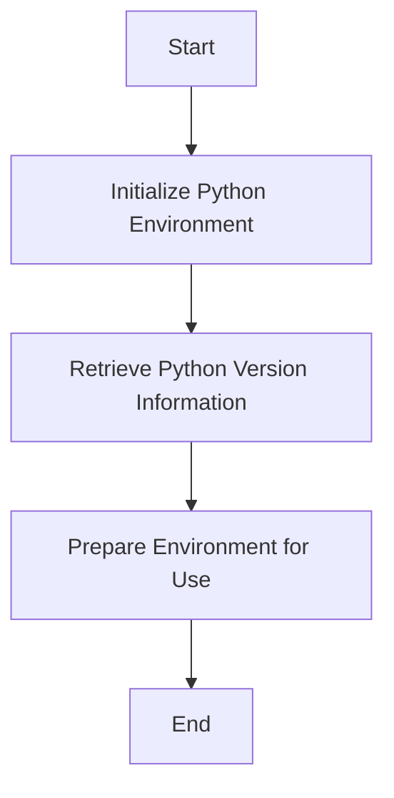

This document will cover the Python Environment Setup process, which includes:

1. Initializing the Python environment
2. Retrieving Python version information
3. Preparing the environment for use.

Technical document: <SwmLink doc-title="Python Environment Setup">[Python Environment Setup](/.swm/python-environment-setup.vq932pth.sw.md)</SwmLink>

# [Initializing the Python environment](https://app.swimm.io/repos/Z2l0aHViJTNBJTNBZGF0YWRvZy1hZ2VudCUzQSUzQVN3aW1tLURlbW8=/docs/vq932pth#setting-up-the-python-environment)

The process begins with initializing the Python environment. This involves setting up the necessary configurations and ensuring that the Python interpreter is ready to be used. The system retrieves the Python version, home, and path information. If the Python interpreter is embedded within the application, it logs the relevant Python details. This step ensures that the Python environment is correctly configured and ready for subsequent operations.

# [Retrieving Python version information](https://app.swimm.io/repos/Z2l0aHViJTNBJTNBZGF0YWRvZy1hZ2VudCUzQSUzQVN3aW1tLURlbW8=/docs/vq932pth#initializing-python)

Once the Python environment is initialized, the next step is to retrieve the Python version information. This involves calling a function that initializes Python and returns the version, home, and path details. These details are crucial for ensuring compatibility and proper functioning of the Python environment within the Datadog Agent. The retrieved information is then logged for reference.

# [Preparing the environment for use](https://app.swimm.io/repos/Z2l0aHViJTNBJTNBZGF0YWRvZy1hZ2VudCUzQSUzQVN3aW1tLURlbW8=/docs/vq932pth#detailed-initialization)

The final step in the setup process is preparing the Python environment for use. This involves several detailed tasks such as setting up memory tracking, performing platform-specific initialization, resolving the Python executable path, and setting up various modules. Additionally, the system locks the Global Interpreter Lock (GIL) to ensure thread safety. Finally, the Python version and path are stored, and telemetry data is sent. This comprehensive preparation ensures that the Python environment is fully operational and optimized for performance.

&nbsp;

*This is an auto-generated document by Swimm AI 🌊 and has not yet been verified by a human*

<SwmMeta version="3.0.0" repo-id="Z2l0aHViJTNBJTNBZGF0YWRvZy1hZ2VudCUzQSUzQVN3aW1tLURlbW8=" repo-name="datadog-agent">Powered by [Swimm](/)</SwmMeta>
