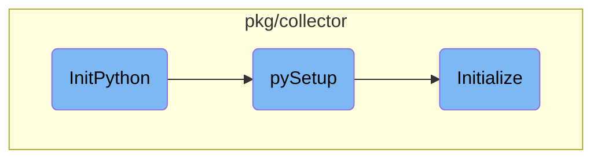

This document explains the process of setting up the Python environment in the Datadog Agent. The initialization involves setting up the Python environment, retrieving Python version information, and preparing the environment for use.

The process starts with setting up the Python environment by calling a function that initializes Python and retrieves the version, home, and path information. If the Python interpreter is embedded, it logs the Python details. Then, it prepares the Python environment for use. The initialization function performs detailed setup tasks such as memory tracking, <SwmToken path="pkg/collector/python/init.go" pos="382:5:7" line-data="	// Any platform-specific initialization">`platform-specific`</SwmToken> initialization, resolving the Python executable path, and setting up various modules.

# Flow drill down



<SwmSnippet path="/pkg/collector/embed_python.go" line="16">

---

## Setting up the Python environment

The <SwmToken path="pkg/collector/embed_python.go" pos="16:2:2" line-data="// InitPython sets up the Python environment">`InitPython`</SwmToken> function is responsible for setting up the Python environment. It calls <SwmToken path="pkg/collector/embed_python.go" pos="18:11:11" line-data="	pyVer, pyHome, pyPath := pySetup(paths...)">`pySetup`</SwmToken> to initialize Python and retrieve the Python version, home, and path. If the Python interpreter is embedded, it logs the Python information. Additionally, it prepares the Python environment by calling <SwmToken path="pkg/collector/embed_python.go" pos="28:7:7" line-data="	if err := pyPrepareEnv(); err != nil {">`pyPrepareEnv`</SwmToken>.

```go
// InitPython sets up the Python environment
func InitPython(paths ...string) {
	pyVer, pyHome, pyPath := pySetup(paths...)

	// print the Python info if the interpreter was embedded
	if pyVer != "" {
		log.Infof("Embedding Python %s", pyVer)
		log.Debugf("Python Home: %s", pyHome)
		log.Debugf("Python path: %s", pyPath)
	}

	// Prepare python environment if necessary
	if err := pyPrepareEnv(); err != nil {
		log.Errorf("Unable to perform additional configuration of the python environment: %v", err)
	}
}
```

---

</SwmSnippet>

<SwmSnippet path="/pkg/collector/embed_python.go" line="33">

---

## Initializing Python

The <SwmToken path="pkg/collector/embed_python.go" pos="33:2:2" line-data="func pySetup(paths ...string) (pythonVersion, pythonHome, pythonPath string) {">`pySetup`</SwmToken> function initializes the Python environment by calling the <SwmToken path="pkg/collector/embed_python.go" pos="34:9:9" line-data="	if err := python.Initialize(paths...); err != nil {">`Initialize`</SwmToken> function from the <SwmToken path="pkg/collector/embed_python.go" pos="34:7:7" line-data="	if err := python.Initialize(paths...); err != nil {">`python`</SwmToken> package. It returns the Python version, home, and path, which are used by <SwmToken path="pkg/collector/embed_python.go" pos="16:2:2" line-data="// InitPython sets up the Python environment">`InitPython`</SwmToken>.

```go
func pySetup(paths ...string) (pythonVersion, pythonHome, pythonPath string) {
	if err := python.Initialize(paths...); err != nil {
		log.Errorf("Could not initialize Python: %s", err)
	}
	return python.PythonVersion, python.PythonHome, python.PythonPath
}
```

---

</SwmSnippet>

<SwmSnippet path="/pkg/collector/python/init.go" line="372">

---

## Detailed Initialization

The <SwmToken path="pkg/collector/python/init.go" pos="373:2:2" line-data="func Initialize(paths ...string) error {">`Initialize`</SwmToken> function performs a detailed initialization of the Python environment. It sets up memory tracking, <SwmToken path="pkg/collector/python/init.go" pos="382:5:7" line-data="	// Any platform-specific initialization">`platform-specific`</SwmToken> initialization, resolves the Python executable path, and initializes the <SwmToken path="pkg/collector/python/init.go" pos="377:7:7" line-data="	// Memory related RTLoader-global initialization">`RTLoader`</SwmToken> with the appropriate Python version. It also sets up various modules and locks the Global Interpreter Lock (GIL). Finally, it retrieves and stores the Python version and path, and sends telemetry data.

```go
//nolint:revive // TODO(AML) Fix revive linter
func Initialize(paths ...string) error {
	pythonVersion := config.Datadog().GetString("python_version")
	allowPathHeuristicsFailure := config.Datadog().GetBool("allow_python_path_heuristics_failure")

	// Memory related RTLoader-global initialization
	if config.Datadog().GetBool("memtrack_enabled") {
		C.initMemoryTracker()
	}

	// Any platform-specific initialization
	// should be done before rtloader initialization
	if initializePlatform() != nil {
		log.Warnf("Unable to complete platform-specific initialization - should be non-fatal")
	}

	// Note: pythonBinPath is a module-level var
	pythonBinPath, err := resolvePythonExecPath(pythonVersion, allowPathHeuristicsFailure)
	if err != nil {
		return err
	}
```

---

</SwmSnippet>

&nbsp;

*This is an auto-generated document by Swimm AI 🌊 and has not yet been verified by a human*

<SwmMeta version="3.0.0" repo-id="Z2l0aHViJTNBJTNBZGF0YWRvZy1hZ2VudCUzQSUzQVN3aW1tLURlbW8=" repo-name="datadog-agent"><sup>Powered by [Swimm](/)</sup></SwmMeta>
