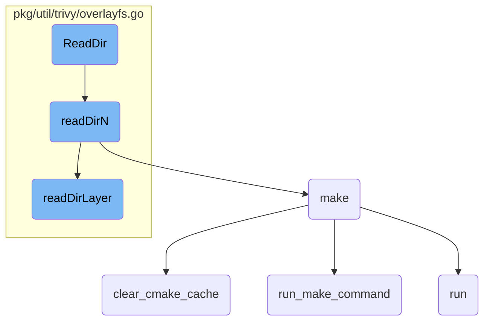

This document explains the process of reading directory contents using the <SwmToken path="pkg/util/trivy/overlayfs.go" pos="109:2:2" line-data="// ReadDir implements fs.ReadDirFS.">`ReadDir`</SwmToken> function. The process involves delegating the task to <SwmToken path="pkg/util/trivy/overlayfs.go" pos="111:5:5" line-data="	return ofs.readDirN(name, -1)">`readDirN`</SwmToken>, which iterates over filesystem layers, and <SwmToken path="pkg/util/trivy/overlayfs.go" pos="124:12:12" line-data="		if ok, err = ofs.readDirLayer(layerIndex, name, n, &amp;entriesMap); ok {">`readDirLayer`</SwmToken>, which reads entries from each layer.

The flow starts with the <SwmToken path="pkg/util/trivy/overlayfs.go" pos="109:2:2" line-data="// ReadDir implements fs.ReadDirFS.">`ReadDir`</SwmToken> function, which reads the contents of a directory. It passes the directory name to <SwmToken path="pkg/util/trivy/overlayfs.go" pos="111:5:5" line-data="	return ofs.readDirN(name, -1)">`readDirN`</SwmToken>, which then processes the directory by iterating over the filesystem layers. For each layer, <SwmToken path="pkg/util/trivy/overlayfs.go" pos="124:12:12" line-data="		if ok, err = ofs.readDirLayer(layerIndex, name, n, &amp;entriesMap); ok {">`readDirLayer`</SwmToken> is called to read the directory entries. The entries are collected, sorted, and any limits on the number of entries are applied. Finally, the entries are returned, excluding any whiteout entries.

# Flow drill down



<SwmSnippet path="/pkg/util/trivy/overlayfs.go" line="109">

---

## <SwmToken path="pkg/util/trivy/overlayfs.go" pos="109:2:2" line-data="// ReadDir implements fs.ReadDirFS.">`ReadDir`</SwmToken> Function

The <SwmToken path="pkg/util/trivy/overlayfs.go" pos="109:2:2" line-data="// ReadDir implements fs.ReadDirFS.">`ReadDir`</SwmToken> function is responsible for reading the contents of a directory. It delegates the task to <SwmToken path="pkg/util/trivy/overlayfs.go" pos="111:5:5" line-data="	return ofs.readDirN(name, -1)">`readDirN`</SwmToken> by passing the directory name and a limit of -1, which means no limit on the number of entries.

```go
// ReadDir implements fs.ReadDirFS.
func (ofs filesystem) ReadDir(name string) ([]fs.DirEntry, error) {
	return ofs.readDirN(name, -1)
}
```

---

</SwmSnippet>

<SwmSnippet path="/pkg/util/trivy/overlayfs.go" line="114">

---

## <SwmToken path="pkg/util/trivy/overlayfs.go" pos="114:8:8" line-data="func (ofs filesystem) readDirN(name string, n int) ([]fs.DirEntry, error) {">`readDirN`</SwmToken> Function

The <SwmToken path="pkg/util/trivy/overlayfs.go" pos="114:8:8" line-data="func (ofs filesystem) readDirN(name string, n int) ([]fs.DirEntry, error) {">`readDirN`</SwmToken> function processes the directory reading by iterating over the layers of the filesystem. It calls <SwmToken path="pkg/util/trivy/overlayfs.go" pos="124:12:12" line-data="		if ok, err = ofs.readDirLayer(layerIndex, name, n, &amp;entriesMap); ok {">`readDirLayer`</SwmToken> for each layer until it successfully reads the directory or encounters an error. The function also handles sorting and limiting the number of directory entries.

```go
func (ofs filesystem) readDirN(name string, n int) ([]fs.DirEntry, error) {
	name = path.Join("/", name)[1:]
	if name == "" {
		name = "."
	}

	var entriesMap map[string]*fs.DirEntry
	var err error
	var ok bool
	for layerIndex := range ofs.layers {
		if ok, err = ofs.readDirLayer(layerIndex, name, n, &entriesMap); ok {
			break
		}
	}
	if err == nil && entriesMap == nil {
		err = syscall.ENOENT
	}
	if err != nil {
		return []fs.DirEntry{}, &os.PathError{Op: "readdirent", Path: name, Err: err}
	}

```

---

</SwmSnippet>

<SwmSnippet path="/pkg/util/trivy/overlayfs.go" line="135">

---

### Handling Directory Entries

This part of <SwmToken path="pkg/util/trivy/overlayfs.go" pos="111:5:5" line-data="	return ofs.readDirN(name, -1)">`readDirN`</SwmToken> collects the directory entries into a slice, sorts them, and applies any limit on the number of entries. It ensures that whiteout entries are excluded from the final list.

```go
	entries := make([]fs.DirEntry, 0, len(entriesMap))
	for _, entry := range entriesMap {
		if entry != whiteout {
			entries = append(entries, *entry)
		}
	}
	sort.Slice(entries, func(i, j int) bool {
		return entries[i].Name() < entries[j].Name()
	})
	if n > 0 && len(entries) > n {
		entries = entries[:n]
	}
```

---

</SwmSnippet>

<SwmSnippet path="/pkg/util/trivy/overlayfs.go" line="150">

---

## <SwmToken path="pkg/util/trivy/overlayfs.go" pos="150:8:8" line-data="func (ofs filesystem) readDirLayer(layerIndex int, name string, n int, entriesMap *map[string]*fs.DirEntry) (bool, error) {">`readDirLayer`</SwmToken> Function

The <SwmToken path="pkg/util/trivy/overlayfs.go" pos="150:8:8" line-data="func (ofs filesystem) readDirLayer(layerIndex int, name string, n int, entriesMap *map[string]*fs.DirEntry) (bool, error) {">`readDirLayer`</SwmToken> function reads the directory entries from a specific layer of the filesystem. It handles various conditions such as non-existent directories, whiteout entries, and regular files. It updates the entries map with the directory entries read from the layer.

```go
func (ofs filesystem) readDirLayer(layerIndex int, name string, n int, entriesMap *map[string]*fs.DirEntry) (bool, error) {
	fullname := ofs.path(layerIndex, name)

	di, err := os.Stat(fullname)
	if errors.Is(err, syscall.ENOENT) || errors.Is(err, syscall.ENOTDIR) {
		return false, nil
	}
	if err != nil {
		return true, err
	}
	if isWhiteout(di) {
		return true, syscall.ENOENT
	}
	if !di.IsDir() {
		return true, syscall.ENOTDIR
	}

	d, err := os.Open(fullname)
	if err != nil {
		return true, err
	}
```

---

</SwmSnippet>

<SwmSnippet path="/pkg/util/trivy/overlayfs.go" line="176">

---

### Updating Entries Map

This part of <SwmToken path="pkg/util/trivy/overlayfs.go" pos="124:12:12" line-data="		if ok, err = ofs.readDirLayer(layerIndex, name, n, &amp;entriesMap); ok {">`readDirLayer`</SwmToken> updates the entries map with the directory entries read from the current layer. It checks for whiteout entries and handles them appropriately.

```go
	if *entriesMap == nil {
		*entriesMap = make(map[string]*fs.DirEntry)
	}
	for entryIndex, entry := range entries {
		entryName := entry.Name()
		if _, exists := (*entriesMap)[entryName]; !exists {
			entryPtr := &entries[entryIndex]
			if entry.Type().IsRegular() {
				(*entriesMap)[entryName] = entryPtr
			} else {
				ei, err := entry.Info()
				if err != nil {
					return true, err
				}
				if isWhiteout(ei) {
					(*entriesMap)[entryName] = whiteout
				} else {
					(*entriesMap)[entryName] = entryPtr
				}
			}
		}
```

---

</SwmSnippet>

# Where is this flow used?

This flow is used multiple times in the codebase as represented in the following diagram:

(Note - these are only some of the entry points of this flow)

```mermaid
graph TD;
      subgraph compforwarderdefaultforwarder["comp/forwarder/defaultforwarder"]
4541f382d923ca6a1f191cd1ca322ebfa866aa11137e9800132a4aee6f2a8914(newForwarder):::rootsStyle --> 2cf9d16a36a27f231c1c1a84b8ad2d2d2b2dbfc1e4e7194358d07ba7f7390edc(NewForwarder)
end

subgraph compforwarderdefaultforwarder["comp/forwarder/defaultforwarder"]
2cf9d16a36a27f231c1c1a84b8ad2d2d2b2dbfc1e4e7194358d07ba7f7390edc(NewForwarder) --> 2dca3f5302b1e7c07ddfe5f9b0556623028df713d1a5fe615205241ecdb34615(NewDefaultForwarder)
end

subgraph compforwarderdefaultforwarderinternalretry["comp/forwarder/defaultforwarder/internal/retry"]
2dca3f5302b1e7c07ddfe5f9b0556623028df713d1a5fe615205241ecdb34615(NewDefaultForwarder) --> b510a6edd1908d557e6e4893a08a1f9e97a0939e5669248e35d6b77c652de081(RemoveUnknownDomains)
end

subgraph compforwarderdefaultforwarderinternalretry["comp/forwarder/defaultforwarder/internal/retry"]
b510a6edd1908d557e6e4893a08a1f9e97a0939e5669248e35d6b77c652de081(RemoveUnknownDomains) --> 4f423fa9b2d85c8ecb5b617c1e6e89c505ced9e413c9c1921922ae608a0ed867(removeUnknownDomain)
end

subgraph compforwarderdefaultforwarderinternalretry["comp/forwarder/defaultforwarder/internal/retry"]
4f423fa9b2d85c8ecb5b617c1e6e89c505ced9e413c9c1921922ae608a0ed867(removeUnknownDomain) --> c825554a405e497b04e4b15f1a0e515ecf002243e1eb0be4a2d039a278f1c849(removeRetryFiles)
end

subgraph pkgfleetinstaller["pkg/fleet/installer"]
c825554a405e497b04e4b15f1a0e515ecf002243e1eb0be4a2d039a278f1c849(removeRetryFiles) --> 7fbb58517ec097dc37470fb4845579cd7182bd487baf3e56c5ca190d90e2080e(Remove)
end

subgraph pkgfleetinstaller["pkg/fleet/installer"]
7fbb58517ec097dc37470fb4845579cd7182bd487baf3e56c5ca190d90e2080e(Remove) --> 8e5b96d5def6b4828b93afeeed0824d4f02b13bf2c025999fe6e1cc33a3866fe(removePackage)
end

subgraph pkgfleetinstaller["pkg/fleet/installer"]
8e5b96d5def6b4828b93afeeed0824d4f02b13bf2c025999fe6e1cc33a3866fe(removePackage) --> 1de0a20ea00165057c2db1a2c486e6dcb264138c2c0f3f09bcd76f6fd2944e57(RemoveAgent)
end

subgraph pkgfleetinstaller["pkg/fleet/installer"]
1de0a20ea00165057c2db1a2c486e6dcb264138c2c0f3f09bcd76f6fd2944e57(RemoveAgent) --> fd8cbc045e91480e68043703d6a74fab7970ba5ebdbef1878184acba0c1c9b9c(msiexec)
end

subgraph cmdcwsinstrumentationsubcommandssetupcmdsetupgo["cmd/cws-instrumentation/subcommands/setupcmd/setup.go"]
fd8cbc045e91480e68043703d6a74fab7970ba5ebdbef1878184acba0c1c9b9c(msiexec) --> 52d0dc142e07d235e4caca6bfdbb646d58a142b3ce8d7a9256ff885bd3d43dad(Command)
end

subgraph cmdcwsinstrumentationsubcommandssetupcmdsetupgo["cmd/cws-instrumentation/subcommands/setupcmd/setup.go"]
52d0dc142e07d235e4caca6bfdbb646d58a142b3ce8d7a9256ff885bd3d43dad(Command) --> 0434b1a236f915ab2852a6ddd555c0662009e87747be354eb2221c0174cd08bf(setupCWSInjector)
end

0434b1a236f915ab2852a6ddd555c0662009e87747be354eb2221c0174cd08bf(setupCWSInjector) --> 35883507160556731c2032d52e9f3773a4cf581c990e5445b9844fa255074ab5(Create)

35883507160556731c2032d52e9f3773a4cf581c990e5445b9844fa255074ab5(Create) --> b920ff6577806ccb8fe6759372dcb0de7c9dd7e51672f8281de11a7ce022993e(CompleteFlare)

b920ff6577806ccb8fe6759372dcb0de7c9dd7e51672f8281de11a7ce022993e(CompleteFlare) --> 8ee12461cae3b182d54c877832027cc902a3e69ee803737016fba5a3d842ce9e(getDiagnoses)

8ee12461cae3b182d54c877832027cc902a3e69ee803737016fba5a3d842ce9e(getDiagnoses) --> a6277cb00551f3ba547a1d45c3c9bbc264cfc21021cce8672462d518aba0b89b(RunStdOutInCLIProcess)

a6277cb00551f3ba547a1d45c3c9bbc264cfc21021cce8672462d518aba0b89b(RunStdOutInCLIProcess) --> b1b88f5b1eb45102aef6f2c1dbba5ba2b4c8183540af366b982260d8b4cff988(RunInCLIProcess)

b1b88f5b1eb45102aef6f2c1dbba5ba2b4c8183540af366b982260d8b4cff988(RunInCLIProcess) --> 525d1fde5bbf57fbc41b3125fd128687d7cc50e75443082a9df6c033c7d7da05(run)

525d1fde5bbf57fbc41b3125fd128687d7cc50e75443082a9df6c033c7d7da05(run) --> 965fc91d8f0f27f2133914ec42752b2681ba50eb9bea733efb9414769bcd4d47(requestDiagnosesFromAgentProcess)

965fc91d8f0f27f2133914ec42752b2681ba50eb9bea733efb9414769bcd4d47(requestDiagnosesFromAgentProcess) --> f6e9ec70b08b2fbb0c0bbcfeab60d3b44a5b914486a2a823e1476761103726f8(Decode)

f6e9ec70b08b2fbb0c0bbcfeab60d3b44a5b914486a2a823e1476761103726f8(Decode) --> dd8539b956b76786f88dba828d06efc1f602afd552b4c4a9477400c5cf96fa56(Unzip)

subgraph pkgfleetinstaller["pkg/fleet/installer"]
dd8539b956b76786f88dba828d06efc1f602afd552b4c4a9477400c5cf96fa56(Unzip) --> 967e68fc479de72ceb339ae04dd8f9b0f0464cadca803acd5a6f4416c37ef9d4(Create)
end

subgraph pkgfleetinstaller["pkg/fleet/installer"]
967e68fc479de72ceb339ae04dd8f9b0f0464cadca803acd5a6f4416c37ef9d4(Create) --> eb56d3090d5c57f23655cb597dd7b49ad34d4d95457bec8c9d13567198fdc83e(readRepository)
end

subgraph pkgfleetinstaller["pkg/fleet/installer"]
eb56d3090d5c57f23655cb597dd7b49ad34d4d95457bec8c9d13567198fdc83e(readRepository) --> 7b4035da1195bacf6a000030152a442512f389697ba991b6fe6352bcfb68e5e5(packageLocked)
end

7b4035da1195bacf6a000030152a442512f389697ba991b6fe6352bcfb68e5e5(packageLocked) --> 85e4a217896305bf1ef9e22765740de8bf9b110eb5270ebc4758e325f1481949(ReadDir):::mainFlowStyle

subgraph pkgprocess["pkg/process"]
06ec4f4c180823da1a70e05883c2d8b733686ab9dc27e9766986d613bbc3f732(HandleEvent):::rootsStyle --> 4381157d812e776ccc7ab71f441e9cc29619380d76ec05b35083b2476cdbad0f(handleProcessExec)
end

subgraph pkgprocess["pkg/process"]
4381157d812e776ccc7ab71f441e9cc29619380d76ec05b35083b2476cdbad0f(handleProcessExec) --> f83a75020259f94cba14fbc1a7524832b69c5ea061c8e78b55e2fda89c1d62ec(Add)
end

subgraph pkgprocess["pkg/process"]
f83a75020259f94cba14fbc1a7524832b69c5ea061c8e78b55e2fda89c1d62ec(Add) --> 7af25a7147cdbd9b8c78cc0cad5a63822bad8ab41e014787e20cff25f1d32cf6(remove)
end

subgraph pkgfleetinstaller["pkg/fleet/installer"]
7af25a7147cdbd9b8c78cc0cad5a63822bad8ab41e014787e20cff25f1d32cf6(remove) --> 7fbb58517ec097dc37470fb4845579cd7182bd487baf3e56c5ca190d90e2080e(Remove)
end

subgraph pkgclusteragentadmissionmutatecwsinstrumentationcwsinstrumentationgo["pkg/clusteragent/admission/mutate/cwsinstrumentation/cws_instrumentation.go"]
ebad3715160ae7d613e3341d7890a38c9953ebfc0a44540cfc4a65bb9e0959dc(injectCWSCommandInstrumentation):::rootsStyle --> 9cde64e444b9fa797ca41954472c96898ce3cf274868160da78fe843f0e5dcd6(injectCWSCommandInstrumentationRemoteCopy)
end

subgraph pkgclusteragentadmissionmutatecwsinstrumentationk8scp["pkg/clusteragent/admission/mutate/cwsinstrumentation/k8scp"]
9cde64e444b9fa797ca41954472c96898ce3cf274868160da78fe843f0e5dcd6(injectCWSCommandInstrumentationRemoteCopy) --> 460da0e36a7db1ee798763696ce6886f07303c6daf991ecbe10c7f8583a0d27b(CopyToPod)
end

subgraph pkgclusteragentadmissionmutatecwsinstrumentationk8scp["pkg/clusteragent/admission/mutate/cwsinstrumentation/k8scp"]
460da0e36a7db1ee798763696ce6886f07303c6daf991ecbe10c7f8583a0d27b(CopyToPod) --> 7a85b84a3dff26b1ee7abed000b41339df68026a991e6dc093718878ceb9e0d3(makeTar)
end

subgraph pkgclusteragentadmissionmutatecwsinstrumentationk8scp["pkg/clusteragent/admission/mutate/cwsinstrumentation/k8scp"]
7a85b84a3dff26b1ee7abed000b41339df68026a991e6dc093718878ceb9e0d3(makeTar) --> d5c8f8c9429adc395fa06d5f82a33f2f48b8f8ad45909d33ea4add3697c26066(recursiveTar)
end

subgraph pkgeventmonitor["pkg/eventmonitor"]
d5c8f8c9429adc395fa06d5f82a33f2f48b8f8ad45909d33ea4add3697c26066(recursiveTar) --> ed6a4ad67ccf1949cc28a1112129439568fc0f9e45e9b0508f89d7686fd29bf1(Close)
end

subgraph pkgeventmonitor["pkg/eventmonitor"]
ed6a4ad67ccf1949cc28a1112129439568fc0f9e45e9b0508f89d7686fd29bf1(Close) --> 7a5aa347729348ad83792d1fce7d2341707ca0cd213f01b9a70a93bf0bb4802a(cleanup)
end

subgraph pkgfleetinstaller["pkg/fleet/installer"]
7a5aa347729348ad83792d1fce7d2341707ca0cd213f01b9a70a93bf0bb4802a(cleanup) --> 7fbb58517ec097dc37470fb4845579cd7182bd487baf3e56c5ca190d90e2080e(Remove)
end

5c40bd89aacbaab1d454caead16924fe8500f6e1ed2b582fe17b3b7743922f29(newRemoteConfigClient):::rootsStyle --> 2169c8053829863bcf4a279f8efccad1409fd414c2d19480688a9d0e07bd900c(start)

subgraph compforwarderdefaultforwarder["comp/forwarder/defaultforwarder"]
2169c8053829863bcf4a279f8efccad1409fd414c2d19480688a9d0e07bd900c(start) --> 134f3cd7b1d041eebfb0f695d20d35408fc9f0cf8fdc7e0accf927d44002625f(Start)
end

subgraph compforwarderdefaultforwarderinternalretry["comp/forwarder/defaultforwarder/internal/retry"]
134f3cd7b1d041eebfb0f695d20d35408fc9f0cf8fdc7e0accf927d44002625f(Start) --> 658404c9dd3d697a696ffbfe9f58502b75ef80884a888eedaabc28e65ec5ca5f(Store)
end

subgraph compforwarderdefaultforwarderinternalretry["comp/forwarder/defaultforwarder/internal/retry"]
658404c9dd3d697a696ffbfe9f58502b75ef80884a888eedaabc28e65ec5ca5f(Store) --> 203d9cca87dbabbc16971b8bcc40201d24af99c2534438e9cb69df4224376e3f(makeRoomFor)
end

subgraph compforwarderdefaultforwarderinternalretry["comp/forwarder/defaultforwarder/internal/retry"]
203d9cca87dbabbc16971b8bcc40201d24af99c2534438e9cb69df4224376e3f(makeRoomFor) --> 31173d8848b77b14962e5ea5aca78ff8292f02fa06547f4f46c54286f95cb79b(removeFileAt)
end

subgraph pkgfleetinstaller["pkg/fleet/installer"]
31173d8848b77b14962e5ea5aca78ff8292f02fa06547f4f46c54286f95cb79b(removeFileAt) --> 7fbb58517ec097dc37470fb4845579cd7182bd487baf3e56c5ca190d90e2080e(Remove)
end

subgraph pkgclusteragentadmissionpatchrcprovidergo["pkg/clusteragent/admission/patch/rc_provider.go"]
e366ddfa0a0fa25513b6b38e9c70224eefd6a2cf2ef0e3c9206d326aa1613877(start):::rootsStyle --> 86f98c1a05ff1ec82d4837da53fc5dd1ee7c88b0c9a1ce8e86fbf1fee036046b(process)
end

subgraph pkgclusteragenttelemetrycollectorgo["pkg/clusteragent/telemetry/collector.go"]
86f98c1a05ff1ec82d4837da53fc5dd1ee7c88b0c9a1ce8e86fbf1fee036046b(process) --> dec8cbb7409252c722c834d04fc1624d8149d0f555b046ef207d74c3a0e4b91c(SendRemoteConfigPatchEvent)
end

subgraph pkgclusteragenttelemetrycollectorgo["pkg/clusteragent/telemetry/collector.go"]
dec8cbb7409252c722c834d04fc1624d8149d0f555b046ef207d74c3a0e4b91c(SendRemoteConfigPatchEvent) --> dfa96065cc415f6149b17259c89d368eab12cbd2d2065189e6459a5fe3973a60(sendRemoteConfigEvent)
end

subgraph pkgeventmonitor["pkg/eventmonitor"]
dfa96065cc415f6149b17259c89d368eab12cbd2d2065189e6459a5fe3973a60(sendRemoteConfigEvent) --> ed6a4ad67ccf1949cc28a1112129439568fc0f9e45e9b0508f89d7686fd29bf1(Close)
end


      classDef mainFlowStyle color:#000000,fill:#7CB9F4
classDef rootsStyle color:#000000,fill:#00FFF4
classDef Style1 color:#000000,fill:#00FFAA
classDef Style2 color:#000000,fill:#FFFF00
classDef Style3 color:#000000,fill:#AA7CB9
```



&nbsp;

*This is an auto-generated document by Swimm AI 🌊 and has not yet been verified by a human*

<SwmMeta version="3.0.0" repo-id="Z2l0aHViJTNBJTNBZGF0YWRvZy1hZ2VudCUzQSUzQVN3aW1tLURlbW8=" repo-name="datadog-agent"><sup>Powered by [Swimm](/)</sup></SwmMeta>
