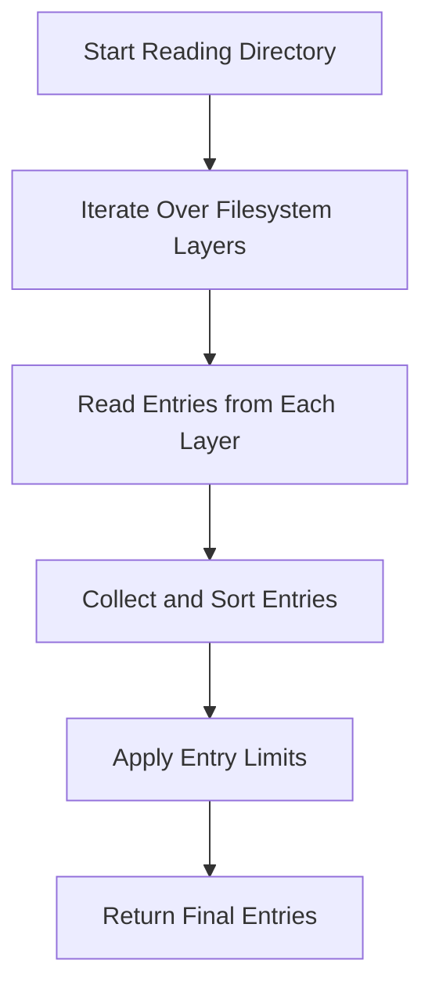

This document will cover the process of reading directory contents, which includes:

1. Initiating the directory read
2. Iterating over filesystem layers
3. Collecting and sorting directory entries
4. Handling specific conditions like whiteout entries.

Technical document: <SwmLink doc-title="Reading Directory Contents">[Reading Directory Contents](/.swm/reading-directory-contents.fljqb508.sw.md)</SwmLink>

# [Initiating the Directory Read](https://app.swimm.io/repos/Z2l0aHViJTNBJTNBZGF0YWRvZy1hZ2VudCUzQSUzQVN3aW1tLURlbW8=/docs/fljqb508#readdir-function)

The process begins with initiating the directory read. This involves calling a function that starts reading the contents of a specified directory. The function is designed to handle the directory name and set a limit on the number of entries to be read. This step is crucial for ensuring that the directory read process is initiated correctly and that the system knows which directory to read and how many entries to expect.

# [Iterating Over Filesystem Layers](https://app.swimm.io/repos/Z2l0aHViJTNBJTNBZGF0YWRvZy1hZ2VudCUzQSUzQVN3aW1tLURlbW8=/docs/fljqb508#readdirn-function)

Once the directory read is initiated, the next step is to iterate over the filesystem layers. This involves processing each layer of the filesystem to read the directory contents. The system will continue to iterate over the layers until it successfully reads the directory or encounters an error. This step ensures that all potential sources of directory entries are considered, providing a comprehensive view of the directory contents.

# [Collecting and Sorting Directory Entries](https://app.swimm.io/repos/Z2l0aHViJTNBJTNBZGF0YWRvZy1hZ2VudCUzQSUzQVN3aW1tLURlbW8=/docs/fljqb508#handling-directory-entries)

After iterating over the filesystem layers, the next step is to collect and sort the directory entries. This involves gathering all the entries read from the different layers into a single collection. The entries are then sorted to ensure they are in a consistent order. This step is important for organizing the directory contents in a way that is easy to understand and navigate for the end user.

# [Handling Specific Conditions](https://app.swimm.io/repos/Z2l0aHViJTNBJTNBZGF0YWRvZy1hZ2VudCUzQSUzQVN3aW1tLURlbW8=/docs/fljqb508#readdirlayer-function)

During the process of reading directory entries, the system must handle specific conditions such as non-existent directories, whiteout entries, and regular files. This involves checking for these conditions and updating the entries map accordingly. For example, whiteout entries are excluded from the final list of directory entries. This step ensures that the directory contents are accurate and do not include any irrelevant or erroneous entries.

&nbsp;

*This is an auto-generated document by Swimm AI 🌊 and has not yet been verified by a human*

<SwmMeta version="3.0.0" repo-id="Z2l0aHViJTNBJTNBZGF0YWRvZy1hZ2VudCUzQSUzQVN3aW1tLURlbW8=" repo-name="datadog-agent">Powered by [Swimm](/)</SwmMeta>
