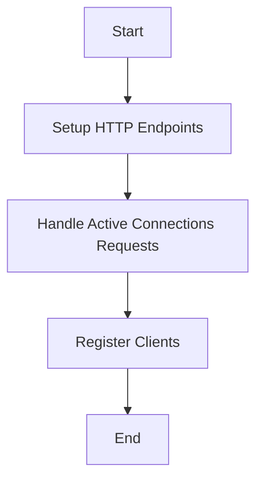

This document will cover the process of registering network tracer endpoints, which includes:

1. Setting up HTTP endpoints
2. Handling requests for active connections
3. Registering clients for network tracing.

Technical document: <SwmLink doc-title="Registering Network Tracer Endpoints">[Registering Network Tracer Endpoints](/.swm/registering-network-tracer-endpoints.x90ebz1v.sw.md)</SwmLink>

# [Setting up HTTP Endpoints](https://app.swimm.io/repos/Z2l0aHViJTNBJTNBZGF0YWRvZy1hZ2VudCUzQSUzQVN3aW1tLURlbW8=/docs/x90ebz1v#registering-network-tracer-endpoints)

The process begins by setting up various HTTP endpoints that will handle network tracing requests. These endpoints are essential for interacting with the network tracer, allowing users to retrieve active connections and register clients. The endpoints are designed to handle specific types of requests, ensuring that the network tracer can efficiently process and respond to user queries.

# [Handling Requests for Active Connections](https://app.swimm.io/repos/Z2l0aHViJTNBJTNBZGF0YWRvZy1hZ2VudCUzQSUzQVN3aW1tLURlbW8=/docs/x90ebz1v#getactiveconnections)

When a request is made to retrieve active connections, the corresponding handler processes the request by first identifying the client making the request. It then retrieves the active connections associated with that client. This step is crucial for providing users with up-to-date information about the network connections currently being monitored. The handler ensures that the data is formatted correctly and sent back to the user in a timely manner.

# [Registering Clients for Network Tracing](https://app.swimm.io/repos/Z2l0aHViJTNBJTNBZGF0YWRvZy1hZ2VudCUzQSUzQVN3aW1tLURlbW8=/docs/x90ebz1v#registering-network-tracer-endpoints)

Clients need to be registered to interact with the network tracer. This registration process involves setting up a unique identifier for each client, which is used to track their requests and the data they are interested in. By registering clients, the network tracer can manage multiple users simultaneously, ensuring that each client receives the correct data and that their requests are handled efficiently.

&nbsp;

*This is an auto-generated document by Swimm AI 🌊 and has not yet been verified by a human*

<SwmMeta version="3.0.0" repo-id="Z2l0aHViJTNBJTNBZGF0YWRvZy1hZ2VudCUzQSUzQVN3aW1tLURlbW8=" repo-name="datadog-agent">Powered by [Swimm](/)</SwmMeta>
