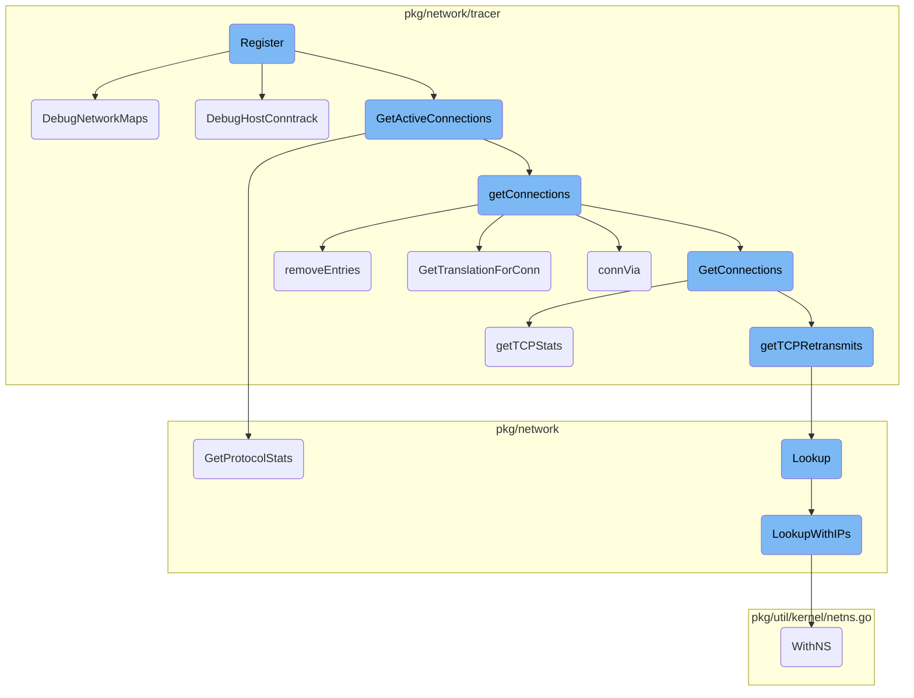
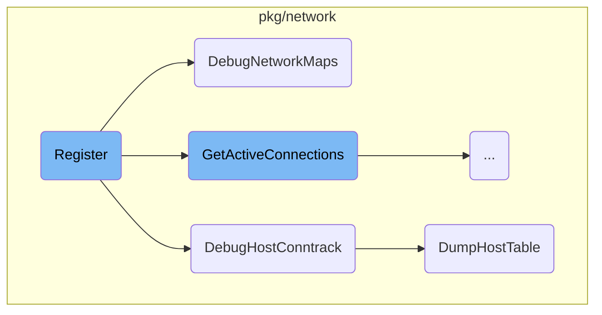
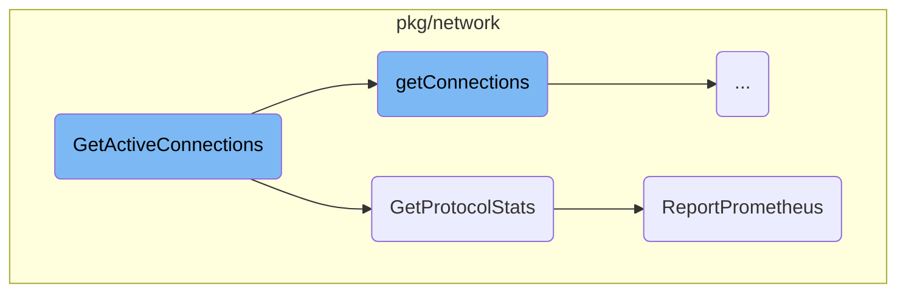
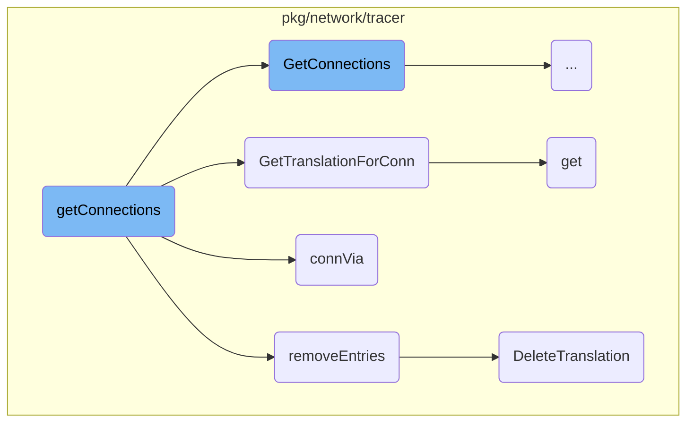
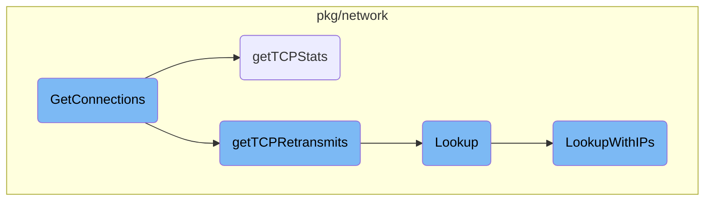

This document explains the process of registering network tracer endpoints. The registration process involves setting up various HTTP endpoints that handle requests related to network tracing, such as retrieving active connections and registering clients.

The registration process starts by setting up HTTP endpoints that will handle different network tracing requests. These endpoints include handlers for retrieving active connections and registering clients. When a request is made to one of these endpoints, the corresponding handler processes the request and returns the necessary data or performs the required action.

Here is a high level diagram of the flow, showing only the most important functions:



# Flow drill down

First, we'll zoom into this section of the flow:



<SwmSnippet path="/cmd/system-probe/modules/network_tracer.go" line="90">

---

## Registering Network Tracer Endpoints

The <SwmToken path="cmd/system-probe/modules/network_tracer.go" pos="90:2:2" line-data="// Register all networkTracer endpoints">`Register`</SwmToken> function registers various HTTP endpoints for network tracing. It sets up handlers for endpoints like <SwmToken path="cmd/system-probe/modules/network_tracer.go" pos="94:6:7" line-data="	httpMux.HandleFunc(&quot;/connections&quot;, utils.WithConcurrencyLimit(utils.DefaultMaxConcurrentRequests, func(w http.ResponseWriter, req *http.Request) {">`/connections`</SwmToken> and <SwmToken path="cmd/system-probe/modules/network_tracer.go" pos="114:6:7" line-data="	httpMux.HandleFunc(&quot;/register&quot;, utils.WithConcurrencyLimit(utils.DefaultMaxConcurrentRequests, func(w http.ResponseWriter, req *http.Request) {">`/register`</SwmToken>, which handle requests to retrieve active connections and register clients respectively.

```go
// Register all networkTracer endpoints
func (nt *networkTracer) Register(httpMux *module.Router) error {
	var runCounter = atomic.NewUint64(0)

	httpMux.HandleFunc("/connections", utils.WithConcurrencyLimit(utils.DefaultMaxConcurrentRequests, func(w http.ResponseWriter, req *http.Request) {
		start := time.Now()
		id := getClientID(req)
		cs, err := nt.tracer.GetActiveConnections(id)
		if err != nil {
			log.Errorf("unable to retrieve connections: %s", err)
			w.WriteHeader(500)
			return
		}
		contentType := req.Header.Get("Accept")
		marshaler := marshal.GetMarshaler(contentType)
		writeConnections(w, marshaler, cs)

		if nt.restartTimer != nil {
			nt.restartTimer.Reset(inactivityRestartDuration)
		}
		count := runCounter.Inc()
```

---

</SwmSnippet>

<SwmSnippet path="/pkg/network/tracer/tracer.go" line="702">

---

## Debugging Network Maps

The <SwmToken path="pkg/network/tracer/tracer.go" pos="702:2:2" line-data="// DebugNetworkMaps returns all connections stored in the BPF maps without modifications from network state">`DebugNetworkMaps`</SwmToken> function retrieves all connections stored in the BPF maps without modifications from the network state. This is useful for debugging purposes as it provides raw connection data.

```go
// DebugNetworkMaps returns all connections stored in the BPF maps without modifications from network state
func (t *Tracer) DebugNetworkMaps() (*network.Connections, error) {
	activeBuffer := network.NewConnectionBuffer(512, 512)
	_, connections, err := t.getConnections(activeBuffer)
	if err != nil {
		return nil, fmt.Errorf("error retrieving connections: %s", err)
	}
	return &network.Connections{
		BufferedData: network.BufferedData{
			Conns: connections,
		},
	}, nil

}
```

---

</SwmSnippet>

<SwmSnippet path="/pkg/network/tracer/tracer.go" line="802">

---

## Debugging Host Conntrack

The <SwmToken path="pkg/network/tracer/tracer.go" pos="802:2:2" line-data="// DebugHostConntrack dumps the NAT conntrack data obtained from the host via netlink.">`DebugHostConntrack`</SwmToken> function dumps the NAT conntrack data obtained from the host via netlink. It retrieves the network namespace and uses the <SwmToken path="pkg/network/tracer/tracer.go" pos="814:10:10" line-data="	table, err := netlink.DumpHostTable(ctx, t.config, t.telemetryComp)">`DumpHostTable`</SwmToken> function to get the conntrack entries.

```go
// DebugHostConntrack dumps the NAT conntrack data obtained from the host via netlink.
func (t *Tracer) DebugHostConntrack(ctx context.Context) (interface{}, error) {
	ns, err := t.config.GetRootNetNs()
	if err != nil {
		return nil, err
	}
	defer ns.Close()

	rootNS, err := kernel.GetInoForNs(ns)
	if err != nil {
		return nil, err
	}
	table, err := netlink.DumpHostTable(ctx, t.config, t.telemetryComp)
	if err != nil {
		return nil, err
	}

	return struct {
		RootNS  uint32
		Entries map[uint32][]netlink.DebugConntrackEntry
	}{
```

---

</SwmSnippet>

<SwmSnippet path="/pkg/network/netlink/conntrack_debug.go" line="88">

---

### Dumping Host Table

The <SwmToken path="pkg/network/netlink/conntrack_debug.go" pos="88:2:2" line-data="// DumpHostTable dumps the host conntrack NAT entries grouped by network namespace">`DumpHostTable`</SwmToken> function dumps the host conntrack NAT entries grouped by network namespace. It iterates over the connection events and decodes them, filtering out non-NAT entries and formatting the remaining entries for debugging.

```go
// DumpHostTable dumps the host conntrack NAT entries grouped by network namespace
func DumpHostTable(ctx context.Context, cfg *config.Config, telemetryComp telemetry.Component) (map[uint32][]DebugConntrackEntry, error) {
	consumer, err := NewConsumer(cfg, telemetryComp)
	if err != nil {
		return nil, err
	}

	decoder := NewDecoder()
	defer consumer.Stop()

	table := make(map[uint32][]DebugConntrackEntry)

	for _, family := range []uint8{unix.AF_INET, unix.AF_INET6} {
		events, err := consumer.DumpTable(family)
		if err != nil {
			return nil, err
		}

		fstr := "v4"
		if family == unix.AF_INET6 {
			fstr = "v6"
```

---

</SwmSnippet>

Now, lets zoom into this section of the flow:



<SwmSnippet path="/pkg/network/tracer/tracer.go" line="403">

---

## <SwmToken path="pkg/network/tracer/tracer.go" pos="403:2:2" line-data="// GetActiveConnections returns the delta for connection info from the last time it was called with the same clientID">`GetActiveConnections`</SwmToken>

The <SwmToken path="pkg/network/tracer/tracer.go" pos="403:2:2" line-data="// GetActiveConnections returns the delta for connection info from the last time it was called with the same clientID">`GetActiveConnections`</SwmToken> function is responsible for retrieving the delta of connection information since the last time it was called with the same client ID. It locks the buffer, flushes pending <SwmToken path="pkg/network/tracer/tracer.go" pos="513:18:18" line-data="// getConnections returns all the active connections in the ebpf maps along with the latest timestamp.  It takes">`ebpf`</SwmToken> tracer data, and retrieves the latest connections. It then calculates the delta of connections, updates telemetry data, and resolves DNS information for the connections. Finally, it returns the updated connections.

```go
// GetActiveConnections returns the delta for connection info from the last time it was called with the same clientID
func (t *Tracer) GetActiveConnections(clientID string) (*network.Connections, error) {
	t.bufferLock.Lock()
	defer t.bufferLock.Unlock()
	if log.ShouldLog(seelog.TraceLvl) {
		log.Tracef("GetActiveConnections clientID=%s", clientID)
	}
	t.ebpfTracer.FlushPending()

	buffer := network.ClientPool.Get(clientID)
	latestTime, active, err := t.getConnections(buffer.ConnectionBuffer)
	if err != nil {
		return nil, fmt.Errorf("error retrieving connections: %s", err)
	}

	delta := t.state.GetDelta(clientID, latestTime, active, t.reverseDNS.GetDNSStats(), t.usmMonitor.GetProtocolStats())

	ips := make(map[util.Address]struct{}, len(delta.Conns)/2)
	var udpConns, tcpConns int
	for i := range delta.Conns {
		conn := &delta.Conns[i]
```

---

</SwmSnippet>

<SwmSnippet path="/pkg/network/usm/monitor.go" line="190">

---

## <SwmToken path="pkg/network/usm/monitor.go" pos="190:2:2" line-data="// GetProtocolStats returns the current stats for all protocols">`GetProtocolStats`</SwmToken>

The <SwmToken path="pkg/network/usm/monitor.go" pos="190:2:2" line-data="// GetProtocolStats returns the current stats for all protocols">`GetProtocolStats`</SwmToken> function returns the current statistics for all protocols. It updates the last update time and calls <SwmToken path="pkg/network/usm/monitor.go" pos="200:3:3" line-data="		telemetry.ReportPrometheus()">`ReportPrometheus`</SwmToken> to report the metrics to Prometheus. This function is crucial for gathering protocol-specific metrics that are used in the telemetry data.

```go
// GetProtocolStats returns the current stats for all protocols
func (m *Monitor) GetProtocolStats() map[protocols.ProtocolType]interface{} {
	if m == nil {
		return nil
	}

	defer func() {
		// Update update time
		now := time.Now().Unix()
		m.lastUpdateTime.Swap(now)
		telemetry.ReportPrometheus()
	}()

	return m.ebpfProgram.getProtocolStats()
```

---

</SwmSnippet>

<SwmSnippet path="/pkg/network/protocols/telemetry/prometheus.go" line="21">

---

## <SwmToken path="pkg/network/protocols/telemetry/prometheus.go" pos="21:2:2" line-data="// ReportPrometheus reports metrics to the Prometheus client.">`ReportPrometheus`</SwmToken>

The <SwmToken path="pkg/network/protocols/telemetry/prometheus.go" pos="21:2:2" line-data="// ReportPrometheus reports metrics to the Prometheus client.">`ReportPrometheus`</SwmToken> function reports metrics to the Prometheus client. It locks the Prometheus mutex, initializes the metrics map if necessary, retrieves the current state and metrics, and updates the Prometheus metrics based on the delta values. This function ensures that the collected metrics are accurately reported to Prometheus for monitoring and analysis.

```go
// ReportPrometheus reports metrics to the Prometheus client.
func ReportPrometheus() {
	prometheusMux.Lock()
	defer prometheusMux.Unlock()

	// Lazily initiate map if necessary
	if prometheusMetrics == nil {
		prometheusMetrics = make(map[string]any)
	}

	deltas := prometheusDelta.GetState("")
	metrics := globalRegistry.GetMetrics(OptPrometheus)
	for _, metric := range metrics {
		base := metric.base()
		pm, ok := prometheusMetrics[base.name]
		if !ok {
			pm = metricToPrometheus(metric)
			prometheusMetrics[base.name] = pm
		}

		switch v := pm.(type) {
```

---

</SwmSnippet>

Now, lets zoom into this section of the flow:



<SwmSnippet path="/pkg/network/tracer/tracer.go" line="513">

---

## <SwmToken path="pkg/network/tracer/tracer.go" pos="513:2:2" line-data="// getConnections returns all the active connections in the ebpf maps along with the latest timestamp.  It takes">`getConnections`</SwmToken>

The <SwmToken path="pkg/network/tracer/tracer.go" pos="513:2:2" line-data="// getConnections returns all the active connections in the ebpf maps along with the latest timestamp.  It takes">`getConnections`</SwmToken> function is responsible for retrieving all active connections from the <SwmToken path="pkg/network/tracer/tracer.go" pos="513:18:18" line-data="// getConnections returns all the active connections in the ebpf maps along with the latest timestamp.  It takes">`ebpf`</SwmToken> maps along with the latest timestamp. It uses a reusable buffer to avoid continuous memory allocation. The function filters out expired and skipped connections, updates telemetry data, and performs gateway resolution and process information addition for each active connection. Finally, it removes stale entries and expired clients from the state.

```go
// getConnections returns all the active connections in the ebpf maps along with the latest timestamp.  It takes
// a reusable buffer for appending the active connections so that this doesn't continuously allocate
func (t *Tracer) getConnections(activeBuffer *network.ConnectionBuffer) (latestUint uint64, activeConnections []network.ConnectionStats, err error) {
	cachedConntrack := newCachedConntrack(t.config.ProcRoot, netlink.NewConntrack, 128)
	defer func() { _ = cachedConntrack.Close() }()

	latestTime, err := ddebpf.NowNanoseconds()
	if err != nil {
		return 0, nil, fmt.Errorf("error retrieving latest timestamp: %s", err)
	}

	var expired []network.ConnectionStats
	err = t.ebpfTracer.GetConnections(activeBuffer, func(c *network.ConnectionStats) bool {
		if t.connectionExpired(c, uint64(latestTime), cachedConntrack) {
			expired = append(expired, *c)
			if c.Type == network.TCP {
				tracerTelemetry.expiredTCPConns.Inc()
			}
			tracerTelemetry.closedConns.IncWithTags(c.Type.Tags())
			return false
		}
```

---

</SwmSnippet>

<SwmSnippet path="/pkg/network/tracer/tracer.go" line="584">

---

### <SwmToken path="pkg/network/tracer/tracer.go" pos="584:9:9" line-data="func (t *Tracer) removeEntries(entries []network.ConnectionStats) {">`removeEntries`</SwmToken>

The <SwmToken path="pkg/network/tracer/tracer.go" pos="584:9:9" line-data="func (t *Tracer) removeEntries(entries []network.ConnectionStats) {">`removeEntries`</SwmToken> function removes expired connection entries from the <SwmToken path="pkg/network/tracer/tracer.go" pos="588:13:13" line-data="	// Remove the entries from the eBPF Map">`eBPF`</SwmToken> map and the userspace state. It also deletes the corresponding conntrack entries and logs the removal process.

```go
func (t *Tracer) removeEntries(entries []network.ConnectionStats) {
	now := time.Now()
	// Byte keys of the connections to remove
	toRemove := make([]*network.ConnectionStats, 0, len(entries))
	// Remove the entries from the eBPF Map
	for i := range entries {
		entry := &entries[i]
		err := t.ebpfTracer.Remove(entry)
		if err != nil {
			if !errors.Is(err, ebpf.ErrKeyNotExist) {
				log.Warnf("failed to remove entry from connections: %s", err)
			}
			continue
		}

		// Delete conntrack entry for this connection
		t.conntracker.DeleteTranslation(*entry)

		// Append the connection key to the keys to remove from the userspace state
		toRemove = append(toRemove, entry)
	}
```

---

</SwmSnippet>

<SwmSnippet path="/pkg/network/tracer/ebpf_conntracker.go" line="231">

---

### <SwmToken path="pkg/network/tracer/ebpf_conntracker.go" pos="231:9:9" line-data="func (e *ebpfConntracker) GetTranslationForConn(stats network.ConnectionStats) *network.IPTranslation {">`GetTranslationForConn`</SwmToken>

The <SwmToken path="pkg/network/tracer/ebpf_conntracker.go" pos="231:9:9" line-data="func (e *ebpfConntracker) GetTranslationForConn(stats network.ConnectionStats) *network.IPTranslation {">`GetTranslationForConn`</SwmToken> function retrieves the IP translation for a given connection by performing a lookup in the conntrack table. It first tries the root namespace and then the connection's namespace if necessary.

```go
func (e *ebpfConntracker) GetTranslationForConn(stats network.ConnectionStats) *network.IPTranslation {
	start := time.Now()
	src := tuplePool.Get()
	defer tuplePool.Put(src)

	toConntrackTupleFromStats(src, &stats)
	if log.ShouldLog(seelog.TraceLvl) {
		log.Tracef("looking up in conntrack (stats): %s", stats)
	}

	// Try the lookup in the root namespace first
	src.Netns = e.rootNS
	if log.ShouldLog(seelog.TraceLvl) {
		log.Tracef("looking up in conntrack (tuple): %s", src)
	}
	dst := e.get(src)

	if dst == nil && stats.NetNS != e.rootNS {
		// Perform another lookup, this time using the connection namespace
		src.Netns = stats.NetNS
		if log.ShouldLog(seelog.TraceLvl) {
```

---

</SwmSnippet>

<SwmSnippet path="/pkg/network/tracer/tracer.go" line="768">

---

### <SwmToken path="pkg/network/tracer/tracer.go" pos="768:9:9" line-data="func (t *Tracer) connVia(cs *network.ConnectionStats) {">`connVia`</SwmToken>

The <SwmToken path="pkg/network/tracer/tracer.go" pos="768:9:9" line-data="func (t *Tracer) connVia(cs *network.ConnectionStats) {">`connVia`</SwmToken> function performs gateway resolution for a given connection if the gateway lookup is enabled.

```go
func (t *Tracer) connVia(cs *network.ConnectionStats) {
	if t.gwLookup == nil {
		return // gateway lookup is not enabled
	}

	cs.Via = t.gwLookup.Lookup(cs)
}
```

---

</SwmSnippet>

<SwmSnippet path="/pkg/network/tracer/ebpf_conntracker.go" line="276">

---

### get

The <SwmToken path="pkg/network/tracer/ebpf_conntracker.go" pos="276:9:9" line-data="func (e *ebpfConntracker) get(src *netebpf.ConntrackTuple) *netebpf.ConntrackTuple {">`get`</SwmToken> function looks up a connection in the <SwmToken path="pkg/network/tracer/ebpf_conntracker.go" pos="279:11:11" line-data="		if !errors.Is(err, ebpf.ErrKeyNotExist) {">`ebpf`</SwmToken> conntrack map and returns the corresponding tuple if found.

```go
func (e *ebpfConntracker) get(src *netebpf.ConntrackTuple) *netebpf.ConntrackTuple {
	dst := tuplePool.Get()
	if err := e.ctMap.Lookup(src, dst); err != nil {
		if !errors.Is(err, ebpf.ErrKeyNotExist) {
			log.Warnf("error looking up connection in ebpf conntrack map: %s", err)
		}
		tuplePool.Put(dst)
		return nil
	}
	return dst
}
```

---

</SwmSnippet>

<SwmSnippet path="/pkg/network/tracer/ebpf_conntracker.go" line="304">

---

### <SwmToken path="pkg/network/tracer/ebpf_conntracker.go" pos="304:9:9" line-data="func (e *ebpfConntracker) DeleteTranslation(stats network.ConnectionStats) {">`DeleteTranslation`</SwmToken>

The <SwmToken path="pkg/network/tracer/ebpf_conntracker.go" pos="304:9:9" line-data="func (e *ebpfConntracker) DeleteTranslation(stats network.ConnectionStats) {">`DeleteTranslation`</SwmToken> function deletes the conntrack entry for a given connection from the <SwmToken path="pkg/network/tracer/tracer.go" pos="513:18:18" line-data="// getConnections returns all the active connections in the ebpf maps along with the latest timestamp.  It takes">`ebpf`</SwmToken> map.

```go
func (e *ebpfConntracker) DeleteTranslation(stats network.ConnectionStats) {
	key := tuplePool.Get()
	defer tuplePool.Put(key)

	toConntrackTupleFromStats(key, &stats)

	dst := e.get(key)
	e.delete(key)
	if dst != nil {
		e.delete(dst)
		tuplePool.Put(dst)
	}
}
```

---

</SwmSnippet>

Now, lets zoom into this section of the flow:



<SwmSnippet path="/pkg/network/tracer/connection/tracer.go" line="410">

---

## <SwmToken path="pkg/network/tracer/connection/tracer.go" pos="410:9:9" line-data="func (t *tracer) GetConnections(buffer *network.ConnectionBuffer, filter func(*network.ConnectionStats) bool) error {">`GetConnections`</SwmToken>

The <SwmToken path="pkg/network/tracer/connection/tracer.go" pos="410:9:9" line-data="func (t *tracer) GetConnections(buffer *network.ConnectionBuffer, filter func(*network.ConnectionStats) bool) error {">`GetConnections`</SwmToken> function is responsible for iterating over all active network connections and collecting their statistics. It uses a map to track connections and avoid duplicates, ensuring accurate data collection. The function also filters connections based on a provided filter function and updates TCP statistics and retransmits information.

```go
func (t *tracer) GetConnections(buffer *network.ConnectionBuffer, filter func(*network.ConnectionStats) bool) error {
	// Iterate through all key-value pairs in map
	key, stats := &netebpf.ConnTuple{}, &netebpf.ConnStats{}
	seen := make(map[netebpf.ConnTuple]struct{})
	// connsByTuple is used to detect whether we are iterating over
	// a connection we have previously seen. This can happen when
	// ebpf maps are being iterated over and deleted at the same time.
	// The iteration can reset when that happens.
	// See https://justin.azoff.dev/blog/bpf_map_get_next_key-pitfalls/
	connsByTuple := make(map[netebpf.ConnTuple]uint32)

	// Cached objects
	conn := new(network.ConnectionStats)
	tcp := new(netebpf.TCPStats)

	var tcp4, tcp6, udp4, udp6 float64
	entries := t.conns.Iterate()
	for entries.Next(key, stats) {
		if cookie, exists := connsByTuple[*key]; exists && cookie == stats.Cookie {
			// already seen the connection in current batch processing,
			// due to race between the iterator and bpf_map_delete
```

---

</SwmSnippet>

<SwmSnippet path="/pkg/network/tracer/connection/tracer.go" line="701">

---

### <SwmToken path="pkg/network/tracer/connection/tracer.go" pos="701:2:2" line-data="// getTCPStats reads tcp related stats for the given ConnTuple">`getTCPStats`</SwmToken>

The <SwmToken path="pkg/network/tracer/connection/tracer.go" pos="701:2:2" line-data="// getTCPStats reads tcp related stats for the given ConnTuple">`getTCPStats`</SwmToken> function reads TCP-related statistics for a given connection tuple. It checks if the connection is of type TCP and then looks up the statistics in the <SwmToken path="pkg/network/tracer/connection/tracer.go" pos="702:16:16" line-data="func (t *tracer) getTCPStats(stats *netebpf.TCPStats, tuple *netebpf.ConnTuple) bool {">`TCPStats`</SwmToken> map.

```go
// getTCPStats reads tcp related stats for the given ConnTuple
func (t *tracer) getTCPStats(stats *netebpf.TCPStats, tuple *netebpf.ConnTuple) bool {
	if tuple.Type() != netebpf.TCP {
		return false
	}

	return t.tcpStats.Lookup(tuple, stats) == nil
}
```

---

</SwmSnippet>

<SwmSnippet path="/pkg/network/tracer/connection/tracer.go" line="677">

---

### <SwmToken path="pkg/network/tracer/connection/tracer.go" pos="677:9:9" line-data="func (t *tracer) getTCPRetransmits(tuple *netebpf.ConnTuple, seen map[netebpf.ConnTuple]struct{}) (uint32, bool) {">`getTCPRetransmits`</SwmToken>

The <SwmToken path="pkg/network/tracer/connection/tracer.go" pos="677:9:9" line-data="func (t *tracer) getTCPRetransmits(tuple *netebpf.ConnTuple, seen map[netebpf.ConnTuple]struct{}) (uint32, bool) {">`getTCPRetransmits`</SwmToken> function retrieves the number of TCP retransmits for a given connection tuple. It temporarily sets the PID to 0 for the lookup and then resets it. The function also ensures that retransmits are not over-reported for connections sharing the same socket.

```go
func (t *tracer) getTCPRetransmits(tuple *netebpf.ConnTuple, seen map[netebpf.ConnTuple]struct{}) (uint32, bool) {
	if tuple.Type() != netebpf.TCP {
		return 0, false
	}

	// The PID isn't used as a key in the stats map, we will temporarily set it to 0 here and reset it when we're done
	pid := tuple.Pid
	tuple.Pid = 0

	var retransmits uint32
	if err := t.tcpRetransmits.Lookup(tuple, &retransmits); err == nil {
		// This is required to avoid (over)reporting retransmits for connections sharing the same socket.
		if _, reported := seen[*tuple]; reported {
			ConnTracerTelemetry.PidCollisions.Inc()
			retransmits = 0
		} else {
			seen[*tuple] = struct{}{}
		}
	}

	tuple.Pid = pid
```

---

</SwmSnippet>

<SwmSnippet path="/pkg/network/gateway_lookup_linux.go" line="114">

---

### Lookup

The <SwmToken path="pkg/network/gateway_lookup_linux.go" pos="114:2:2" line-data="// Lookup performs a gateway lookup for connection stats">`Lookup`</SwmToken> function performs a gateway lookup for connection statistics. It determines the destination IP address and calls <SwmToken path="pkg/network/gateway_lookup_linux.go" pos="121:5:5" line-data="	return g.LookupWithIPs(cs.Source, dest, cs.NetNS)">`LookupWithIPs`</SwmToken> to get the gateway information.

```go
// Lookup performs a gateway lookup for connection stats
func (g *gatewayLookup) Lookup(cs *ConnectionStats) *Via {
	dest := cs.Dest
	if cs.IPTranslation != nil {
		dest = cs.IPTranslation.ReplSrcIP
	}

	return g.LookupWithIPs(cs.Source, dest, cs.NetNS)
}
```

---

</SwmSnippet>

<SwmSnippet path="/pkg/network/gateway_lookup_linux.go" line="124">

---

### <SwmToken path="pkg/network/gateway_lookup_linux.go" pos="124:2:2" line-data="// LookupWithIPs performs a gateway lookup given the">`LookupWithIPs`</SwmToken>

The <SwmToken path="pkg/network/gateway_lookup_linux.go" pos="124:2:2" line-data="// LookupWithIPs performs a gateway lookup given the">`LookupWithIPs`</SwmToken> function performs a gateway lookup given the source, destination, and namespace. It checks the route cache and, if necessary, retrieves subnet information for the gateway. The function handles various scenarios, including cache misses and errors, to ensure accurate gateway resolution.

```go
// LookupWithIPs performs a gateway lookup given the
// source, destination, and namespace
func (g *gatewayLookup) LookupWithIPs(source util.Address, dest util.Address, netns uint32) *Via {
	r, ok := g.routeCache.Get(source, dest, netns)
	if !ok {
		return nil
	}

	// if there is no gateway, we don't need to add subnet info
	// for gateway resolution in the backend
	if r.Gateway.IsZero() || r.Gateway.IsUnspecified() {
		return nil
	}

	gatewayLookupTelemetry.subnetCacheLookups.Inc()
	v, ok := g.subnetCache.Get(r.IfIndex)
	if !ok {
		gatewayLookupTelemetry.subnetCacheMisses.Inc()

		var s Subnet
		var err error
```

---

</SwmSnippet>

&nbsp;

*This is an auto-generated document by Swimm AI 🌊 and has not yet been verified by a human*

<SwmMeta version="3.0.0" repo-id="Z2l0aHViJTNBJTNBZGF0YWRvZy1hZ2VudCUzQSUzQVN3aW1tLURlbW8=" repo-name="datadog-agent"><sup>Powered by [Swimm](/)</sup></SwmMeta>
