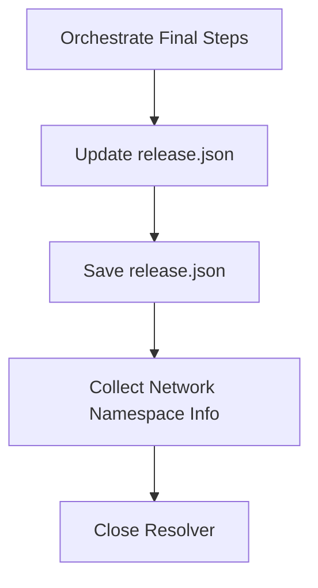

The process of finishing a release involves several steps to ensure that the release is properly finalized and all necessary updates are made. This document will cover:

1. Orchestrating the final steps of the release process
2. Updating the release entry in <SwmPath>[release.json](release.json)</SwmPath>
3. Saving the updated <SwmPath>[release.json](release.json)</SwmPath>
4. Collecting information about network namespaces
5. Closing the resolver and freeing resources

Technical document: <SwmLink doc-title="Finishing a Release">[Finishing a Release](/.swm/finishing-a-release.gg00p3lg.sw.md)</SwmLink>

# [Orchestrating the Final Steps](https://app.swimm.io/repos/Z2l0aHViJTNBJTNBZGF0YWRvZy1hZ2VudCUzQSUzQVN3aW1tLURlbW8=/docs/gg00p3lg#finishing-the-release)

The final steps of the release process are orchestrated to ensure that all necessary updates are made. This involves updating the release entry in the <SwmPath>[release.json](release.json)</SwmPath> file, updating internal module dependencies, branching out, committing changes, and pushing the branch to the upstream repository. This step ensures that the repository is prepared for the new release.

# [Updating release.json](https://app.swimm.io/repos/Z2l0aHViJTNBJTNBZGF0YWRvZy1hZ2VudCUzQSUzQVN3aW1tLURlbW8=/docs/gg00p3lg#updating-releasejson)

The <SwmToken path="tasks/libs/releasing/json.py" pos="291:2:2" line-data="def update_release_json(new_version: Version, max_version: Version):">`update_release_json`</SwmToken> function updates the release entries in <SwmPath>[release.json](release.json)</SwmPath> to prepare for the next RC or final build. It loads the current <SwmPath>[release.json](release.json)</SwmPath>, updates it with the new version information, and then saves the updated file. This step ensures that the <SwmPath>[release.json](release.json)</SwmPath> file reflects the latest version information.

# [Saving release.json](https://app.swimm.io/repos/Z2l0aHViJTNBJTNBZGF0YWRvZy1hZ2VudCUzQSUzQVN3aW1tLURlbW8=/docs/gg00p3lg#saving-releasejson)

The <SwmToken path="tasks/libs/releasing/json.py" pos="51:2:2" line-data="def _save_release_json(release_json):">`_save_release_json`</SwmToken> function saves the updated <SwmPath>[release.json](release.json)</SwmPath> to disk. It writes the JSON data to the <SwmPath>[release.json](release.json)</SwmPath> file with proper formatting. This step ensures that the updated release information is stored persistently.

# [Collecting Network Namespace Info](https://app.swimm.io/repos/Z2l0aHViJTNBJTNBZGF0YWRvZy1hZ2VudCUzQSUzQVN3aW1tLURlbW8=/docs/gg00p3lg#dumping-network-namespaces)

The dump method in the Resolver class iterates over the list of network namespaces and collects information about each namespace. It locks the namespace, gathers details such as namespace ID, handle, and network devices, and optionally takes a snapshot of the interfaces. This step is crucial for debugging and monitoring network namespaces.

# [Closing the Resolver](https://app.swimm.io/repos/Z2l0aHViJTNBJTNBZGF0YWRvZy1hZ2VudCUzQSUzQVN3aW1tLURlbW8=/docs/gg00p3lg#closing-the-resolver)

The Close method in the Resolver class closes the resolver and frees all associated resources. It purges the network namespaces and performs a manual flush of namespaces to ensure that no resources are left hanging. This step ensures that all resources are properly released and no memory leaks occur.

&nbsp;

*This is an auto-generated document by Swimm AI 🌊 and has not yet been verified by a human*

<SwmMeta version="3.0.0" repo-id="Z2l0aHViJTNBJTNBZGF0YWRvZy1hZ2VudCUzQSUzQVN3aW1tLURlbW8=" repo-name="datadog-agent">Powered by [Swimm](/)</SwmMeta>
