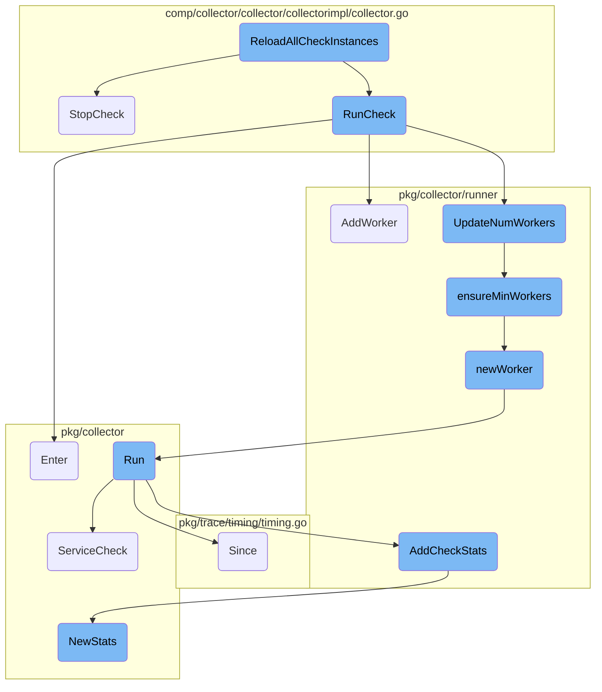
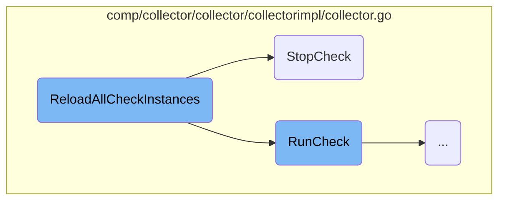
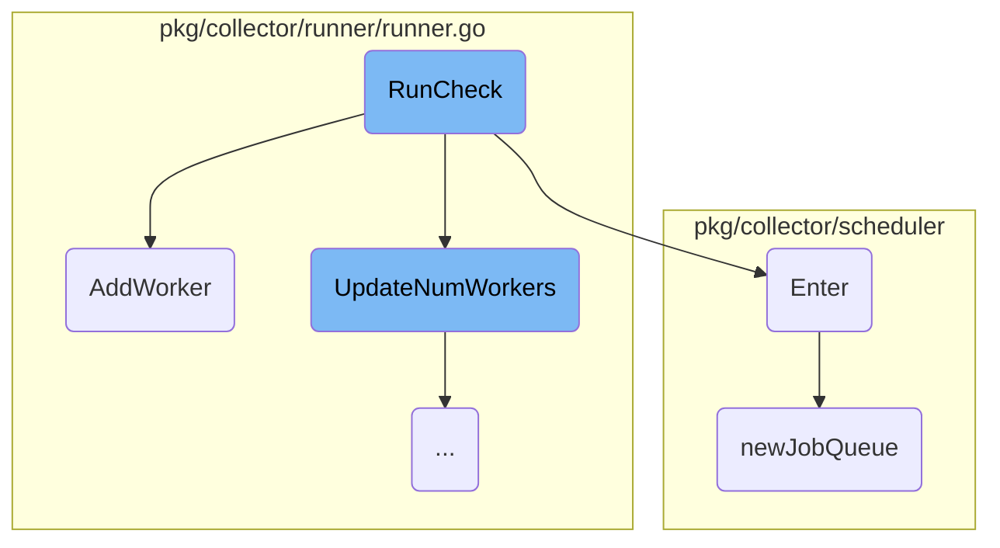
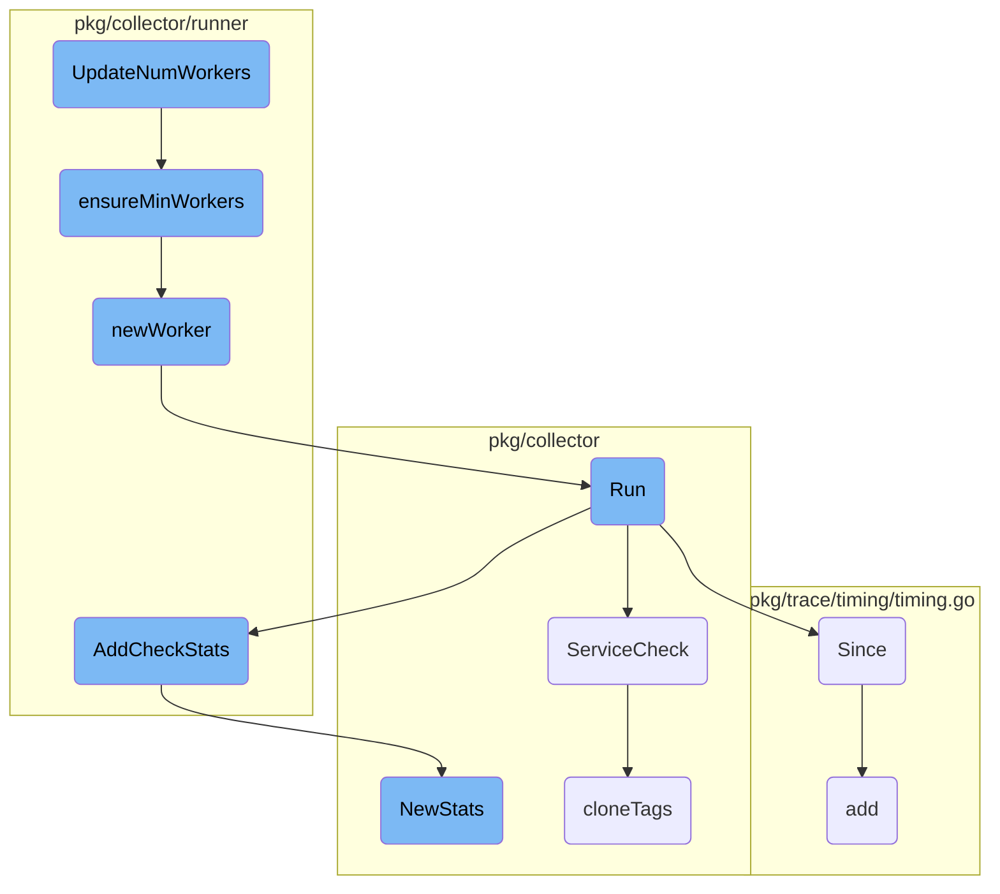

In this document, we will explain the process of reloading all check instances. This involves stopping the current instances of a check and starting new ones with updated configurations.

The flow starts by stopping all the current instances of a check. This is done to ensure that no outdated configurations are running. Once all instances are stopped, new instances are started with the updated configurations. This ensures that the system is always running the latest version of the checks.

Here is a high level diagram of the flow, showing only the most important functions:



# Flow drill down

First, we'll zoom into this section of the flow:



<SwmSnippet path="/comp/collector/collector/collectorimpl/collector.go" line="344">

---

## <SwmToken path="comp/collector/collector/collectorimpl/collector.go" pos="344:2:2" line-data="// ReloadAllCheckInstances completely restarts a check with a new configuration and returns a list of killed check IDs">`ReloadAllCheckInstances`</SwmToken>

The <SwmToken path="comp/collector/collector/collectorimpl/collector.go" pos="344:2:2" line-data="// ReloadAllCheckInstances completely restarts a check with a new configuration and returns a list of killed check IDs">`ReloadAllCheckInstances`</SwmToken> function is responsible for completely restarting a check with a new configuration. It first stops all the old instances of the check by calling <SwmToken path="comp/collector/collector/collectorimpl/collector.go" pos="353:7:7" line-data="		e := c.StopCheck(id)">`StopCheck`</SwmToken> for each instance ID. After successfully stopping the old instances, it starts the new instances by calling <SwmToken path="comp/collector/collector/collectorimpl/collector.go" pos="361:10:10" line-data="		id, e := c.RunCheck(check)">`RunCheck`</SwmToken> for each new check. This ensures that the check is updated with the new configuration and any old instances are properly terminated.

```go
// ReloadAllCheckInstances completely restarts a check with a new configuration and returns a list of killed check IDs
func (c *collectorImpl) ReloadAllCheckInstances(name string, newInstances []check.Check) ([]checkid.ID, error) {
	if !c.started() {
		return nil, fmt.Errorf("The collector is not running")
	}

	// Stop all the old instances
	killed := c.GetAllInstanceIDs(name)
	for _, id := range killed {
		e := c.StopCheck(id)
		if e != nil {
			return nil, fmt.Errorf("Error stopping check %s: %s", id, e)
		}
	}

	// Start the new instances
	for _, check := range newInstances {
		id, e := c.RunCheck(check)
		if e != nil {
			return nil, fmt.Errorf("Error adding check %s: %s", id, e)
		}
```

---

</SwmSnippet>

<SwmSnippet path="/comp/collector/collector/collectorimpl/collector.go" line="225">

---

### Stopping Checks

The <SwmToken path="comp/collector/collector/collectorimpl/collector.go" pos="225:2:2" line-data="// StopCheck halts a check and remove the instance">`StopCheck`</SwmToken> function halts a check and removes the instance. It first verifies if the collector is running and then attempts to find the check instance by its ID. If found, it unschedules the instance, removes it from the checks map, and updates the check's state to 'cancelling'. It then stops the check using the runner and cancels the check. This function ensures that the check is properly stopped and cleaned up from the system.

```go
// StopCheck halts a check and remove the instance
func (c *collectorImpl) StopCheck(id checkid.ID) error {
	if !c.started() {
		return fmt.Errorf("the collector is not running")
	}

	ch, found := c.get(id)
	if !found {
		return fmt.Errorf("cannot find a check with ID %s", id)
	}

	// unschedule the instance
	if err := c.scheduler.Cancel(id); err != nil {
		return fmt.Errorf("an error occurred while canceling the check schedule: %s", err)
	}

	// delete check from checks map even if we encounter an error
	defer c.delete(id)

	// remove the check from the stats map
	defer expvars.RemoveCheckStats(id)
```

---

</SwmSnippet>

Now, lets zoom into this section of the flow:



<SwmSnippet path="/comp/collector/collector/collectorimpl/collector.go" line="187">

---

## <SwmToken path="comp/collector/collector/collectorimpl/collector.go" pos="187:2:2" line-data="// RunCheck sends a Check in the execution queue">`RunCheck`</SwmToken>

The <SwmToken path="comp/collector/collector/collectorimpl/collector.go" pos="187:2:2" line-data="// RunCheck sends a Check in the execution queue">`RunCheck`</SwmToken> function is responsible for sending a check to the execution queue. It first locks the collector to ensure thread safety, then wraps the check with middleware. If the collector is not running or if the check is already running, it returns an error. Otherwise, it schedules the check using the <SwmToken path="comp/collector/collector/collectorimpl/collector.go" pos="204:11:11" line-data="	if err := c.scheduler.Enter(ch); err != nil {">`Enter`</SwmToken> method of the scheduler. Depending on the check's interval, it either adds a temporary runner for long-running checks or updates the number of workers. Finally, it tracks the check instance and notifies that the check is running.

```go
// RunCheck sends a Check in the execution queue
func (c *collectorImpl) RunCheck(inner check.Check) (checkid.ID, error) {
	c.m.Lock()
	defer c.m.Unlock()

	ch := middleware.NewCheckWrapper(inner, c.senderManager)

	var emptyID checkid.ID

	if c.state.Load() != started {
		return emptyID, fmt.Errorf("the collector is not running")
	}

	if _, found := c.checks[ch.ID()]; found {
		return emptyID, fmt.Errorf("a check with ID %s is already running", ch.ID())
	}

	if err := c.scheduler.Enter(ch); err != nil {
		return emptyID, fmt.Errorf("unable to schedule the check: %s", err)
	}

```

---

</SwmSnippet>

<SwmSnippet path="/pkg/collector/runner/runner.go" line="105">

---

## <SwmToken path="pkg/collector/runner/runner.go" pos="105:2:2" line-data="// AddWorker adds a single worker to the runner.">`AddWorker`</SwmToken>

The <SwmToken path="pkg/collector/runner/runner.go" pos="105:2:2" line-data="// AddWorker adds a single worker to the runner.">`AddWorker`</SwmToken> function adds a single worker to the runner. It locks the worker list to ensure thread safety, creates a new worker, and adds it to the list of workers if no error occurs.

```go
// AddWorker adds a single worker to the runner.
func (r *Runner) AddWorker() {
	r.workersLock.Lock()
	defer r.workersLock.Unlock()

	worker, err := r.newWorker()
	if err == nil {
		r.workers[worker.ID] = worker
	}
}
```

---

</SwmSnippet>

<SwmSnippet path="/pkg/collector/scheduler/scheduler.go" line="80">

---

## Enter

The <SwmToken path="pkg/collector/scheduler/scheduler.go" pos="80:2:2" line-data="// Enter schedules a `Check`s for execution accordingly to the `Check.Interval()` value.">`Enter`</SwmToken> function schedules a check for execution based on its interval. If the interval is zero, it enqueues the check to run once. For other intervals, it ensures the interval is valid, logs the scheduling, and adds the check to the appropriate job queue. It also updates various tracking metrics and maps the check to its job queue.

```go
// Enter schedules a `Check`s for execution accordingly to the `Check.Interval()` value.
// If the interval is 0, the check is supposed to run only once.
func (s *Scheduler) Enter(check check.Check) error {
	// enqueue immediately if this is a one-time schedule
	if check.Interval() == 0 {
		s.enqueueOnce(check)
		return nil
	}

	if check.Interval() < minAllowedInterval {
		return fmt.Errorf("schedule interval must be greater than %v or 0", minAllowedInterval)
	}

	log.Infof("Scheduling check %s with an interval of %v", check.ID(), check.Interval())

	// sync when accessing `jobQueues` and `check2queue`
	s.mu.Lock()
	defer s.mu.Unlock()

	if _, ok := s.jobQueues[check.Interval()]; !ok {
		s.jobQueues[check.Interval()] = newJobQueue(check.Interval())
```

---

</SwmSnippet>

<SwmSnippet path="/pkg/collector/scheduler/job.go" line="76">

---

## <SwmToken path="pkg/collector/scheduler/job.go" pos="76:2:2" line-data="// newJobQueue creates a new jobQueue instance">`newJobQueue`</SwmToken>

The <SwmToken path="pkg/collector/scheduler/job.go" pos="76:2:2" line-data="// newJobQueue creates a new jobQueue instance">`newJobQueue`</SwmToken> function creates a new job queue instance for a given interval. It initializes the queue's properties, including its interval, stop channels, health check, and bucket ticker. It then creates the necessary number of job buckets based on the interval and computes the step for sparse scheduling.

```go
// newJobQueue creates a new jobQueue instance
func newJobQueue(interval time.Duration) *jobQueue {
	jq := &jobQueue{
		interval:     interval,
		stop:         make(chan bool),
		stopped:      make(chan bool),
		health:       health.RegisterLiveness(fmt.Sprintf("collector-queue-%vs", interval.Seconds())),
		bucketTicker: time.NewTicker(time.Second),
	}

	var nb int
	if interval <= time.Second {
		nb = 1
	} else {
		nb = int(interval.Truncate(time.Second).Seconds())
	}
	for i := 0; i < nb; i++ {
		bucket := &jobBucket{}
		jq.buckets = append(jq.buckets, bucket)
	}

```

---

</SwmSnippet>

Now, lets zoom into this section of the flow:



<SwmSnippet path="/pkg/collector/runner/runner.go" line="147">

---

## <SwmToken path="pkg/collector/runner/runner.go" pos="147:2:2" line-data="// UpdateNumWorkers checks if the current number of workers is reasonable,">`UpdateNumWorkers`</SwmToken>

The <SwmToken path="pkg/collector/runner/runner.go" pos="147:2:2" line-data="// UpdateNumWorkers checks if the current number of workers is reasonable,">`UpdateNumWorkers`</SwmToken> function is responsible for adjusting the number of workers based on the number of checks that need to be processed. It first checks if the worker count is static and returns if so. Then, it determines the desired number of workers based on the number of checks and calls <SwmToken path="pkg/collector/runner/runner.go" pos="77:2:2" line-data="// EnsureMinWorkers increases the number of workers to match the">`EnsureMinWorkers`</SwmToken> to adjust the worker count accordingly.

```go
// UpdateNumWorkers checks if the current number of workers is reasonable,
// and adds more if needed
func (r *Runner) UpdateNumWorkers(numChecks int64) {
	// We don't want to update the worker count when we have a static number defined
	if r.isStaticWorkerCount {
		return
	}

	// Find which range the number of checks we're running falls in
	var desiredNumWorkers int
	switch {
	case numChecks <= 10:
		desiredNumWorkers = 4
	case numChecks <= 15:
		desiredNumWorkers = 10
	case numChecks <= 20:
		desiredNumWorkers = 15
	case numChecks <= 25:
		desiredNumWorkers = 20
	default:
		desiredNumWorkers = config.MaxNumWorkers
```

---

</SwmSnippet>

<SwmSnippet path="/pkg/collector/runner/runner.go" line="77">

---

## <SwmToken path="pkg/collector/runner/runner.go" pos="77:2:2" line-data="// EnsureMinWorkers increases the number of workers to match the">`EnsureMinWorkers`</SwmToken>

The <SwmToken path="pkg/collector/runner/runner.go" pos="77:2:2" line-data="// EnsureMinWorkers increases the number of workers to match the">`EnsureMinWorkers`</SwmToken> function ensures that the number of workers is at least the desired number. It locks the worker list, calculates the number of additional workers needed, and adds new workers by calling <SwmToken path="pkg/collector/runner/runner.go" pos="91:10:10" line-data="		worker, err := r.newWorker()">`newWorker`</SwmToken>. It logs the number of workers added.

```go
// EnsureMinWorkers increases the number of workers to match the
// `desiredNumWorkers` parameter
func (r *Runner) ensureMinWorkers(desiredNumWorkers int) {
	r.workersLock.Lock()
	defer r.workersLock.Unlock()

	currentWorkers := len(r.workers)

	if desiredNumWorkers <= currentWorkers {
		return
	}

	workersToAdd := desiredNumWorkers - currentWorkers
	for idx := 0; idx < workersToAdd; idx++ {
		worker, err := r.newWorker()
		if err == nil {
			r.workers[worker.ID] = worker
		}
	}

	log.Infof(
```

---

</SwmSnippet>

<SwmSnippet path="/pkg/collector/runner/runner.go" line="116">

---

## <SwmToken path="pkg/collector/runner/runner.go" pos="117:9:9" line-data="func (r *Runner) newWorker() (*worker.Worker, error) {">`newWorker`</SwmToken>

The <SwmToken path="pkg/collector/runner/runner.go" pos="117:9:9" line-data="func (r *Runner) newWorker() (*worker.Worker, error) {">`newWorker`</SwmToken> function creates a new worker and starts it in a separate goroutine. It initializes the worker with necessary parameters and starts its <SwmToken path="pkg/collector/runner/runner.go" pos="134:3:3" line-data="		worker.Run()">`Run`</SwmToken> method. If worker creation fails, it logs an error.

```go
// addWorker adds a new worker running in a separate goroutine
func (r *Runner) newWorker() (*worker.Worker, error) {
	worker, err := worker.NewWorker(
		r.senderManager,
		r.id,
		int(workerIDGenerator.Inc()),
		r.pendingChecksChan,
		r.checksTracker,
		r.ShouldAddCheckStats,
	)
	if err != nil {
		log.Errorf("Runner %d was unable to instantiate a worker: %s", r.id, err)
		return nil, err
	}

	go func() {
		defer r.removeWorker(worker.ID)

		worker.Run()
	}()

```

---

</SwmSnippet>

<SwmSnippet path="/pkg/collector/worker/worker.go" line="121">

---

## Run

The <SwmToken path="pkg/collector/worker/worker.go" pos="121:2:2" line-data="// Run waits for checks and run them as long as they arrive on the channel">`Run`</SwmToken> method of the worker waits for checks to arrive on the channel and processes them. It tracks the utilization, logs the start and end of each check, updates statistics, and handles errors and warnings. It also sends service check statuses if configured.

```go
// Run waits for checks and run them as long as they arrive on the channel
func (w *Worker) Run() {
	log.Debugf("Runner %d, worker %d: Ready to process checks...", w.runnerID, w.ID)

	utilizationTracker := NewUtilizationTracker(w.Name, w.utilizationTickInterval)
	defer utilizationTracker.Stop()

	startUtilizationUpdater(w.Name, utilizationTracker)
	cancel := startTrackerTicker(utilizationTracker, w.utilizationTickInterval)
	defer cancel()

	for check := range w.pendingChecksChan {
		checkLogger := CheckLogger{Check: check}
		longRunning := check.Interval() == 0

		// Add check to tracker if it's not already running
		if !w.checksTracker.AddCheck(check) {
			checkLogger.Debug("Check is already running, skipping execution...")
			continue
		}

```

---

</SwmSnippet>

&nbsp;

*This is an auto-generated document by Swimm AI 🌊 and has not yet been verified by a human*

<SwmMeta version="3.0.0" repo-id="Z2l0aHViJTNBJTNBZGF0YWRvZy1hZ2VudCUzQSUzQVN3aW1tLURlbW8=" repo-name="datadog-agent"><sup>Powered by [Swimm](/)</sup></SwmMeta>
