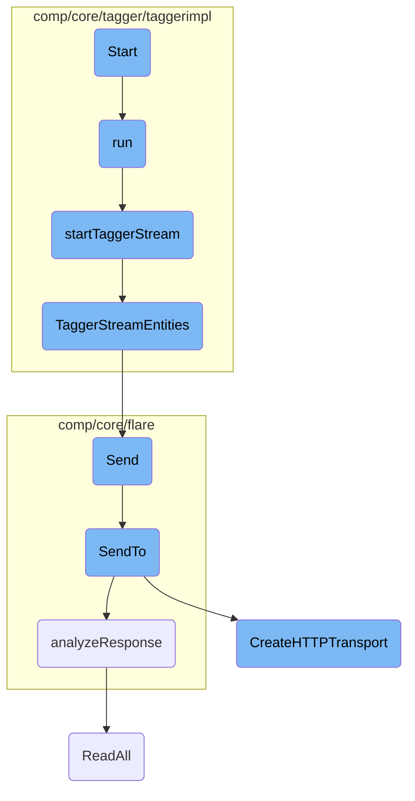

This document explains the initialization and main loop processes for the remote tagger. It covers how the connection to the remote tagger is established, how the main loop handles telemetry collection and stream management, and how the stream is initialized and maintained.

The process starts with initializing the connection to the remote tagger and setting up necessary components like the telemetry ticker and credentials. Once the connection is established, the main loop begins, which handles collecting telemetry data and managing the stream. If the stream is not available or an error occurs, it tries to re-establish the stream. The stream initialization involves setting up a connection with the remote <SwmToken path="comp/core/tagger/taggerimpl/remote/tagger.go" pos="129:18:18" line-data="	// NOTE: we&#39;re using InsecureSkipVerify because the gRPC server only">`gRPC`</SwmToken> endpoint and using exponential backoff for retries. The tagger then subscribes to entity events and streams them to clients, maintaining the connection with <SwmToken path="comp/core/tagger/taggerimpl/remote/tagger.go" pos="323:21:23" line-data="	// returning early when there are no events prevents a keep-alive sent">`keep-alive`</SwmToken> messages.

# Flow drill down



<SwmSnippet path="/comp/core/tagger/taggerimpl/remote/tagger.go" line="122">

---

## Initialization

The <SwmToken path="comp/core/tagger/taggerimpl/remote/tagger.go" pos="122:2:2" line-data="// Start creates the connection to the remote tagger and starts watching for">`Start`</SwmToken> function initializes the connection to the remote tagger and begins watching for events. It sets up the telemetry ticker, context, and credentials for the <SwmToken path="comp/core/tagger/taggerimpl/remote/tagger.go" pos="129:18:18" line-data="	// NOTE: we&#39;re using InsecureSkipVerify because the gRPC server only">`gRPC`</SwmToken> connection. After establishing the connection, it starts the tagger stream and runs the main loop in a separate goroutine.

```go
// Start creates the connection to the remote tagger and starts watching for
// events.
func (t *Tagger) Start(ctx context.Context) error {
	t.telemetryTicker = time.NewTicker(1 * time.Minute)

	t.ctx, t.cancel = context.WithCancel(ctx)

	// NOTE: we're using InsecureSkipVerify because the gRPC server only
	// persists its TLS certs in memory, and we currently have no
	// infrastructure to make them available to clients. This is NOT
	// equivalent to grpc.WithInsecure(), since that assumes a non-TLS
	// connection.
	creds := credentials.NewTLS(&tls.Config{
		InsecureSkipVerify: true,
	})

	var err error
	t.conn, err = grpc.DialContext( //nolint:staticcheck // TODO (ASC) fix grpc.DialContext is deprecated
		t.ctx,
		t.options.Target,
		grpc.WithTransportCredentials(creds),
```

---

</SwmSnippet>

<SwmSnippet path="/comp/core/tagger/taggerimpl/remote/tagger.go" line="270">

---

## Main Loop

The <SwmToken path="comp/core/tagger/taggerimpl/remote/tagger.go" pos="270:9:9" line-data="func (t *Tagger) run() {">`run`</SwmToken> function is the main loop that handles telemetry collection and stream management. It attempts to receive data from the stream and processes the response. If the stream is nil or an error occurs, it tries to re-establish the stream.

```go
func (t *Tagger) run() {
	for {
		select {
		case <-t.telemetryTicker.C:
			t.store.collectTelemetry()
			continue
		case <-t.ctx.Done():
			return
		default:
		}

		if t.stream == nil {
			if err := t.startTaggerStream(noTimeout); err != nil {
				log.Warnf("error received trying to start stream with target %q: %s", t.options.Target, err)
				continue
			}
		}

		var response *pb.StreamTagsResponse
		err := grpcutil.DoWithTimeout(func() error {
			var err error
```

---

</SwmSnippet>

<SwmSnippet path="/comp/core/tagger/taggerimpl/remote/tagger.go" line="366">

---

## Stream Initialization

The <SwmToken path="comp/core/tagger/taggerimpl/remote/tagger.go" pos="366:2:2" line-data="// startTaggerStream tries to establish a stream with the remote gRPC endpoint.">`startTaggerStream`</SwmToken> function tries to establish a stream with the remote <SwmToken path="comp/core/tagger/taggerimpl/remote/tagger.go" pos="366:20:20" line-data="// startTaggerStream tries to establish a stream with the remote gRPC endpoint.">`gRPC`</SwmToken> endpoint. It uses exponential backoff for retries and sets up the stream context with an authorization token.

```go
// startTaggerStream tries to establish a stream with the remote gRPC endpoint.
// Since the entire remote tagger really depends on this working, it'll keep on
// retrying with an exponential backoff until maxElapsed (or forever if
// maxElapsed == 0) or the tagger is stopped.
func (t *Tagger) startTaggerStream(maxElapsed time.Duration) error {
	expBackoff := backoff.NewExponentialBackOff()
	expBackoff.InitialInterval = 500 * time.Millisecond
	expBackoff.MaxInterval = 5 * time.Minute
	expBackoff.MaxElapsedTime = maxElapsed

	return backoff.Retry(func() error {
		select {
		case <-t.ctx.Done():
			return &backoff.PermanentError{Err: errTaggerStreamNotStarted}
		default:
		}

		token, err := t.options.TokenFetcher()
		if err != nil {
			log.Infof("unable to fetch auth token, will possibly retry: %s", err)
			return err
```

---

</SwmSnippet>

<SwmSnippet path="/comp/core/tagger/taggerimpl/server/server.go" line="41">

---

## Streaming Entities

The <SwmToken path="comp/core/tagger/taggerimpl/server/server.go" pos="41:2:2" line-data="// TaggerStreamEntities subscribes to added, removed, or changed entities in the Tagger">`TaggerStreamEntities`</SwmToken> function subscribes to entity events in the tagger and streams them to clients. It handles sending events and <SwmToken path="comp/core/tagger/taggerimpl/remote/tagger.go" pos="323:21:23" line-data="	// returning early when there are no events prevents a keep-alive sent">`keep-alive`</SwmToken> messages to maintain the connection.

```go
// TaggerStreamEntities subscribes to added, removed, or changed entities in the Tagger
// and streams them to clients as pb.StreamTagsResponse events. Filtering is as
// of yet not implemented.
func (s *Server) TaggerStreamEntities(in *pb.StreamTagsRequest, out pb.AgentSecure_TaggerStreamEntitiesServer) error {
	cardinality, err := proto.Pb2TaggerCardinality(in.GetCardinality())
	if err != nil {
		return err
	}

	// NOTE: StreamTagsRequest can specify filters, but they cannot be
	// implemented since the tagger has no concept of container metadata.
	// these filters will be introduced when we implement a container
	// metadata service that can receive them as is from the tagger.

	eventCh := s.taggerComponent.Subscribe(cardinality)
	defer s.taggerComponent.Unsubscribe(eventCh)

	ticker := time.NewTicker(streamKeepAliveInterval)
	defer ticker.Stop()
	for {
		select {
```

---

</SwmSnippet>

&nbsp;

*This is an auto-generated document by Swimm AI 🌊 and has not yet been verified by a human*

<SwmMeta version="3.0.0" repo-id="Z2l0aHViJTNBJTNBZGF0YWRvZy1hZ2VudCUzQSUzQVN3aW1tLURlbW8=" repo-name="datadog-agent"><sup>Powered by [Swimm](/)</sup></SwmMeta>
