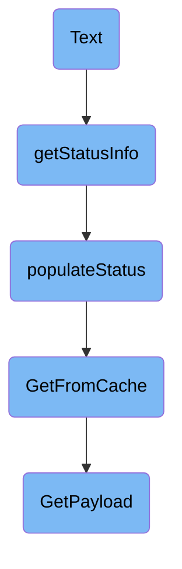

In this document, we will explain the process of rendering text output for the Datadog Agent. The process involves gathering status information, populating status data, retrieving cached metadata, and generating a metadata payload.

The flow starts with gathering status information, which involves creating a map and populating it with data. This data is then used to render the text output. The status data is populated by retrieving hostname statistics and metadata from the cache. If the metadata is not found in the cache, a new payload is generated by collecting various pieces of information such as hostname data, system statistics, and other metadata.

# Flow drill down



<SwmSnippet path="/pkg/status/clusteragent/hostname/status.go" line="55">

---

## Rendering Text Output

The <SwmToken path="pkg/status/clusteragent/hostname/status.go" pos="55:2:2" line-data="// Text renders the text output">`Text`</SwmToken> function is responsible for rendering the text output. It uses the <SwmToken path="pkg/status/clusteragent/hostname/status.go" pos="57:3:5" line-data="	return status.RenderText(templatesFS, &quot;hostname.tmpl&quot;, buffer, p.getStatusInfo())">`status.RenderText`</SwmToken> method to generate the output based on the <SwmPath>[pkg/status/clusteragent/hostname/status_templates/hostname.tmpl](pkg/status/clusteragent/hostname/status_templates/hostname.tmpl)</SwmPath> template and the data provided by the <SwmToken path="pkg/status/clusteragent/hostname/status.go" pos="57:22:22" line-data="	return status.RenderText(templatesFS, &quot;hostname.tmpl&quot;, buffer, p.getStatusInfo())">`getStatusInfo`</SwmToken> function.

```go
// Text renders the text output
func (p Provider) Text(_ bool, buffer io.Writer) error {
	return status.RenderText(templatesFS, "hostname.tmpl", buffer, p.getStatusInfo())
}
```

---

</SwmSnippet>

<SwmSnippet path="/pkg/status/clusteragent/hostname/status.go" line="65">

---

## Gathering Status Information

The <SwmToken path="pkg/status/clusteragent/hostname/status.go" pos="65:8:8" line-data="func (p Provider) getStatusInfo() map[string]interface{} {">`getStatusInfo`</SwmToken> function gathers status information by creating a map and populating it with data using the <SwmToken path="pkg/status/clusteragent/hostname/status.go" pos="68:1:1" line-data="	populateStatus(stats, p.config)">`populateStatus`</SwmToken> function. This map is then returned to be used in rendering the text output.

```go
func (p Provider) getStatusInfo() map[string]interface{} {
	stats := make(map[string]interface{})

	populateStatus(stats, p.config)

	return stats
}
```

---

</SwmSnippet>

<SwmSnippet path="/pkg/status/clusteragent/hostname/status.go" line="73">

---

### Populating Status Data

The <SwmToken path="pkg/status/clusteragent/hostname/status.go" pos="73:2:2" line-data="func populateStatus(stats map[string]interface{}, config config.Component) {">`populateStatus`</SwmToken> function fills the provided map with hostname statistics and metadata. It retrieves hostname statistics from the <SwmToken path="pkg/status/clusteragent/hostname/status.go" pos="74:9:9" line-data="	hostnameStatsJSON := []byte(expvar.Get(&quot;hostname&quot;).String())">`expvar`</SwmToken> package and metadata from the cache using the <SwmToken path="pkg/status/clusteragent/hostname/status.go" pos="79:7:7" line-data="	hostMetadata := hostMetadataUtils.GetFromCache(context.TODO(), config)">`GetFromCache`</SwmToken> function.

```go
func populateStatus(stats map[string]interface{}, config config.Component) {
	hostnameStatsJSON := []byte(expvar.Get("hostname").String())
	hostnameStats := make(map[string]interface{})
	json.Unmarshal(hostnameStatsJSON, &hostnameStats) //nolint:errcheck
	stats["hostnameStats"] = hostnameStats

	hostMetadata := hostMetadataUtils.GetFromCache(context.TODO(), config)
	metadataStats := make(map[string]interface{})
	hostMetadataBytes, _ := json.Marshal(hostMetadata)
	json.Unmarshal(hostMetadataBytes, &metadataStats) //nolint:errcheck

	stats["metadata"] = metadataStats
}
```

---

</SwmSnippet>

<SwmSnippet path="/comp/metadata/host/hostimpl/utils/host.go" line="201">

---

## Retrieving Cached Metadata

The <SwmToken path="comp/metadata/host/hostimpl/utils/host.go" pos="201:2:2" line-data="// GetFromCache returns the payload from the cache if it exists, otherwise it creates it.">`GetFromCache`</SwmToken> function attempts to retrieve the metadata payload from the cache. If the payload is not found in the cache, it calls the <SwmToken path="comp/metadata/host/hostimpl/utils/host.go" pos="206:3:3" line-data="		return GetPayload(ctx, conf)">`GetPayload`</SwmToken> function to generate a new payload.

```go
// GetFromCache returns the payload from the cache if it exists, otherwise it creates it.
// The metadata reporting should always grab it fresh. Any other uses, e.g. status, should use this
func GetFromCache(ctx context.Context, conf config.Reader) *Payload {
	data, found := cache.Cache.Get(hostCacheKey)
	if !found {
		return GetPayload(ctx, conf)
	}
	return data.(*Payload)
}
```

---

</SwmSnippet>

<SwmSnippet path="/comp/metadata/host/hostimpl/utils/host.go" line="169">

---

### Generating Metadata Payload

The <SwmToken path="comp/metadata/host/hostimpl/utils/host.go" pos="169:2:2" line-data="// GetPayload builds a metadata payload every time is called.">`GetPayload`</SwmToken> function generates a metadata payload by collecting various pieces of information such as hostname data, system statistics, and other metadata. This payload is then cached for future use.

```go
// GetPayload builds a metadata payload every time is called.
// Some data is collected only once, some is cached, some is collected at every call.
func GetPayload(ctx context.Context, conf config.Reader) *Payload {
	hostnameData, err := hostname.GetWithProvider(ctx)
	if err != nil {
		log.Errorf("Error grabbing hostname for status: %v", err)
		hostnameData = hostname.Data{Hostname: "unknown", Provider: "unknown"}
	}

	meta := GetMeta(ctx, conf)
	meta.Hostname = hostnameData.Hostname

	p := &Payload{
		Os:            osName,
		AgentFlavor:   flavor.GetFlavor(),
		PythonVersion: python.GetPythonInfo(),
		SystemStats:   getSystemStats(),
		Meta:          meta,
		HostTags:      hosttags.Get(ctx, false, conf),
		ContainerMeta: containerMetadata.Get(1 * time.Second),
		NetworkMeta:   getNetworkMeta(ctx),
```

---

</SwmSnippet>

&nbsp;

*This is an auto-generated document by Swimm AI 🌊 and has not yet been verified by a human*

<SwmMeta version="3.0.0" repo-id="Z2l0aHViJTNBJTNBZGF0YWRvZy1hZ2VudCUzQSUzQVN3aW1tLURlbW8=" repo-name="datadog-agent"><sup>Powered by [Swimm](/)</sup></SwmMeta>
