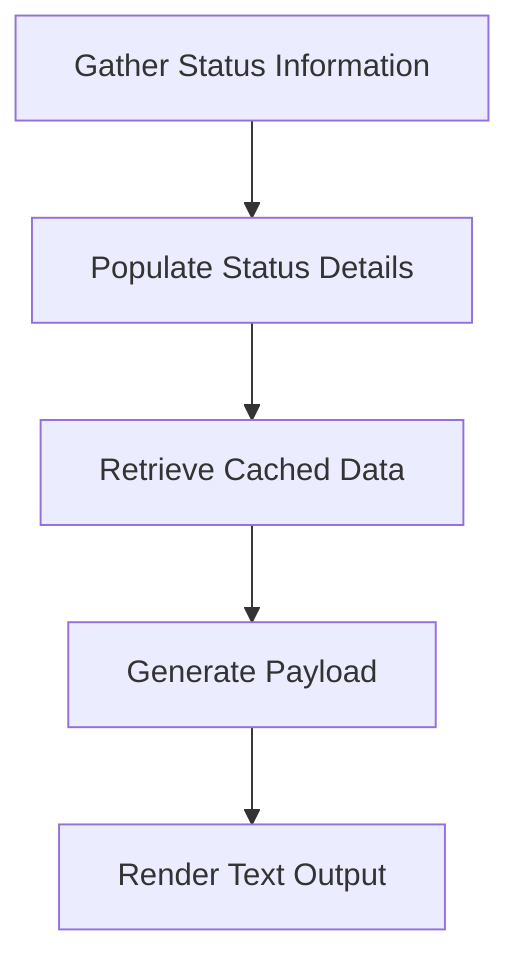

This document will cover the process of rendering text output for status information. We'll cover:

1. Gathering status information
2. Populating status details
3. Retrieving cached data
4. Generating payload
5. Rendering the text output.

Technical document: <SwmLink doc-title="Rendering Text Output for Status Information">[Rendering Text Output for Status Information](/.swm/rendering-text-output-for-status-information.llw7ojtq.sw.md)</SwmLink>

# [Gathering Status Information](https://app.swimm.io/repos/Z2l0aHViJTNBJTNBZGF0YWRvZy1hZ2VudCUzQSUzQVN3aW1tLURlbW8=/docs/llw7ojtq#gathering-status-information)

The process begins with gathering status information. This involves creating a map to hold various status details. The map is populated with data such as hostname statistics, metadata from the cache, host tags, and host information. This map is then used to render the text output.

# [Populating Status Details](https://app.swimm.io/repos/Z2l0aHViJTNBJTNBZGF0YWRvZy1hZ2VudCUzQSUzQVN3aW1tLURlbW8=/docs/llw7ojtq#populating-status-details)

The next step is to populate the map with detailed status information. This includes retrieving hostname statistics, metadata from the cache, host tags, and host information. The data is then added to the map, which will be used to generate the final status output.

# [Retrieving Cached Data](https://app.swimm.io/repos/Z2l0aHViJTNBJTNBZGF0YWRvZy1hZ2VudCUzQSUzQVN3aW1tLURlbW8=/docs/llw7ojtq#retrieving-cached-data)

The process then attempts to retrieve the payload from the cache. If the payload is not found in the cache, a new payload is generated and cached for future use. This ensures that the most up-to-date information is always available for rendering the status output.

# [Generating Payload](https://app.swimm.io/repos/Z2l0aHViJTNBJTNBZGF0YWRvZy1hZ2VudCUzQSUzQVN3aW1tLURlbW8=/docs/llw7ojtq#generating-payload)

If the required data is not found in the cache, a new payload is generated. This involves collecting various pieces of information such as hostname data, system statistics, host tags, and other metadata. The generated payload is then cached for future use and returned.

# [Rendering the Text Output](https://app.swimm.io/repos/Z2l0aHViJTNBJTNBZGF0YWRvZy1hZ2VudCUzQSUzQVN3aW1tLURlbW8=/docs/llw7ojtq#rendering-text-output)

Finally, the gathered information is used to render the text output. This is done using a predefined template that formats the status details into a readable text format. The rendered text output provides a comprehensive overview of the current status information.

&nbsp;

*This is an auto-generated document by Swimm AI 🌊 and has not yet been verified by a human*

<SwmMeta version="3.0.0" repo-id="Z2l0aHViJTNBJTNBZGF0YWRvZy1hZ2VudCUzQSUzQVN3aW1tLURlbW8=" repo-name="datadog-agent">Powered by [Swimm](/)</SwmMeta>
