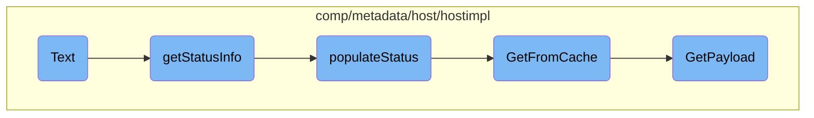

In this document, we will explain the process of rendering text output for status information. The process involves gathering status details, populating these details, retrieving cached data, and generating a payload if necessary.

The flow starts with gathering status information, which involves creating a map and filling it with various status details. These details include hostname statistics, metadata from the cache, host tags, and host information. If the required data is not found in the cache, a new payload is generated and cached for future use. Finally, the gathered information is used to render the text output based on a predefined template.

# Flow drill down



<SwmSnippet path="/comp/metadata/host/hostimpl/status.go" line="80">

---

## Rendering Text Output

The <SwmToken path="comp/metadata/host/hostimpl/status.go" pos="80:2:2" line-data="// Text renders the text output">`Text`</SwmToken> function is responsible for rendering the text output. It uses the <SwmToken path="comp/metadata/host/hostimpl/status.go" pos="82:3:5" line-data="	return status.RenderText(templatesFS, &quot;host.tmpl&quot;, buffer, p.getStatusInfo())">`status.RenderText`</SwmToken> method to generate the output based on the <SwmPath>[comp/metadata/host/hostimpl/status_templates/host.tmpl](comp/metadata/host/hostimpl/status_templates/host.tmpl)</SwmPath> template and the data obtained from the <SwmToken path="comp/metadata/host/hostimpl/status.go" pos="82:22:22" line-data="	return status.RenderText(templatesFS, &quot;host.tmpl&quot;, buffer, p.getStatusInfo())">`getStatusInfo`</SwmToken> function.

```go
// Text renders the text output
func (p StatusProvider) Text(_ bool, buffer io.Writer) error {
	return status.RenderText(templatesFS, "host.tmpl", buffer, p.getStatusInfo())
}
```

---

</SwmSnippet>

<SwmSnippet path="/comp/metadata/host/hostimpl/status.go" line="40">

---

## Gathering Status Information

The <SwmToken path="comp/metadata/host/hostimpl/status.go" pos="40:8:8" line-data="func (p StatusProvider) getStatusInfo() map[string]interface{} {">`getStatusInfo`</SwmToken> function gathers status information by creating a map and populating it with various status details using the <SwmToken path="comp/metadata/host/hostimpl/status.go" pos="43:3:3" line-data="	p.populateStatus(stats)">`populateStatus`</SwmToken> function. This map is then returned to be used in rendering the text output.

```go
func (p StatusProvider) getStatusInfo() map[string]interface{} {
	stats := make(map[string]interface{})

	p.populateStatus(stats)

	return stats
}
```

---

</SwmSnippet>

<SwmSnippet path="/comp/metadata/host/hostimpl/status.go" line="48">

---

### Populating Status Details

The <SwmToken path="comp/metadata/host/hostimpl/status.go" pos="48:8:8" line-data="func (p StatusProvider) populateStatus(stats map[string]interface{}) {">`populateStatus`</SwmToken> function fills the provided map with detailed status information. It retrieves hostname statistics, metadata from the cache, host tags, and host information. This data is then added to the map, which is used to generate the final status output.

```go
func (p StatusProvider) populateStatus(stats map[string]interface{}) {
	hostnameStatsJSON := []byte(expvar.Get("hostname").String())
	hostnameStats := make(map[string]interface{})
	json.Unmarshal(hostnameStatsJSON, &hostnameStats) //nolint:errcheck
	stats["hostnameStats"] = hostnameStats

	payload := utils.GetFromCache(context.TODO(), p.Config)
	metadataStats := make(map[string]interface{})
	payloadBytes, _ := json.Marshal(payload)

	json.Unmarshal(payloadBytes, &metadataStats) //nolint:errcheck

	stats["metadata"] = metadataStats

	hostTags := make([]string, 0, len(payload.HostTags.System)+len(payload.HostTags.GoogleCloudPlatform))
	hostTags = append(hostTags, payload.HostTags.System...)
	hostTags = append(hostTags, payload.HostTags.GoogleCloudPlatform...)
	stats["hostTags"] = hostTags
	hostinfo := utils.GetInformation()
	hostinfoMap := make(map[string]interface{})
	hostinfoBytes, _ := json.Marshal(hostinfo)
```

---

</SwmSnippet>

<SwmSnippet path="/comp/metadata/host/hostimpl/utils/host.go" line="201">

---

## Retrieving Cached Data

The <SwmToken path="comp/metadata/host/hostimpl/utils/host.go" pos="201:2:2" line-data="// GetFromCache returns the payload from the cache if it exists, otherwise it creates it.">`GetFromCache`</SwmToken> function attempts to retrieve the payload from the cache. If the payload is not found in the cache, it calls the <SwmToken path="comp/metadata/host/hostimpl/utils/host.go" pos="206:3:3" line-data="		return GetPayload(ctx, conf)">`GetPayload`</SwmToken> function to generate a new payload and then caches it for future use.

```go
// GetFromCache returns the payload from the cache if it exists, otherwise it creates it.
// The metadata reporting should always grab it fresh. Any other uses, e.g. status, should use this
func GetFromCache(ctx context.Context, conf config.Reader) *Payload {
	data, found := cache.Cache.Get(hostCacheKey)
	if !found {
		return GetPayload(ctx, conf)
	}
	return data.(*Payload)
}
```

---

</SwmSnippet>

<SwmSnippet path="/comp/metadata/host/hostimpl/utils/host.go" line="169">

---

### Generating Payload

The <SwmToken path="comp/metadata/host/hostimpl/utils/host.go" pos="169:2:2" line-data="// GetPayload builds a metadata payload every time is called.">`GetPayload`</SwmToken> function generates a metadata payload by collecting various pieces of information such as hostname data, system statistics, host tags, and other metadata. This payload is then cached for future use and returned.

```go
// GetPayload builds a metadata payload every time is called.
// Some data is collected only once, some is cached, some is collected at every call.
func GetPayload(ctx context.Context, conf config.Reader) *Payload {
	hostnameData, err := hostname.GetWithProvider(ctx)
	if err != nil {
		log.Errorf("Error grabbing hostname for status: %v", err)
		hostnameData = hostname.Data{Hostname: "unknown", Provider: "unknown"}
	}

	meta := GetMeta(ctx, conf)
	meta.Hostname = hostnameData.Hostname

	p := &Payload{
		Os:            osName,
		AgentFlavor:   flavor.GetFlavor(),
		PythonVersion: python.GetPythonInfo(),
		SystemStats:   getSystemStats(),
		Meta:          meta,
		HostTags:      hosttags.Get(ctx, false, conf),
		ContainerMeta: containerMetadata.Get(1 * time.Second),
		NetworkMeta:   getNetworkMeta(ctx),
```

---

</SwmSnippet>

&nbsp;

*This is an auto-generated document by Swimm AI 🌊 and has not yet been verified by a human*

<SwmMeta version="3.0.0" repo-id="Z2l0aHViJTNBJTNBZGF0YWRvZy1hZ2VudCUzQSUzQVN3aW1tLURlbW8=" repo-name="datadog-agent"><sup>Powered by [Swimm](/)</sup></SwmMeta>
