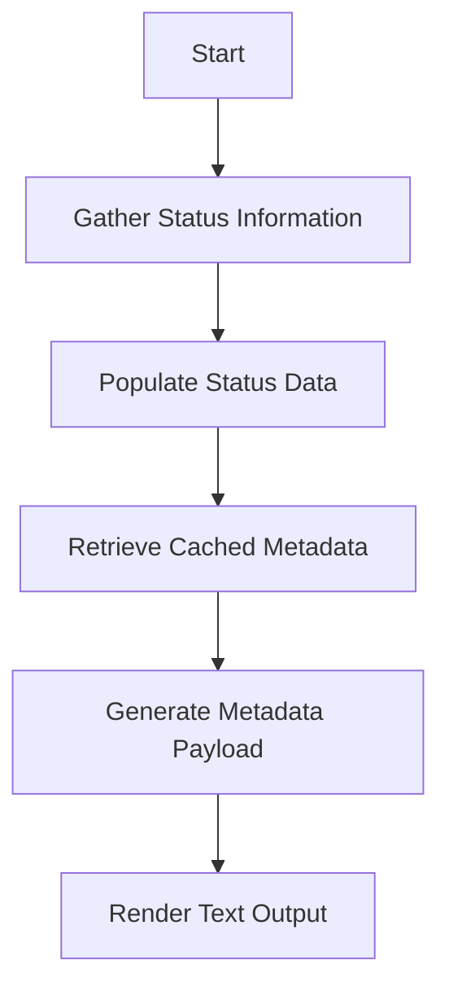

This document will cover the process of rendering text output for the Datadog Agent. We'll cover:

1. Gathering status information
2. Populating status data
3. Retrieving cached metadata
4. Generating a metadata payload.

Technical document: <SwmLink doc-title="Rendering Text Output Flow">[Rendering Text Output Flow](/.swm/rendering-text-output-flow.bv4bbsya.sw.md)</SwmLink>

# [Gathering Status Information](https://app.swimm.io/repos/Z2l0aHViJTNBJTNBZGF0YWRvZy1hZ2VudCUzQSUzQVN3aW1tLURlbW8=/docs/bv4bbsya#gathering-status-information)

The process begins by gathering status information. This involves creating a map to store various pieces of data. This map will be populated with relevant status information that will later be used to render the text output. The status information includes details about the hostname and other system statistics.

# [Populating Status Data](https://app.swimm.io/repos/Z2l0aHViJTNBJTNBZGF0YWRvZy1hZ2VudCUzQSUzQVN3aW1tLURlbW8=/docs/bv4bbsya#populating-status-data)

Next, the status data is populated. This step involves filling the map created in the previous step with hostname statistics and metadata. Hostname statistics are retrieved from a specific package, and metadata is fetched from a cache. If the metadata is not found in the cache, it will be generated anew. This ensures that the status data is comprehensive and up-to-date.

# [Retrieving Cached Metadata](https://app.swimm.io/repos/Z2l0aHViJTNBJTNBZGF0YWRvZy1hZ2VudCUzQSUzQVN3aW1tLURlbW8=/docs/bv4bbsya#retrieving-cached-metadata)

In this step, the system attempts to retrieve the metadata payload from the cache. If the metadata is found in the cache, it is used directly. If not, the system proceeds to generate a new metadata payload. This step is crucial for ensuring that the metadata used in the status data is current and accurate.

# [Generating Metadata Payload](https://app.swimm.io/repos/Z2l0aHViJTNBJTNBZGF0YWRvZy1hZ2VudCUzQSUzQVN3aW1tLURlbW8=/docs/bv4bbsya#generating-metadata-payload)

If the metadata is not found in the cache, a new metadata payload is generated. This involves collecting various pieces of information such as hostname data, system statistics, and other relevant metadata. The newly generated payload is then cached for future use. This step ensures that all necessary information is available for rendering the text output.

&nbsp;

*This is an auto-generated document by Swimm AI 🌊 and has not yet been verified by a human*

<SwmMeta version="3.0.0" repo-id="Z2l0aHViJTNBJTNBZGF0YWRvZy1hZ2VudCUzQSUzQVN3aW1tLURlbW8=" repo-name="datadog-agent">Powered by [Swimm](/)</SwmMeta>
