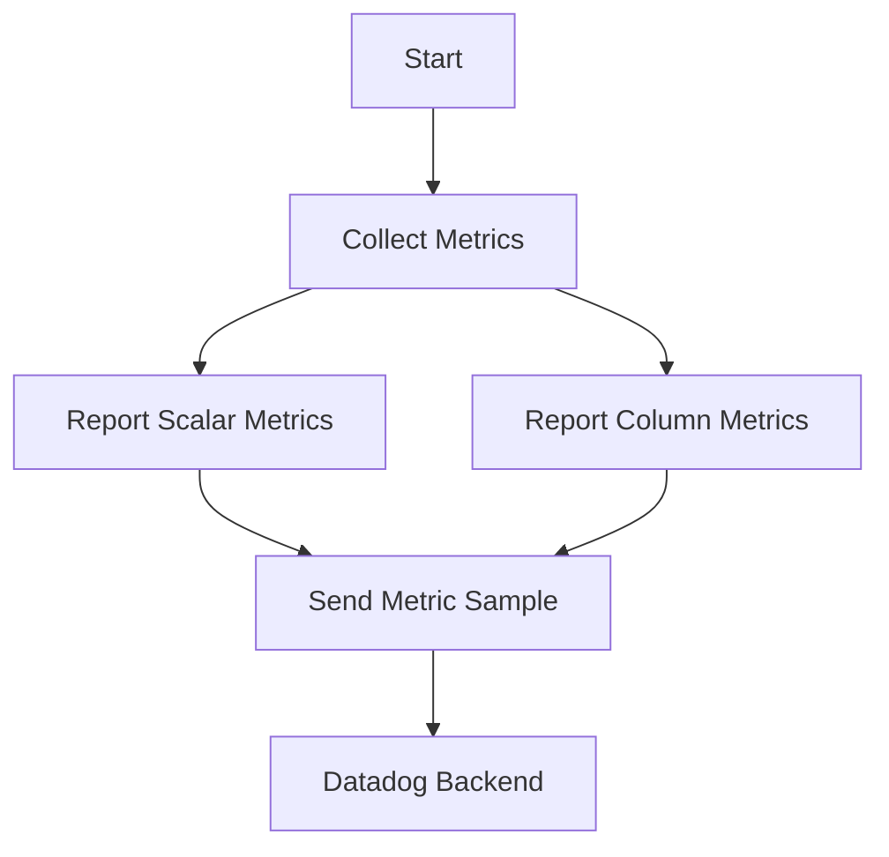

# Overview

Report metrics is a process where the <SwmToken path="pkg/collector/corechecks/snmp/internal/report/report_metrics.go" pos="23:2:2" line-data="// MetricSender is a wrapper around sender.Sender">`MetricSender`</SwmToken> collects and sends metric samples to the Datadog backend for monitoring and analysis. This document will cover the main methods involved in this process, including <SwmToken path="pkg/collector/corechecks/snmp/internal/report/report_metrics.go" pos="51:2:2" line-data="// ReportMetrics reports metrics using Sender">`ReportMetrics`</SwmToken>, <SwmToken path="pkg/collector/corechecks/snmp/internal/report/report_metrics.go" pos="58:10:10" line-data="			sample, err := ms.reportScalarMetrics(metric, values, tags)">`reportScalarMetrics`</SwmToken>, <SwmToken path="pkg/collector/corechecks/snmp/internal/report/report_metrics.go" pos="67:7:7" line-data="			samples := ms.reportColumnMetrics(metric, values, tags)">`reportColumnMetrics`</SwmToken>, and <SwmToken path="pkg/collector/corechecks/snmp/internal/report/report_metrics.go" pos="124:3:3" line-data="	ms.sendMetric(sample)">`sendMetric`</SwmToken>.

<SwmSnippet path="/pkg/collector/corechecks/snmp/internal/report/report_metrics.go" line="23">

---

# <SwmToken path="pkg/collector/corechecks/snmp/internal/report/report_metrics.go" pos="23:2:2" line-data="// MetricSender is a wrapper around sender.Sender">`MetricSender`</SwmToken> Class

The <SwmToken path="pkg/collector/corechecks/snmp/internal/report/report_metrics.go" pos="23:2:2" line-data="// MetricSender is a wrapper around sender.Sender">`MetricSender`</SwmToken> class is responsible for wrapping around the <SwmToken path="pkg/collector/corechecks/snmp/internal/report/report_metrics.go" pos="23:12:14" line-data="// MetricSender is a wrapper around sender.Sender">`sender.Sender`</SwmToken> and managing the collection and submission of metrics.

```go
// MetricSender is a wrapper around sender.Sender
type MetricSender struct {
	sender                  sender.Sender
	hostname                string
	submittedMetrics        int
	interfaceConfigs        []snmpintegration.InterfaceConfig
	interfaceBandwidthState InterfaceBandwidthState
}
```

---

</SwmSnippet>

<SwmSnippet path="/pkg/collector/corechecks/snmp/internal/report/report_metrics.go" line="51">

---

# <SwmToken path="pkg/collector/corechecks/snmp/internal/report/report_metrics.go" pos="51:2:2" line-data="// ReportMetrics reports metrics using Sender">`ReportMetrics`</SwmToken> Method

The <SwmToken path="pkg/collector/corechecks/snmp/internal/report/report_metrics.go" pos="51:2:2" line-data="// ReportMetrics reports metrics using Sender">`ReportMetrics`</SwmToken> method in <SwmToken path="pkg/collector/corechecks/snmp/internal/report/report_metrics.go" pos="52:6:6" line-data="func (ms *MetricSender) ReportMetrics(metrics []profiledefinition.MetricsConfig, values *valuestore.ResultValueStore, tags []string) {">`MetricSender`</SwmToken> handles the reporting of both scalar and column metrics by iterating through the provided metrics configuration.

```go
// ReportMetrics reports metrics using Sender
func (ms *MetricSender) ReportMetrics(metrics []profiledefinition.MetricsConfig, values *valuestore.ResultValueStore, tags []string) {
	scalarSamples := make(map[string]MetricSample)
	columnSamples := make(map[string]map[string]MetricSample)

	for _, metric := range metrics {
		if metric.IsScalar() {
			sample, err := ms.reportScalarMetrics(metric, values, tags)
			if err != nil {
				continue
			}
			if _, ok := EvaluatedSampleDependencies[sample.symbol.Name]; !ok {
				continue
			}
			scalarSamples[sample.symbol.Name] = sample
		} else if metric.IsColumn() {
			samples := ms.reportColumnMetrics(metric, values, tags)

			for name, sampleRows := range samples {
				if _, ok := EvaluatedSampleDependencies[name]; !ok {
					continue
```

---

</SwmSnippet>

<SwmSnippet path="/pkg/collector/corechecks/snmp/internal/report/report_metrics.go" line="108">

---

# <SwmToken path="pkg/collector/corechecks/snmp/internal/report/report_metrics.go" pos="108:9:9" line-data="func (ms *MetricSender) reportScalarMetrics(metric profiledefinition.MetricsConfig, values *valuestore.ResultValueStore, tags []string) (MetricSample, error) {">`reportScalarMetrics`</SwmToken> Method

For scalar metrics, the <SwmToken path="pkg/collector/corechecks/snmp/internal/report/report_metrics.go" pos="108:9:9" line-data="func (ms *MetricSender) reportScalarMetrics(metric profiledefinition.MetricsConfig, values *valuestore.ResultValueStore, tags []string) (MetricSample, error) {">`reportScalarMetrics`</SwmToken> method is called, which retrieves the scalar value, tags it appropriately, and sends it as a <SwmToken path="pkg/collector/corechecks/snmp/internal/report/report_metrics.go" pos="108:34:34" line-data="func (ms *MetricSender) reportScalarMetrics(metric profiledefinition.MetricsConfig, values *valuestore.ResultValueStore, tags []string) (MetricSample, error) {">`MetricSample`</SwmToken>.

```go
func (ms *MetricSender) reportScalarMetrics(metric profiledefinition.MetricsConfig, values *valuestore.ResultValueStore, tags []string) (MetricSample, error) {
	value, err := getScalarValueFromSymbol(values, metric.Symbol)
	if err != nil {
		log.Debugf("report scalar: error getting scalar value: %v", err)
		return MetricSample{}, err
	}

	scalarTags := utils.CopyStrings(tags)
	scalarTags = append(scalarTags, metric.GetSymbolTags()...)
	sample := MetricSample{
		value:      value,
		tags:       scalarTags,
		symbol:     metric.Symbol,
		forcedType: metric.MetricType,
		options:    metric.Options,
	}
	ms.sendMetric(sample)
	return sample, nil
}
```

---

</SwmSnippet>

<SwmSnippet path="/pkg/collector/corechecks/snmp/internal/report/report_metrics.go" line="128">

---

# <SwmToken path="pkg/collector/corechecks/snmp/internal/report/report_metrics.go" pos="128:9:9" line-data="func (ms *MetricSender) reportColumnMetrics(metricConfig profiledefinition.MetricsConfig, values *valuestore.ResultValueStore, tags []string) map[string]map[string]MetricSample {">`reportColumnMetrics`</SwmToken> Method

For column metrics, the <SwmToken path="pkg/collector/corechecks/snmp/internal/report/report_metrics.go" pos="128:9:9" line-data="func (ms *MetricSender) reportColumnMetrics(metricConfig profiledefinition.MetricsConfig, values *valuestore.ResultValueStore, tags []string) map[string]map[string]MetricSample {">`reportColumnMetrics`</SwmToken> method is used, which processes each column value, tags it, and sends it as a <SwmToken path="pkg/collector/corechecks/snmp/internal/report/report_metrics.go" pos="128:41:41" line-data="func (ms *MetricSender) reportColumnMetrics(metricConfig profiledefinition.MetricsConfig, values *valuestore.ResultValueStore, tags []string) map[string]map[string]MetricSample {">`MetricSample`</SwmToken>.

```go
func (ms *MetricSender) reportColumnMetrics(metricConfig profiledefinition.MetricsConfig, values *valuestore.ResultValueStore, tags []string) map[string]map[string]MetricSample {
	rowTagsCache := make(map[string][]string)
	samples := map[string]map[string]MetricSample{}
	for _, symbol := range metricConfig.Symbols {
		var metricValues map[string]valuestore.ResultValue

		if symbol.ConstantValueOne {
			metricValues = getConstantMetricValues(metricConfig.MetricTags, values)
		} else {
			var err error
			metricValues, err = getColumnValueFromSymbol(values, symbol)
			if err != nil {
				log.Debugf("report column: error getting column value: %v", err)
				continue
			}
		}
		for fullIndex, value := range metricValues {
			// cache row tags by fullIndex to avoid rebuilding it for every column rows
			if _, ok := rowTagsCache[fullIndex]; !ok {
				tmpTags := utils.CopyStrings(tags)
				tmpTags = append(tmpTags, metricConfig.StaticTags...)
```

---

</SwmSnippet>

<SwmSnippet path="/pkg/collector/corechecks/snmp/internal/report/report_metrics.go" line="178">

---

# <SwmToken path="pkg/collector/corechecks/snmp/internal/report/report_metrics.go" pos="178:9:9" line-data="func (ms *MetricSender) sendMetric(metricSample MetricSample) {">`sendMetric`</SwmToken> Method

The <SwmToken path="pkg/collector/corechecks/snmp/internal/report/report_metrics.go" pos="178:9:9" line-data="func (ms *MetricSender) sendMetric(metricSample MetricSample) {">`sendMetric`</SwmToken> method in <SwmToken path="pkg/collector/corechecks/snmp/internal/report/report_metrics.go" pos="178:6:6" line-data="func (ms *MetricSender) sendMetric(metricSample MetricSample) {">`MetricSender`</SwmToken> determines the appropriate metric type (e.g., gauge, rate, counter) and sends the metric sample to the Datadog backend.

```go
func (ms *MetricSender) sendMetric(metricSample MetricSample) {
	metricFullName := "snmp." + metricSample.symbol.Name
	forcedType := metricSample.forcedType
	if metricSample.symbol.MetricType != "" {
		forcedType = metricSample.symbol.MetricType
	}
	if forcedType == "" {
		if metricSample.value.SubmissionType != "" {
			forcedType = metricSample.value.SubmissionType
		} else {
			forcedType = profiledefinition.ProfileMetricTypeGauge
		}
	} else if forcedType == "flag_stream" {
		strValue, err := metricSample.value.ToString()
		if err != nil {
			log.Debugf("error converting value (%#v) to string : %v", metricSample.value, err)
			return
		}
		options := metricSample.options
		floatValue, err := getFlagStreamValue(options.Placement, strValue)
		if err != nil {
```

---

</SwmSnippet>

&nbsp;

*This is an auto-generated document by Swimm AI 🌊 and has not yet been verified by a human*

<SwmMeta version="3.0.0" repo-id="Z2l0aHViJTNBJTNBZGF0YWRvZy1hZ2VudCUzQSUzQVN3aW1tLURlbW8=" repo-name="datadog-agent"><sup>Powered by [Swimm](/)</sup></SwmMeta>
