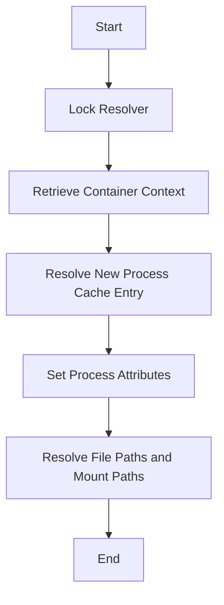

This document will cover the process of resolving process information from kernel maps. We'll cover:

1. Locking the resolver
2. Retrieving container context
3. Resolving new process cache entries
4. Setting process attributes
5. Resolving file paths and mount paths.

Technical document: <SwmLink doc-title="Resolving Process Information from Kernel Maps">[Resolving Process Information from Kernel Maps](/.swm/resolving-process-information-from-kernel-maps.9io6tvib.sw.md)</SwmLink>

# [Locking the Resolver](https://app.swimm.io/repos/Z2l0aHViJTNBJTNBZGF0YWRvZy1hZ2VudCUzQSUzQVN3aW1tLURlbW8=/docs/9io6tvib#locking-the-resolver)

The process begins by locking the resolver to ensure that no other operations interfere with the current process resolution. This step is crucial for maintaining data integrity and preventing race conditions.

# [Retrieving Container Context](https://app.swimm.io/repos/Z2l0aHViJTNBJTNBZGF0YWRvZy1hZ2VudCUzQSUzQVN3aW1tLURlbW8=/docs/9io6tvib#getcontainercontext)

Next, the system retrieves the container context for the process. This involves identifying the container ID and flags associated with the process by parsing the relevant cgroup files. This step is essential for understanding the environment in which the process is running.

# [Resolving New Process Cache Entry](https://app.swimm.io/repos/Z2l0aHViJTNBJTNBZGF0YWRvZy1hZ2VudCUzQSUzQVN3aW1tLURlbW8=/docs/9io6tvib#resolvenewprocesscacheentry)

The system then resolves a new process cache entry. This involves setting various attributes such as the process path, arguments, environment variables, and user and group information. This step ensures that all necessary process information is correctly populated for further use.

# [Setting Process Attributes](https://app.swimm.io/repos/Z2l0aHViJTNBJTNBZGF0YWRvZy1hZ2VudCUzQSUzQVN3aW1tLURlbW8=/docs/9io6tvib#setting-process-users-and-groups)

The process attributes, including user and group information, are set next. This involves resolving and setting the user and group details based on the process's credentials. Accurate user and group context is crucial for security and access control.

# [Resolving File Paths and Mount Paths](https://app.swimm.io/repos/Z2l0aHViJTNBJTNBZGF0YWRvZy1hZ2VudCUzQSUzQVN3aW1tLURlbW8=/docs/9io6tvib#setprocesspath)

Finally, the system resolves the file paths and mount paths for the process. This involves checking the inode validity and resolving the file fields path to get the path details. Ensuring accurate file and mount paths is essential for process tracking and auditing.

&nbsp;

*This is an auto-generated document by Swimm AI 🌊 and has not yet been verified by a human*

<SwmMeta version="3.0.0" repo-id="Z2l0aHViJTNBJTNBZGF0YWRvZy1hZ2VudCUzQSUzQVN3aW1tLURlbW8=" repo-name="datadog-agent">Powered by [Swimm](/)</SwmMeta>
