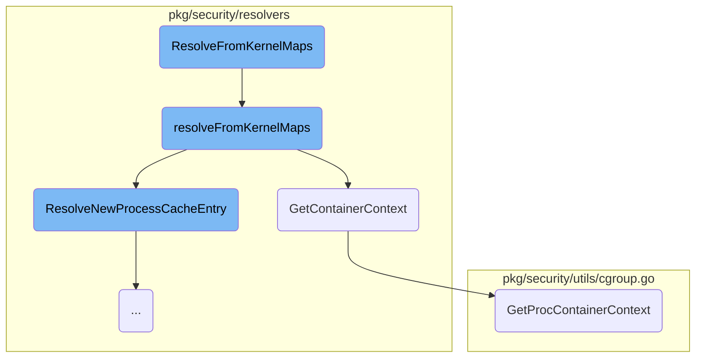
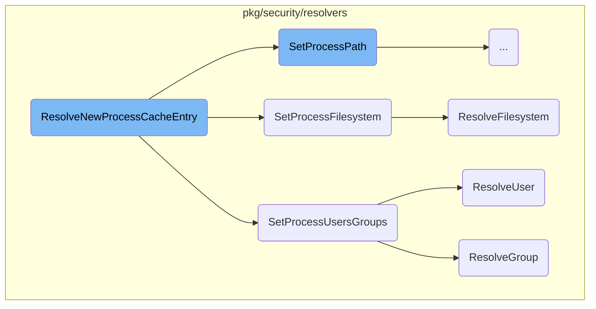

```mermaid
graph TD;
      subgraph pkgsecurityresolvers["pkg/security/resolvers"]
4ac7a031d2f8974f1263ee92e67f766f917ed49a0fa5571d40b4fe074c37c457(SetProcessPath):::mainFlowStyle --> 7482b699e97081732c424128d66d98267bfd467a910bd125822ea00269114824(resolveFileFieldsPath):::mainFlowStyle
end

subgraph pkgsecurityresolvers["pkg/security/resolvers"]
7482b699e97081732c424128d66d98267bfd467a910bd125822ea00269114824(resolveFileFieldsPath):::mainFlowStyle --> 39c6f7b379c565cad5efe17d1ad80fd2ac7a88b8910b084419db575f89ffa469(ResolveFileFieldsPath):::mainFlowStyle
end

subgraph pkgsecurityresolvers["pkg/security/resolvers"]
39c6f7b379c565cad5efe17d1ad80fd2ac7a88b8910b084419db575f89ffa469(ResolveFileFieldsPath):::mainFlowStyle --> 65ce5d27726a10165711c00b6372fd9b76e77e6e53189cde95307eeb4cf7a342(ResolveMountPath):::mainFlowStyle
end

subgraph pkgsecurityresolvers["pkg/security/resolvers"]
65ce5d27726a10165711c00b6372fd9b76e77e6e53189cde95307eeb4cf7a342(ResolveMountPath):::mainFlowStyle --> cbe753168bec62764bb2f05ab545358a96f91813e29f3c1ff1826f5090b8446e(resolveMountPath):::mainFlowStyle
end

subgraph pkgsecurityresolvers["pkg/security/resolvers"]
cbe753168bec62764bb2f05ab545358a96f91813e29f3c1ff1826f5090b8446e(resolveMountPath):::mainFlowStyle --> b5f940d31454c0022f326207488e84139f00e4c0aa88ad773b0b03dff8170f36(reSyncCache):::mainFlowStyle
end


      classDef mainFlowStyle color:#000000,fill:#7CB9F4
classDef rootsStyle color:#000000,fill:#00FFF4
classDef Style1 color:#000000,fill:#00FFAA
classDef Style2 color:#000000,fill:#FFFF00
classDef Style3 color:#000000,fill:#AA7CB9
```

This document explains the process of resolving process information from kernel maps. The process involves several steps, including locking the resolver, retrieving container context, resolving new process cache entries, setting process attributes, and resolving file paths and mount paths.

The flow starts with locking the resolver to ensure thread safety. It then retrieves the container context for the process. Next, it resolves a new process cache entry by setting various attributes like path, arguments, environment variables, and user and group information. The process continues by resolving the file path and mount path for the process, ensuring all necessary information is correctly populated.

Here is a high level diagram of the flow, showing only the most important functions:

```mermaid
graph TD;
      subgraph pkgsecurityresolvers["pkg/security/resolvers"]
ead676f2c425e304baf23a46fafc2cce6e38d7a274880ba1e7be7f5f30faa10e(ResolveFromKernelMaps):::mainFlowStyle --> f87acc6a90320c5bd057775ef3b69753235ce6c28ac81477f1859e342dd12033(resolveFromKernelMaps):::mainFlowStyle
end

subgraph pkgsecurityresolvers["pkg/security/resolvers"]
f87acc6a90320c5bd057775ef3b69753235ce6c28ac81477f1859e342dd12033(resolveFromKernelMaps):::mainFlowStyle --> 7942ab1eee9e2ff2f4ddda12265b46dc683669da18813be18b7cc863049baa94(GetContainerContext)
end

subgraph pkgsecurityresolvers["pkg/security/resolvers"]
f87acc6a90320c5bd057775ef3b69753235ce6c28ac81477f1859e342dd12033(resolveFromKernelMaps):::mainFlowStyle --> 248775cb4095c346a0351378d24cca120c1fbdf5f77ddc7b32ff588f7ecd037f(ResolveNewProcessCacheEntry):::mainFlowStyle
end

subgraph pkgsecurityresolvers["pkg/security/resolvers"]
248775cb4095c346a0351378d24cca120c1fbdf5f77ddc7b32ff588f7ecd037f(ResolveNewProcessCacheEntry):::mainFlowStyle --> 684ce4d54e1bae065e6003b900c4394cef6344349a451d246abd899aeacaa718(SetProcessUsersGroups)
end

subgraph pkgsecurityresolvers["pkg/security/resolvers"]
248775cb4095c346a0351378d24cca120c1fbdf5f77ddc7b32ff588f7ecd037f(ResolveNewProcessCacheEntry):::mainFlowStyle --> d4ae9fe78b0a35d090fc308e24bc446e1cac403088919a4f18213857e41e2d9f(SetProcessFilesystem)
end

subgraph pkgsecurityresolvers["pkg/security/resolvers"]
248775cb4095c346a0351378d24cca120c1fbdf5f77ddc7b32ff588f7ecd037f(ResolveNewProcessCacheEntry):::mainFlowStyle --> 4ac7a031d2f8974f1263ee92e67f766f917ed49a0fa5571d40b4fe074c37c457(SetProcessPath):::mainFlowStyle
end

subgraph pkgsecurityresolvers["pkg/security/resolvers"]
4ac7a031d2f8974f1263ee92e67f766f917ed49a0fa5571d40b4fe074c37c457(SetProcessPath):::mainFlowStyle --> 7482b699e97081732c424128d66d98267bfd467a910bd125822ea00269114824(resolveFileFieldsPath):::mainFlowStyle
end

subgraph pkgsecurityresolvers["pkg/security/resolvers"]
7482b699e97081732c424128d66d98267bfd467a910bd125822ea00269114824(resolveFileFieldsPath):::mainFlowStyle --> 39c6f7b379c565cad5efe17d1ad80fd2ac7a88b8910b084419db575f89ffa469(ResolveFileFieldsPath):::mainFlowStyle
end

subgraph pkgsecurityresolvers["pkg/security/resolvers"]
39c6f7b379c565cad5efe17d1ad80fd2ac7a88b8910b084419db575f89ffa469(ResolveFileFieldsPath):::mainFlowStyle --> 65ce5d27726a10165711c00b6372fd9b76e77e6e53189cde95307eeb4cf7a342(ResolveMountPath):::mainFlowStyle
end

subgraph pkgsecurityresolvers["pkg/security/resolvers"]
65ce5d27726a10165711c00b6372fd9b76e77e6e53189cde95307eeb4cf7a342(ResolveMountPath):::mainFlowStyle --> cbe753168bec62764bb2f05ab545358a96f91813e29f3c1ff1826f5090b8446e(resolveMountPath):::mainFlowStyle
end

subgraph pkgsecurityresolvers["pkg/security/resolvers"]
cbe753168bec62764bb2f05ab545358a96f91813e29f3c1ff1826f5090b8446e(resolveMountPath):::mainFlowStyle --> b5f940d31454c0022f326207488e84139f00e4c0aa88ad773b0b03dff8170f36(reSyncCache):::mainFlowStyle
end


      classDef mainFlowStyle color:#000000,fill:#7CB9F4
classDef rootsStyle color:#000000,fill:#00FFF4
classDef Style1 color:#000000,fill:#00FFAA
classDef Style2 color:#000000,fill:#FFFF00
classDef Style3 color:#000000,fill:#AA7CB9
```



# Flow drill down

First, we'll zoom into this section of the flow:



<SwmSnippet path="/pkg/security/resolvers/process/resolver_ebpf.go" line="780">

---

## <SwmToken path="pkg/security/resolvers/process/resolver_ebpf.go" pos="780:2:2" line-data="// ResolveFromKernelMaps resolves the entry from the kernel maps">`ResolveFromKernelMaps`</SwmToken>

The <SwmToken path="pkg/security/resolvers/process/resolver_ebpf.go" pos="780:2:2" line-data="// ResolveFromKernelMaps resolves the entry from the kernel maps">`ResolveFromKernelMaps`</SwmToken> function is the entry point for resolving process information from kernel maps. It locks the resolver, defers the unlock, and calls <SwmToken path="pkg/security/resolvers/process/resolver_ebpf.go" pos="780:2:2" line-data="// ResolveFromKernelMaps resolves the entry from the kernel maps">`ResolveFromKernelMaps`</SwmToken> to perform the actual resolution.

```go
// ResolveFromKernelMaps resolves the entry from the kernel maps
func (p *EBPFResolver) ResolveFromKernelMaps(pid, tid uint32, inode uint64) *model.ProcessCacheEntry {
	p.Lock()
	defer p.Unlock()
	return p.resolveFromKernelMaps(pid, tid, inode)
}
```

---

</SwmSnippet>

<SwmSnippet path="/pkg/security/resolvers/process/resolver_ebpf.go" line="787">

---

## <SwmToken path="pkg/security/resolvers/process/resolver_ebpf.go" pos="787:9:9" line-data="func (p *EBPFResolver) resolveFromKernelMaps(pid, tid uint32, inode uint64) *model.ProcessCacheEntry {">`resolveFromKernelMaps`</SwmToken>

The <SwmToken path="pkg/security/resolvers/process/resolver_ebpf.go" pos="787:9:9" line-data="func (p *EBPFResolver) resolveFromKernelMaps(pid, tid uint32, inode uint64) *model.ProcessCacheEntry {">`resolveFromKernelMaps`</SwmToken> function performs the core logic of resolving a process cache entry from kernel maps. It first checks if the <SwmToken path="pkg/security/resolvers/process/resolver_ebpf.go" pos="787:11:11" line-data="func (p *EBPFResolver) resolveFromKernelMaps(pid, tid uint32, inode uint64) *model.ProcessCacheEntry {">`pid`</SwmToken> is zero and returns nil if true. It then looks up the <SwmToken path="pkg/security/resolvers/process/resolver_ebpf.go" pos="795:1:1" line-data="	pidCache, err := p.pidCacheMap.LookupBytes(pidb)">`pidCache`</SwmToken> and <SwmToken path="pkg/security/resolvers/process/resolver_ebpf.go" pos="805:1:1" line-data="	procCache, err := p.procCacheMap.LookupBytes(pidCache[0:model.SizeOfCookie])">`procCache`</SwmToken> from the kernel maps. If successful, it creates a new <SwmToken path="pkg/security/resolvers/process/resolver_ebpf.go" pos="787:27:27" line-data="func (p *EBPFResolver) resolveFromKernelMaps(pid, tid uint32, inode uint64) *model.ProcessCacheEntry {">`ProcessCacheEntry`</SwmToken> and unmarshals the container and cgroup contexts. It also resolves paths and other context fields, and finally inserts the entry into the appropriate cache.

```go
func (p *EBPFResolver) resolveFromKernelMaps(pid, tid uint32, inode uint64) *model.ProcessCacheEntry {
	if pid == 0 {
		return nil
	}

	pidb := make([]byte, 4)
	binary.NativeEndian.PutUint32(pidb, pid)

	pidCache, err := p.pidCacheMap.LookupBytes(pidb)
	if err != nil {
		// LookupBytes doesn't return an error if the key is not found thus it is a critical error
		seclog.Errorf("kernel map lookup error: %v", err)
	}
	if pidCache == nil {
		return nil
	}

	// first 4 bytes are the actual cookie
	procCache, err := p.procCacheMap.LookupBytes(pidCache[0:model.SizeOfCookie])
	if err != nil {
		// LookupBytes doesn't return an error if the key is not found thus it is a critical error
```

---

</SwmSnippet>

<SwmSnippet path="/pkg/security/resolvers/container/resolver.go" line="19">

---

### <SwmToken path="pkg/security/resolvers/container/resolver.go" pos="19:2:2" line-data="// GetContainerContext returns the container id of the given pid along with its flags">`GetContainerContext`</SwmToken>

The <SwmToken path="pkg/security/resolvers/container/resolver.go" pos="19:2:2" line-data="// GetContainerContext returns the container id of the given pid along with its flags">`GetContainerContext`</SwmToken> function retrieves the container ID and flags for a given process ID by parsing the <SwmPath>[pkg/security/resolvers/cgroup/](pkg/security/resolvers/cgroup/)</SwmPath> file. It calls <SwmToken path="pkg/security/resolvers/container/resolver.go" pos="22:5:5" line-data="	return utils.GetProcContainerContext(pid, pid)">`GetProcContainerContext`</SwmToken> to perform the actual parsing.

```go
// GetContainerContext returns the container id of the given pid along with its flags
func (cr *Resolver) GetContainerContext(pid uint32) (containerutils.ContainerID, containerutils.CGroupFlags, error) {
	// Parse /proc/[pid]/task/[pid]/cgroup
	return utils.GetProcContainerContext(pid, pid)
}
```

---

</SwmSnippet>

<SwmSnippet path="/pkg/security/utils/cgroup.go" line="83">

---

### <SwmToken path="pkg/security/utils/cgroup.go" pos="83:2:2" line-data="// GetProcContainerContext returns the container ID which the process belongs to along with its manager. Returns &quot;&quot; if the process does not belong">`GetProcContainerContext`</SwmToken>

The <SwmToken path="pkg/security/utils/cgroup.go" pos="83:2:2" line-data="// GetProcContainerContext returns the container ID which the process belongs to along with its manager. Returns &quot;&quot; if the process does not belong">`GetProcContainerContext`</SwmToken> function returns the container ID and cgroup flags for a given process. It retrieves the control groups for the process and iterates through them to find the container context. If the process does not belong to a container, it returns an empty string.

```go
// GetProcContainerContext returns the container ID which the process belongs to along with its manager. Returns "" if the process does not belong
// to a container.
func GetProcContainerContext(tgid, pid uint32) (containerutils.ContainerID, containerutils.CGroupFlags, error) {
	cgroups, err := GetProcControlGroups(tgid, pid)
	if err != nil {
		return "", 0, err
	}

	for _, cgroup := range cgroups {
		if containerID, runtime := cgroup.GetContainerContext(); containerID != "" {
			return containerID, runtime, nil
		}
	}
	return "", 0, nil
}
```

---

</SwmSnippet>

Now, lets zoom into this section of the flow:



<SwmSnippet path="/pkg/security/resolvers/process/resolver_ebpf.go" line="752">

---

## Resolving Process Cache Entry

The function <SwmToken path="pkg/security/resolvers/process/resolver_ebpf.go" pos="752:2:2" line-data="// ResolveNewProcessCacheEntry resolves the context fields of a new process cache entry parsed from kernel data">`ResolveNewProcessCacheEntry`</SwmToken> is responsible for resolving the context fields of a new process cache entry parsed from kernel data. It sets various attributes of the process such as the path, arguments, environment variables, TTY, users, groups, and filesystem. This function ensures that all necessary process information is correctly populated for further use.

```go
// ResolveNewProcessCacheEntry resolves the context fields of a new process cache entry parsed from kernel data
func (p *EBPFResolver) ResolveNewProcessCacheEntry(entry *model.ProcessCacheEntry, ctrCtx *model.ContainerContext) error {
	if _, err := p.SetProcessPath(&entry.FileEvent, entry, ctrCtx); err != nil {
		return &spath.ErrPathResolution{Err: fmt.Errorf("failed to resolve exec path: %w", err)}
	}

	if entry.HasInterpreter() {
		if _, err := p.SetProcessPath(&entry.LinuxBinprm.FileEvent, entry, ctrCtx); err != nil {
			return &spath.ErrPathResolution{Err: fmt.Errorf("failed to resolve interpreter path: %w", err)}
		}
	} else {
		// mark it as resolved to avoid abnormal path later in the call flow
		entry.LinuxBinprm.FileEvent.SetPathnameStr("")
		entry.LinuxBinprm.FileEvent.SetBasenameStr("")
	}

	p.SetProcessArgs(entry)
	p.SetProcessEnvs(entry)
	p.SetProcessTTY(entry)
	p.SetProcessUsersGroups(entry)
	p.ApplyBootTime(entry)
```

---

</SwmSnippet>

<SwmSnippet path="/pkg/security/resolvers/process/resolver_ebpf.go" line="1011">

---

### Setting Process Users and Groups

The function <SwmToken path="pkg/security/resolvers/process/resolver_ebpf.go" pos="1011:2:2" line-data="// SetProcessUsersGroups resolves and set users and groups">`SetProcessUsersGroups`</SwmToken> resolves and sets the user and group information for a process. It uses the <SwmToken path="pkg/security/resolvers/process/resolver_ebpf.go" pos="1013:12:12" line-data="	pce.User, _ = p.userGroupResolver.ResolveUser(int(pce.Credentials.UID), string(pce.ContainerID))">`userGroupResolver`</SwmToken> to fetch user and group details based on the process's credentials, ensuring that the process has accurate user and group context.

```go
// SetProcessUsersGroups resolves and set users and groups
func (p *EBPFResolver) SetProcessUsersGroups(pce *model.ProcessCacheEntry) {
	pce.User, _ = p.userGroupResolver.ResolveUser(int(pce.Credentials.UID), string(pce.ContainerID))
	pce.EUser, _ = p.userGroupResolver.ResolveUser(int(pce.Credentials.EUID), string(pce.ContainerID))
	pce.FSUser, _ = p.userGroupResolver.ResolveUser(int(pce.Credentials.FSUID), string(pce.ContainerID))

	pce.Group, _ = p.userGroupResolver.ResolveGroup(int(pce.Credentials.GID), string(pce.ContainerID))
	pce.EGroup, _ = p.userGroupResolver.ResolveGroup(int(pce.Credentials.EGID), string(pce.ContainerID))
	pce.FSGroup, _ = p.userGroupResolver.ResolveGroup(int(pce.Credentials.FSGID), string(pce.ContainerID))
}
```

---

</SwmSnippet>

<SwmSnippet path="/pkg/security/resolvers/process/resolver_ebpf.go" line="706">

---

### Setting Process Filesystem

The function <SwmToken path="pkg/security/resolvers/process/resolver_ebpf.go" pos="706:2:2" line-data="// SetProcessFilesystem resolves process file system">`SetProcessFilesystem`</SwmToken> resolves the filesystem information for a process. It uses the <SwmToken path="pkg/security/resolvers/process/resolver_ebpf.go" pos="709:10:10" line-data="		fs, err := p.mountResolver.ResolveFilesystem(entry.FileEvent.MountID, entry.FileEvent.Device, entry.Pid, string(entry.ContainerID))">`mountResolver`</SwmToken> to determine the filesystem type based on the process's mount ID and device, ensuring that the process's filesystem context is correctly set.

```go
// SetProcessFilesystem resolves process file system
func (p *EBPFResolver) SetProcessFilesystem(entry *model.ProcessCacheEntry) (string, error) {
	if entry.FileEvent.MountID != 0 {
		fs, err := p.mountResolver.ResolveFilesystem(entry.FileEvent.MountID, entry.FileEvent.Device, entry.Pid, string(entry.ContainerID))
		if err != nil {
			return "", err
		}
		entry.FileEvent.Filesystem = fs
	}

	return entry.FileEvent.Filesystem, nil
}
```

---

</SwmSnippet>

<SwmSnippet path="/pkg/security/resolvers/mount/resolver.go" line="219">

---

### Resolving Filesystem

The function <SwmToken path="pkg/security/resolvers/mount/resolver.go" pos="219:2:2" line-data="// ResolveFilesystem returns the name of the filesystem">`ResolveFilesystem`</SwmToken> returns the name of the filesystem for a given mount ID, device, and process ID. It locks the resolver, resolves the mount information, and retrieves the filesystem type, ensuring thread-safe access to the mount data.

```go
// ResolveFilesystem returns the name of the filesystem
func (mr *Resolver) ResolveFilesystem(mountID uint32, device uint32, pid uint32, containerID string) (string, error) {
	mr.lock.Lock()
	defer mr.lock.Unlock()

	mount, _, _, err := mr.resolveMount(mountID, device, pid, containerID)
	if err != nil {
		return model.UnknownFS, err
	}

	return mount.GetFSType(), nil
}
```

---

</SwmSnippet>

<SwmSnippet path="/pkg/security/resolvers/usergroup/resolver_linux.go" line="154">

---

### Resolving User

The function <SwmToken path="pkg/security/resolvers/usergroup/resolver_linux.go" pos="154:2:2" line-data="// ResolveUser resolves a user id to a username">`ResolveUser`</SwmToken> resolves a user ID to a username. It first checks the cache for the user information and, if not found, refreshes the user cache from the filesystem. This ensures that the process has the correct username associated with its user ID.

```go
// ResolveUser resolves a user id to a username
func (r *Resolver) ResolveUser(uid int, containerID string) (string, error) {
	userCache, found := r.nsUserCache.Get(containerID)
	if found {
		cachedEntry, found := userCache.entries[uid]
		if !found {
			return "", errUserNotFound
		}
		return cachedEntry, nil
	}

	fsys, err := r.getFilesystem(containerID)
	if err != nil {
		return "", err
	}

	userEntries, err := r.refreshUserCache(containerID, fsys)
	if err != nil {
		return "", err
	}

```

---

</SwmSnippet>

<SwmSnippet path="/pkg/security/resolvers/usergroup/resolver_linux.go" line="183">

---

### Resolving Group

The function <SwmToken path="pkg/security/resolvers/usergroup/resolver_linux.go" pos="183:2:2" line-data="// ResolveGroup resolves a group id to a group name">`ResolveGroup`</SwmToken> resolves a group ID to a group name. Similar to <SwmToken path="pkg/security/resolvers/process/resolver_ebpf.go" pos="1013:14:14" line-data="	pce.User, _ = p.userGroupResolver.ResolveUser(int(pce.Credentials.UID), string(pce.ContainerID))">`ResolveUser`</SwmToken>, it checks the cache for the group information and refreshes the group cache from the filesystem if necessary. This ensures that the process has the correct group name associated with its group ID.

```go
// ResolveGroup resolves a group id to a group name
func (r *Resolver) ResolveGroup(gid int, containerID string) (string, error) {
	groupCache, found := r.nsGroupCache.Get(containerID)
	if found {
		cachedEntry, found := groupCache.entries[gid]
		if !found {
			return "", errGroupNotFound
		}
		return cachedEntry, nil
	}

	fsys, err := r.getFilesystem(containerID)
	if err != nil {
		return "", err
	}

	groupEntries, err := r.refreshGroupCache(containerID, fsys)
	if err != nil {
		return "", err
	}

```

---

</SwmSnippet>

Now, lets zoom into this section of the flow:



<SwmSnippet path="/pkg/security/resolvers/process/resolver_ebpf.go" line="665">

---

## <SwmToken path="pkg/security/resolvers/process/resolver_ebpf.go" pos="665:2:2" line-data="// SetProcessPath resolves process file path">`SetProcessPath`</SwmToken>

The <SwmToken path="pkg/security/resolvers/process/resolver_ebpf.go" pos="665:2:2" line-data="// SetProcessPath resolves process file path">`SetProcessPath`</SwmToken> function is responsible for resolving the file path of a process. It first checks if the inode is valid and then calls <SwmToken path="pkg/security/resolvers/process/resolver_ebpf.go" pos="680:19:19" line-data="	pathnameStr, mountPath, source, origin, err := p.resolveFileFieldsPath(&amp;fileEvent.FileFields, pce, ctrCtx)">`resolveFileFieldsPath`</SwmToken> to get the path details. If successful, it sets the path and mount details in the <SwmToken path="pkg/security/resolvers/process/resolver_ebpf.go" pos="666:11:11" line-data="func (p *EBPFResolver) SetProcessPath(fileEvent *model.FileEvent, pce *model.ProcessCacheEntry, ctrCtx *model.ContainerContext) (string, error) {">`fileEvent`</SwmToken> object.

```go
// SetProcessPath resolves process file path
func (p *EBPFResolver) SetProcessPath(fileEvent *model.FileEvent, pce *model.ProcessCacheEntry, ctrCtx *model.ContainerContext) (string, error) {
	onError := func(pathnameStr string, err error) (string, error) {
		fileEvent.SetPathnameStr("")
		fileEvent.SetBasenameStr("")

		p.pathErrStats.Inc()

		return pathnameStr, err
	}

	if fileEvent.Inode == 0 {
		return onError("", &model.ErrInvalidKeyPath{Inode: fileEvent.Inode, MountID: fileEvent.MountID})
	}

	pathnameStr, mountPath, source, origin, err := p.resolveFileFieldsPath(&fileEvent.FileFields, pce, ctrCtx)
	if err != nil {
		return onError(pathnameStr, err)
	}
	setPathname(fileEvent, pathnameStr)
	fileEvent.MountPath = mountPath
```

---

</SwmSnippet>

<SwmSnippet path="/pkg/security/resolvers/process/resolver_ebpf.go" line="639">

---

## <SwmToken path="pkg/security/resolvers/process/resolver_ebpf.go" pos="639:9:9" line-data="func (p *EBPFResolver) resolveFileFieldsPath(e *model.FileFields, pce *model.ProcessCacheEntry, ctrCtx *model.ContainerContext) (string, string, model.MountSource, model.MountOrigin, error) {">`resolveFileFieldsPath`</SwmToken>

The <SwmToken path="pkg/security/resolvers/process/resolver_ebpf.go" pos="639:9:9" line-data="func (p *EBPFResolver) resolveFileFieldsPath(e *model.FileFields, pce *model.ProcessCacheEntry, ctrCtx *model.ContainerContext) (string, string, model.MountSource, model.MountOrigin, error) {">`resolveFileFieldsPath`</SwmToken> function attempts to resolve the file fields path by calling <SwmToken path="pkg/security/resolvers/process/resolver_ebpf.go" pos="639:9:9" line-data="func (p *EBPFResolver) resolveFileFieldsPath(e *model.FileFields, pce *model.ProcessCacheEntry, ctrCtx *model.ContainerContext) (string, string, model.MountSource, model.MountOrigin, error) {">`resolveFileFieldsPath`</SwmToken> from the path resolver. It retries up to three times if necessary, using the parent process cache entry if available.

```go
func (p *EBPFResolver) resolveFileFieldsPath(e *model.FileFields, pce *model.ProcessCacheEntry, ctrCtx *model.ContainerContext) (string, string, model.MountSource, model.MountOrigin, error) {
	var (
		pathnameStr, mountPath string
		source                 model.MountSource
		origin                 model.MountOrigin
		err                    error
		maxDepthRetry          = 3
	)

	for maxDepthRetry > 0 {
		pathnameStr, mountPath, source, origin, err = p.pathResolver.ResolveFileFieldsPath(e, &pce.PIDContext, ctrCtx)
		if err == nil {
			return pathnameStr, mountPath, source, origin, nil
		}
		parent, exists := p.entryCache[pce.PPid]
		if !exists {
			break
		}

		pce = parent
		maxDepthRetry--
```

---

</SwmSnippet>

<SwmSnippet path="/pkg/security/resolvers/path/resolver.go" line="37">

---

### <SwmToken path="pkg/security/resolvers/path/resolver.go" pos="37:2:2" line-data="// ResolveFileFieldsPath resolves an inode/mount ID pair to a full path">`ResolveFileFieldsPath`</SwmToken>

The <SwmToken path="pkg/security/resolvers/path/resolver.go" pos="37:2:2" line-data="// ResolveFileFieldsPath resolves an inode/mount ID pair to a full path">`ResolveFileFieldsPath`</SwmToken> function in the path resolver is called by <SwmToken path="pkg/security/resolvers/path/resolver.go" pos="37:2:2" line-data="// ResolveFileFieldsPath resolves an inode/mount ID pair to a full path">`ResolveFileFieldsPath`</SwmToken>. It resolves an <SwmPath>[pkg/security/resolvers/mount/](pkg/security/resolvers/mount/)</SwmPath> ID pair to a full path and handles various error scenarios, including invalid mount <SwmToken path="tasks/gitlab_helpers.py" pos="90:10:10" line-data="def print_gitlab_object(get_object, ctx, ids, repo=&#39;DataDog/datadog-agent&#39;, jq: str | None = None, jq_colors=True):">`ids`</SwmToken> and fileless events.

```go
// ResolveFileFieldsPath resolves an inode/mount ID pair to a full path
func (r *Resolver) ResolveFileFieldsPath(e *model.FileFields, pidCtx *model.PIDContext, ctrCtx *model.ContainerContext) (string, string, model.MountSource, model.MountOrigin, error) {
	pathStr, err := r.dentryResolver.Resolve(e.PathKey, !e.HasHardLinks())
	if err != nil {
		if _, err := r.mountResolver.IsMountIDValid(e.MountID); errors.Is(err, mount.ErrMountKernelID) {
			return pathStr, "", model.MountSourceUnknown, model.MountOriginUnknown, &ErrPathResolutionNotCritical{Err: err}
		}
		return pathStr, "", model.MountSourceUnknown, model.MountOriginUnknown, &ErrPathResolution{Err: err}
	}

	if e.IsFileless() {
		return pathStr, "", model.MountSourceUnknown, model.MountOriginUnknown, nil
	}

	mountPath, source, origin, err := r.mountResolver.ResolveMountPath(e.MountID, e.Device, pidCtx.Pid, string(ctrCtx.ContainerID))
	if err != nil {
		if _, err := r.mountResolver.IsMountIDValid(e.MountID); errors.Is(err, mount.ErrMountKernelID) {
			return pathStr, "", origin, source, &ErrPathResolutionNotCritical{Err: fmt.Errorf("mount ID(%d) invalid: %w", e.MountID, err)}
		}
		return pathStr, "", source, origin, &ErrPathResolution{Err: err}
	}
```

---

</SwmSnippet>

<SwmSnippet path="/pkg/security/resolvers/mount/resolver.go" line="418">

---

### <SwmToken path="pkg/security/resolvers/mount/resolver.go" pos="418:2:2" line-data="// ResolveMountPath returns the path of a mount identified by its mount ID.">`ResolveMountPath`</SwmToken>

The <SwmToken path="pkg/security/resolvers/mount/resolver.go" pos="418:2:2" line-data="// ResolveMountPath returns the path of a mount identified by its mount ID.">`ResolveMountPath`</SwmToken> function is a wrapper that locks the resolver and calls <SwmToken path="pkg/security/resolvers/mount/resolver.go" pos="418:2:2" line-data="// ResolveMountPath returns the path of a mount identified by its mount ID.">`ResolveMountPath`</SwmToken> to get the mount path details.

```go
// ResolveMountPath returns the path of a mount identified by its mount ID.
func (mr *Resolver) ResolveMountPath(mountID uint32, device uint32, pid uint32, containerID string) (string, model.MountSource, model.MountOrigin, error) {
	mr.lock.Lock()
	defer mr.lock.Unlock()

	return mr.resolveMountPath(mountID, device, pid, containerID)
}
```

---

</SwmSnippet>

<SwmSnippet path="/pkg/security/resolvers/mount/resolver.go" line="445">

---

### <SwmToken path="pkg/security/resolvers/mount/resolver.go" pos="445:9:9" line-data="func (mr *Resolver) resolveMountPath(mountID uint32, device uint32, pid uint32, containerID string) (string, model.MountSource, model.MountOrigin, error) {">`resolveMountPath`</SwmToken>

The <SwmToken path="pkg/security/resolvers/mount/resolver.go" pos="445:9:9" line-data="func (mr *Resolver) resolveMountPath(mountID uint32, device uint32, pid uint32, containerID string) (string, model.MountSource, model.MountOrigin, error) {">`resolveMountPath`</SwmToken> function checks if the mount ID is valid and attempts to get the mount path from the cache. If not found, it resyncs the cache and retries.

```go
func (mr *Resolver) resolveMountPath(mountID uint32, device uint32, pid uint32, containerID string) (string, model.MountSource, model.MountOrigin, error) {
	if _, err := mr.IsMountIDValid(mountID); err != nil {
		return "", model.MountSourceUnknown, model.MountOriginUnknown, err
	}

	// force a resolution here to make sure the LRU keeps doing its job and doesn't evict important entries
	workload, _ := mr.cgroupsResolver.GetWorkload(containerID)

	path, source, origin, err := mr.getMountPath(mountID, device, pid)
	if err == nil {
		mr.cacheHitsStats.Inc()
		return path, source, origin, nil
	}
	mr.cacheMissStats.Inc()

	if !mr.opts.UseProcFS {
		return "", model.MountSourceUnknown, model.MountOriginUnknown, &ErrMountNotFound{MountID: mountID}
	}

	if err := mr.reSyncCache(mountID, []uint32{pid}, containerID, workload); err != nil {
		return "", model.MountSourceUnknown, model.MountOriginUnknown, err
```

---

</SwmSnippet>

<SwmSnippet path="/pkg/security/resolvers/mount/resolver.go" line="430">

---

### <SwmToken path="pkg/security/resolvers/mount/resolver.go" pos="430:9:9" line-data="func (mr *Resolver) reSyncCache(mountID uint32, pids []uint32, containerID string, workload *cmodel.CacheEntry) error {">`reSyncCache`</SwmToken>

The <SwmToken path="pkg/security/resolvers/mount/resolver.go" pos="430:9:9" line-data="func (mr *Resolver) reSyncCache(mountID uint32, pids []uint32, containerID string, workload *cmodel.CacheEntry) error {">`reSyncCache`</SwmToken> function is called by <SwmToken path="pkg/security/resolvers/mount/resolver.go" pos="418:2:2" line-data="// ResolveMountPath returns the path of a mount identified by its mount ID.">`ResolveMountPath`</SwmToken> to synchronize the cache with the latest mount information. It adds relevant <SwmToken path="pkg/security/resolvers/mount/resolver.go" pos="430:16:16" line-data="func (mr *Resolver) reSyncCache(mountID uint32, pids []uint32, containerID string, workload *cmodel.CacheEntry) error {">`pids`</SwmToken> and calls <SwmToken path="pkg/security/resolvers/mount/resolver.go" pos="437:9:9" line-data="	if err := mr.syncCache(mountID, pids); err != nil {">`syncCache`</SwmToken> to update the cache.

```go
func (mr *Resolver) reSyncCache(mountID uint32, pids []uint32, containerID string, workload *cmodel.CacheEntry) error {
	if workload != nil {
		pids = append(pids, workload.GetPIDs()...)
	} else if len(containerID) == 0 && !slices.Contains(pids, 1) {
		pids = append(pids, 1)
	}

	if err := mr.syncCache(mountID, pids); err != nil {
		mr.syncCacheMiss()
		return err
	}

	return nil
}
```

---

</SwmSnippet>

&nbsp;

*This is an auto-generated document by Swimm AI 🌊 and has not yet been verified by a human*

<SwmMeta version="3.0.0" repo-id="Z2l0aHViJTNBJTNBZGF0YWRvZy1hZ2VudCUzQSUzQVN3aW1tLURlbW8=" repo-name="datadog-agent"><sup>Powered by [Swimm](/)</sup></SwmMeta>
