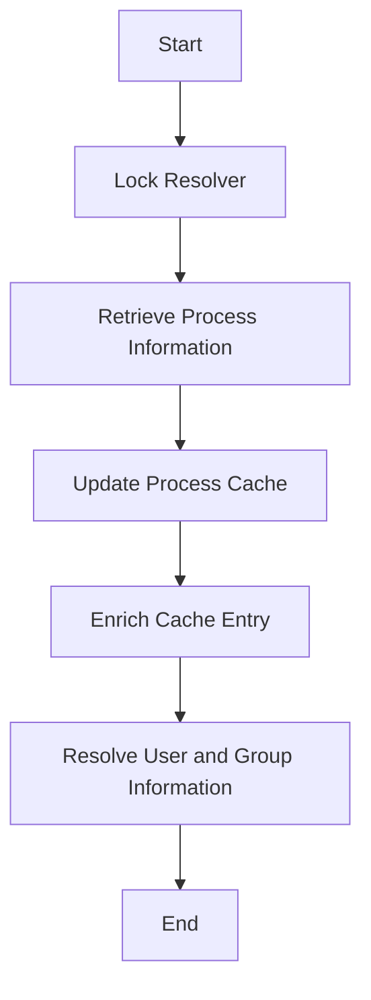

This document will cover the process of resolving process information from the procfs filesystem. We'll cover:

1. Locking the resolver
2. Retrieving process information
3. Updating the process cache
4. Enriching the cache entry with additional metadata
5. Resolving and setting user and group information.

Technical document: <SwmLink doc-title="Resolving Process Information from Procfs">[Resolving Process Information from Procfs](/.swm/resolving-process-information-from-procfs.no9hntc5.sw.md)</SwmLink>

# [Locking the resolver](https://app.swimm.io/repos/Z2l0aHViJTNBJTNBZGF0YWRvZy1hZ2VudCUzQSUzQVN3aW1tLURlbW8=/docs/no9hntc5#resolvefromprocfs)

The process begins by locking the resolver to ensure that no other operations can interfere with the current process resolution. This step is crucial for maintaining data integrity and preventing race conditions.

# [Retrieving process information](https://app.swimm.io/repos/Z2l0aHViJTNBJTNBZGF0YWRvZy1hZ2VudCUzQSUzQVN3aW1tLURlbW8=/docs/no9hntc5#resolvefromprocfs)

Next, the system retrieves process information from the procfs filesystem. This involves checking the validity of the process ID (PID) and ensuring it is within the allowed depth for resolution. If the PID is valid, detailed information about the process is gathered.

# [Updating the process cache](https://app.swimm.io/repos/Z2l0aHViJTNBJTNBZGF0YWRvZy1hZ2VudCUzQSUzQVN3aW1tLURlbW8=/docs/no9hntc5#synccache)

The retrieved process information is then used to update the process cache. This step ensures that the cache contains the most recent data about the process. If the process is already in the cache, it is updated; otherwise, a new cache entry is created.

# [Enriching the cache entry with additional metadata](https://app.swimm.io/repos/Z2l0aHViJTNBJTNBZGF0YWRvZy1hZ2VudCUzQSUzQVN3aW1tLURlbW8=/docs/no9hntc5#enricheventfromproc)

The process cache entry is enriched with additional metadata, such as the executable path, file fields, and container context. This step provides a more comprehensive view of the process by including relevant details that can be used for further analysis.

# [Resolving and setting user and group information](https://app.swimm.io/repos/Z2l0aHViJTNBJTNBZGF0YWRvZy1hZ2VudCUzQSUzQVN3aW1tLURlbW8=/docs/no9hntc5#setprocessusersgroups)

Finally, the user and group information for the process is resolved and set. This involves mapping user <SwmToken path="tasks/gitlab_helpers.py" pos="90:10:10" line-data="def print_gitlab_object(get_object, ctx, ids, repo=&#39;DataDog/datadog-agent&#39;, jq: str | None = None, jq_colors=True):">`ids`</SwmToken> (UIDs) and group <SwmToken path="tasks/gitlab_helpers.py" pos="90:10:10" line-data="def print_gitlab_object(get_object, ctx, ids, repo=&#39;DataDog/datadog-agent&#39;, jq: str | None = None, jq_colors=True):">`ids`</SwmToken> (GIDs) to their respective names by checking the cache and, if necessary, refreshing it by reading the `/etc/passwd` and `/etc/group` files.

&nbsp;

*This is an auto-generated document by Swimm AI 🌊 and has not yet been verified by a human*

<SwmMeta version="3.0.0" repo-id="Z2l0aHViJTNBJTNBZGF0YWRvZy1hZ2VudCUzQSUzQVN3aW1tLURlbW8=" repo-name="datadog-agent">Powered by [Swimm](/)</SwmMeta>
