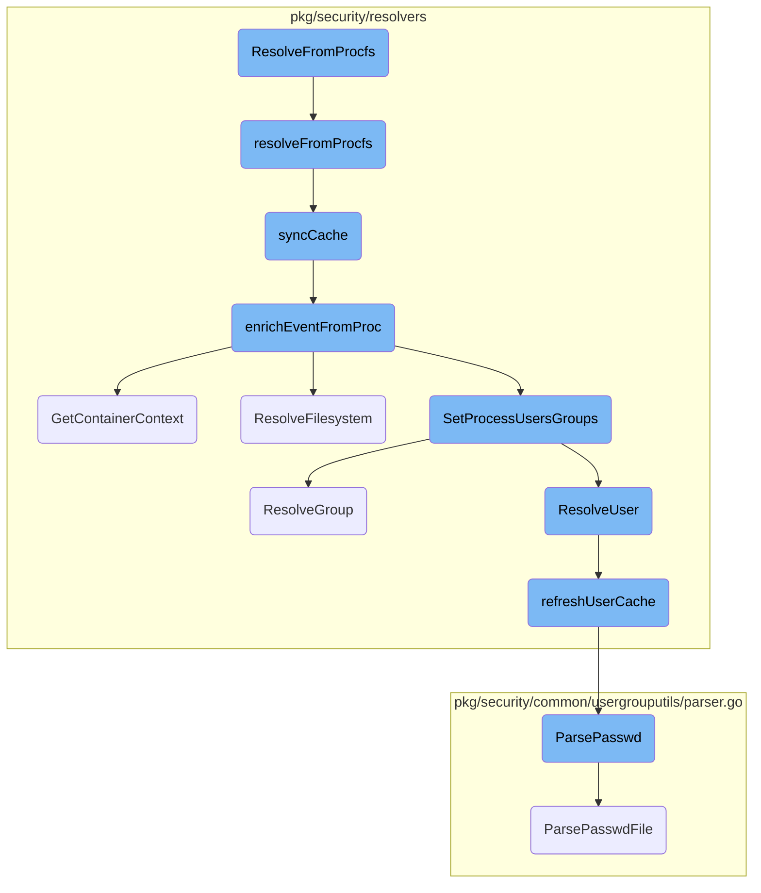
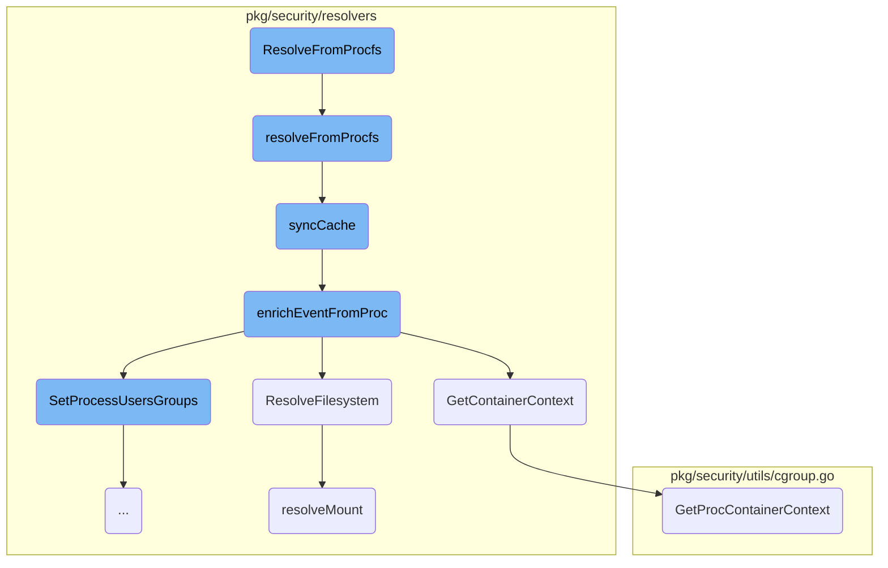
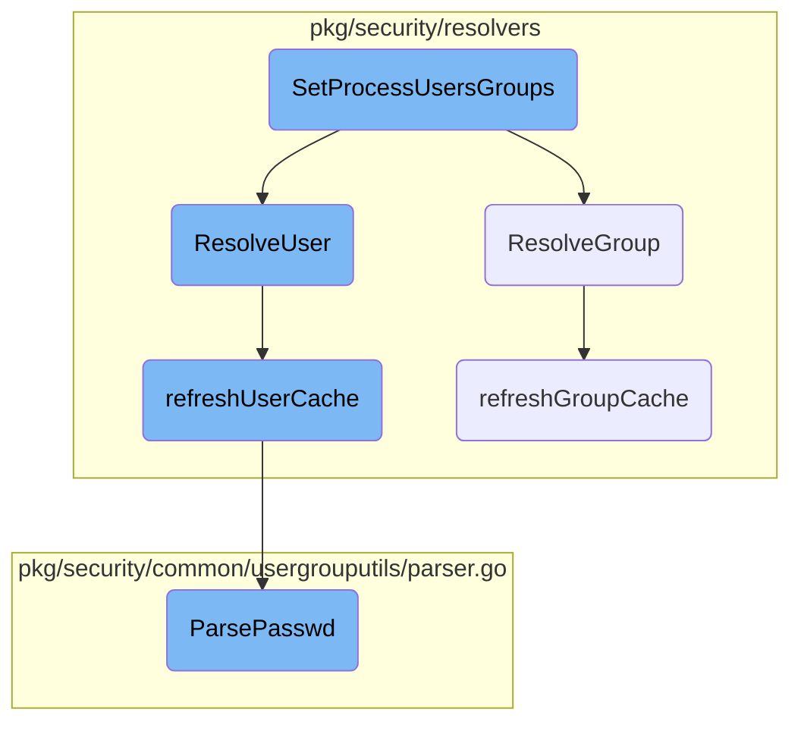

This document explains the process of resolving process information from the procfs filesystem. The process involves several steps, including locking the resolver, retrieving process information, updating the process cache, and enriching the cache entry with additional metadata.

The flow starts by locking the resolver to ensure thread safety. Then, it retrieves process information from the procfs filesystem. This information is used to update the process cache, ensuring that the cache has the most recent data. The process cache entry is then enriched with additional metadata, such as the executable path and container context. Finally, the user and group information for the process is resolved and set.

Here is a high level diagram of the flow, showing only the most important functions:



# Flow drill down

First, we'll zoom into this section of the flow:



<SwmSnippet path="/pkg/security/resolvers/process/resolver_ebpf.go" line="868">

---

## <SwmToken path="pkg/security/resolvers/process/resolver_ebpf.go" pos="868:2:2" line-data="// ResolveFromProcfs resolves the entry from procfs">`ResolveFromProcfs`</SwmToken>

The <SwmToken path="pkg/security/resolvers/process/resolver_ebpf.go" pos="868:2:2" line-data="// ResolveFromProcfs resolves the entry from procfs">`ResolveFromProcfs`</SwmToken> function is the entry point for resolving process information from procfs. It locks the resolver, defers the unlock, and calls <SwmToken path="pkg/security/resolvers/process/resolver_ebpf.go" pos="868:2:2" line-data="// ResolveFromProcfs resolves the entry from procfs">`ResolveFromProcfs`</SwmToken> with the given PID and a maximum depth.

```go
// ResolveFromProcfs resolves the entry from procfs
func (p *EBPFResolver) ResolveFromProcfs(pid uint32) *model.ProcessCacheEntry {
	p.Lock()
	defer p.Unlock()
	return p.resolveFromProcfs(pid, procResolveMaxDepth)
}
```

---

</SwmSnippet>

<SwmSnippet path="/pkg/security/resolvers/process/resolver_ebpf.go" line="875">

---

## <SwmToken path="pkg/security/resolvers/process/resolver_ebpf.go" pos="875:9:9" line-data="func (p *EBPFResolver) resolveFromProcfs(pid uint32, maxDepth int) *model.ProcessCacheEntry {">`resolveFromProcfs`</SwmToken>

The <SwmToken path="pkg/security/resolvers/process/resolver_ebpf.go" pos="875:9:9" line-data="func (p *EBPFResolver) resolveFromProcfs(pid uint32, maxDepth int) *model.ProcessCacheEntry {">`resolveFromProcfs`</SwmToken> function performs the actual resolution of process information. It checks the maximum depth and PID validity, retrieves process information, and calls <SwmToken path="pkg/security/resolvers/process/resolver_ebpf.go" pos="1218:2:2" line-data="// syncCache snapshots /proc for the provided pid. This method returns true if it updated the process cache.">`syncCache`</SwmToken> to update the process cache. If the process has a parent, it recursively resolves the parent process.

```go
func (p *EBPFResolver) resolveFromProcfs(pid uint32, maxDepth int) *model.ProcessCacheEntry {
	if maxDepth < 1 {
		seclog.Tracef("max depth reached during procfs resolution: %d", pid)
		return nil
	}

	if pid == 0 {
		seclog.Tracef("no pid: %d", pid)
		return nil
	}

	var ppid uint32
	proc, err := process.NewProcess(int32(pid))
	if err != nil {
		seclog.Tracef("unable to find pid: %d", pid)
		return nil
	}

	filledProc, err := utils.GetFilledProcess(proc)
	if err != nil {
		seclog.Tracef("unable to get a filled process for pid %d: %d", pid, err)
```

---

</SwmSnippet>

<SwmSnippet path="/pkg/security/resolvers/process/resolver_ebpf.go" line="1218">

---

### <SwmToken path="pkg/security/resolvers/process/resolver_ebpf.go" pos="1218:2:2" line-data="// syncCache snapshots /proc for the provided pid. This method returns true if it updated the process cache.">`syncCache`</SwmToken>

The <SwmToken path="pkg/security/resolvers/process/resolver_ebpf.go" pos="1218:2:2" line-data="// syncCache snapshots /proc for the provided pid. This method returns true if it updated the process cache.">`syncCache`</SwmToken> function updates the process cache with information from procfs. It checks if the process is already in the cache, creates a new cache entry if not, and enriches the entry with additional metadata using <SwmToken path="pkg/security/resolvers/process/resolver_ebpf.go" pos="1234:9:9" line-data="	if err := p.enrichEventFromProc(entry, proc, filledProc); err != nil {">`enrichEventFromProc`</SwmToken>.

```go
// syncCache snapshots /proc for the provided pid. This method returns true if it updated the process cache.
func (p *EBPFResolver) syncCache(proc *process.Process, filledProc *utils.FilledProcess, source uint64) (*model.ProcessCacheEntry, bool) {
	pid := uint32(proc.Pid)

	// Check if an entry is already in cache for the given pid.
	entry := p.entryCache[pid]
	if entry != nil {
		p.setAncestor(entry)

		return entry, false
	}

	entry = p.NewProcessCacheEntry(model.PIDContext{Pid: pid, Tid: pid})
	entry.IsThread = true

	// update the cache entry
	if err := p.enrichEventFromProc(entry, proc, filledProc); err != nil {
		entry.Release()

		seclog.Trace(err)
		return nil, false
```

---

</SwmSnippet>

<SwmSnippet path="/pkg/security/resolvers/process/resolver_ebpf.go" line="317">

---

### <SwmToken path="pkg/security/resolvers/process/resolver_ebpf.go" pos="317:2:2" line-data="// enrichEventFromProc uses /proc to enrich a ProcessCacheEntry with additional metadata">`enrichEventFromProc`</SwmToken>

The <SwmToken path="pkg/security/resolvers/process/resolver_ebpf.go" pos="317:2:2" line-data="// enrichEventFromProc uses /proc to enrich a ProcessCacheEntry with additional metadata">`enrichEventFromProc`</SwmToken> function enriches a <SwmToken path="pkg/security/resolvers/process/resolver_ebpf.go" pos="317:15:15" line-data="// enrichEventFromProc uses /proc to enrich a ProcessCacheEntry with additional metadata">`ProcessCacheEntry`</SwmToken> with additional metadata from procfs. It retrieves the process's executable path, file fields, container context, and other attributes, and updates the cache entry accordingly.

```go
// enrichEventFromProc uses /proc to enrich a ProcessCacheEntry with additional metadata
func (p *EBPFResolver) enrichEventFromProc(entry *model.ProcessCacheEntry, proc *process.Process, filledProc *utils.FilledProcess) error {
	// the provided process is a kernel process if its virtual memory size is null
	if filledProc.MemInfo.VMS == 0 {
		return fmt.Errorf("cannot snapshot kernel threads")
	}
	pid := uint32(proc.Pid)

	// Get process filename and pre-fill the cache
	procExecPath := utils.ProcExePath(pid)
	pathnameStr, err := os.Readlink(procExecPath)
	if err != nil {
		return fmt.Errorf("snapshot failed for %d: couldn't readlink binary: %w", proc.Pid, err)
	}
	if pathnameStr == "/ (deleted)" {
		return fmt.Errorf("snapshot failed for %d: binary was deleted", proc.Pid)
	}

	// Get the file fields of the process binary
	info, err := p.retrieveExecFileFields(procExecPath)
	if err != nil {
```

---

</SwmSnippet>

<SwmSnippet path="/pkg/security/resolvers/container/resolver.go" line="19">

---

## <SwmToken path="pkg/security/resolvers/container/resolver.go" pos="19:2:2" line-data="// GetContainerContext returns the container id of the given pid along with its flags">`GetContainerContext`</SwmToken>

The <SwmToken path="pkg/security/resolvers/container/resolver.go" pos="19:2:2" line-data="// GetContainerContext returns the container id of the given pid along with its flags">`GetContainerContext`</SwmToken> function retrieves the container ID and flags for a given PID by parsing the cgroup information from procfs.

```go
// GetContainerContext returns the container id of the given pid along with its flags
func (cr *Resolver) GetContainerContext(pid uint32) (containerutils.ContainerID, containerutils.CGroupFlags, error) {
	// Parse /proc/[pid]/task/[pid]/cgroup
	return utils.GetProcContainerContext(pid, pid)
}
```

---

</SwmSnippet>

<SwmSnippet path="/pkg/security/resolvers/mount/resolver.go" line="219">

---

## <SwmToken path="pkg/security/resolvers/mount/resolver.go" pos="219:2:2" line-data="// ResolveFilesystem returns the name of the filesystem">`ResolveFilesystem`</SwmToken>

The <SwmToken path="pkg/security/resolvers/mount/resolver.go" pos="219:2:2" line-data="// ResolveFilesystem returns the name of the filesystem">`ResolveFilesystem`</SwmToken> function returns the filesystem type for a given mount ID, device, and PID. It locks the resolver, calls <SwmToken path="pkg/security/resolvers/mount/resolver.go" pos="224:16:16" line-data="	mount, _, _, err := mr.resolveMount(mountID, device, pid, containerID)">`resolveMount`</SwmToken>, and retrieves the filesystem type from the mount information.

```go
// ResolveFilesystem returns the name of the filesystem
func (mr *Resolver) ResolveFilesystem(mountID uint32, device uint32, pid uint32, containerID string) (string, error) {
	mr.lock.Lock()
	defer mr.lock.Unlock()

	mount, _, _, err := mr.resolveMount(mountID, device, pid, containerID)
	if err != nil {
		return model.UnknownFS, err
	}

	return mount.GetFSType(), nil
}
```

---

</SwmSnippet>

<SwmSnippet path="/pkg/security/resolvers/mount/resolver.go" line="486">

---

### <SwmToken path="pkg/security/resolvers/mount/resolver.go" pos="486:9:9" line-data="func (mr *Resolver) resolveMount(mountID uint32, device uint32, pid uint32, containerID string) (*model.Mount, model.MountSource, model.MountOrigin, error) {">`resolveMount`</SwmToken>

The <SwmToken path="pkg/security/resolvers/mount/resolver.go" pos="486:9:9" line-data="func (mr *Resolver) resolveMount(mountID uint32, device uint32, pid uint32, containerID string) (*model.Mount, model.MountSource, model.MountOrigin, error) {">`resolveMount`</SwmToken> function resolves mount information for a given mount ID, device, and PID. It checks the validity of the mount ID, retrieves workload information, and looks up the mount in the cache. If not found, it re-syncs the cache and tries again.

```go
func (mr *Resolver) resolveMount(mountID uint32, device uint32, pid uint32, containerID string) (*model.Mount, model.MountSource, model.MountOrigin, error) {
	if _, err := mr.IsMountIDValid(mountID); err != nil {
		return nil, model.MountSourceUnknown, model.MountOriginUnknown, err
	}

	// force a resolution here to make sure the LRU keeps doing its job and doesn't evict important entries
	workload, _ := mr.cgroupsResolver.GetWorkload(containerID)

	mount, source, origin := mr.lookupMount(mountID, device, pid)
	if mount != nil {
		mr.cacheHitsStats.Inc()
		return mount, source, origin, nil
	}
	mr.cacheMissStats.Inc()

	if !mr.opts.UseProcFS {
		return nil, model.MountSourceUnknown, model.MountOriginUnknown, &ErrMountNotFound{MountID: mountID}
	}

	if err := mr.reSyncCache(mountID, []uint32{pid}, containerID, workload); err != nil {
		return nil, model.MountSourceUnknown, model.MountOriginUnknown, err
```

---

</SwmSnippet>

<SwmSnippet path="/pkg/security/utils/cgroup.go" line="83">

---

## <SwmToken path="pkg/security/utils/cgroup.go" pos="83:2:2" line-data="// GetProcContainerContext returns the container ID which the process belongs to along with its manager. Returns &quot;&quot; if the process does not belong">`GetProcContainerContext`</SwmToken>

The <SwmToken path="pkg/security/utils/cgroup.go" pos="83:2:2" line-data="// GetProcContainerContext returns the container ID which the process belongs to along with its manager. Returns &quot;&quot; if the process does not belong">`GetProcContainerContext`</SwmToken> function returns the container ID and flags for a given PID by parsing the cgroup information from procfs. It iterates over the cgroups and retrieves the container context if available.

```go
// GetProcContainerContext returns the container ID which the process belongs to along with its manager. Returns "" if the process does not belong
// to a container.
func GetProcContainerContext(tgid, pid uint32) (containerutils.ContainerID, containerutils.CGroupFlags, error) {
	cgroups, err := GetProcControlGroups(tgid, pid)
	if err != nil {
		return "", 0, err
	}

	for _, cgroup := range cgroups {
		if containerID, runtime := cgroup.GetContainerContext(); containerID != "" {
			return containerID, runtime, nil
		}
	}
	return "", 0, nil
}
```

---

</SwmSnippet>

Now, lets zoom into this section of the flow:



<SwmSnippet path="/pkg/security/resolvers/process/resolver_ebpf.go" line="1013">

---

## Resolving and setting users and groups

The <SwmToken path="pkg/security/resolvers/process/resolver_ebpf.go" pos="396:3:3" line-data="	p.SetProcessUsersGroups(entry)">`SetProcessUsersGroups`</SwmToken> function is responsible for resolving and setting the user and group information for a process. It uses the <SwmToken path="pkg/security/resolvers/process/resolver_ebpf.go" pos="1013:14:14" line-data="	pce.User, _ = p.userGroupResolver.ResolveUser(int(pce.Credentials.UID), string(pce.ContainerID))">`ResolveUser`</SwmToken> and <SwmToken path="pkg/security/resolvers/process/resolver_ebpf.go" pos="1017:14:14" line-data="	pce.Group, _ = p.userGroupResolver.ResolveGroup(int(pce.Credentials.GID), string(pce.ContainerID))">`ResolveGroup`</SwmToken> methods to fetch the user and group names based on their <SwmToken path="tasks/gitlab_helpers.py" pos="90:10:10" line-data="def print_gitlab_object(get_object, ctx, ids, repo=&#39;DataDog/datadog-agent&#39;, jq: str | None = None, jq_colors=True):">`ids`</SwmToken> and the container ID.

```go
	pce.User, _ = p.userGroupResolver.ResolveUser(int(pce.Credentials.UID), string(pce.ContainerID))
	pce.EUser, _ = p.userGroupResolver.ResolveUser(int(pce.Credentials.EUID), string(pce.ContainerID))
	pce.FSUser, _ = p.userGroupResolver.ResolveUser(int(pce.Credentials.FSUID), string(pce.ContainerID))

	pce.Group, _ = p.userGroupResolver.ResolveGroup(int(pce.Credentials.GID), string(pce.ContainerID))
	pce.EGroup, _ = p.userGroupResolver.ResolveGroup(int(pce.Credentials.EGID), string(pce.ContainerID))
	pce.FSGroup, _ = p.userGroupResolver.ResolveGroup(int(pce.Credentials.FSGID), string(pce.ContainerID))
```

---

</SwmSnippet>

<SwmSnippet path="/pkg/security/resolvers/usergroup/resolver_linux.go" line="154">

---

### Resolving user information

The <SwmToken path="pkg/security/resolvers/usergroup/resolver_linux.go" pos="154:2:2" line-data="// ResolveUser resolves a user id to a username">`ResolveUser`</SwmToken> function resolves a user ID to a username. It first checks the cache for the user information. If not found, it refreshes the cache by reading the <SwmToken path="pkg/security/resolvers/usergroup/resolver_linux.go" pos="125:16:19" line-data="	entries, err := usergrouputils.ParsePasswd(fsys, &quot;/etc/passwd&quot;)">`/etc/passwd`</SwmToken> file and then retrieves the username.

```go
// ResolveUser resolves a user id to a username
func (r *Resolver) ResolveUser(uid int, containerID string) (string, error) {
	userCache, found := r.nsUserCache.Get(containerID)
	if found {
		cachedEntry, found := userCache.entries[uid]
		if !found {
			return "", errUserNotFound
		}
		return cachedEntry, nil
	}

	fsys, err := r.getFilesystem(containerID)
	if err != nil {
		return "", err
	}

	userEntries, err := r.refreshUserCache(containerID, fsys)
	if err != nil {
		return "", err
	}

```

---

</SwmSnippet>

<SwmSnippet path="/pkg/security/resolvers/usergroup/resolver_linux.go" line="183">

---

### Resolving group information

The <SwmToken path="pkg/security/resolvers/usergroup/resolver_linux.go" pos="183:2:2" line-data="// ResolveGroup resolves a group id to a group name">`ResolveGroup`</SwmToken> function resolves a group ID to a group name. Similar to <SwmToken path="pkg/security/resolvers/process/resolver_ebpf.go" pos="1013:14:14" line-data="	pce.User, _ = p.userGroupResolver.ResolveUser(int(pce.Credentials.UID), string(pce.ContainerID))">`ResolveUser`</SwmToken>, it first checks the cache and refreshes it by reading the <SwmToken path="pkg/security/resolvers/usergroup/resolver_linux.go" pos="145:16:19" line-data="	entries, err := usergrouputils.ParseGroup(fsys, &quot;/etc/group&quot;)">`/etc/group`</SwmToken> file if the group information is not found.

```go
// ResolveGroup resolves a group id to a group name
func (r *Resolver) ResolveGroup(gid int, containerID string) (string, error) {
	groupCache, found := r.nsGroupCache.Get(containerID)
	if found {
		cachedEntry, found := groupCache.entries[gid]
		if !found {
			return "", errGroupNotFound
		}
		return cachedEntry, nil
	}

	fsys, err := r.getFilesystem(containerID)
	if err != nil {
		return "", err
	}

	groupEntries, err := r.refreshGroupCache(containerID, fsys)
	if err != nil {
		return "", err
	}

```

---

</SwmSnippet>

<SwmSnippet path="/pkg/security/resolvers/usergroup/resolver_linux.go" line="112">

---

### Refreshing user cache

The <SwmToken path="pkg/security/resolvers/usergroup/resolver_linux.go" pos="112:9:9" line-data="func (r *Resolver) refreshUserCache(containerID string, fsys fs.FS) (map[int]string, error) {">`refreshUserCache`</SwmToken> function updates the user cache by parsing the <SwmToken path="pkg/security/resolvers/usergroup/resolver_linux.go" pos="125:16:19" line-data="	entries, err := usergrouputils.ParsePasswd(fsys, &quot;/etc/passwd&quot;)">`/etc/passwd`</SwmToken> file. It ensures that the cache is refreshed only if the rate limiter allows it, preventing excessive parsing.

```go
func (r *Resolver) refreshUserCache(containerID string, fsys fs.FS) (map[int]string, error) {
	entryCache, found := r.nsUserCache.Get(containerID)
	if !found {
		// add the entry cache before we parse the fill so that we also
		// rate limit parsing failures
		entryCache = &EntryCache{rateLimiter: rate.NewLimiter(rate.Limit(refreshCacheRateLimit), refreshCacheRateBurst)}
		r.nsUserCache.Add(containerID, entryCache)
	}

	if !entryCache.rateLimiter.Allow() {
		return entryCache.entries, nil
	}

	entries, err := usergrouputils.ParsePasswd(fsys, "/etc/passwd")
	if err != nil {
		return nil, err
	}
	entryCache.entries = entries

	return entries, nil
}
```

---

</SwmSnippet>

<SwmSnippet path="/pkg/security/resolvers/usergroup/resolver_linux.go" line="134">

---

### Refreshing group cache

The <SwmToken path="pkg/security/resolvers/usergroup/resolver_linux.go" pos="134:9:9" line-data="func (r *Resolver) refreshGroupCache(containerID string, fsys fs.FS) (map[int]string, error) {">`refreshGroupCache`</SwmToken> function updates the group cache by parsing the <SwmToken path="pkg/security/resolvers/usergroup/resolver_linux.go" pos="145:16:19" line-data="	entries, err := usergrouputils.ParseGroup(fsys, &quot;/etc/group&quot;)">`/etc/group`</SwmToken> file. Similar to <SwmToken path="pkg/security/resolvers/usergroup/resolver_linux.go" pos="112:9:9" line-data="func (r *Resolver) refreshUserCache(containerID string, fsys fs.FS) (map[int]string, error) {">`refreshUserCache`</SwmToken>, it uses a rate limiter to control the frequency of cache refreshes.

```go
func (r *Resolver) refreshGroupCache(containerID string, fsys fs.FS) (map[int]string, error) {
	entryCache, found := r.nsGroupCache.Get(containerID)
	if !found {
		entryCache = &EntryCache{rateLimiter: rate.NewLimiter(rate.Limit(refreshCacheRateLimit), refreshCacheRateBurst)}
		r.nsGroupCache.Add(containerID, entryCache)
	}

	if !entryCache.rateLimiter.Allow() {
		return entryCache.entries, nil
	}

	entries, err := usergrouputils.ParseGroup(fsys, "/etc/group")
	if err != nil {
		return nil, err
	}
	entryCache.entries = entries

	return entries, nil
}
```

---

</SwmSnippet>

<SwmSnippet path="/pkg/security/common/usergrouputils/parser.go" line="127">

---

### Parsing the passwd file

The <SwmToken path="pkg/security/common/usergrouputils/parser.go" pos="127:2:2" line-data="func ParsePasswd(fs fs.FS, path string) (map[int]string, error) {">`ParsePasswd`</SwmToken> function reads and parses the <SwmToken path="pkg/security/resolvers/usergroup/resolver_linux.go" pos="125:16:19" line-data="	entries, err := usergrouputils.ParsePasswd(fsys, &quot;/etc/passwd&quot;)">`/etc/passwd`</SwmToken> file to extract user information. This function is called by <SwmToken path="pkg/security/resolvers/usergroup/resolver_linux.go" pos="112:9:9" line-data="func (r *Resolver) refreshUserCache(containerID string, fsys fs.FS) (map[int]string, error) {">`refreshUserCache`</SwmToken> to update the user cache.

```go
func ParsePasswd(fs fs.FS, path string) (map[int]string, error) {
	file, err := fs.Open(path)
	if err != nil {
		return nil, err
	}
	defer file.Close()
	return ParsePasswdFile(file)
}
```

---

</SwmSnippet>

&nbsp;

*This is an auto-generated document by Swimm AI 🌊 and has not yet been verified by a human*

<SwmMeta version="3.0.0" repo-id="Z2l0aHViJTNBJTNBZGF0YWRvZy1hZ2VudCUzQSUzQVN3aW1tLURlbW8=" repo-name="datadog-agent"><sup>Powered by [Swimm](/)</sup></SwmMeta>
