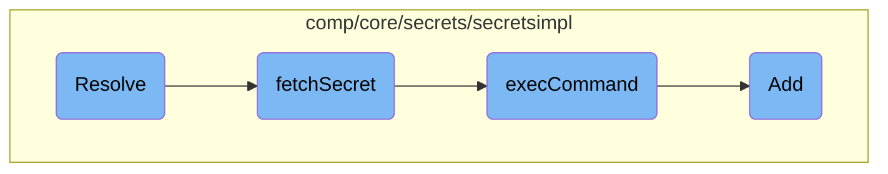

In this document, we will explain the process of resolving secrets within the Datadog Agent. The process involves checking if secrets are enabled, unmarshaling data, collecting secret handles, fetching new secrets if necessary, and replacing the resolved secrets in the configuration.

The flow starts by checking if secrets are enabled and if the necessary data and backend command are available. It then unmarshals the data to collect all new secret handles. If there are new secrets to fetch, it calls a function to retrieve them. Finally, it replaces the newly resolved secrets in the configuration and returns the updated data.

# Flow drill down



<SwmSnippet path="/comp/core/secrets/secretsimpl/secrets.go" line="264">

---

## Resolve

The <SwmToken path="comp/core/secrets/secretsimpl/secrets.go" pos="264:2:2" line-data="// Resolve replaces all encoded secrets in data by executing &quot;secret_backend_command&quot; once if all secrets aren&#39;t">`Resolve`</SwmToken> function is responsible for replacing all encoded secrets in the provided data by executing the <SwmToken path="comp/core/secrets/secretsimpl/secrets.go" pos="264:21:21" line-data="// Resolve replaces all encoded secrets in data by executing &quot;secret_backend_command&quot; once if all secrets aren&#39;t">`secret_backend_command`</SwmToken> if the secrets are not already present in the cache. It first checks if the agent secrets are enabled and if the necessary data and backend command are available. It then unmarshals the data and collects all new secret handles. If any new secrets need to be fetched, it calls the <SwmToken path="comp/core/secrets/secretsimpl/fetch_secret.go" pos="105:2:2" line-data="// fetchSecret receives a list of secrets name to fetch, exec a custom">`fetchSecret`</SwmToken> function to retrieve them. Finally, it replaces the newly resolved secrets in the configuration and returns the updated data.

```go
// Resolve replaces all encoded secrets in data by executing "secret_backend_command" once if all secrets aren't
// present in the cache.
func (r *secretResolver) Resolve(data []byte, origin string) ([]byte, error) {
	r.lock.Lock()
	defer r.lock.Unlock()

	if !r.enabled {
		log.Infof("Agent secrets is disabled by caller")
		return nil, nil
	}
	if data == nil || r.backendCommand == "" {
		return data, nil
	}

	var config interface{}
	err := yaml.Unmarshal(data, &config)
	if err != nil {
		return nil, fmt.Errorf("could not Unmarshal config: %s", err)
	}

	// First we collect all new handles in the config
```

---

</SwmSnippet>

<SwmSnippet path="/comp/core/secrets/secretsimpl/fetch_secret.go" line="105">

---

## <SwmToken path="comp/core/secrets/secretsimpl/fetch_secret.go" pos="105:2:2" line-data="// fetchSecret receives a list of secrets name to fetch, exec a custom">`fetchSecret`</SwmToken>

The <SwmToken path="comp/core/secrets/secretsimpl/fetch_secret.go" pos="105:2:2" line-data="// fetchSecret receives a list of secrets name to fetch, exec a custom">`fetchSecret`</SwmToken> function receives a list of secret names to fetch, executes a custom executable to retrieve the actual secrets, and returns them. It serializes the secret handles into a JSON payload and calls the <SwmToken path="comp/core/secrets/secretsimpl/fetch_secret.go" pos="116:10:10" line-data="	output, err := r.execCommand(string(jsonPayload))">`execCommand`</SwmToken> function to execute the command. The output is then unmarshaled to extract the secrets, which are returned as a map.

```go
// fetchSecret receives a list of secrets name to fetch, exec a custom
// executable to fetch the actual secrets and returns them.
func (r *secretResolver) fetchSecret(secretsHandle []string) (map[string]string, error) {
	payload := map[string]interface{}{
		"version": secrets.PayloadVersion,
		"secrets": secretsHandle,
	}
	jsonPayload, err := json.Marshal(payload)
	if err != nil {
		return nil, fmt.Errorf("could not serialize secrets IDs to fetch password: %s", err)
	}
	output, err := r.execCommand(string(jsonPayload))
	if err != nil {
		return nil, err
	}

	secrets := map[string]secrets.SecretVal{}
	err = json.Unmarshal(output, &secrets)
	if err != nil {
		r.tlmSecretUnmarshalError.Inc()
		return nil, fmt.Errorf("could not unmarshal 'secret_backend_command' output: %s", err)
```

---

</SwmSnippet>

<SwmSnippet path="/comp/core/secrets/secretsimpl/fetch_secret.go" line="35">

---

## <SwmToken path="comp/core/secrets/secretsimpl/fetch_secret.go" pos="35:9:9" line-data="func (r *secretResolver) execCommand(inputPayload string) ([]byte, error) {">`execCommand`</SwmToken>

The <SwmToken path="comp/core/secrets/secretsimpl/fetch_secret.go" pos="35:9:9" line-data="func (r *secretResolver) execCommand(inputPayload string) ([]byte, error) {">`execCommand`</SwmToken> function executes the <SwmToken path="comp/core/secrets/secretsimpl/secrets.go" pos="264:21:21" line-data="// Resolve replaces all encoded secrets in data by executing &quot;secret_backend_command&quot; once if all secrets aren&#39;t">`secret_backend_command`</SwmToken> with the provided input payload. It sets up the command context with a timeout, checks the command's permissions, and runs the command. The function captures the command's stdout and stderr, logs the execution details, and returns the command's output.

```go
func (r *secretResolver) execCommand(inputPayload string) ([]byte, error) {
	// hook used only for tests
	if r.commandHookFunc != nil {
		return r.commandHookFunc(inputPayload)
	}

	ctx, cancel := context.WithTimeout(context.Background(),
		time.Duration(r.backendTimeout)*time.Second)
	defer cancel()

	cmd, done, err := commandContext(ctx, r.backendCommand, r.backendArguments...)
	if err != nil {
		return nil, err
	}
	defer done()

	if err := checkRights(cmd.Path, r.commandAllowGroupExec); err != nil {
		return nil, err
	}

	cmd.Stdin = strings.NewReader(inputPayload)
```

---

</SwmSnippet>

<SwmSnippet path="/comp/core/secrets/secretsimpl/rotating_ndrecords.go" line="67">

---

## Add

The <SwmToken path="comp/core/secrets/secretsimpl/rotating_ndrecords.go" pos="67:2:2" line-data="// Add adds a new record to the file with the given time and payload">`Add`</SwmToken> function adds a new record to a file with the given time and payload. It prunes old entries and removes old files if they exceed the retention period. If the new entry pushes the file over the size limit, the file is rotated. The function then opens the file, appends the new record, and closes the file.

```go
// Add adds a new record to the file with the given time and payload
// old entries will be pruned, and the file will be rotated if it gets too large
func (r *rotatingNDRecords) Add(t time.Time, payload interface{}) error {
	r.ensureDefaults()

	// prune old entries
	if !r.firstEntry.IsZero() && t.Sub(r.firstEntry) > r.cfg.retention {
		if err := r.pruneOldEntries(t); err != nil {
			log.Error(err)
		}
	}
	// remove old files that were already rotated
	if !r.oldestFileMtime.IsZero() && t.Sub(*r.oldestFileMtime) > r.cfg.retention {
		if err := r.removeOldFiles(t); err != nil {
			log.Error(err)
		}
	}

	var recordData bytes.Buffer
	err := json.NewEncoder(&recordData).Encode(ndRecord{
		Time: t,
```

---

</SwmSnippet>

&nbsp;

*This is an auto-generated document by Swimm AI 🌊 and has not yet been verified by a human*

<SwmMeta version="3.0.0" repo-id="Z2l0aHViJTNBJTNBZGF0YWRvZy1hZ2VudCUzQSUzQVN3aW1tLURlbW8=" repo-name="datadog-agent"><sup>Powered by [Swimm](/)</sup></SwmMeta>
