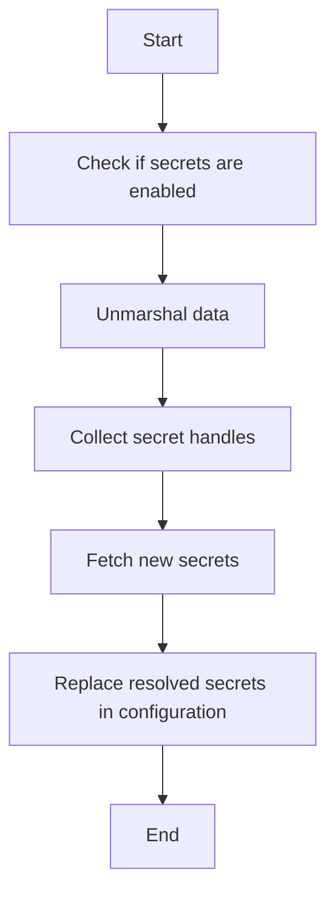

This document will cover the process of resolving secrets within the Datadog Agent. We'll cover:

1. Checking if secrets are enabled
2. Unmarshaling data
3. Collecting secret handles
4. Fetching new secrets
5. Replacing resolved secrets in the configuration.

Technical document: <SwmLink doc-title="Resolving Secrets Flow">[Resolving Secrets Flow](/.swm/resolving-secrets-flow.3rz5xbsx.sw.md)</SwmLink>

# [Checking if secrets are enabled](https://app.swimm.io/repos/Z2l0aHViJTNBJTNBZGF0YWRvZy1hZ2VudCUzQSUzQVN3aW1tLURlbW8=/docs/3rz5xbsx#resolve)

The process begins by verifying if the secrets feature is enabled in the Datadog Agent. This is crucial because if secrets are not enabled, the system will not proceed with any further steps related to secret resolution. This check ensures that the agent is configured to handle secrets before attempting to process them.

# [Unmarshaling data](https://app.swimm.io/repos/Z2l0aHViJTNBJTNBZGF0YWRvZy1hZ2VudCUzQSUzQVN3aW1tLURlbW8=/docs/3rz5xbsx#resolve)

Once it is confirmed that secrets are enabled, the next step is to unmarshal the data. Unmarshaling involves converting the data from a serialized format (like JSON or YAML) into a structured format that the system can work with. This step is necessary to identify and extract the secret handles that need to be resolved.

# [Collecting secret handles](https://app.swimm.io/repos/Z2l0aHViJTNBJTNBZGF0YWRvZy1hZ2VudCUzQSUzQVN3aW1tLURlbW8=/docs/3rz5xbsx#resolve)

After unmarshaling the data, the system collects all the secret handles. Secret handles are identifiers or placeholders for the actual secrets. This step involves scanning the unmarshaled data to find all the references to secrets that need to be resolved. These handles are then prepared for the next step, which is fetching the actual secrets.

# [Fetching new secrets](https://app.swimm.io/repos/Z2l0aHViJTNBJTNBZGF0YWRvZy1hZ2VudCUzQSUzQVN3aW1tLURlbW8=/docs/3rz5xbsx#fetchsecret)

If there are new secrets to be fetched, the system proceeds to retrieve them. This involves executing a custom command to fetch the actual secrets based on the collected handles. The command's output is then processed to extract the secrets, which are returned as a map of secret names to their corresponding values. This step ensures that the latest secrets are obtained and ready to be used in the configuration.

# [Replacing resolved secrets in the configuration](https://app.swimm.io/repos/Z2l0aHViJTNBJTNBZGF0YWRvZy1hZ2VudCUzQSUzQVN3aW1tLURlbW8=/docs/3rz5xbsx#resolve)

Finally, the newly resolved secrets are replaced in the configuration. This step involves updating the configuration data with the actual secret values obtained in the previous step. The updated configuration is then returned, completing the process of resolving secrets. This ensures that the configuration now contains the actual secrets instead of placeholders, making it ready for use by the Datadog Agent.

&nbsp;

*This is an auto-generated document by Swimm AI 🌊 and has not yet been verified by a human*

<SwmMeta version="3.0.0" repo-id="Z2l0aHViJTNBJTNBZGF0YWRvZy1hZ2VudCUzQSUzQVN3aW1tLURlbW8=" repo-name="datadog-agent">Powered by [Swimm](/)</SwmMeta>
