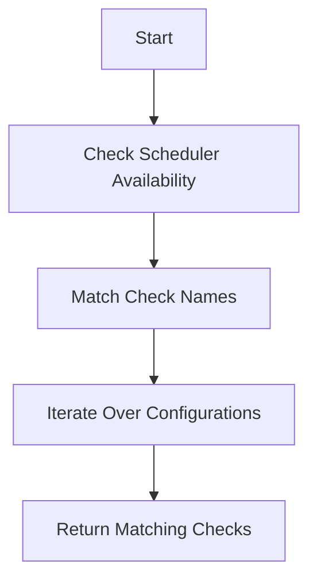

This document will cover the process of retrieving checks by name, which includes:

1. Checking the scheduler availability
2. Matching check names
3. Iterating over configurations to find relevant checks.

Technical document: <SwmLink doc-title="Retrieving Checks by Name">[Retrieving Checks by Name](/.swm/retrieving-checks-by-name.yvk2e5j5.sw.md)</SwmLink>

# [Checking Scheduler Availability](https://app.swimm.io/repos/Z2l0aHViJTNBJTNBZGF0YWRvZy1hZ2VudCUzQSUzQVN3aW1tLURlbW8=/docs/yvk2e5j5#getchecksbynameforconfigs)

The process begins by verifying if the scheduler is available. If the scheduler is not available, the system returns an empty list of checks. This step ensures that the system does not proceed with further operations if the scheduler, which is responsible for managing the checks, is not active. This prevents unnecessary processing and potential errors.

# [Matching Check Names](https://app.swimm.io/repos/Z2l0aHViJTNBJTNBZGF0YWRvZy1hZ2VudCUzQSUzQVN3aW1tLURlbW8=/docs/yvk2e5j5#getchecksbynameforconfigs)

Next, the system attempts to match the given check name with the available checks. It also considers a titled version of the name to ensure a broader match. For example, if the input name is 'foo', it will also try to match 'FooCheck'. This step increases the likelihood of finding the correct check by accommodating different naming conventions.

# [Iterating Over Configurations](https://app.swimm.io/repos/Z2l0aHViJTNBJTNBZGF0YWRvZy1hZ2VudCUzQSUzQVN3aW1tLURlbW8=/docs/yvk2e5j5#getchecksbynameforconfigs)

The system then iterates over the configurations to find checks that match the given name. It retrieves all check instances for the provided configurations and appends the matching checks to the result list. This step ensures that all relevant checks are identified and collected based on the provided configurations.

# [Returning Matching Checks](https://app.swimm.io/repos/Z2l0aHViJTNBJTNBZGF0YWRvZy1hZ2VudCUzQSUzQVN3aW1tLURlbW8=/docs/yvk2e5j5#getchecksbynameforconfigs)

Finally, the system returns the list of checks that match the given name. This list includes all checks that were identified during the iteration over the configurations. This step provides the end user with the relevant checks that match their query, ensuring that they have the necessary information for further actions.

&nbsp;

*This is an auto-generated document by Swimm AI 🌊 and has not yet been verified by a human*

<SwmMeta version="3.0.0" repo-id="Z2l0aHViJTNBJTNBZGF0YWRvZy1hZ2VudCUzQSUzQVN3aW1tLURlbW8=" repo-name="datadog-agent">Powered by [Swimm](/)</SwmMeta>
