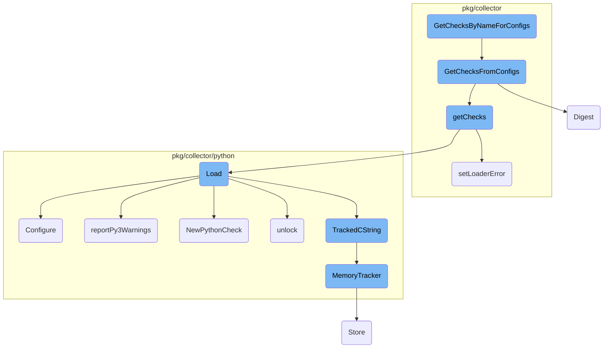
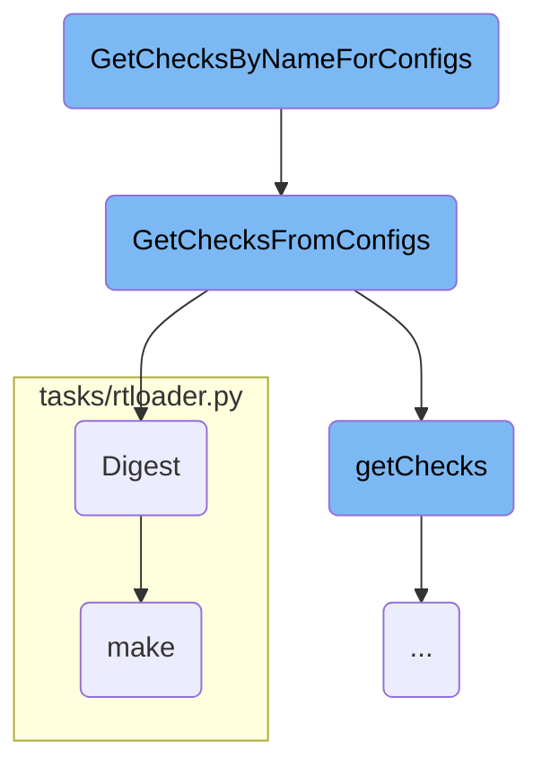
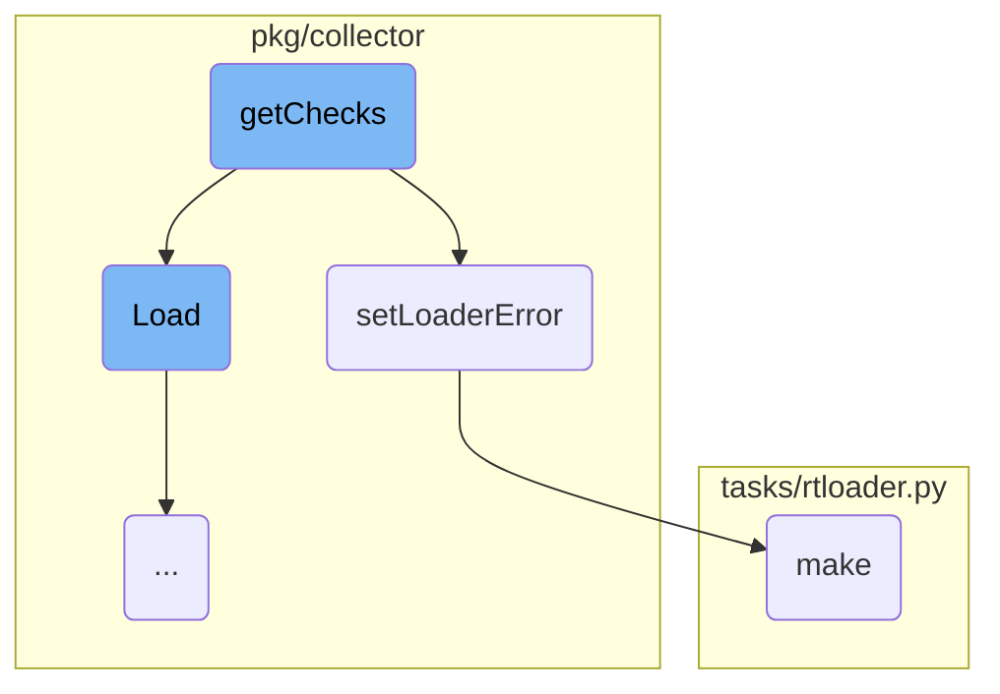
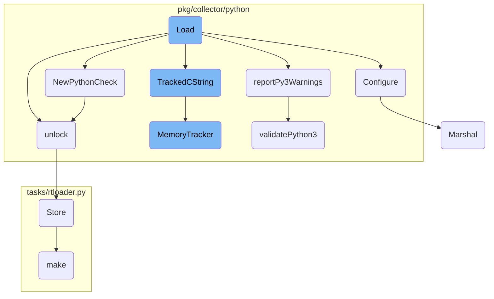

This document explains the process of retrieving checks by name from a list of configurations. The process involves several steps, including checking the scheduler, matching check names, and iterating over configurations to find the relevant checks.

The flow starts by checking if the scheduler is available. If it is, the process continues by trying to match the given check name with the available checks, including a titled version of the name. It then iterates over the configurations to find the checks that match the given name and returns them.

Here is a high level diagram of the flow, showing only the most important functions:



# Flow drill down

First, we'll zoom into this section of the flow:



<SwmSnippet path="/pkg/collector/scheduler.go" line="224">

---

## <SwmToken path="pkg/collector/scheduler.go" pos="224:2:2" line-data="// GetChecksByNameForConfigs returns checks matching name for passed in configs">`GetChecksByNameForConfigs`</SwmToken>

The function <SwmToken path="pkg/collector/scheduler.go" pos="224:2:2" line-data="// GetChecksByNameForConfigs returns checks matching name for passed in configs">`GetChecksByNameForConfigs`</SwmToken> is responsible for returning checks that match a given name from a list of configurations. It first checks if the <SwmToken path="pkg/collector/scheduler.go" pos="227:3:3" line-data="	if checkScheduler == nil {">`checkScheduler`</SwmToken> is nil, and if so, returns an empty list. It then tries to match the check name by also considering a titled version of the name (e.g., matching <SwmToken path="pkg/collector/scheduler.go" pos="230:12:12" line-data="	// try to also match `FooCheck` if `foo` was passed">`FooCheck`</SwmToken> if <SwmToken path="pkg/collector/scheduler.go" pos="230:18:18" line-data="	// try to also match `FooCheck` if `foo` was passed">`foo`</SwmToken> was passed). It iterates over the checks obtained from <SwmToken path="pkg/collector/scheduler.go" pos="234:14:14" line-data="	for _, c := range checkScheduler.GetChecksFromConfigs(configs, false) {">`GetChecksFromConfigs`</SwmToken> and appends the matching checks to the result list.

```go
// GetChecksByNameForConfigs returns checks matching name for passed in configs
func GetChecksByNameForConfigs(checkName string, configs []integration.Config) []check.Check {
	var checks []check.Check
	if checkScheduler == nil {
		return checks
	}
	// try to also match `FooCheck` if `foo` was passed
	titled := cases.Title(language.English, cases.NoLower).String(checkName)
	titleCheck := fmt.Sprintf("%s%s", titled, "Check")

	for _, c := range checkScheduler.GetChecksFromConfigs(configs, false) {
		if checkName == c.String() || titleCheck == c.String() {
			checks = append(checks, c)
		}
	}
	return checks
}
```

---

</SwmSnippet>

<SwmSnippet path="/pkg/collector/scheduler.go" line="242">

---

## <SwmToken path="pkg/collector/scheduler.go" pos="242:2:2" line-data="// GetChecksFromConfigs gets all the check instances for given configurations">`GetChecksFromConfigs`</SwmToken>

The function <SwmToken path="pkg/collector/scheduler.go" pos="242:2:2" line-data="// GetChecksFromConfigs gets all the check instances for given configurations">`GetChecksFromConfigs`</SwmToken> retrieves all check instances for the given configurations. It locks the scheduler to ensure thread safety and iterates over the configurations. It skips non-check configurations and those filtered out for metrics collection. For each valid configuration, it calculates a digest and attempts to load the checks. If successful, it appends the checks to the result list and optionally populates the <SwmToken path="pkg/collector/scheduler.go" pos="243:10:10" line-data="// optionally can populate the configToChecks cache">`configToChecks`</SwmToken> cache.

```go
// GetChecksFromConfigs gets all the check instances for given configurations
// optionally can populate the configToChecks cache
func (s *CheckScheduler) GetChecksFromConfigs(configs []integration.Config, populateCache bool) []check.Check {
	s.m.Lock()
	defer s.m.Unlock()

	var allChecks []check.Check
	for _, config := range configs {
		if !config.IsCheckConfig() {
			// skip non check configs.
			continue
		}
		if config.HasFilter(containers.MetricsFilter) {
			log.Debugf("Config %s is filtered out for metrics collection, ignoring it", config.Name)
			continue
		}
		configDigest := config.Digest()
		checks, err := s.getChecks(config)
		if err != nil {
			log.Errorf("Unable to load the check: %v", err)
			continue
```

---

</SwmSnippet>

<SwmSnippet path="/pkg/snmp/snmp.go" line="197">

---

## Digest

The <SwmToken path="pkg/snmp/snmp.go" pos="197:2:2" line-data="// Digest returns an hash value representing the data stored in this configuration, minus the network address">`Digest`</SwmToken> function generates a hash value representing the data stored in a configuration, excluding the network address. It uses the FNV-1a hash function to combine various configuration fields and sorts the ignored IP addresses to ensure a stable digest. The resulting hash is returned as a hexadecimal string.

```go
// Digest returns an hash value representing the data stored in this configuration, minus the network address
func (c *Config) Digest(address string) string {
	h := fnv.New64()
	// Hash write never returns an error
	h.Write([]byte(address))                   //nolint:errcheck
	h.Write([]byte(fmt.Sprintf("%d", c.Port))) //nolint:errcheck
	h.Write([]byte(c.Version))                 //nolint:errcheck
	h.Write([]byte(c.Community))               //nolint:errcheck
	h.Write([]byte(c.User))                    //nolint:errcheck
	h.Write([]byte(c.AuthKey))                 //nolint:errcheck
	h.Write([]byte(c.AuthProtocol))            //nolint:errcheck
	h.Write([]byte(c.PrivKey))                 //nolint:errcheck
	h.Write([]byte(c.PrivProtocol))            //nolint:errcheck
	h.Write([]byte(c.ContextEngineID))         //nolint:errcheck
	h.Write([]byte(c.ContextName))             //nolint:errcheck
	h.Write([]byte(c.Loader))                  //nolint:errcheck
	h.Write([]byte(c.Namespace))               //nolint:errcheck

	// Sort the addresses to get a stable digest
	addresses := make([]string, 0, len(c.IgnoredIPAddresses))
	for ip := range c.IgnoredIPAddresses {
```

---

</SwmSnippet>

<SwmSnippet path="/tasks/rtloader.py" line="60">

---

## make

The <SwmToken path="tasks/rtloader.py" pos="60:2:2" line-data="def make(ctx, install_prefix=None, python_runtimes=&#39;3&#39;, cmake_options=&#39;&#39;):">`make`</SwmToken> function in <SwmPath>[tasks/rtloader.py](tasks/rtloader.py)</SwmPath> is used to build the rtloader component. It sets up the build environment, configures <SwmToken path="tasks/rtloader.py" pos="40:1:1" line-data="    CMake is not regenerated when we change an option. This function detect the">`CMake`</SwmToken> options, and handles Python runtime settings. The function ensures that the build path exists, clears the <SwmToken path="tasks/rtloader.py" pos="40:1:1" line-data="    CMake is not regenerated when we change an option. This function detect the">`CMake`</SwmToken> cache if necessary, and runs the <SwmToken path="tasks/rtloader.py" pos="40:1:1" line-data="    CMake is not regenerated when we change an option. This function detect the">`CMake`</SwmToken> and make commands to compile the rtloader.

```python
def make(ctx, install_prefix=None, python_runtimes='3', cmake_options=''):
    dev_path = get_dev_path()

    if cmake_options.find("-G") == -1:
        cmake_options += " -G \"Unix Makefiles\""

    cmake_args = cmake_options + f" -DBUILD_DEMO:BOOL=OFF -DCMAKE_INSTALL_PREFIX:PATH={install_prefix or dev_path}"

    python_runtimes = python_runtimes.split(',')

    settings = {
        "DISABLE_PYTHON2:BOOL": "OFF",
        "DISABLE_PYTHON3:BOOL": "OFF",
    }
    if '2' not in python_runtimes:
        settings["DISABLE_PYTHON2:BOOL"] = "ON"
    if '3' not in python_runtimes:
        settings["DISABLE_PYTHON3:BOOL"] = "ON"

    rtloader_build_path = get_rtloader_build_path()

```

---

</SwmSnippet>

Now, lets zoom into this section of the flow:



<SwmSnippet path="/pkg/collector/scheduler.go" line="160">

---

## Loading Check Instances

The <SwmToken path="pkg/collector/scheduler.go" pos="259:10:10" line-data="		checks, err := s.getChecks(config)">`getChecks`</SwmToken> function is responsible for taking a check configuration and returning a slice of Check instances. It iterates over the instances in the configuration, determines the appropriate loader to use, and attempts to load each check instance. If a loader successfully loads a check, it is added to the list of checks. If all loaders fail, an error is logged.

```go
	checks := []check.Check{}
	numLoaders := len(s.loaders)

	initConfig := commonInitConfig{}
	err := yaml.Unmarshal(config.InitConfig, &initConfig)
	if err != nil {
		return nil, err
	}
	selectedLoader := initConfig.LoaderName

	for _, instance := range config.Instances {
		if check.IsJMXInstance(config.Name, instance, config.InitConfig) {
			log.Debugf("skip loading jmx check '%s', it is handled elsewhere", config.Name)
			continue
		}

		errors := []string{}
		selectedInstanceLoader := selectedLoader
		instanceConfig := commonInstanceConfig{}

		err := yaml.Unmarshal(instance, &instanceConfig)
```

---

</SwmSnippet>

<SwmSnippet path="/pkg/collector/stats.go" line="30">

---

## Handling Loader Errors

The <SwmToken path="pkg/collector/stats.go" pos="30:9:9" line-data="func (ce *collectorErrors) setLoaderError(checkName string, loaderName string, err string) {">`setLoaderError`</SwmToken> function is used to record errors that occur during the loading of check instances. It safely sets the error for a specific check and loader in the <SwmToken path="pkg/collector/stats.go" pos="29:28:28" line-data="// setLoaderError will safely set the error for that check and loader to the LoaderErrorStats">`LoaderErrorStats`</SwmToken> map, ensuring that errors are tracked and can be reported or logged appropriately.

```go
func (ce *collectorErrors) setLoaderError(checkName string, loaderName string, err string) {
	_, found := ce.loader[checkName]
	if !found {
		ce.loader[checkName] = make(map[string]string)
	}

	ce.loader[checkName][loaderName] = err
}
```

---

</SwmSnippet>

Now, lets zoom into this section of the flow:



<SwmSnippet path="/pkg/collector/python/loader.go" line="110">

---

## Loading Python Checks

The <SwmToken path="pkg/collector/python/loader.go" pos="110:2:2" line-data="// Load tries to import a Python module with the same name found in config.Name, searches for">`Load`</SwmToken> function is responsible for importing a Python module specified by the configuration name, searching for subclasses of the <SwmToken path="pkg/collector/python/loader.go" pos="111:8:8" line-data="// subclasses of the AgentCheck class and returns the corresponding Check">`AgentCheck`</SwmToken> class, and returning the corresponding check. It handles <SwmToken path="pkg/collector/python/loader.go" pos="127:3:5" line-data="	// Platform-specific preparation">`Platform-specific`</SwmToken> preparations, checks for Python wheel modules, and retrieves the module's version and file path attributes. If Python 3 validation is enabled, it calls <SwmToken path="pkg/collector/python/loader.go" pos="202:3:3" line-data="		go reportPy3Warnings(name, goCheckFilePath)">`reportPy3Warnings`</SwmToken> to run the linter and report any warnings. Finally, it creates a new Python check using <SwmToken path="pkg/collector/python/loader.go" pos="205:8:8" line-data="	c, err := NewPythonCheck(senderManager, moduleName, checkClass)">`NewPythonCheck`</SwmToken> and configures it using the <SwmToken path="pkg/collector/python/loader.go" pos="210:23:23" line-data="	// The GIL should be unlocked at this point, `check.Configure` uses its own stickyLock and stickyLocks must not be nested">`Configure`</SwmToken> method.

```go
// Load tries to import a Python module with the same name found in config.Name, searches for
// subclasses of the AgentCheck class and returns the corresponding Check
func (cl *PythonCheckLoader) Load(senderManager sender.SenderManager, config integration.Config, instance integration.Data) (check.Check, error) {
	if rtloader == nil {
		return nil, fmt.Errorf("python is not initialized")
	}
	moduleName := config.Name
	// FastDigest is used as check id calculation does not account for tags order
	configDigest := config.FastDigest()

	// Lock the GIL
	glock, err := newStickyLock()
	if err != nil {
		return nil, err
	}
	defer glock.unlock()

	// Platform-specific preparation
	if !agentConfig.Datadog().GetBool("win_skip_com_init") {
		log.Debugf("Performing platform loading prep")
		err = platformLoaderPrep()
```

---

</SwmSnippet>

&nbsp;

*This is an auto-generated document by Swimm AI 🌊 and has not yet been verified by a human*

<SwmMeta version="3.0.0" repo-id="Z2l0aHViJTNBJTNBZGF0YWRvZy1hZ2VudCUzQSUzQVN3aW1tLURlbW8=" repo-name="datadog-agent"><sup>Powered by [Swimm](/)</sup></SwmMeta>
