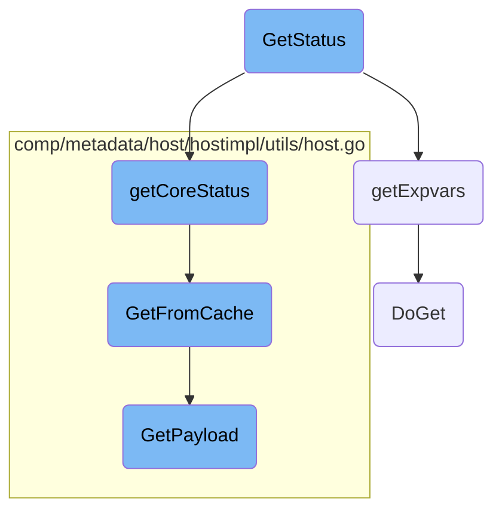

In this document, we will explain the process of retrieving the status of the <SwmToken path="pkg/process/util/status/status.go" pos="154:20:22" line-data="// GetStatus returns a Status object with runtime information about process-agent">`process-agent`</SwmToken>. The process involves gathering core status information, fetching process-specific variables, and compiling this data into a status object.

The flow is straightforward and involves three main steps: gathering core status information, fetching process-specific variables, and compiling this data into a status object. First, the core status information is collected, which includes details like the agent version and runtime information. Next, process-specific variables are fetched from a given URL. Finally, all this information is compiled into a status object that provides a comprehensive overview of the process-agent's runtime status.

# Flow drill down



<SwmSnippet path="/pkg/process/util/status/status.go" line="154">

---

## <SwmToken path="pkg/process/util/status/status.go" pos="154:2:2" line-data="// GetStatus returns a Status object with runtime information about process-agent">`GetStatus`</SwmToken>

The <SwmToken path="pkg/process/util/status/status.go" pos="154:2:2" line-data="// GetStatus returns a Status object with runtime information about process-agent">`GetStatus`</SwmToken> function is responsible for returning a <SwmToken path="pkg/process/util/status/status.go" pos="154:8:8" line-data="// GetStatus returns a Status object with runtime information about process-agent">`Status`</SwmToken> object containing runtime information about the <SwmToken path="pkg/process/util/status/status.go" pos="154:20:22" line-data="// GetStatus returns a Status object with runtime information about process-agent">`process-agent`</SwmToken>. It calls <SwmToken path="pkg/process/util/status/status.go" pos="156:5:5" line-data="	coreStatus := getCoreStatus(coreConfig)">`getCoreStatus`</SwmToken> to retrieve core status information and <SwmToken path="pkg/process/util/status/status.go" pos="157:8:8" line-data="	processExpVars, err := getExpvars(expVarURL)">`getExpvars`</SwmToken> to fetch process-specific variables. The collected data is then compiled into a <SwmToken path="pkg/process/util/status/status.go" pos="154:8:8" line-data="// GetStatus returns a Status object with runtime information about process-agent">`Status`</SwmToken> object.

```go
// GetStatus returns a Status object with runtime information about process-agent
func GetStatus(coreConfig ddconfig.Reader, expVarURL string) (*Status, error) {
	coreStatus := getCoreStatus(coreConfig)
	processExpVars, err := getExpvars(expVarURL)
	if err != nil {
		return nil, err
	}

	return &Status{
		Date:    float64(time.Now().UnixNano()),
		Core:    coreStatus,
		Expvars: processExpVars,
	}, nil
}
```

---

</SwmSnippet>

<SwmSnippet path="/pkg/process/util/status/status.go" line="143">

---

## <SwmToken path="pkg/process/util/status/status.go" pos="143:2:2" line-data="func getExpvars(expVarURL string) (s ProcessExpvars, err error) {">`getExpvars`</SwmToken>

The <SwmToken path="pkg/process/util/status/status.go" pos="143:2:2" line-data="func getExpvars(expVarURL string) (s ProcessExpvars, err error) {">`getExpvars`</SwmToken> function fetches process-specific variables from a given URL. It uses an HTTP client to perform a GET request via the <SwmToken path="pkg/process/util/status/status.go" pos="145:10:10" line-data="	b, err := apiutil.DoGet(client, expVarURL, apiutil.CloseConnection)">`DoGet`</SwmToken> function and then unmarshals the JSON response into a <SwmToken path="pkg/process/util/status/status.go" pos="143:12:12" line-data="func getExpvars(expVarURL string) (s ProcessExpvars, err error) {">`ProcessExpvars`</SwmToken> object.

```go
func getExpvars(expVarURL string) (s ProcessExpvars, err error) {
	client := getHTTPClient()
	b, err := apiutil.DoGet(client, expVarURL, apiutil.CloseConnection)
	if err != nil {
		return s, ConnectionError{err}
	}

	err = json.Unmarshal(b, &s)
	return
}
```

---

</SwmSnippet>

<SwmSnippet path="/pkg/process/util/status/status.go" line="131">

---

## <SwmToken path="pkg/process/util/status/status.go" pos="131:2:2" line-data="func getCoreStatus(coreConfig ddconfig.Reader) (s CoreStatus) {">`getCoreStatus`</SwmToken>

The <SwmToken path="pkg/process/util/status/status.go" pos="131:2:2" line-data="func getCoreStatus(coreConfig ddconfig.Reader) (s CoreStatus) {">`getCoreStatus`</SwmToken> function gathers core status information such as the agent version, Go runtime version, and architecture. It also retrieves metadata from the cache using the <SwmToken path="pkg/process/util/status/status.go" pos="139:7:7" line-data="		Metadata: *hostMetadataUtils.GetFromCache(context.Background(), coreConfig),">`GetFromCache`</SwmToken> function.

```go
func getCoreStatus(coreConfig ddconfig.Reader) (s CoreStatus) {
	return CoreStatus{
		AgentVersion: version.AgentVersion,
		GoVersion:    runtime.Version(),
		Arch:         runtime.GOARCH,
		Config: ConfigStatus{
			LogLevel: coreConfig.GetString("log_level"),
		},
		Metadata: *hostMetadataUtils.GetFromCache(context.Background(), coreConfig),
	}
}
```

---

</SwmSnippet>

<SwmSnippet path="/comp/metadata/host/hostimpl/utils/host.go" line="201">

---

### <SwmToken path="comp/metadata/host/hostimpl/utils/host.go" pos="201:2:2" line-data="// GetFromCache returns the payload from the cache if it exists, otherwise it creates it.">`GetFromCache`</SwmToken>

The <SwmToken path="comp/metadata/host/hostimpl/utils/host.go" pos="201:2:2" line-data="// GetFromCache returns the payload from the cache if it exists, otherwise it creates it.">`GetFromCache`</SwmToken> function attempts to retrieve the payload from the cache. If the payload is not found, it calls the <SwmToken path="comp/metadata/host/hostimpl/utils/host.go" pos="206:3:3" line-data="		return GetPayload(ctx, conf)">`GetPayload`</SwmToken> function to generate a new payload.

```go
// GetFromCache returns the payload from the cache if it exists, otherwise it creates it.
// The metadata reporting should always grab it fresh. Any other uses, e.g. status, should use this
func GetFromCache(ctx context.Context, conf config.Reader) *Payload {
	data, found := cache.Cache.Get(hostCacheKey)
	if !found {
		return GetPayload(ctx, conf)
	}
	return data.(*Payload)
}
```

---

</SwmSnippet>

<SwmSnippet path="/pkg/api/util/doget.go" line="49">

---

### <SwmToken path="pkg/api/util/doget.go" pos="49:2:2" line-data="// DoGet is a wrapper around performing HTTP GET requests">`DoGet`</SwmToken>

The <SwmToken path="pkg/api/util/doget.go" pos="49:2:2" line-data="// DoGet is a wrapper around performing HTTP GET requests">`DoGet`</SwmToken> function is a wrapper around performing HTTP GET requests. It is used by <SwmToken path="pkg/process/util/status/status.go" pos="143:2:2" line-data="func getExpvars(expVarURL string) (s ProcessExpvars, err error) {">`getExpvars`</SwmToken> to fetch data from a specified URL.

```go
// DoGet is a wrapper around performing HTTP GET requests
func DoGet(c *http.Client, url string, conn ShouldCloseConnection) (body []byte, e error) {
	return DoGetWithOptions(c, url, &ReqOptions{Conn: conn})
}
```

---

</SwmSnippet>

<SwmSnippet path="/comp/metadata/host/hostimpl/utils/host.go" line="169">

---

### <SwmToken path="comp/metadata/host/hostimpl/utils/host.go" pos="169:2:2" line-data="// GetPayload builds a metadata payload every time is called.">`GetPayload`</SwmToken>

The <SwmToken path="comp/metadata/host/hostimpl/utils/host.go" pos="169:2:2" line-data="// GetPayload builds a metadata payload every time is called.">`GetPayload`</SwmToken> function builds a metadata payload by collecting various pieces of information such as OS details, agent flavor, system stats, and network metadata. This payload is then cached for future use.

```go
// GetPayload builds a metadata payload every time is called.
// Some data is collected only once, some is cached, some is collected at every call.
func GetPayload(ctx context.Context, conf config.Reader) *Payload {
	hostnameData, err := hostname.GetWithProvider(ctx)
	if err != nil {
		log.Errorf("Error grabbing hostname for status: %v", err)
		hostnameData = hostname.Data{Hostname: "unknown", Provider: "unknown"}
	}

	meta := GetMeta(ctx, conf)
	meta.Hostname = hostnameData.Hostname

	p := &Payload{
		Os:            osName,
		AgentFlavor:   flavor.GetFlavor(),
		PythonVersion: python.GetPythonInfo(),
		SystemStats:   getSystemStats(),
		Meta:          meta,
		HostTags:      hosttags.Get(ctx, false, conf),
		ContainerMeta: containerMetadata.Get(1 * time.Second),
		NetworkMeta:   getNetworkMeta(ctx),
```

---

</SwmSnippet>

&nbsp;

*This is an auto-generated document by Swimm AI 🌊 and has not yet been verified by a human*

<SwmMeta version="3.0.0" repo-id="Z2l0aHViJTNBJTNBZGF0YWRvZy1hZ2VudCUzQSUzQVN3aW1tLURlbW8=" repo-name="datadog-agent"><sup>Powered by [Swimm](/)</sup></SwmMeta>
