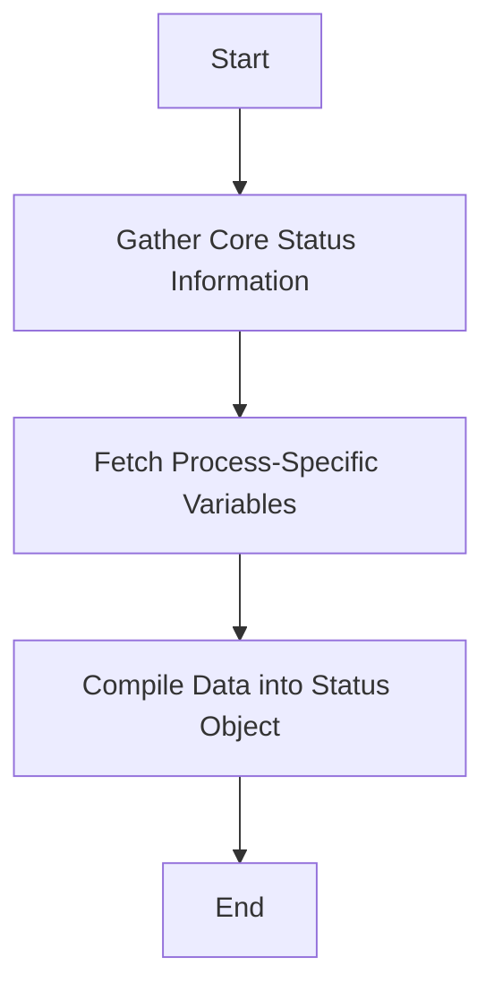

This document will cover the process of retrieving the status of the process-agent, which includes:

1. Gathering core status information
2. Fetching process-specific variables
3. Compiling the data into a status object.

Technical document: <SwmLink doc-title="Retrieving Process-Agent Status">[Retrieving Process-Agent Status](/.swm/retrieving-process-agent-status.33nwi1mq.sw.md)</SwmLink>

# [Gathering Core Status Information](https://app.swimm.io/repos/Z2l0aHViJTNBJTNBZGF0YWRvZy1hZ2VudCUzQSUzQVN3aW1tLURlbW8=/docs/33nwi1mq#getcorestatus)

The first step in retrieving the process-agent status is to gather core status information. This includes details such as the agent version, Go runtime version, and system architecture. Additionally, metadata is retrieved from the cache to provide a snapshot of the current state. This core information is essential as it provides the foundational data about the agent's environment and configuration.

# [Fetching Process-Specific Variables](https://app.swimm.io/repos/Z2l0aHViJTNBJTNBZGF0YWRvZy1hZ2VudCUzQSUzQVN3aW1tLURlbW8=/docs/33nwi1mq#getexpvars)

The next step involves fetching process-specific variables. This is done by making an HTTP GET request to a specified URL to retrieve JSON data. The data includes various runtime metrics and statistics specific to the process-agent. This step is crucial for obtaining dynamic and real-time information about the process-agent's performance and behavior.

# [Compiling Data into Status Object](https://app.swimm.io/repos/Z2l0aHViJTNBJTNBZGF0YWRvZy1hZ2VudCUzQSUzQVN3aW1tLURlbW8=/docs/33nwi1mq#getstatus)

Finally, the gathered core status information and the fetched process-specific variables are compiled into a status object. This object provides a comprehensive overview of the process-agent's runtime status, including both static configuration details and dynamic performance metrics. The status object is then returned, offering a complete and detailed snapshot of the process-agent's current state.

&nbsp;

*This is an auto-generated document by Swimm AI 🌊 and has not yet been verified by a human*

<SwmMeta version="3.0.0" repo-id="Z2l0aHViJTNBJTNBZGF0YWRvZy1hZ2VudCUzQSUzQVN3aW1tLURlbW8=" repo-name="datadog-agent">Powered by [Swimm](/)</SwmMeta>
