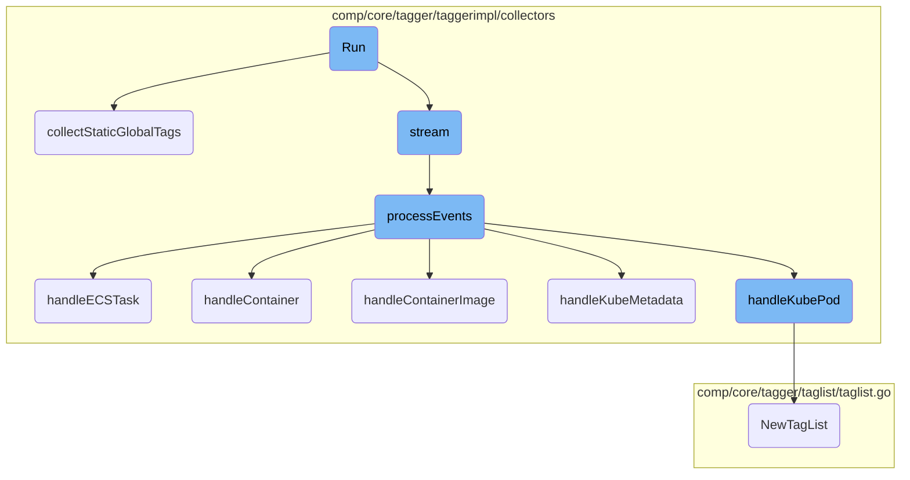
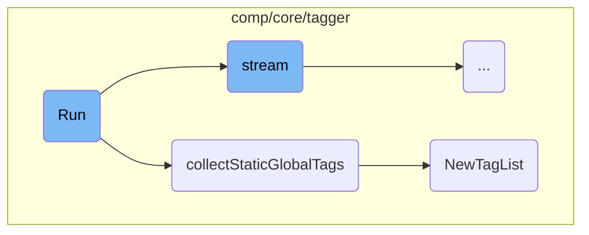
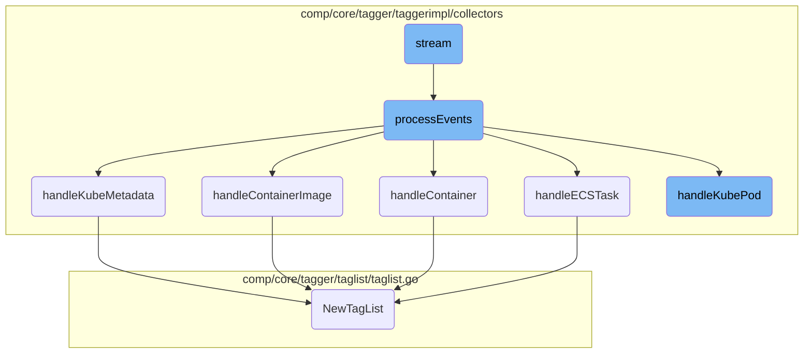

This document explains the <SwmToken path="comp/core/tagger/taggerimpl/collectors/workloadmeta_main.go" pos="86:2:2" line-data="// Run runs the continuous event watching loop and sends new tags to the">`Run`</SwmToken> function, which is responsible for initiating the continuous event watching loop and sending new tags to the tagger based on events from the workload metadata. The process involves collecting static global tags, streaming events, and processing these events to handle various entity types such as ECS tasks, containers, container images, Kubernetes metadata, and Kubernetes pods.

The <SwmToken path="comp/core/tagger/taggerimpl/collectors/workloadmeta_main.go" pos="86:2:2" line-data="// Run runs the continuous event watching loop and sends new tags to the">`Run`</SwmToken> function starts by gathering static global tags, which are tags that do not change frequently. It then sets up a stream to listen for events from the workload metadata. As events come in, they are processed to extract relevant tags. These tags are then categorized and stored for further use. The function handles different types of events, including those related to ECS tasks, containers, container images, Kubernetes metadata, and Kubernetes pods, ensuring that all relevant tags are captured and processed.

Here is a high level diagram of the flow, showing only the most important functions:



# Flow drill down

First, we'll zoom into this section of the flow:



<SwmSnippet path="/comp/core/tagger/taggerimpl/collectors/workloadmeta_main.go" line="86">

---

## Run

The <SwmToken path="comp/core/tagger/taggerimpl/collectors/workloadmeta_main.go" pos="86:2:2" line-data="// Run runs the continuous event watching loop and sends new tags to the">`Run`</SwmToken> function initiates the continuous event watching loop and sends new tags to the tagger based on the events sent by the workloadmeta. It first calls <SwmToken path="comp/core/tagger/taggerimpl/collectors/workloadmeta_main.go" pos="89:3:3" line-data="	c.collectStaticGlobalTags(ctx)">`collectStaticGlobalTags`</SwmToken> to gather static global tags and then calls <SwmToken path="comp/core/tagger/taggerimpl/collectors/workloadmeta_main.go" pos="90:3:3" line-data="	c.stream(ctx)">`stream`</SwmToken> to process events.

```go
// Run runs the continuous event watching loop and sends new tags to the
// tagger based on the events sent by the workloadmeta.
func (c *WorkloadMetaCollector) Run(ctx context.Context) {
	c.collectStaticGlobalTags(ctx)
	c.stream(ctx)
}
```

---

</SwmSnippet>

<SwmSnippet path="/comp/core/tagger/taggerimpl/collectors/workloadmeta_main.go" line="93">

---

## <SwmToken path="comp/core/tagger/taggerimpl/collectors/workloadmeta_main.go" pos="93:9:9" line-data="func (c *WorkloadMetaCollector) collectStaticGlobalTags(ctx context.Context) {">`collectStaticGlobalTags`</SwmToken>

The <SwmToken path="comp/core/tagger/taggerimpl/collectors/workloadmeta_main.go" pos="93:9:9" line-data="func (c *WorkloadMetaCollector) collectStaticGlobalTags(ctx context.Context) {">`collectStaticGlobalTags`</SwmToken> function gathers static global tags, including the <SwmToken path="comp/core/tagger/taggerimpl/collectors/workloadmeta_main.go" pos="96:28:28" line-data="		// If we are running the cluster agent, we want to set the kube_cluster_name tag as a global tag if we are able">`kube_cluster_name`</SwmToken> tag if running in a cluster environment. It then creates a new <SwmToken path="comp/core/tagger/taggerimpl/collectors/workloadmeta_main.go" pos="106:5:5" line-data="		tags := taglist.NewTagList()">`taglist`</SwmToken> and adds the collected tags to it. Finally, it processes the tag information using <SwmToken path="comp/core/tagger/taggerimpl/collectors/workloadmeta_main.go" pos="113:3:3" line-data="		c.tagProcessor.ProcessTagInfo([]*types.TagInfo{">`tagProcessor`</SwmToken>.

```go
func (c *WorkloadMetaCollector) collectStaticGlobalTags(ctx context.Context) {
	c.staticTags = util.GetStaticTags(ctx)
	if _, exists := c.staticTags[clusterTagNamePrefix]; flavor.GetFlavor() == flavor.ClusterAgent && !exists {
		// If we are running the cluster agent, we want to set the kube_cluster_name tag as a global tag if we are able
		// to read it, for the instances where we are running in an environment where hostname cannot be detected.
		if cluster := clustername.GetClusterNameTagValue(ctx, ""); cluster != "" {
			if c.staticTags == nil {
				c.staticTags = make(map[string]string, 1)
			}
			c.staticTags[clusterTagNamePrefix] = cluster
		}
	}
	if len(c.staticTags) > 0 {
		tags := taglist.NewTagList()

		for tag, value := range c.staticTags {
			tags.AddLow(tag, value)
		}

		low, orch, high, standard := tags.Compute()
		c.tagProcessor.ProcessTagInfo([]*types.TagInfo{
```

---

</SwmSnippet>

<SwmSnippet path="/comp/core/tagger/taglist/taglist.go" line="26">

---

## <SwmToken path="comp/core/tagger/taglist/taglist.go" pos="26:2:2" line-data="// NewTagList creates a new object ready to use">`NewTagList`</SwmToken>

The <SwmToken path="comp/core/tagger/taglist/taglist.go" pos="26:2:2" line-data="// NewTagList creates a new object ready to use">`NewTagList`</SwmToken> function creates and initializes a new <SwmToken path="comp/core/tagger/taglist/taglist.go" pos="27:7:7" line-data="func NewTagList() *TagList {">`TagList`</SwmToken> object, which is used to store and manage different categories of tags such as low, orchestrator, high, and standard card tags.

```go
// NewTagList creates a new object ready to use
func NewTagList() *TagList {
	return &TagList{
		lowCardTags:          make(map[string]bool),
		orchestratorCardTags: make(map[string]bool),
		highCardTags:         make(map[string]bool),
		standardTags:         make(map[string]bool),
		splitList:            config.Datadog().GetStringMapString("tag_value_split_separator"),
	}
}
```

---

</SwmSnippet>

Now, lets zoom into this section of the flow:



<SwmSnippet path="/comp/core/tagger/taggerimpl/collectors/workloadmeta_main.go" line="126">

---

## Stream Initialization

The <SwmToken path="comp/core/tagger/taggerimpl/collectors/workloadmeta_main.go" pos="126:9:9" line-data="func (c *WorkloadMetaCollector) stream(ctx context.Context) {">`stream`</SwmToken> function initializes the stream by registering a health check and subscribing to the workload metadata store. It then enters a loop where it listens for events and processes them using the <SwmToken path="comp/core/tagger/taggerimpl/collectors/workloadmeta_extract.go" pos="121:9:9" line-data="func (c *WorkloadMetaCollector) processEvents(evBundle workloadmeta.EventBundle) {">`processEvents`</SwmToken> function.

```go
func (c *WorkloadMetaCollector) stream(ctx context.Context) {
	const name = "tagger-workloadmeta"

	health := health.RegisterLiveness(name)
	defer func() {
		err := health.Deregister()
		if err != nil {
			log.Warnf("error de-registering health check: %s", err)
		}
	}()

	ch := c.store.Subscribe(name, workloadmeta.TaggerPriority, nil)

	log.Infof("workloadmeta tagger collector started")

	for {
		select {
		case evBundle, ok := <-ch:
			if !ok {
				return
			}
```

---

</SwmSnippet>

<SwmSnippet path="/comp/core/tagger/taggerimpl/collectors/workloadmeta_extract.go" line="121">

---

## Event Processing

The <SwmToken path="comp/core/tagger/taggerimpl/collectors/workloadmeta_extract.go" pos="121:9:9" line-data="func (c *WorkloadMetaCollector) processEvents(evBundle workloadmeta.EventBundle) {">`processEvents`</SwmToken> function processes a bundle of events by iterating over each event and handling it based on its type. It delegates the handling of specific entity types to functions like <SwmToken path="comp/core/tagger/taggerimpl/collectors/workloadmeta_extract.go" pos="191:9:9" line-data="func (c *WorkloadMetaCollector) handleContainer(ev workloadmeta.Event) []*types.TagInfo {">`handleContainer`</SwmToken>, <SwmToken path="comp/core/tagger/taggerimpl/collectors/workloadmeta_extract.go" pos="336:9:9" line-data="func (c *WorkloadMetaCollector) handleKubePod(ev workloadmeta.Event) []*types.TagInfo {">`handleKubePod`</SwmToken>, and others. After processing, it acknowledges the event bundle.

```go
func (c *WorkloadMetaCollector) processEvents(evBundle workloadmeta.EventBundle) {
	var tagInfos []*types.TagInfo

	for _, ev := range evBundle.Events {
		entity := ev.Entity
		entityID := entity.GetID()

		switch ev.Type {
		case workloadmeta.EventTypeSet:
			taggerEntityID := buildTaggerEntityID(entityID)

			// keep track of children of this entity from previous
			// iterations ...
			unseen := make(map[string]struct{})
			for childTaggerID := range c.children[taggerEntityID] {
				unseen[childTaggerID] = struct{}{}
			}

			// ... and create a new empty map to store the children
			// seen in this iteration.
			c.children[taggerEntityID] = make(map[string]struct{})
```

---

</SwmSnippet>

<SwmSnippet path="/comp/core/tagger/taggerimpl/collectors/workloadmeta_extract.go" line="434">

---

### Handling ECS Task Events

The <SwmToken path="comp/core/tagger/taggerimpl/collectors/workloadmeta_extract.go" pos="434:9:9" line-data="func (c *WorkloadMetaCollector) handleECSTask(ev workloadmeta.Event) []*types.TagInfo {">`handleECSTask`</SwmToken> function processes ECS task events by extracting relevant tags and creating <SwmToken path="comp/core/tagger/taggerimpl/collectors/workloadmeta_extract.go" pos="434:23:23" line-data="func (c *WorkloadMetaCollector) handleECSTask(ev workloadmeta.Event) []*types.TagInfo {">`TagInfo`</SwmToken> objects for each container in the task. It also handles backward compatibility for task names and adds static tags for Fargate tasks.

```go
func (c *WorkloadMetaCollector) handleECSTask(ev workloadmeta.Event) []*types.TagInfo {
	task := ev.Entity.(*workloadmeta.ECSTask)

	taskTags := taglist.NewTagList()

	// as of Agent 7.33, tasks have a name internally, but before that
	// task_name already was task.Family, so we keep it for backwards
	// compatibility
	taskTags.AddLow(tags.TaskName, task.Family)
	taskTags.AddLow(tags.TaskFamily, task.Family)
	taskTags.AddLow(tags.TaskVersion, task.Version)
	taskTags.AddOrchestrator(tags.TaskARN, task.ID)

	if task.ClusterName != "" {
		if !config.Datadog().GetBool("disable_cluster_name_tag_key") {
			taskTags.AddLow(tags.ClusterName, task.ClusterName)
		}
		taskTags.AddLow(tags.EcsClusterName, task.ClusterName)
	}

	if task.LaunchType == workloadmeta.ECSLaunchTypeFargate {
```

---

</SwmSnippet>

<SwmSnippet path="/comp/core/tagger/taggerimpl/collectors/workloadmeta_extract.go" line="191">

---

### Handling Container Events

The <SwmToken path="comp/core/tagger/taggerimpl/collectors/workloadmeta_extract.go" pos="191:9:9" line-data="func (c *WorkloadMetaCollector) handleContainer(ev workloadmeta.Event) []*types.TagInfo {">`handleContainer`</SwmToken> function processes container events by extracting tags from the container's metadata, labels, and environment variables. It also handles specific container runtimes like Docker and Garden.

```go
func (c *WorkloadMetaCollector) handleContainer(ev workloadmeta.Event) []*types.TagInfo {
	container := ev.Entity.(*workloadmeta.Container)

	// Garden containers tagging is specific as we don't have any information locally
	// Metadata are not available and tags are retrieved as-is from Cluster Agent
	if container.Runtime == workloadmeta.ContainerRuntimeGarden {
		return c.handleGardenContainer(container)
	}

	tagList := taglist.NewTagList()
	tagList.AddHigh(tags.ContainerName, container.Name)
	tagList.AddHigh(tags.ContainerID, container.ID)

	image := container.Image
	tagList.AddLow(tags.ImageName, image.Name)
	tagList.AddLow(tags.ShortImage, image.ShortName)
	tagList.AddLow(tags.ImageTag, image.Tag)
	tagList.AddLow(tags.ImageID, image.ID)

	if container.Runtime == workloadmeta.ContainerRuntimeDocker {
		if image.Tag != "" {
```

---

</SwmSnippet>

<SwmSnippet path="/comp/core/tagger/taggerimpl/collectors/workloadmeta_extract.go" line="253">

---

### Handling Container Image Events

The <SwmToken path="comp/core/tagger/taggerimpl/collectors/workloadmeta_extract.go" pos="253:9:9" line-data="func (c *WorkloadMetaCollector) handleContainerImage(ev workloadmeta.Event) []*types.TagInfo {">`handleContainerImage`</SwmToken> function processes container image events by extracting tags from the image's metadata, including repository digests, tags, and labels.

```go
func (c *WorkloadMetaCollector) handleContainerImage(ev workloadmeta.Event) []*types.TagInfo {
	image := ev.Entity.(*workloadmeta.ContainerImageMetadata)

	tagList := taglist.NewTagList()
	tagList.AddLow(tags.ImageName, image.Name)

	// In containerd some images are created without a repo digest, and it's
	// also possible to remove repo digests manually.
	// This means that the set of repos that we need to handle is the union of
	// the repos present in the repo digests and the ones present in the repo
	// tags.
	repos := make(map[string]struct{})
	for _, repoDigest := range image.RepoDigests {
		repos[strings.SplitN(repoDigest, "@sha256:", 2)[0]] = struct{}{}
	}
	for _, repoTag := range image.RepoTags {
		repos[strings.SplitN(repoTag, ":", 2)[0]] = struct{}{}
	}
	for repo := range repos {
		repoSplitted := strings.Split(repo, "/")
		shortName := repoSplitted[len(repoSplitted)-1]
```

---

</SwmSnippet>

<SwmSnippet path="/comp/core/tagger/taggerimpl/collectors/workloadmeta_extract.go" line="515">

---

### Handling Kubernetes Metadata Events

The <SwmToken path="comp/core/tagger/taggerimpl/collectors/workloadmeta_extract.go" pos="515:9:9" line-data="func (c *WorkloadMetaCollector) handleKubeMetadata(ev workloadmeta.Event) []*types.TagInfo {">`handleKubeMetadata`</SwmToken> function processes Kubernetes metadata events by extracting tags from the metadata's labels and annotations. It handles specific Kubernetes resources like nodes and namespaces.

```go
func (c *WorkloadMetaCollector) handleKubeMetadata(ev workloadmeta.Event) []*types.TagInfo {
	kubeMetadata := ev.Entity.(*workloadmeta.KubernetesMetadata)

	resource := kubeMetadata.GVR.Resource

	if !slices.Contains(handledKubernetesMetadataResources, resource) {
		return nil
	}

	tagList := taglist.NewTagList()

	switch resource {
	case "nodes":
		// No tags for nodes
	case "namespaces":
		for name, value := range kubeMetadata.Labels {
			k8smetadata.AddMetadataAsTags(name, value, c.nsLabelsAsTags, c.globNsLabels, tagList)
		}

		for name, value := range kubeMetadata.Annotations {
			k8smetadata.AddMetadataAsTags(name, value, c.nsAnnotationsAsTags, c.globNsAnnotations, tagList)
```

---

</SwmSnippet>

<SwmSnippet path="/comp/core/tagger/taggerimpl/collectors/workloadmeta_extract.go" line="336">

---

### Handling Kubernetes Pod Events

The <SwmToken path="comp/core/tagger/taggerimpl/collectors/workloadmeta_extract.go" pos="336:9:9" line-data="func (c *WorkloadMetaCollector) handleKubePod(ev workloadmeta.Event) []*types.TagInfo {">`handleKubePod`</SwmToken> function processes Kubernetes pod events by extracting tags from the pod's metadata, labels, annotations, and owners. It also handles static tags for EKS Fargate pods and extracts tags from pod containers.

```go
func (c *WorkloadMetaCollector) handleKubePod(ev workloadmeta.Event) []*types.TagInfo {
	pod := ev.Entity.(*workloadmeta.KubernetesPod)

	tagList := taglist.NewTagList()
	tagList.AddOrchestrator(tags.KubePod, pod.Name)
	tagList.AddLow(tags.KubeNamespace, pod.Namespace)
	tagList.AddLow(tags.PodPhase, strings.ToLower(pod.Phase))
	tagList.AddLow(tags.KubePriorityClass, pod.PriorityClass)
	tagList.AddLow(tags.KubeQOS, pod.QOSClass)

	c.extractTagsFromPodLabels(pod, tagList)

	for name, value := range pod.Annotations {
		k8smetadata.AddMetadataAsTags(name, value, c.annotationsAsTags, c.globAnnotations, tagList)
	}

	for name, value := range pod.NamespaceLabels {
		k8smetadata.AddMetadataAsTags(name, value, c.nsLabelsAsTags, c.globNsLabels, tagList)
	}

	for name, value := range pod.NamespaceAnnotations {
```

---

</SwmSnippet>

&nbsp;

*This is an auto-generated document by Swimm AI 🌊 and has not yet been verified by a human*

<SwmMeta version="3.0.0" repo-id="Z2l0aHViJTNBJTNBZGF0YWRvZy1hZ2VudCUzQSUzQVN3aW1tLURlbW8=" repo-name="datadog-agent"><sup>Powered by [Swimm](/)</sup></SwmMeta>
