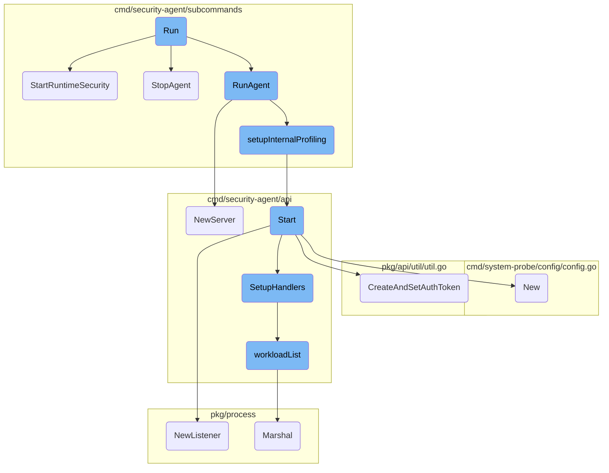
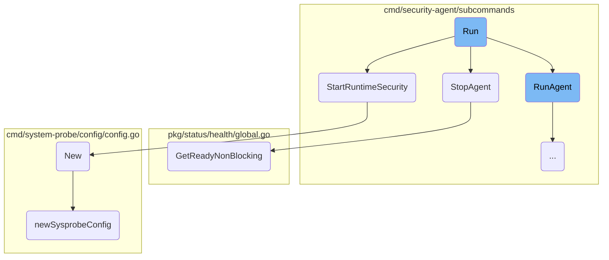
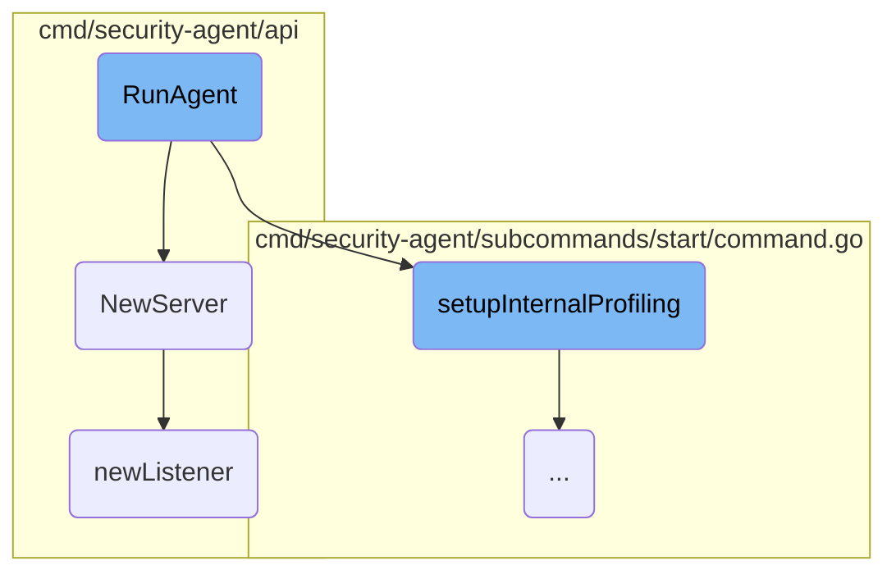
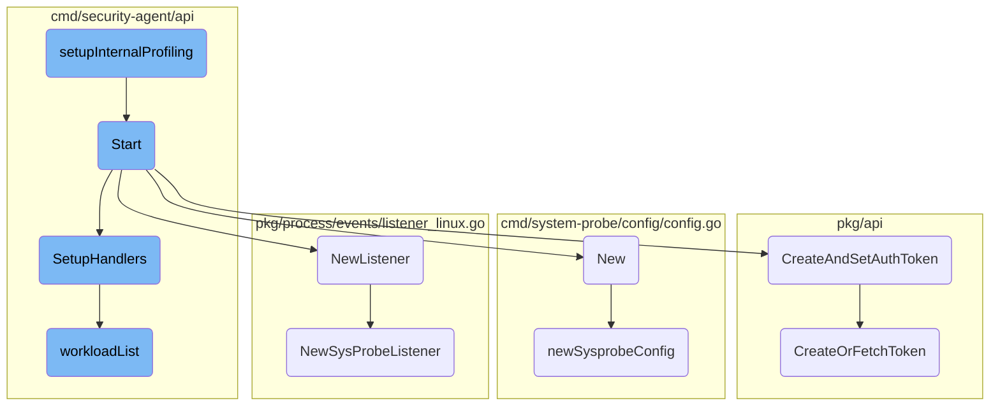
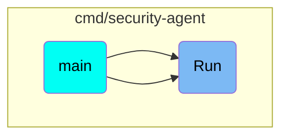

This document provides an overview of the <SwmToken path="rtloader/test/python/datadog_checks/base/checks/__init__.py" pos="9:3:3" line-data="    def run(self):">`run`</SwmToken> function, which is responsible for initializing and starting the Datadog Agent. It covers the main steps involved in setting up the agent, including starting runtime security, stopping the agent, and running the agent.

The <SwmToken path="rtloader/test/python/datadog_checks/base/checks/__init__.py" pos="9:3:3" line-data="    def run(self):">`run`</SwmToken> function is like the engine starter for the Datadog Agent. First, it checks if the runtime security is enabled and starts it if necessary. Then, it sets up the agent to run by initializing various components like logging, configuration, and telemetry. Once everything is set up, the agent starts running and waits for a signal to stop. When the stop signal is received, the agent gracefully shuts down, ensuring all resources are cleaned up properly.

Here is a high level diagram of the flow, showing only the most important functions:



# Flow drill down

First, we'll zoom into this section of the flow:



<SwmSnippet path="/cmd/security-agent/main_windows.go" line="90">

---

## <SwmToken path="cmd/security-agent/main_windows.go" pos="95:7:7" line-data="			err := start.RunAgent(log, config, telemetry, statusComponent, settings, wmeta)">`RunAgent`</SwmToken>

The <SwmToken path="rtloader/test/python/datadog_checks/base/checks/__init__.py" pos="9:3:3" line-data="    def run(self):">`run`</SwmToken> function initializes and starts the agent. It sets up various components like logging, configuration, and telemetry. The function <SwmToken path="cmd/security-agent/main_windows.go" pos="95:7:7" line-data="			err := start.RunAgent(log, config, telemetry, statusComponent, settings, wmeta)">`RunAgent`</SwmToken> is invoked to start the agent, and it waits for a stop signal to gracefully shut down the service.

```go
	err := fxutil.OneShot(
		func(log log.Component, config config.Component, _ secrets.Component, statsd statsd.Component, sysprobeconfig sysprobeconfig.Component,
			telemetry telemetry.Component, _ workloadmeta.Component, params *cliParams, statusComponent status.Component, _ autoexit.Component, settings settings.Component, wmeta workloadmeta.Component) error {
			defer start.StopAgent(log)

			err := start.RunAgent(log, config, telemetry, statusComponent, settings, wmeta)
			if err != nil {
				return err
			}

			// Wait for stop signal
			<-svcctx.Done()
			log.Info("Received stop from service manager, shutting down...")

			return nil
		},
```

---

</SwmSnippet>

<SwmSnippet path="/cmd/security-agent/subcommands/runtime/command_unsupported.go" line="30">

---

## <SwmToken path="cmd/security-agent/subcommands/runtime/command_unsupported.go" pos="30:2:2" line-data="// StartRuntimeSecurity starts runtime security">`StartRuntimeSecurity`</SwmToken>

The <SwmToken path="cmd/security-agent/subcommands/runtime/command_unsupported.go" pos="30:2:2" line-data="// StartRuntimeSecurity starts runtime security">`StartRuntimeSecurity`</SwmToken> function checks if the runtime security agent is enabled in the configuration. If it is not enabled, it logs a message and returns nil. If enabled, it attempts to start the runtime security agent but currently only supports Linux and Windows.

```go
// StartRuntimeSecurity starts runtime security
func StartRuntimeSecurity(log log.Component, config config.Component, _ string, _ startstop.Stopper, _ statsd.ClientInterface, _ workloadmeta.Component) (*secagent.RuntimeSecurityAgent, error) {
	enabled := config.GetBool("runtime_security_config.enabled")
	if !enabled {
		log.Info("Datadog runtime security agent disabled by config")
		return nil, nil
	}

	return nil, errors.New("Datadog runtime security agent is only supported on Linux and Windows")
}
```

---

</SwmSnippet>

<SwmSnippet path="/cmd/security-agent/subcommands/start/command.go" line="321">

---

## <SwmToken path="cmd/security-agent/subcommands/start/command.go" pos="321:2:2" line-data="// StopAgent stops the API server and clean up resources">`StopAgent`</SwmToken>

The <SwmToken path="cmd/security-agent/subcommands/start/command.go" pos="321:2:2" line-data="// StopAgent stops the API server and clean up resources">`StopAgent`</SwmToken> function is responsible for stopping the agent and cleaning up resources. It retrieves the agent's health status, stops various components like the <SwmToken path="cmd/security-agent/subcommands/start/command.go" pos="332:5:5" line-data="	// stop metaScheduler and statsd if they are instantiated">`metaScheduler`</SwmToken> and statsd, and shuts down the expvar server if it is running.

```go
// StopAgent stops the API server and clean up resources
func StopAgent(log log.Component) {
	// retrieve the agent health before stopping the components
	// GetReadyNonBlocking has a 100ms timeout to avoid blocking
	healthStatus, err := health.GetReadyNonBlocking()
	if err != nil {
		log.Warnf("Security Agent health unknown: %s", err)
	} else if len(healthStatus.Unhealthy) > 0 {
		log.Warnf("Some components were unhealthy: %v", healthStatus.Unhealthy)
	}

	// stop metaScheduler and statsd if they are instantiated
	if stopper != nil {
		stopper.Stop()
	}

	if srv != nil {
		srv.Stop()
	}
	if expvarServer != nil {
		if err := expvarServer.Shutdown(context.Background()); err != nil {
```

---

</SwmSnippet>

<SwmSnippet path="/pkg/status/health/global.go" line="88">

---

### <SwmToken path="pkg/status/health/global.go" pos="88:2:2" line-data="// GetReadyNonBlocking returns the health of all components registered for both readiness and liveness with a 500ms timeout">`GetReadyNonBlocking`</SwmToken>

The <SwmToken path="pkg/status/health/global.go" pos="88:2:2" line-data="// GetReadyNonBlocking returns the health of all components registered for both readiness and liveness with a 500ms timeout">`GetReadyNonBlocking`</SwmToken> function returns the health status of all registered components with a <SwmToken path="pkg/status/health/global.go" pos="88:32:32" line-data="// GetReadyNonBlocking returns the health of all components registered for both readiness and liveness with a 500ms timeout">`500ms`</SwmToken> timeout. This is used in <SwmToken path="cmd/security-agent/main_windows.go" pos="93:5:5" line-data="			defer start.StopAgent(log)">`StopAgent`</SwmToken> to check the health status before stopping the components.

```go
// GetReadyNonBlocking returns the health of all components registered for both readiness and liveness with a 500ms timeout
func GetReadyNonBlocking() (Status, error) {
	return getStatusNonBlocking(GetReady)
}
```

---

</SwmSnippet>

<SwmSnippet path="/cmd/system-probe/config/config.go" line="46">

---

### New

The <SwmToken path="cmd/system-probe/config/config.go" pos="46:2:2" line-data="// New creates a config object for system-probe. It assumes no configuration has been loaded as this point.">`New`</SwmToken> function creates a configuration object for the <SwmToken path="cmd/system-probe/config/config.go" pos="46:14:16" line-data="// New creates a config object for system-probe. It assumes no configuration has been loaded as this point.">`system-probe`</SwmToken>. It calls <SwmToken path="cmd/system-probe/config/config.go" pos="48:3:3" line-data="	return newSysprobeConfig(configPath)">`newSysprobeConfig`</SwmToken> to load the configuration from the specified path.

```go
// New creates a config object for system-probe. It assumes no configuration has been loaded as this point.
func New(configPath string) (*types.Config, error) {
	return newSysprobeConfig(configPath)
}
```

---

</SwmSnippet>

<SwmSnippet path="/cmd/system-probe/config/config.go" line="51">

---

### <SwmToken path="cmd/system-probe/config/config.go" pos="51:2:2" line-data="func newSysprobeConfig(configPath string) (*types.Config, error) {">`newSysprobeConfig`</SwmToken>

The <SwmToken path="cmd/system-probe/config/config.go" pos="51:2:2" line-data="func newSysprobeConfig(configPath string) (*types.Config, error) {">`newSysprobeConfig`</SwmToken> function sets up the configuration for the <SwmToken path="cmd/system-probe/config/config.go" pos="52:8:10" line-data="	aconfig.SystemProbe.SetConfigName(&quot;system-probe&quot;)">`system-probe`</SwmToken>. It sets the configuration file name, adds the configuration path, and loads the configuration. If there are any errors during loading, it handles them appropriately.

```go
func newSysprobeConfig(configPath string) (*types.Config, error) {
	aconfig.SystemProbe.SetConfigName("system-probe")
	// set the paths where a config file is expected
	if len(configPath) != 0 {
		// if the configuration file path was supplied on the command line,
		// add that first, so it's first in line
		aconfig.SystemProbe.AddConfigPath(configPath)
		// If they set a config file directly, let's try to honor that
		if strings.HasSuffix(configPath, ".yaml") {
			aconfig.SystemProbe.SetConfigFile(configPath)
		}
	} else {
		// only add default if a custom configPath was not supplied
		aconfig.SystemProbe.AddConfigPath(defaultConfigDir)
	}
	// load the configuration
	err := aconfig.LoadCustom(aconfig.SystemProbe, aconfig.Datadog().GetEnvVars())
	if err != nil {
		if errors.Is(err, fs.ErrPermission) {
			// special-case permission-denied with a clearer error message
			if runtime.GOOS == "windows" {
```

---

</SwmSnippet>

Now, lets zoom into this section of the flow:



<SwmSnippet path="/cmd/security-agent/subcommands/start/command.go" line="259">

---

## <SwmToken path="cmd/security-agent/subcommands/start/command.go" pos="259:2:2" line-data="// RunAgent initialized resources and starts API server">`RunAgent`</SwmToken> Initialization

The <SwmToken path="cmd/security-agent/subcommands/start/command.go" pos="259:2:2" line-data="// RunAgent initialized resources and starts API server">`RunAgent`</SwmToken> function initializes resources and starts the API server. It first sets up core dumps and checks if any <SwmToken path="cmd/security-agent/subcommands/start/command.go" pos="267:8:10" line-data="		log.Infof(&quot;All security-agent components are deactivated, exiting&quot;)">`security-agent`</SwmToken> components are enabled. If no components are enabled or if no API key is configured, it logs the issue and exits.

```go
// RunAgent initialized resources and starts API server
func RunAgent(log log.Component, config config.Component, telemetry telemetry.Component, statusComponent status.Component, settings settings.Component, wmeta workloadmeta.Component) (err error) {
	if err := util.SetupCoreDump(config); err != nil {
		log.Warnf("Can't setup core dumps: %v, core dumps might not be available after a crash", err)
	}

	// Check if we have at least one component to start based on config
	if !config.GetBool("compliance_config.enabled") && !config.GetBool("runtime_security_config.enabled") {
		log.Infof("All security-agent components are deactivated, exiting")

		// A sleep is necessary so that sysV doesn't think the agent has failed
		// to startup because of an error. Only applies on Debian 7.
		time.Sleep(5 * time.Second)

		return errAllComponentsDisabled
	}

	if !config.IsSet("api_key") {
		log.Critical("No API key configured, exiting")

		// A sleep is necessary so that sysV doesn't think the agent has failed
```

---

</SwmSnippet>

<SwmSnippet path="/cmd/security-agent/subcommands/start/command.go" line="286">

---

## Setting up Expvar Server

The function sets up an expvar server for monitoring and debugging. It configures the server to listen on a specified port and starts it in a separate goroutine.

```go
	// Setup expvar server
	port := config.GetString("security_agent.expvar_port")
	pkgconfig.Datadog().Set("expvar_port", port, model.SourceAgentRuntime)
	if config.GetBool("telemetry.enabled") {
		http.Handle("/telemetry", telemetry.Handler())
	}
	expvarServer := &http.Server{
		Addr:    "127.0.0.1:" + port,
		Handler: http.DefaultServeMux,
	}
	go func() {
		err := expvarServer.ListenAndServe()
		if err != nil && err != http.ErrServerClosed {
			log.Errorf("Error creating expvar server on port %v: %v", port, err)
		}
	}()
```

---

</SwmSnippet>

<SwmSnippet path="/cmd/security-agent/subcommands/start/command.go" line="303">

---

## Creating and Starting the API Server

The <SwmToken path="cmd/security-agent/main_windows.go" pos="95:7:7" line-data="			err := start.RunAgent(log, config, telemetry, statusComponent, settings, wmeta)">`RunAgent`</SwmToken> function creates a new API server using the <SwmToken path="cmd/security-agent/subcommands/start/command.go" pos="303:10:10" line-data="	srv, err = api.NewServer(statusComponent, settings, wmeta)">`NewServer`</SwmToken> function and starts it. If there are any errors during the creation or starting of the server, it logs the error and exits.

```go
	srv, err = api.NewServer(statusComponent, settings, wmeta)
	if err != nil {
		return log.Errorf("Error while creating api server, exiting: %v", err)
	}

	if err = srv.Start(); err != nil {
		return log.Errorf("Error while starting api server, exiting: %v", err)
	}
```

---

</SwmSnippet>

<SwmSnippet path="/cmd/security-agent/api/server.go" line="41">

---

## <SwmToken path="cmd/security-agent/api/server.go" pos="41:2:2" line-data="// NewServer creates a new Server instance">`NewServer`</SwmToken> Function

The <SwmToken path="cmd/security-agent/api/server.go" pos="41:2:2" line-data="// NewServer creates a new Server instance">`NewServer`</SwmToken> function creates a new server instance. It first creates a listener using the <SwmToken path="cmd/security-agent/api/server.go" pos="43:8:8" line-data="	listener, err := newListener()">`newListener`</SwmToken> function and then initializes a new agent with the provided components.

```go
// NewServer creates a new Server instance
func NewServer(statusComponent status.Component, settings settings.Component, wmeta workloadmeta.Component) (*Server, error) {
	listener, err := newListener()
	if err != nil {
		return nil, err
	}
	return &Server{
		listener: listener,
		agent:    agent.NewAgent(statusComponent, settings, wmeta),
	}, nil
```

---

</SwmSnippet>

<SwmSnippet path="/cmd/security-agent/api/listener.go" line="15">

---

## <SwmToken path="cmd/security-agent/api/listener.go" pos="15:2:2" line-data="// newListener creates a listening connection">`newListener`</SwmToken> Function

The <SwmToken path="cmd/security-agent/api/listener.go" pos="15:2:2" line-data="// newListener creates a listening connection">`newListener`</SwmToken> function creates a listening connection. It retrieves the IPC address from the configuration and sets up a TCP listener on the specified port.

```go
// newListener creates a listening connection
func newListener() (net.Listener, error) {
	address, err := config.GetIPCAddress()
	if err != nil {
		return nil, err
	}
	return net.Listen("tcp", fmt.Sprintf("%v:%v", address, config.Datadog().GetInt("security_agent.cmd_port")))
```

---

</SwmSnippet>

Now, lets zoom into this section of the flow:



<SwmSnippet path="/cmd/security-agent/subcommands/start/command.go" line="349">

---

## <SwmToken path="cmd/security-agent/subcommands/start/command.go" pos="349:2:2" line-data="func setupInternalProfiling(config config.Component) error {">`setupInternalProfiling`</SwmToken>

The <SwmToken path="cmd/security-agent/subcommands/start/command.go" pos="349:2:2" line-data="func setupInternalProfiling(config config.Component) error {">`setupInternalProfiling`</SwmToken> function configures and starts the internal profiling for the security agent. It checks if internal profiling is enabled in the configuration and sets up the profiling settings such as the profiling URL, environment, service name, and various profiling options. Finally, it starts the profiling with the specified settings.

```go
func setupInternalProfiling(config config.Component) error {
	if config.GetBool(secAgentKey("internal_profiling.enabled")) {
		v, _ := version.Agent()

		cfgSite := config.GetString(secAgentKey("internal_profiling.site"))
		cfgURL := config.GetString(secAgentKey("internal_profiling.profile_dd_url"))

		// check if TRACE_AGENT_URL is set, in which case, forward the profiles to the trace agent
		var site string
		if traceAgentURL := os.Getenv("TRACE_AGENT_URL"); len(traceAgentURL) > 0 {
			site = fmt.Sprintf(profiling.ProfilingLocalURLTemplate, traceAgentURL)
		} else {
			site = fmt.Sprintf(profiling.ProfilingURLTemplate, cfgSite)
			if cfgURL != "" {
				site = cfgURL
			}
		}

		tags := config.GetStringSlice(secAgentKey("internal_profiling.extra_tags"))
		tags = append(tags, fmt.Sprintf("version:%v", v))

```

---

</SwmSnippet>

<SwmSnippet path="/cmd/security-agent/api/server.go" line="53">

---

## Start

The <SwmToken path="cmd/security-agent/api/server.go" pos="53:2:2" line-data="// Start creates the router and starts the HTTP server">`Start`</SwmToken> function initializes and starts the HTTP server for the security agent. It sets up the HTTP router, configures the IPC REST API server, validates tokens for every request, and creates a TLS certificate for secure communication. The server is then started in a separate goroutine.

```go
// Start creates the router and starts the HTTP server
func (s *Server) Start() error {
	// create the root HTTP router
	r := mux.NewRouter()

	// IPC REST API server
	s.agent.SetupHandlers(r.PathPrefix("/agent").Subrouter())

	// Validate token for every request
	r.Use(validateToken)

	err := util.CreateAndSetAuthToken(config.Datadog())
	if err != nil {
		return err
	}

	hosts := []string{"127.0.0.1", "localhost"}
	_, rootCertPEM, rootKey, err := security.GenerateRootCert(hosts, 2048)
	if err != nil {
		return fmt.Errorf("unable to start TLS server")
	}
```

---

</SwmSnippet>

<SwmSnippet path="/pkg/process/events/listener_linux.go" line="46">

---

## <SwmToken path="pkg/process/events/listener_linux.go" pos="46:2:2" line-data="// NewListener returns a new SysProbeListener to listen for process events">`NewListener`</SwmToken>

The <SwmToken path="pkg/process/events/listener_linux.go" pos="46:2:2" line-data="// NewListener returns a new SysProbeListener to listen for process events">`NewListener`</SwmToken> function creates a new <SwmToken path="pkg/process/events/listener_linux.go" pos="46:10:10" line-data="// NewListener returns a new SysProbeListener to listen for process events">`SysProbeListener`</SwmToken> to listen for process events. It establishes a <SwmToken path="pkg/process/events/listener_linux.go" pos="53:8:8" line-data="	conn, err := grpc.Dial(socketPath, grpc.WithTransportCredentials(insecure.NewCredentials()), grpc.WithContextDialer(func(ctx context.Context, url string) (net.Conn, error) { //nolint:staticcheck // TODO (ASC) fix grpc.Dial is deprecated">`grpc`</SwmToken> connection to the specified socket path and returns a new <SwmToken path="pkg/process/events/listener_linux.go" pos="46:10:10" line-data="// NewListener returns a new SysProbeListener to listen for process events">`SysProbeListener`</SwmToken> instance.

```go
// NewListener returns a new SysProbeListener to listen for process events
func NewListener(handler EventHandler) (*SysProbeListener, error) {
	socketPath := ddconfig.SystemProbe.GetString("event_monitoring_config.socket")
	if socketPath == "" {
		return nil, errors.New("event_monitoring_config.socket must be set")
	}

	conn, err := grpc.Dial(socketPath, grpc.WithTransportCredentials(insecure.NewCredentials()), grpc.WithContextDialer(func(ctx context.Context, url string) (net.Conn, error) { //nolint:staticcheck // TODO (ASC) fix grpc.Dial is deprecated
		return net.Dial("unix", url)
	}))
	if err != nil {
		return nil, err
	}

	client := api.NewEventMonitoringModuleClient(conn)
	return NewSysProbeListener(conn, client, handler)
}
```

---

</SwmSnippet>

<SwmSnippet path="/pkg/api/util/util.go" line="43">

---

## <SwmToken path="pkg/api/util/util.go" pos="43:2:2" line-data="// CreateAndSetAuthToken creates and sets the authorization token">`CreateAndSetAuthToken`</SwmToken>

The <SwmToken path="pkg/api/util/util.go" pos="43:2:2" line-data="// CreateAndSetAuthToken creates and sets the authorization token">`CreateAndSetAuthToken`</SwmToken> function generates and sets the authorization token required for secure communication. It ensures that the token is created or fetched if it doesn't already exist.

```go
// CreateAndSetAuthToken creates and sets the authorization token
// Requires that the config has been set up before calling
func CreateAndSetAuthToken(config model.Reader) error {
	tokenLock.Lock()
	defer tokenLock.Unlock()

	// Noop if token is already set
	if token != "" {
		return nil
	}

	var err error
	token, err = security.CreateOrFetchToken(config)
	return err
}
```

---

</SwmSnippet>

<SwmSnippet path="/cmd/security-agent/api/agent/agent.go" line="45">

---

## <SwmToken path="cmd/security-agent/api/agent/agent.go" pos="45:2:2" line-data="// SetupHandlers adds the specific handlers for /agent endpoints">`SetupHandlers`</SwmToken>

The <SwmToken path="cmd/security-agent/api/agent/agent.go" pos="45:2:2" line-data="// SetupHandlers adds the specific handlers for /agent endpoints">`SetupHandlers`</SwmToken> function adds specific HTTP handlers for the <SwmPath>[Dockerfiles/agent/](Dockerfiles/agent/)</SwmPath> endpoints. These handlers manage various functionalities such as retrieving the agent version, generating flares, getting the hostname, stopping the agent, and fetching the workload list.

```go
// SetupHandlers adds the specific handlers for /agent endpoints
func (a *Agent) SetupHandlers(r *mux.Router) {
	r.HandleFunc("/version", common.GetVersion).Methods("GET")
	r.HandleFunc("/flare", a.makeFlare).Methods("POST")
	r.HandleFunc("/hostname", a.getHostname).Methods("GET")
	r.HandleFunc("/stop", a.stopAgent).Methods("POST")
	r.HandleFunc("/status", a.getStatus).Methods("GET")
	r.HandleFunc("/status/health", a.getHealth).Methods("GET")
	r.HandleFunc("/config", a.settings.GetFullConfig("")).Methods("GET")
	// FIXME: this returns the entire datadog.yaml and not just security-agent.yaml config
	r.HandleFunc("/config/by-source", a.settings.GetFullConfigBySource()).Methods("GET")
	r.HandleFunc("/config/list-runtime", a.settings.ListConfigurable).Methods("GET")
	r.HandleFunc("/config/{setting}", a.settings.GetValue).Methods("GET")
	r.HandleFunc("/config/{setting}", a.settings.SetValue).Methods("POST")
	r.HandleFunc("/workload-list", func(w http.ResponseWriter, r *http.Request) {
		verbose := r.URL.Query().Get("verbose") == "true"
		workloadList(w, verbose, a.wmeta)
	}).Methods("GET")
}
```

---

</SwmSnippet>

<SwmSnippet path="/cmd/security-agent/api/agent/agent.go" line="65">

---

## <SwmToken path="cmd/security-agent/api/agent/agent.go" pos="65:2:2" line-data="func workloadList(w http.ResponseWriter, verbose bool, wmeta workloadmeta.Component) {">`workloadList`</SwmToken>

The <SwmToken path="cmd/security-agent/api/agent/agent.go" pos="65:2:2" line-data="func workloadList(w http.ResponseWriter, verbose bool, wmeta workloadmeta.Component) {">`workloadList`</SwmToken> function handles the <SwmToken path="cmd/security-agent/api/agent/agent.go" pos="59:6:9" line-data="	r.HandleFunc(&quot;/workload-list&quot;, func(w http.ResponseWriter, r *http.Request) {">`/workload-list`</SwmToken> endpoint. It retrieves and returns a list of workloads in JSON format. If an error occurs during the process, it sends an error response.

```go
func workloadList(w http.ResponseWriter, verbose bool, wmeta workloadmeta.Component) {
	response := wmeta.Dump(verbose)
	jsonDump, err := json.Marshal(response)
	if err != nil {
		err := log.Errorf("Unable to marshal workload list response: %v", err)
		w.Header().Set("Content-Type", "application/json")
		body, _ := json.Marshal(map[string]string{"error": err.Error()})
		http.Error(w, string(body), 500)
		return
	}

	w.Write(jsonDump)
}
```

---

</SwmSnippet>

<SwmSnippet path="/pkg/api/security/security.go" line="129">

---

## <SwmToken path="pkg/api/security/security.go" pos="129:2:2" line-data="// CreateOrFetchToken gets the authentication token from the auth token file &amp; creates one if it doesn&#39;t exist">`CreateOrFetchToken`</SwmToken>

The <SwmToken path="pkg/api/security/security.go" pos="129:2:2" line-data="// CreateOrFetchToken gets the authentication token from the auth token file &amp; creates one if it doesn&#39;t exist">`CreateOrFetchToken`</SwmToken> function retrieves the authentication token from the auth token file or creates a new one if it doesn't exist. This function is essential for ensuring secure communication.

```go
// CreateOrFetchToken gets the authentication token from the auth token file & creates one if it doesn't exist
// Requires that the config has been set up before calling
func CreateOrFetchToken(config configModel.Reader) (string, error) {
	return fetchAuthToken(config, true)
}
```

---

</SwmSnippet>

<SwmSnippet path="/pkg/process/events/listener_linux.go" line="64">

---

## <SwmToken path="pkg/process/events/listener_linux.go" pos="64:2:2" line-data="// NewSysProbeListener returns a new SysPobeListener">`NewSysProbeListener`</SwmToken>

The <SwmToken path="pkg/process/events/listener_linux.go" pos="64:2:2" line-data="// NewSysProbeListener returns a new SysPobeListener">`NewSysProbeListener`</SwmToken> function returns a new <SwmToken path="pkg/process/events/listener_linux.go" pos="65:26:26" line-data="func NewSysProbeListener(conn *grpc.ClientConn, client api.EventMonitoringModuleClient, handler EventHandler) (*SysProbeListener, error) {">`SysProbeListener`</SwmToken> instance. It requires a <SwmToken path="pkg/process/events/listener_linux.go" pos="65:7:7" line-data="func NewSysProbeListener(conn *grpc.ClientConn, client api.EventMonitoringModuleClient, handler EventHandler) (*SysProbeListener, error) {">`grpc`</SwmToken> connection, an event monitoring client, and an event handler. This listener is responsible for monitoring process events.

```go
// NewSysProbeListener returns a new SysPobeListener
func NewSysProbeListener(conn *grpc.ClientConn, client api.EventMonitoringModuleClient, handler EventHandler) (*SysProbeListener, error) {
	if handler == nil {
		return nil, errors.New("can't create a Listener without an EventHandler")
	}

	return &SysProbeListener{
		client:        client,
		conn:          conn,
		retryInterval: 2 * time.Second,
		handler:       handler,
		exit:          make(chan struct{}),
	}, nil
}
```

---

</SwmSnippet>

# Where is this flow used?

This flow is used multiple times in the codebase as represented in the following diagram:



&nbsp;

*This is an auto-generated document by Swimm AI 🌊 and has not yet been verified by a human*

<SwmMeta version="3.0.0" repo-id="Z2l0aHViJTNBJTNBZGF0YWRvZy1hZ2VudCUzQSUzQVN3aW1tLURlbW8=" repo-name="datadog-agent"><sup>Powered by [Swimm](/)</sup></SwmMeta>
