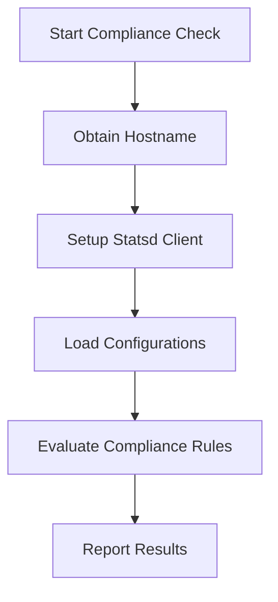

This document will cover the process of running a compliance check, which includes:

1. Obtaining the hostname
2. Setting up a statsd client if metrics are enabled
3. Loading configurations
4. Evaluating compliance rules
5. Reporting the results.

Technical document: <SwmLink doc-title="Running a Compliance Check">[Running a Compliance Check](/.swm/running-a-compliance-check.x8gl1hj9.sw.md)</SwmLink>

# [Obtaining the Hostname](https://app.swimm.io/repos/Z2l0aHViJTNBJTNBZGF0YWRvZy1hZ2VudCUzQSUzQVN3aW1tLURlbW8=/docs/x8gl1hj9#runcheck)

The process begins by obtaining the hostname of the system where the compliance check is being run. This is essential because the hostname uniquely identifies the system and is used in subsequent steps to ensure that the compliance check results are correctly attributed to the right system.

# [Setting Up a Statsd Client](https://app.swimm.io/repos/Z2l0aHViJTNBJTNBZGF0YWRvZy1hZ2VudCUzQSUzQVN3aW1tLURlbW8=/docs/x8gl1hj9#runcheck)

If metrics are enabled, the next step is to set up a statsd client. This client is responsible for collecting and sending metrics data to the monitoring system. Setting up the client involves checking if metrics are enabled in the configuration and then initializing the client. This step ensures that any metrics related to the compliance check are captured and reported.

# [Loading Configurations](https://app.swimm.io/repos/Z2l0aHViJTNBJTNBZGF0YWRvZy1hZ2VudCUzQSUzQVN3aW1tLURlbW8=/docs/x8gl1hj9#loadconfiguration)

The system then loads the necessary configurations required for the compliance check. This involves determining the type of database resource associated with the process and loading the corresponding configuration. The configurations could be for PostgreSQL, MongoDB, or Cassandra, and the appropriate configuration is loaded based on the resource type. This step ensures that the compliance check has all the necessary information to proceed.

# [Evaluating Compliance Rules](https://app.swimm.io/repos/Z2l0aHViJTNBJTNBZGF0YWRvZy1hZ2VudCUzQSUzQVN3aW1tLURlbW8=/docs/x8gl1hj9#runcheck)

Once the configurations are loaded, the system evaluates the compliance rules. These rules are predefined checks that determine whether the system complies with certain standards or policies. Each rule is evaluated, and the results are collected. This step is crucial as it forms the core of the compliance check, ensuring that the system meets the required compliance standards.

# [Reporting the Results](https://app.swimm.io/repos/Z2l0aHViJTNBJTNBZGF0YWRvZy1hZ2VudCUzQSUzQVN3aW1tLURlbW8=/docs/x8gl1hj9#reportcomplianceevents)

Finally, the results of the compliance check are reported. This involves retrieving the hostname again, setting up a log context, and using a LogReporter to send each event. The results can either be saved to a file or reported for monitoring. This step ensures that the compliance check results are properly logged and can be monitored for any compliance issues.

&nbsp;

*This is an auto-generated document by Swimm AI 🌊 and has not yet been verified by a human*

<SwmMeta version="3.0.0" repo-id="Z2l0aHViJTNBJTNBZGF0YWRvZy1hZ2VudCUzQSUzQVN3aW1tLURlbW8=" repo-name="datadog-agent">Powered by [Swimm](/)</SwmMeta>
